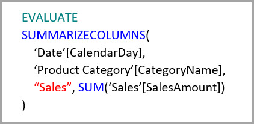

# Aggregációk használata a Power BI Desktopban

A Power BI-beli *aggregációk* lehetővé teszik a táblázatok méretének csökkentését, így a fontos adatokra figyelhet, és javíthatja a lekérdezések hatékonyságát. Az aggregációk lehetővé teszik a big data típusú adatok egyéb módon megoldhatatlan interaktív elemzését, és radikálisan csökkenthetik a nagyméretű adathalmazok döntéshozatali célú feltárásának költségeit.

Az aggregációk használatának néhány előnye:

- **Big data típusú adatok hatékonyabb lekérdezése**. A Power BI-vizualizációkkal folytatott minden interakció DAX-lekérdezéseket küld az adatkészletbe. A gyorsítótárazott aggregált adatok a részletes adatokhoz szükséges erőforrásoknak csak a töredékét használják fel, ezért lehetővé válik az egyébként hozzáférhetetlen big data típusú adatok feltárása.
- **Optimalizált adatfrissítés**. A kisebb gyorsítótár-méretek csökkentik a frissítések időtartamát, így az adatok hamarabb eljutnak a felhasználókhoz.
- **Kiegyensúlyozott architektúrák**. A Power BI memórián belüli gyorsítótárazása az aggregált lekérdezéseket is kezeli, ezzel lecsökkenti a DirectQuery módban küldött lekérdezések számát, és segít teljesíteni az egyidejűségi korlátokat. A fennmaradó lekérdezések többnyire szűrt tranzakciószintű lekérdezések, amelyeket az adattárházak és a big data-rendszerek általában könnyen kezelnek.

Az olyan dimenziós adatforrások, mint az adattárházak és a data martok, [kapcsolatalapú aggregációkat](#aggregation-based-on-relationships) használnak. A Hadoop-alapú big data adatforrások gyakran [GroupBy-oszlopokra építik az aggregációkat](#aggregation-based-on-groupby-columns). Ez a cikk azt ismerteti, hogy miben különbözik az egyes adatforrások modellezése a Power BI-ban.

## Összesített tábla létrehozása

Összesített tábla létrehozásához:
1. Készítsen el egy új táblát tetszőleges mezőkkel a meglévő adatforrás és modell alapján. 
1. Határozza meg az aggregációkat az **Aggregációk kezelése** párbeszédablakban.
1. Ha lehetősége van rá, módosítsa az összesített tábla [tárolási módját](#storage-modes). 

### Összesítések kezelése

Miután elkészítette az új táblát a tetszőleges mezőkkel, bármely Power BI Desktop-nézet **Mezők** paneljén kattintson jobb gombbal a táblára, és válassza az **Aggregációk kezelése** lehetőséget.

Az **Aggregációk kezelése** tábla minden egyes sorához megjelenít egy sort, amelyben megadhatja az aggregáció működését. A következő példában a **Sales** részletes táblába küldött lekérdezések rendszeren belül át lesznek irányítva a **Sales Agg** aggregációs táblába. 

Az **Aggregációk kezelése** párbeszédpanel **Összegzés** legördülő listája az alábbi értékeket kínálja fel:
- Darabszám
- GroupBy
- Max
- Min
- Sum
- Tábla sorainak száma

A kapcsolatalapú aggregáció itt bemutatott példájában a GroupBy-bejegyzések megadása nem kötelező. A DISTINCTCOUNT kivételével nincs hatásuk az aggregáció viselkedésére, és elsődleges céljuk az olvashatóság. Az aggregációk a kapcsolatok alapján GroupBy-bejegyzések nélkül is adnának vissza találatokat. Ez eltér a cikk későbbi részében található [big data példától](#aggregation-based-on-groupby-columns), ahol a GroupBy-bejegyzések kötelezőek.

A kívánt aggregációk meghatározása után válassza az **Összes alkalmazása** lehetőséget. 

### Ellenőrzések

Az **Aggregációk kezelése** párbeszédpanel az alábbi fontos ellenőrzéseket érvényesíti:

- A kiválasztott **Részletek oszlop** adattípusának meg kell egyeznie az **Aggregációs oszlopéval**, kivéve a Darabszám és a Tábla sorainak száma **Összegzési** függvényeit. A Darabszám és a Tábla sorainak száma függvények csak egész szám típusú oszlopok esetén érhetők el, és nem kell megadni hozzájuk megfelelő adattípust.
- Három vagy több táblát lefedő láncolt aggregációk nem engedélyezettek. Egy **A tábla** aggregációi például nem hivatkozhatnak olyan **B táblára**, amely egy **C táblára** hivatkozó aggregációkat tartalmaz.
- Nem engedélyezettek duplikált aggregációk, amelyek ugyanazt az **Összegzési** funkciót használják, és ugyanarra a **Részletek táblára** vagy **Részletek oszlopra** hivatkoznak.
- A **Részletek táblának** nem az Importált, hanem a DirectQuery tárolási módot kell használnia.
- Nem támogatott az inaktív kapcsolat által használt külsőkulcs-oszlop szerinti csoportosítás és a USERELATIONSHIP függvényre való támaszkodás az aggregációnál.

A legtöbb ellenőrzés kikényszerítése a legördülő menü elemeinek letiltásával és egy magyarázó elemleírás megjelenítésével történik, ahogyan a következő ábra mutatja.

### Az aggregációs táblák rejtettek

Az adatkészlethez csak olvasási jogosultsággal rendelkező felhasználók nem kérdezhetik le az aggregációs táblákat. Ezzel elkerülhetők a biztonsági problémák a*Sorszintű biztonság (RLS)* használatánál. A felhasználók és a lekérdezések nem az aggregációs, hanem a részlettáblára hivatkoznak, és nem is kell tudniuk az aggregációs tábláról.

Ezért az aggregációs táblák a **Jelentés** nézetből el vannak rejtve. Ha a tábla nincs elrejtve, akkor az **Aggregációk kezelése** párbeszédpanel fogja elrejtésre állítani az **Összes alkalmazása** lehetőség kiválasztásakor.

### Tárolási módok
Ez az aggregációs funkció a táblaszintű tárolási módokkal kommunikál. A Power BI-táblák a *DirectQuery*, az *Importált*, vagy a *Kettős* tárolási módot használják. A DirectQuery mód közvetlenül kérdezi le a hátteret, az Importált pedig a memórián belül gyorsítótárazza az adatokat, és a lekérdezéseket a gyorsítótárazott adatokhoz küldi. Az aggregációk a Power BI összes Importált forrásán és nem többdimenziós DirectQuery-adatforrásán használhatók. 

Ha a lekérdezések gyorsításához Importáltra kívánja állítani egy aggregált tábla tárolási módját, akkor a Power BI Desktop **Modell** nézetében válassza ki az aggregált táblát. A **Tulajdonságok** panelen bontsa ki a **Speciális** elemet, húzza le a **Tárolási mód** alatti kijelölést, és válassza ki az **Importált** elemet. Vegye figyelembe, hogy ez a művelet nem vonható vissza. 

A táblázatos tárolási módokkal kapcsolatos további információért lásd: [Tárolási mód kezelése a Power BI Desktopban](desktop-storage-mode.md).

### RLS az aggregációk használatához

Az RLS-kifejezéseknek a megfelelő működéshez mind az aggregációs táblát, mind a részletező táblát szűrniük kell. 

A következő példában a **Geography** táblán alkalmazott RLS-kifejezés működik az aggregációkhoz, mert a Geography a kapcsolatok szűrési oldalán van mind a **Sales**, mind a **Sales Agg** táblánál. Az RLS-t egyaránt sikerrel alkalmazzák azok a lekérdezések, amelyek az aggregációs táblából kérnek le találatokat és azok, amelyek nem.

A **Product** táblán egy RLS-kifejezés csak a részletes **Sales** táblát szűri, de nem szűri az aggregált **Sales Agg** táblát. Mivel az aggregációs tábla a részletek tábla adatainak egy újabb reprezentációja, nem lenne biztonságos lekérdezésekre választ adni az aggregációs táblából, ha az RLS-szűrő nem alkalmazható. Nem ajánlott a részletek tábla kizárólagos szűrése, mert az ebből a szerepkörből származó felhasználói lekérdezések nem tudják felhasználni az aggregációs találatokat. 

Egy kizárólag a **Sales Agg** táblán futtatott RLS-kifejezés csak az aggregációs táblát szűrné, de a részletező **Sales** táblát nem.

A [GroupBy-oszlopok szerinti aggregációk](#aggregation-based-on-groupby-columns) esetében a részletek táblára alkalmazott RLS-kifejezés felhasználható az aggregációs tábla szűrésére, mert a részletek tábla az aggregációs táblában az összes GroupBy-oszlopot lefedi. Másfelől azonban az aggregációs táblára alkalmazott RLS-szűrő nem alkalmazható a részletek táblára, ezért nincs engedélyezve.

## Kapcsolatokon alapuló aggregációk

A dimenziós modellek általában *kapcsolatokon alapuló aggregációkat*  használnak. Az adattárházakból vagy data martokból származó Power BI-adatkészletek csillag vagy hópehely sémájúak, és kapcsolatok találhatók a dimenziós és a ténytáblák között.

Az alábbi, egyetlen adatforrásból származó modellben a táblázatok a DirectQuery tárolási módot használják. A **Sales** (Értékesítések) ténytáblában több milliárd sor található. Ha a **Sales** (Értékesítések) tárolási módját Importált lehetőségre állítaná, akkor a gyorsítótárazás számottevő memóriahasználatot és munkaterhelést eredményezne.

Ehelyett inkább hozzunk létre egy **Sales Agg** (Aggr. értékesítések) nevű aggregációs táblát. A **Sales Agg** táblában a sorok száma megegyezik a **SalesAmount** (Értékesítési összeg) **CustomerKey** (ÜgyfélAzonosító), **DateKey** (DátumAzonosító) és **ProductSubcategoryKey** (TermékAlkategóriaAzonosító) attribútumok szerint csoportosított összegével. A **Sales Agg** táblázat magasabb részletességgel rendelkezik, mint a **Sales**, ezért több milliárd helyett csak több millió sort tartalmaz, és ennek lényegesen könnyebb a kezelése.

Ha a magas üzleti értékkel rendelkező lekérdezéseknél az alábbi dimenziós táblák használata a leggyakoribb, akkor **egy-a-sokhoz** vagy *sok-az-egyhez* kapcsolattal szűrhetik a *Sales Agg* táblát.

- Földrajzi
- Ügyfél
- Dátum
- Termékalkategória
- Product Category (Termék kategóriája)

Az alábbi képen ez a modell látható.

Az alábbi táblázat a **Sales Agg** (Aggr. értékesítések) tábla aggregációit jeleníti meg.

> [!NOTE]
> A **Sales Agg** (Aggr. értékesítések) tábla, mint bármely más tábla, rugalmasan, többféle módon tölthető be. Az aggregáció elvégezhető ETL/ELT-folyamatokkal a forrásadatbázisban, vagy a táblára vonatkozó [M-kifejezéssel](/powerquery-m/power-query-m-function-reference). Az aggregált tábla használhat Importált tárolási módot a [Power BI Premium növekményes frissítése](../admin/service-premium-incremental-refresh.md) lehetőséggel vagy anélkül, vagy használhat DirectQueryt, és lehet az [oszlopcentrikus indexeket](/sql/relational-databases/indexes/columnstore-indexes-overview) használó gyors lekérdezésekre optimalizálva. Ez a rugalmasság kiegyensúlyozott architektúrákat tesz lehetővé, amelyek a lekérdezési terhelés elosztásával elkerülheti a szűk keresztmetszetek kialakulását.

Ha az aggregált **Sales Agg** tábla tárolási módját **Importáltra** váltja, egy párbeszédpanel nyílik meg, amelyben az olvasható, hogy a kapcsolódó dimenziós táblákat a *Kettős* tárolási módra lehet váltani. 

Ha a kapcsolódó dimenziós táblák tárolási módját Kettősre állítja be, akkor a beágyazott lekérdezésnek megfelelően vagy Importált vagy DirectQuery tárolási módú táblaként működhetnek. A példában:

- Azoknak a lekérdezéseknek az eredményei, amelyek az Importált tárolási módú **Sales Agg** (Aggr. értékesítések) táblából aggregálják a metrikákat, illetve a kapcsolódó Kettős táblákból származó csoportosítási attribútum(ok) a memóriában tárolt gyorsítótárából adhatók vissza.
- Azoknak a lekérdezéseknek az eredményei, amelyek a DirectQuery **Sales** (Értékesítések) táblából kérdezik le a metrikákat, illetve a kapcsolódó Kettős táblákból származó csoportosítási attribútum(ok) DirectQuery módban adhatók vissza. A GroupBy-műveletet is tartalmazó lekérdezési logikák le lesznek küldve a forrásadatbázishoz.

A Kettős tárolási móddal kapcsolatos további információért lásd: [A tárolási mód kezelése a Power BI Desktopban](desktop-storage-mode.md).

### Erős és gyenge kapcsolatok összehasonlítása

A kapcsolatokon alapuló aggregációs találatok erős kapcsolatokat igényelnek.

Erős kapcsolatok többek között az alábbi tárolásimód-kombinációk, amennyiben mindkét tábla egyetlen forrásból származik:

| Tábla a *több* oldalon | Tábla az *egy* oldalon |
| ------------- |----------------------| 
| Kettős          | Kettős                 | 
| Importálás        | Importálás vagy kettős       | 
| DirectQuery   | DirectQuery vagy kettős  | 

A *források közötti* kapcsolatok csak abban az esetben számítanak erősnek, ha mindkét tábla tárolási módja Importáltra van állítva. A több-a-többhöz kapcsolatok mindig gyengének minősülnek.

A kapcsolatoktól független *források közötti* aggregációs találatokat lásd az [Oszlop szerinti csoportosításon alapuló aggregáció](#aggregation-based-on-groupby-columns) című részben. 

### Példák a kapcsolatokon alapuló aggregációs lekérdezésekre

A következő lekérdezés az aggregációból ad vissza találatot, mert a **Data** (Dátum) tábla részletessége ezt lehetővé teszi. A **SalesAmount** oszlop a **SUM** aggregációt használja.

A következő lekérdezés nem az aggregációból ad vissza találatot. Bár a **SalesAmount** (Értékesítési összeg) összegét kéri le, a lekérdezés végrehajt egy GroupBy-műveletet is a **Product** (Termék) tábla egy oszlopán, amelynek nincs elegendő részletessége ahhoz, hogy a lekérdezés az aggregációból adjon vissza találatot. Ha megfigyeli a modellben lévő kapcsolatokat, egy termék-alkategória több **Product** (Termék) sort is tartalmazhat. A lekérdezés nem lenne képes meghatározni, hogy melyik terméket kell összesíteni. Ebben az esetben a lekérdezés visszalép a DirectQueryre, és egy SQL-lekérdezést küld be az adatforrásba.

Az aggregációk nem csupán egyszerű összegzések elvégzésére használt alapvető számítások lehetnek. Az összetett számításoknak is megvannak az előnyeik. Elvileg egy összetett számítás a SUM, MIN, MAX és COUNT funkciók alapján beágyazott lekérdezésekre bontható szét, és mindegyik ilyen lekérdezés esetén kiértékelhető, hogy az aggregációból ad-e vissza találatot. Ez a gondolatmenet a lekérdezésterv optimalizálása miatt nem minden esetben állja meg a helyét, azonban általánosságban alkalmazható. A következő példa az aggregációból ad vissza találatot:

Az aggregációk hasznosak a COUNTROWS (Sorok száma) funkció használata esetén. A következő lekérdezés azért az aggregációból ad vissza találatot, mert meg van határozva a **Sales** (Értékesítések) tábla soraihoz egy **Count** (Darabszám) aggregáció.

Az aggregációk hasznosak az AVERAGE (Átlag) függvény használata esetén. A következő lekérdezés azért az aggregációból ad vissza találatot, mert az AVERAGE (Átlag) belsőleg egy SUM (Összeg) és egy COUNT (Darabszám) hányadosából áll össze. Mivel a **UnitPrice** (Egységár) oszlop rendelkezik SUM (Összeg) és COUNT (Darabszám) aggregációkkal is, az aggregáció ad vissza találatot.

Az aggregációk bizonyos esetekben hasznosak a DISTINCTCOUNT (Eltérő értékek száma) funkció használata esetén. A következő lekérdezés azért az aggregációból ad vissza találatot, mert a **CustomerKey** (ÜgyfélAzonosító) attribútumnak van egy GroupBy (Csoportosítási szempont) bejegyzése, amely fenntartja a **CustomerKey** (ÜgyfélAzonosító) eltérő értékeit az aggregációs táblában. A technika még mindig beleütközhet egy teljesítménybeli küszöbbe, ugyanis több mint 2–5 milliónál több eltérő érték negatívan befolyásolhatja a lekérdezés teljesítményét. Hasznos lehet azonban olyan forgatókönyvek esetén, ahol a részlettábla több milliárd sort tartalmaz, az oszlopban pedig 2–5 millió eltérő érték található. Ebben az esetben a DISTINCTCOUNT függvény gyorsabban hajtható végre, mint a több milliárd sor vizsgálata, még akkor is, ha azok a memória gyorsítótárában találhatók.

A DAX időintelligencia függvényei figyelembe veszik az aggregációkat. A következő lekérdezés találatot eredményez az aggregációban, mert a DATESYTD függvény táblát hoz létre a **CalendarDay** értékeiből, és az aggregációs tábla részletességi szintjét lefedik a **Dátum** tábla csoportosítási oszlopai. Ez egy példa a CALCULATE függvény táblaértékszűrőire, amelyek használhatók aggregációkkal.

## GroupBy-oszlopok szerinti aggregációk 

A Hadoop-alapú big data-modellek a dimenziós modellektől eltérő tulajdonságokkal rendelkeznek. A nagyméretű táblázatok összekapcsolásának elkerülése érdekében a big data típusú modellek gyakran nem a kapcsolatokat használják, hanem a dimenzió-attribútumokat denormalizálják a ténytáblákhoz. Az ilyen big data-modelleket *GroupBy-oszlopok szerinti aggregációkkal* oldhatja fel az interaktív elemzésekhez.

Az alábbi tábla tartalmazza az aggregálandó **Movement** (Mozgás) numerikus oszlopot. Minden más oszlop attribútumokat tartalmaz, amelyek csoportosítás alapját képezhetik. A tábla IoT-adatokat és nagy mennyiségű sort tartalmaz. A tárolási mód DirectQuery. A hatalmas mennyiség miatt lassúak lesznek az adatforrásra irányuló olyan lekérdezések, amelyek az egész adatkészletben végeznek aggregációt. 

Ahhoz, hogy lehetővé tegye az adatkészlet interaktív elemzését, vegyen fel egy aggregációs táblát, amely csoportosítást végez a legtöbb attribútum szerint, azonban kizárja a nagy számosságú földrajzi hosszúság és szélesség attribútumokat. Ez nagymértékben lecsökkenti a sorok számát, és elég kis méretű ahhoz, hogy kényelmesen elférjen a memóriában tárolt gyorsítótárban. 

A **Driver Activity Agg** (Aggr. sofőrtevékenység) tábla aggregációs leképezéseit az **Aggregációk kezelése** párbeszédpanelen definiálhatja. 

A GroupBy-oszlopok szerinti aggregációk esetén a **GroupBy**-bejegyzések kötelezőek. Nélkülük az aggregációk nem jelennek meg. Ez eltér a kapcsolatok szerinti aggregációk használatától, ahol a GroupBy-bejegyzések megadása nem kötelező.

Az alábbi táblázat a **Driver Activity Agg** (Aggr. sofőrtevékenység) tábla aggregációit jeleníti meg.

A **Driver Activity Agg** (Aggr. sofőrtevékenység) tábla tárolási módját Importálásra állíthatja.

### Példák a GroupBy-típusú aggregációs lekérdezésekre

A következő lekérdezés azért az aggregációból ad vissza találatot, mert az **Activity Date** (Tevékenység dátuma) oszlopot lefedi az aggregációs tábla. A COUNTROWS funkció a **Tábla sorainak száma aggregációt** használja.

Érdemes a **Tábla sorainak száma** aggregációkat használni, különösen az olyan modellek esetén, amelyek a ténytáblában szűrő attribútumokat tartalmaznak. Előfordulhat, hogy a Power BI még akkor is a COUNTROWS (Sorok száma) funkció használatával küld lekérdezéseket az adatkészlethez, ha a felhasználó ezt nem igényelte explicit módon. A szűrő párbeszédablak például a sorok számát mutatja minden érték esetén.

## Aggregációs technikák kombinálása

Az aggregációk esetében kombinálhatja a kapcsolatokat és a GroupBy-oszlopok technikáit. A kapcsolatokon alapuló aggregációk esetén előfordulhat, hogy több táblára kell felosztania denormalizált dimenziós táblákat. Ha ez bizonyos dimenziós táblák esetén költséges vagy nem praktikus, akkor replikálhatja a szükséges attribútumokat az adott dimenziók esetén a megfelelő aggregációs táblában, más dimenziók esetén pedig az általuk használt kapcsolatokban.

A következő modell például a **Hónap**, a **Negyedév**, a **Félév**, és az **Év** dimenziókat replikálja a **Sales Agg** (Agg. értékesítések) táblába. A **Sales Agg** (Agg. értékesítések)és a **Dátum** tábla között nincs kapcsolat, de a **Customer** és a **Product Subcategory** tábla között van. A **Sales Agg** (Aggr. értékesítések) tábla Importált tárolási módú.

Az alábbi táblázatban a **Sales Agg** (Aggr. értékesítések) tábla **Aggregációk kezelése** párbeszédablaka látható. Ahhoz, hogy a **Dátum** attribútum alapján csoportosító lekérdezések az aggregációból adjanak vissza találatokat, kötelező a **Dátum** részlettáblára irányuló GroupBy-bejegyzések használata. Ahogyan az előző példában is, a **CustomerKey** és a **ProductSubcategoryKey** attribútumokon alapuló **GroupBy**-bejegyzések a kapcsolatok megléte miatt nincsenek hatással arra, hogy a lekérdezés az aggregációból ad-e vissza találatot, a DISTINCTCOUNT kivételével.

### Példák az összesített aggregációs lekérdezésekre

A következő lekérdezés azért az aggregációból ad vissza találatot, mert a **CalendarMonth** attribútumot lefedi az aggregációs tábla, és a **CategoryName** elérhető egy-a-többhöz típusú kapcsolatokkal. A **SalesAmount** a **SUM** aggregációt használja.

A következő lekérdezés azért nem az aggregációból ad vissza találatot, mert a **CalendarDay** attribútumot nem fedi le az aggregációs tábla.

A következő időintelligenciás lekérdezés azért nem az aggregációból ad vissza találatot, mert a DATESYTD függvény egy **CalendarDay** értékekből álló táblát hoz létre, és az aggregációs tábla nem fedi le a **CalendarDay** attribútumot.

## Aggregációk prioritása

Az aggregációk prioritásának köszönhetően egyetlen beágyazott lekérdezés több aggregációs táblát is figyelembe vehet.

A következő példa egy több forrást tartalmazó [összetett modell](desktop-composite-models.md):

- A **Driver Activity** DirectQuery-tábla több billiárd sornyi IoT-adatot tartalmaz, amelyek forrása egy big data-rendszer. Részletezési lekérdezéseket szolgált ki, hogy az IoT-adatok egy kezelhető és szűrt környezetben legyenek megtekinthetők.
- A **Driver Activity Agg** (Aggr. sofőrtevékenység) tábla egy DirectQuery módú köztes aggregációs tábla. Több milliárd sort tartalmaz az Azure SQL Data Warehouse-ban, és az oszlopcentrikus indexek használatával a forrásban van optimalizálva.
- A **Driver Activity Agg2** (Aggr. sofőrtevékenység2) Importált tábla magas részletességre van állítva, mert a csoportosítási szempont alapját képező attribútumokból kevés van, és kicsi a számosságuk is. A sorok száma mindössze néhány ezer, így könnyedén elfér a memóriában tárolt gyorsítótárban. Ezeket az attribútumokat történetesen egy, a figyelem központjában álló vezetői irányítópult használja, így a rájuk irányuló lekérdezéseknek a lehető leggyorsabbnak kell lenniük.

> [!NOTE]
> Azok a DirectQuery-aggregációs táblák, amelyek a részletező táblától eltérő adatforrást használnak, csak akkor vannak támogatva, ha az aggregációs tábla forrása egy SQL Server-, egy Azure SQL- vagy Azure SQL Data Warehouse-forrás.

Ez a modell viszonylag kicsi memóriaigényű, mégis egy hatalmas adatkészletet old fel. Ez egy kiegyensúlyozott architektúrát képvisel, mert az architektúra egyes komponenseinek erősségét kihasználva osztja szét a lekérdezési terhelést.

A **Driver Activity Agg2** (Aggr. sofőrtevékenység2) táblára vonatkozó **Aggregációk kezelése** párbeszédpanel az **Elsőbbség** mezőt *10*-re állítja, ami magasabb, mint a **Driver Activity Agg** (Aggr. sofőrtevékenység) tábla esetén. A magasabb elsőbbségbeállítás olyan lekérdezéseket jelent, amelyek a **Driver Activity Agg2** (Aggr. sofőrtevékenység2) táblát elsőnek tekintő aggregációkat használja. Azok a beágyazott lekérdezések, amelyek nem rendelkeznek olyan részletességgel, hogy a **Driver Activity Agg2** (Aggr. sofőrtevékenység2) táblából kaphassanak választ, a **Driver Activity Agg** (Aggr. sofőrtevékenység) táblát fogják figyelembe venni. Azok a részletlekérdezések, amelyek egyik aggregációs táblából sem kaphatnak választ, a **Driver Activity** (Sofőrtevékenység) táblához lesznek irányítva.

A **Részletek tábla** oszlopban megadott tábla azért a **Driver Activity** (Sofőrtevékenység), nem pedig a **Driver Activity Agg** (Agg. sofőrtevékenységek), mert a láncolt aggregációk nem engedélyezettek.

Az alábbi táblázat a **Driver Activity Agg2** (Aggr. sofőrtevékenység2) tábla aggregációit jeleníti meg.

## Annak észlelése, hogy a lekérdezések adnak-e vissza találatokat az aggregációkból

Az SQL Profiler észleli, hogy a lekérdezések visszatérnek-e a memórián belüli gyorsítótár-motorból, vagy a DirectQuery továbbküldi őket az adatforráshoz. Ezzel a folyamattal az is észlelhető, hogy a lekérdezések adnak-e vissza találatokat az aggregációkból. További információ: [Gyorsítótárból visszatérő vagy nem visszatérő lekérdezések](desktop-storage-mode.md#queries-that-hit-or-miss-the-cache). 

Az SQL Profiler a kiterjesztett `Query Processing\Aggregate Table Rewrite Query` eseményt is biztosítja.

A következő JSON-részlet egy olyan esemény kimenetére mutat példát, amely egy aggregációt használt.

- A **matchingResults** azt mutatja, hogy a beágyazott lekérdezés egy aggregációt használt.
- A **dataRequest** azt mutatja, hogy a beágyazott lekérdezés mely csoportosítási és aggregációs oszlopokat használta.
- A **mapping** (leképezés) az aggregációs tábla hozzárendelt oszlopait mutatja.

## Gyorsítótárak szinkronban tartása

Azok az aggregációk, amelyek kombinálják a DirectQuery, az Importált, és/vagy a Kettős tárolási módot, más adatokat adhatnak vissza, ha a memóriában tárolt gyorsítótár nincs szinkronban a forrásadatokkal. Például a lekérdezések végrehajtása nem kísérli meg elfedni az adatokkal kapcsolatos problémákat azzal, hogy a DirectQuery-eredményeket a gyorsítótárazott értékekkel való egyezés alapján szűri. Léteznek bevált módszerek az ilyen problémáknak a forrásnál való kezelésére, ha szükséges. A teljesítményoptimalizáló funkciókat csak abban az esetben érdemes használni, ha nincsenek negatív hatással az üzleti követelmények teljesítésére. Önnek kell ismernie a saját adatfolyamait, és azok alapján kell terveznie. 

## További lépések

További tudnivalók az összetett modellekről:

- [Összetett modellek használata a Power BI Desktopban](desktop-composite-models.md)
- [Több-a-többhöz kapcsolatok alkalmazása a Power BI Desktopban](desktop-many-to-many-relationships.md)
- [Tárolási mód kezelése a Power BI Desktopban](desktop-storage-mode.md)

A DirectQueryvel kapcsolatos további információkhoz lásd:

- [DirectQuery használata a Power BI-ban](../connect-data/desktop-directquery-about.md)
- [Adatforrások a Power BI-hoz](../connect-data/power-bi-data-sources.md)
