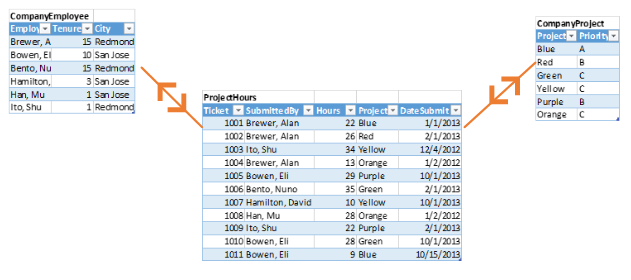
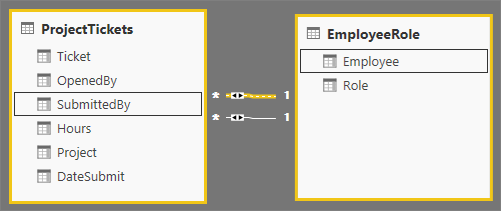

# Kapcsolatok létrehozása és kezelése a Power BI Desktopban
Amikor több táblát importál, valószínűleg az összes táblából származó adattal fog elemzést végezni. A táblák közötti kapcsolatok szükségesek az eredmények pontos kiszámításához és a jelentésekben a helyes információk megjelenítéséhez. A Power BI Desktop megkönnyíti ezen kapcsolatok létrehozását. Valójában a legtöbb esetben semmit sem kell tennie, az Automatikus észlelés funkció elvégzi Ön helyett. Bizonyos esetekben azonban szükség lehet a kapcsolatok saját kezű létrehozására, vagy egy kapcsolat módosításaira. Mindkét esetben fontos megérteni a Power BI Desktopban lévő kapcsolatokat és azok létrehozásának és szerkesztésének módját.

## Automatikus észlelés a betöltés során
Ha egyszerre két vagy több táblázatot kérdez le, az adatok betöltésekor a Power BI Desktop megkísérli megkeresni és létrehozni a kapcsolatokat Ön helyett. A **Számosság**, a **Keresztszűrés iránya** és a **Kapcsolat aktívvá tétele** beállítás automatikus. A Power BI Desktop a lekérdezett táblákban szereplő oszlopnevek vizsgálatával határozza meg, hogy vannak-e lehetséges kapcsolatok. Ha vannak, a kapcsolatok automatikusan létrejönnek. Ha a Power BI Desktop nem tud egyértelműen meghatározni egyezést, nem hozza létre a kapcsolatot. Ön azonban ilyenkor is létrehozhat vagy szerkeszthet kapcsolatokat manuálisan a **Kapcsolatok kezelése** párbeszédpanelen.

## Kapcsolat létrehozása automatikus észleléssel
A **Kezdőlap** lapon válassza a **Kapcsolatok kezelése** \> **Automatikus észlelés** elemet.

## Kapcsolatok létrehozása manuálisan
1. A **Kezdőlap** lapon válassza a **Kapcsolatok kezelése** \> **Új** elemet.

2. Válasszon ki egy táblát a **Kapcsolat létrehozása** párbeszédpanel első legördülő listájából. Jelölje ki a kapcsolathoz használni kívánt oszlopot.

3. A táblázatok második legördülő listájában válassza ki a kapcsolatban használandó másik táblát. Jelölje ki a másik használni kívánt oszlopot, majd kattintson az **OK** gombra.

   

A Power BI Desktop alapértelmezés szerint automatikusan konfigurálja az új kapcsolat **Számosság** (irány), **Keresztszűrés iránya** és **Kapcsolat aktívvá tétele** beállítását. Szükség esetén azonban ezek is módosíthatók. Erről a [További beállítások ismertetése](#understanding-additional-options) című cikkből tájékozódhat.

Ha a kapcsolathoz kiválasztott táblák egyike sem áll egyedi értékekből, a következő hibaüzenet jelenik meg: *Az oszlopok egyikének egyedi értékeket kell tartalmaznia*. Egy kapcsolatban legalább az egyik táblának tartalmaznia *kell* kulcs-értékek megkülönböztethető, egyedi listáját, amely egy általános követelmény a relációs adatbázis-technológiák esetében. 

Ha ezt a hibát észleli, a következő módokon javíthatja a problémát:

* Használja az **Ismétlődések eltávolítása** funkciót egy egyedi értékeket tartalmazó oszlop létrehozásához. Ennek a módszernek az a hátránya, hogy az ismétlődő sorok eltávolítása adatvesztéssel járhat – egy kulcs (sor) a legtöbb esetben okkal van megkettőzve.
* Vegyen fel egy köztes táblát a modellben használt egyedi kulcs-értékekkel, amely csatlakoztatva lesz a kapcsolat mindkét eredeti oszlopához.

További információkat [ebben a blogbejegyzésben](https://blogs.technet.microsoft.com/cansql/2016/12/19/relationships-in-power-bi-fixing-one-of-the-columns-must-have-unique-values-error-message/) talál.

## Kapcsolat szerkesztése
1. A **Kezdőlap** lapon válassza a **Kapcsolatok kezelése** lehetőséget.

2. A **Kapcsolatok kezelése** párbeszédpanelen jelölje ki a kapcsolatot, majd válassza a **Szerkesztés** lehetőséget.

## További beállítások konfigurálása
A kapcsolatok létrehozásakor vagy szerkesztésekor további beállításokat is konfigurálhat. Alapértelmezés szerint a Power BI Desktop automatikusan, legjobb belátása szerint konfigurálja a további beállításokat, amelyek az oszlopokban található adatok alapján kapcsolatonként eltérőek lehetnek.

### Számosság
A **Számosság** beállítás értéke az alábbiak egyike lehet:

**Több az egyhez (\*:1)** : A kapcsolatok leggyakoribb, alapértelmezett típusa a több az egyhez. Ez azt jelenti, hogy az egyik tábla oszlopában egy érték több példánya szerepelhet, és a másik kapcsolódó táblában, másnéven a keresési táblában az érték egy példánya szerepel.

**Egy az egyhez (1:1)** : Egy az egyhez kapcsolatban az egyik tábla oszlopában egy adott érték egy példánya szerepelhet, és a másik kapcsolódó táblában is az érték egy példánya szerepel.

**Egy a többhöz (1:*)** : Egy a többhöz kapcsolatban az egyik tábla oszlopában egy adott érték egy példánya szerepelhet, a másik kapcsolódó táblában viszont az érték több példánya is szerepelhet.

**Több a többhöz (\*:\*)** : Összetett modellek esetén több a többhöz típusú kapcsolatot hozhat létre a táblák között, ami megszünteti a táblák egyedi értékeire vonatkozó követelményeket. Korábbi áthidaló megoldásokat is szükségtelenné tesz, például új táblák bevezetését a kapcsolatok létrehozásához. További információ: [Több a többhöz számosságú kapcsolatok](https://docs.microsoft.com/power-bi/desktop-many-to-many-relationships). 

A számosság módosítását indokló esetekről a [További beállítások ismertetése](#understanding-additional-options) című szakaszban talál további információt.

### Szűrő irányának keresztezése
A **Keresztszűrés iránya** beállítás értéke az alábbiak egyike lehet:

**Kétirányú**: Szűrés szempontjából a két tábla egyetlen táblaként lesz kezelve. A **Kétirányú** beállítás jól használható sok keresési táblával körülvett táblákhoz. Erre példa lehet egy Értékesítési táblázat, amelyben a részleghez egy keresési tábla szerepel. Az ilyen konfigurációt (központi tábla több keresési táblával) gyakran csillagsémának nevezik. Ha azonban két vagy több táblához is tartoznak keresési táblák (azok közül pedig néhány közös), akkor nem ajánlott a **Kétirányú** beállítást használni. Az előző példa folytatása érdekében ebben az esetben olyan költségvetési értékesítési táblázattal is rendelkezik, amely az egyes részlegek cél költségvetését rögzíti. A részleg táblázata pedig az értékesítés és a költségvetés táblázathoz is csatlakozik. Ilyen jellegű konfigurációhoz kerülendő a **Kétirányú** beállítás.

**Egyirányú**: A leggyakoribb, alapértelmezett irány, amely azt jelenti, hogy a csatlakoztatott táblákban lévő szűrési lehetőségek arra a táblára érvényesek, ahol az értékek összesítve lesznek. Ha egy Power Pivot táblázatot Excel 2013 vagy korábbi adatmodellbe importál, minden kapcsolat egyetlen iránnyal rendelkezik. 

A keresztszűrés irányának módosítását indokló esetekről a [További beállítások ismertetése](#understanding-additional-options) című szakaszban talál további információt.

### A kapcsolat aktívvá tétele
Ha be van jelölve, a kapcsolat lesz az aktív, alapértelmezett kapcsolat. Olyan esetekben, ahol több kapcsolat van két táblázat között, az aktív kapcsolattal a Power BI Desktop automatikusan hozhatja létre a mindkét táblázatot tartalmazó vizualizációkat.

Az egy adott kapcsolat aktívvá tételét indokló esetekről a [További beállítások ismertetése](#understanding-additional-options) című szakaszban talál további információt.

## A kapcsolatok ismertetése
Miután egy kapcsolattal összekapcsolt két táblát, mindkét tábla adatait úgy használhatja, mintha egyetlen táblát alkotnának, így nem kell törődnie a kapcsolat részleteivel, és nem kell egyetlen táblába egybesimítania a táblákat az importálásuk előtt. A Power BI Desktop sokféle helyzetben képes a kapcsolatok automatikus létrehozására. Ha azonban a Power BI Desktop nem tudja nagy valószínűséggel meghatározni, hogy léteznie kell-e kapcsolatnak két tábla között, nem hozza létre automatikusan a kapcsolatot. Ezt ilyen esetben Önnek kell megtennie. 

Tekintsünk át egy rövid oktatóprogramot, hogy jobban bemutathassuk a kapcsolatok működését a Power BI Desktopban.

>[!TIP]
>Ezt a leckét önállóan elvégezheti: 
>
> 1. Másolja az alábbi **ProjektÓrák** táblázatot egy Excel-munkalapra (a cím nélkül), jelölje ki az összes cellát, majd válassza a **Beszúrás** \> **Táblázat** menüpontot. 
> 2. A **Táblázat létrehozása** párbeszédpanelen válassza az **OK** gombot. 
> 3. Jelölje ki a táblázat bármelyik celláját, válassza a **Táblázateszközök** \> **Táblázat neve** menüelemet, és írja be a *ProjektÓrák* nevet. 
> 4. Ismételje meg ugyanezt a **VállalatiProjekt** táblázattal. 
> 5. Importálja az adatokat a Power BI Desktop **Adatok betöltése** lehetőségével. Adatforrásként jelölje ki a két táblázatot, majd válassza a **Betöltés** lehetőséget.

Az első, **ProjektÓrák** nevű táblázat azon munkajegyek rekordja, amelyek rögzítik az egy adott személy által egy adott projekttel töltött órák számát. 

**ProjektÓrák**

| **Jegy** | **Beküldő** | **Órák** | **Projekt** | **KüldésiDátum** |
| ---:|:--- | ---:|:--- | ---:|
| 1001 |Brewer, Alan |22 |Kék |1/1/2013 |
| 1002 |Brewer, Alan |26 |Vörös |2/1/2013 |
| 1003 |Ito, Shu |34 |Sárga |12/4/2012 |
| 1004 |Brewer, Alan |13 |Narancssárga |1/2/2012 |
| 1005 |Bowen, Eli |29 |Bíbor |2013.10.01. |
| 1006 |Bento, Nuno |35 |Zöld |2/1/2013 |
| 1007 |Hamilton, David |10 |Sárga |2013.10.01. |
| 1008 |Han, Mu |28 |Narancssárga |1/2/2012 |
| 1009 |Ito, Shu |22 |Bíbor |2/1/2013 |
| 1010 |Bowen, Eli |28 |Zöld |10/1/2013 |
| 1011 |Bowen, Eli |9 |Kék |10/15/2013 |

A második **VállalatiProjekt** nevű táblázat a hozzárendelt prioritásokkal (A, B vagy C) rendelkező projektek listája: A, B vagy C. 

**VállalatiProjekt**

| **ProjektNév** | **Prioritás** |
| --- | --- |
| Kék |A |
| Vörös |B |
| Zöld |C |
| Sárga |C |
| Bíbor |B |
| Narancssárga |C |

Figyelje meg, hogy mindegyik táblázatban található egy projekt oszlop. Nem ugyanaz a nevük, de úgy tűnik, hogy az értékek egyeznek. Ez fontos, és nemsokára visszatérünk rá.

Most, hogy két táblázat van a modellbe importálva, hozzunk létre egy jelentést. Először a projekt prioritásai alapján elküldött órák számát szeretnénk lekérni, ezért jelöljük be a **Mezők** panelen a **Prioritás** és az **Órák** lehetőségeket.

A jelentésvásznon lévő táblázaton az látható, hogy mindegyik projekthez 256 az órák száma, és az összeg is ez. Ez a szám nyilván helytelen. Miért? Ez azért van, mert nem lehet kiszámítani az értékek összegét egy olyan táblázatból (**Órák** a **Projekt** táblázatban), amelyet egy másik táblázatban lévő értékek szeletelnek (**Prioritás** a **VállalatiProjekt** táblázatban) anélkül, hogy kapcsolat lenne a két táblázat között.

Ezért hozzunk létre egy kapcsolatot a két táblázat között.

Emlékszik a két táblázatban a projektnévvel szereplő oszlopokra, amelyeknek hasonlónak tűnő értékeik voltak? Ezzel a két oszloppal hozunk létre kapcsolatot a táblázatok között.

Miért ezekkel az oszlopokkal? Ha a **ProjektÓrák** táblázatban lévő **Projekt** oszlopra tekintünk, olyan értékeket láthatunk, mint Kék, Vörös, Sárga, Narancssárga stb. Valójában több azonos értékű sort is láthatunk. Ez azt jelenti, hogy számos színértékünk van a **Projekthez**.

Ha a **VállalatiProjekt** táblázatban lévő **ProjektNév** oszlopra tekintünk, láthatjuk, hogy a projektnevekhez csak egy-egy színérték tartozik. A táblázatban lévő mindegyik érték egyedi, és ez fontos, mert kapcsolatot tudunk létrehozni a két táblázat között. Ebben az esetben ez egy „több az egyhez” kapcsolat. A „több az egyhez” kapcsolatokban legalább az egyik táblázat egyik oszlopának egyedi értékeket kell tartalmaznia. Egyes kapcsolatokhoz további beállítások is rendelkezésre állnak, ezekről később lesz szó. Egyelőre a két táblázat projekt-oszlopai között hozzunk létre kapcsolatot.

### Új kapcsolat létrehozása
1. Válassza a **Kezdőlap** **Kapcsolatok kezelése** elemét.
2. A **Kapcsolatok kezelése** területen válassza az **Új** lehetőséget a **Kapcsolat létrehozása** párbeszédpanel megnyitásához, ahol kiválaszthatja a kapcsolathoz használni kívánt táblázatokat, oszlopokat és további beállításokat.
3. Az első legördülő listából válassza a **ProjektÓrák** táblázatot, majd jelölje ki a **Projekt** oszlopot. Ez a kapcsolat *több* oldala.
4. A második legördülő listában második táblázatként előre ki van választva a **VállalatiProjekt**. Jelölje ki a **ProjektNév** oszlopot. Ez a kapcsolat *egy* oldala. 
5. Fogadja el a kapcsolat alapértelmezett beállításait, majd válassza az **OK** lehetőséget.

   

6. Válassza a **Kapcsolatok kezelése** párbeszédpanel **Bezárás** lehetőségét.

Az igazság az, hogy ez volt a kapcsolat létrehozásának nehezebb módja. A **Kapcsolatok kezelése** párbeszédpanelen egyszerűen az **Automatikus észlelés** lehetőséget is választhatta volna. Az Automatikus észlelés ugyanis automatikusan létrehozta volna a kapcsolatot az adatok betöltésekor, ha a két oszlop neve megegyezik. De mi ebben a kihívás?

Tekintsük meg újra a táblázatot a jelentésvásznon.

Sokkal jobban néz ki, nem igaz?

Amikor a **Prioritás** alapján összegezzük az órákat, a Power BI Desktop megkeresi a **VállalatiProjekt** keresési táblázatban az egyedi színértékek összes példányát, megkeresi ezen értékek minden példányát a **ProjektÓrák** táblázatban, majd kiszámítja minden egyes egyedi érték összegét.

Ez eddig nem volt bonyolult. Automatikus észleléssel talán még ennyit sem kellett volna tennie.

## További beállítások ismertetése
A kapcsolatok automatikus észleléssel vagy manuálisan való létrehozásakor a Power BI Desktop automatikusan konfigurálja a további beállításokat a táblázatokban lévő adatok alapján. Ezek a további kapcsolattulajdonságok a **Kapcsolat létrehozása** és a **Kapcsolat szerkesztése** párbeszédpanel legalsó szakaszában találhatók.

 

A Power BI ezeket általában automatikusan állítja be, így Önnek nem kell velük foglalkoznia; de több olyan helyzet is előfordulhat, amikor érdemes saját kezűleg konfigurálni a további beállításokat.

## Automatikus kapcsolatfrissítések

Felügyelheti, hogy a Power BI hogyan kezeli és állítja be automatikusan a jelentések és modellek kapcsolatait. Ha meg szeretné szabni, hogy a Power BI hogyan kezelje a kapcsolati beállításokat, válassza a **Fájl** > **Lehetőségek és beállítások** > **Beállítások** lehetőséget a Power BI Desktopban, majd a bal oldali panelen válassza az **Adatok betöltése** elemet. Megjelennek a **Kapcsolatok** beállításai.

   

Három lehetőség engedélyezése közül választhat: 

- **Kapcsolatok importálása adatforrásokból az első betöltéskor**: Alapértelmezés szerint ez a beállítás van kijelölve. Ezzel a beállítással a Power BI ellenőrzi az adatforrásban definiált kapcsolatokat, például az adattárház külső kulcsainak és elsődleges kulcsainak kapcsolatait. Ha léteznek ilyen kapcsolatok, azok az első adatbetöltésnél megjelennek a Power BI adatmodelljében. Ezzel a beállítással gyorsan használatba veheti a modellt, anélkül, hogy Önnek kellene megkeresnie és definiálnia a kapcsolatokat.

- **Kapcsolatok frissítése vagy törlése az adatok frissítésekor**: Ez a beállítás alapértelmezés szerint nincs kijelölve. Ezzel a beállítással a Power BI az adathalmaz frissítésekor ellenőrzi az adatforrás-kapcsolatok változásait. Ha ezek a kapcsolatok módosulnak vagy törlődnek, a Power BI tükrözi ezeket a változásokat saját adatmodelljében, és a megfelelő (törlési vagy frissítési) műveletet végzi el.

   > [!WARNING]
   > Ha a megadott kapcsolatokra épülő sorszintű biztonságot használ, nem ajánlott ezt a beállítást választani. Ha eltávolít egy olyan kapcsolatot, amelyre RLS-beállítások épülnek, az veszélyeztetheti a modell biztonságát. 

- **Új kapcsolatok automatikus észlelése a betöltés után**: Ezt a beállítást az [Automatikus észlelés betöltéskor](#autodetect-during-load) szakasz ismerteti. 

## Az adatok jövőbeli frissítései más számosságot igényelnek.
A Power BI Desktop normál esetben automatikusan meg tudja határozni a legmegfelelőbb számosságot a kapcsolathoz. Ha felül kell bírálnia az automatikus beállítást, mert tudja, hogy az adatok később változni fognak, ezt a **Számosság** vezérlőelemmel teheti meg. Nézzünk egy olyan példát, ahol más számosságot kell választania.

A **VállalatiProjektPrioritás** táblázat az összes vállalati projektet és azok prioritását tartalmazza. A **ProjektKöltségvetés** táblázat pedig azon projektek listája, amelyekhez jóvá lett hagyva a költségvetés.

**VállalatiProjektPrioritás** 

| **ProjektNév** | **Prioritás** |
| --- | --- |
| Kék |A |
| Vörös |B |
| Zöld |C |
| Sárga |C |
| Bíbor |B |
| Narancssárga |C |

**ProjektKöltségvetés**

| **Jóváhagyott projektek** | **LefoglaltKöltségvetés** | **LefoglalásDátuma** |
|:--- | ---:| ---:|
| Kék |40,000 |12/1/2012 |
| Vörös |100,000 |12/1/2012 |
| Zöld |50 000 |12/1/2012 |

Ha a **ProjektKöltségvetés** táblázat **Jóváhagyott projektek** oszlopa és a **VállalatiProjektPrioritás** táblázat **ProjektNév** oszlopa között hoz létre kapcsolatot, a Power BI automatikusan beállítja a **Számosság** **Egy az egyhez (1:1)** és a **Keresztszűrés iránya** **Kétirányú** értékét. 

 

A Power BI azért alkalmazza ezeket a beállításokat, mert a Power BI Desktop szempontjából a két tábla legelőnyösebb kombinációja a következő:

| **ProjektNév** | **Prioritás** | **LefoglaltKöltségvetés** | **LefoglalásDátuma** |
|:--- | --- | ---:| ---:|
| Kék |A |40,000 |12/1/2012 |
| Vörös |B |100.000 |12/1/2012 |
| Zöld |C |50,000 |12/1/2012 |
| Sárga |C |  |  |
| Bíbor |B |  |  |
| Narancssárga |C |  |  |

A két táblázat között egy az egyhez kapcsolat áll fenn, mert nincsenek ismétlődő értékek a kombinált táblázat **ProjektNév** oszlopában. A **ProjektNév** oszlop azért egyedi, mert minden érték csak egyszer fordul elő, ezért a két táblázat sorai közvetlenül, megkettőzés nélkül kombinálhatók.

De tegyük fel, hogy tudja, hogy a következő frissítéskor az adatok módosulni fognak. A **ProjektKöltségvetés** táblázat frissített verziója ekkor a Kék és Vörös projekt további sorait is tartalmazza:

**ProjektKöltségvetés**

| **Jóváhagyott projektek** | **LefoglaltKöltségvetés** | **LefoglalásDátuma** |
| --- | ---:| ---:|
| Kék |40,000 |12/1/2012 |
| Vörös |100,000 |12/1/2012 |
| Zöld |50 000 |12/1/2012 |
| Kék |80,000 |6/1/2013 |
| Vörös |90,000 |6/1/2013 |

 Az újabb sorok miatt a két táblázat legjobb kombinációja ekkor a következő: 

| **ProjektNév** | **Prioritás** | **LefoglaltKöltségvetés** | **LefoglalásDátuma** |
| --- | --- | ---:| ---:|
| Kék |A |40,000 |12/1/2012 |
| Vörös |B |100.000 |12/1/2012 |
| Zöld |C |50,000 |12/1/2012 |
| Sárga |C |  |  |
| Bíbor |B |  |  |
| Narancssárga |C |  |  |
| Kék |A |80000 |6/1/2013 |
| Vörös |B |90000 |6/1/2013 |

Ebben az új, kombinált táblázatban a **ProjektNév** oszlop ismétlődő értékeket tartalmaz. A két eredeti táblázatnak nem egy-az-egyhez kapcsolata lesz a táblázat frissítése után. Ebben az esetben, mivel tudjuk, hogy a jövőbeli frissítések miatt a **ProjektNév** oszlopban ismétlődések lesznek, a **Számosságot** **Több az egyhez (\*:1)** típusúra érdemes állítani, ahol a *több* a **ProjektKöltségvetés** oldalán, az *egy* pedig a **VállalatiProjektPrioritás** oldalán van.

## Keresztszűrés irányának módosítása összetett táblázatoknál és kapcsolatoknál
A legtöbb kapcsolathoz a keresztszűrés irányának beállítása **Kétirányú**. Egyes ritka esetekben azonban előfordulhat, hogy a beállítás alapértékét módosítania kell, például ha egy modellt importál a Power Pivot egy régebbi verziójából, ahol minden kapcsolat egyetlen irányra van állítva. 

A **Kétirányú** beállítás lehetővé teszi, hogy a Power BI Desktop úgy kezelje a összekapcsolt táblázatok minden szempontját, mintha egyetlen táblázatot alkotnának. Esetenként azonban a Power BI Desktop nem tudja a kapcsolat keresztszűrési irányát **Kétirányú** értékre állítani, és emellett jelentéskészítési célokból az alapértékek egyértelmű készletét is megőrizni. Ha egy kapcsolat keresztszűrési irányának beállítása nem **Kétirányú**, annak oka általában az, hogy az félreértést okozna. Ha az alapértelmezett keresztszűrő nem működik, próbálja meg egy adott táblázatra vagy a **Kétirányú** értékre állítani.

Az egyetlen irányú keresztszűrés számos esetben működik. Ha a Power Pivotból importált egy modellt az Excel 2013 vagy korábbi verziójába, minden kapcsolat egyetlen irányra lesz állítva. Az egyetlen irány azt jelenti, hogy a csatlakoztatott táblázatokban lévő szűrési lehetőségek arra a táblázatra érvényesek, ahol az összesítés történik. Előfordulhat, hogy a keresztszűrés nehezen érthető meg, ezért tekintsünk meg egy példát.

Egyirányú keresztszűréssel a projektórákat összegző jelentés létrehozásakor döntheti el, hogy a **VállalatiProjekt** táblázat és annak **Prioritás** oszlopa, vagy a **VállalatiAlkalmazott** táblázat és annak **Város** oszlopa szerint kíván összegezni (vagy szűrni). Ha azonban meg szeretné számolni a projektenkénti alkalmazottak számát (ez kevésbé gyakori igény), mindez nem működik. Az eredmény egy azonos értékeket tartalmazó oszlop lesz. Az alábbi példában mindkét kapcsolat keresztszűrése egyirányúra van beállítva – a **ProjektÓrák** táblázat felé. Az **Értékek** gyűjtőben a **Projekt** mező beállítása **Darabszám**:

 

A szűrőspecifikáció a **VállalatiProjekt** felől a **ProjektÓrák** felé halad (az alábbi képen látható módon), de nem éri el a **VállalatiAlkalmazott** oszlopot. 

 

Ha azonban a **Kétirányú** értékre állítja be a keresztszűrés irányát, az működik. A **Kétirányú** beállítás lehetővé teszi, hogy a szűrőspecifikáció elérje a **VállalatiAlkalmazott** oszlopot.

 

Ha a keresztszűrés irányának értéke **Kétirányú**, a jelentés megfelelően jelenik meg:

 

A kétirányú keresztszűrés jól működik a fentihez hasonló táblázatkapcsolatok esetén. Ezt a sémát gyakran csillagsémának nevezik:

 

A szűrő irányának keresztezése nem működik jól az adatbázisokban gyakran megtalálható általánosabb mintákkal, például a következő ábrán láthatóval:

 

Ha ilyen táblázatmintát hoz léte hurkokkal, akkor a keresztszűrés a kapcsolatok nem egyértelmű készletét hozhatja létre. Ha például összegzi a TableX egyik mezőjét, majd a TableY egyik mezője alapján szűr, akkor nem egyértelmű, hogy hogyan kell haladnia a szűrőnek, a felső táblázaton vagy az alsó táblázaton keresztül. Az ilyen mintatípusok egyik gyakori példája, ha a TableX egy Értékesítési táblázat tényleges adatokkal, a TableY pedig költségvetési adatok táblázata. Ekkor a középen lévő táblázatok a mindkét táblázat által használt keresési táblázatok, amelyek például a részleget vagy régiót tartalmazzák. 

Az aktív/inaktív kapcsolatokhoz hasonlóan a Power BI Desktop nem engedi, hogy egy kapcsolat **Kétirányú** legyen, ha az többértelműséget okoz a jelentésekben. Ez a helyzet többféleképpen kezelhető. A két leggyakoribb módszer a következő:

* A kapcsolatok törlése vagy megjelölése inaktívként a többértelműség csökkentése érdekében. Ezután elképzelhető, hogy a kapcsolat keresztszűrése **Kétirányú** értékre állítható.
* A táblázat beolvasása kétszer (másodszorra más névvel) a hurkok elkerülése érdekében. Ennek következtében a kapcsolatok mintázata csillagsémához lesz hasonló. Csillagsémában minden kapcsolat beállítása lehet **Kétirányú**.

## Helytelen aktív kapcsolat
Amikor a Power BI Desktop automatikusan hoz létre kapcsolatokat, néha két táblázat között egynél több kapcsolatot talál. Ilyen esetben csak az egyik kapcsolat állítható be aktívként. Az aktív kapcsolat az alapértelmezett kapcsolat, így amikor két különböző táblázatból választ mezőket, a Power BI Desktop automatikusan létrehozhat egy vizualizációt. Néhány esetben azonban az automatikusan létrehozott kapcsolat helytelen lehet. A **Kapcsolatok kezelése** párbeszédpanelen aktívként vagy inaktívként állíthatja be a kapcsolatot, vagy a **Kapcsolat szerkesztése** párbeszédpanelen beállíthatja az aktív kapcsolatot. 

Annak biztosítása érdekében, hogy legyen alapértelmezett kapcsolat, a Power BI Desktop egyszerre csak egyetlen aktív kapcsolatot engedélyez két táblázat között. Ezért először inaktívvá kell tenni az aktuális kapcsolatot, majd be kell állítani az aktívvá tenni kívánt kapcsolatot.

Lássunk erre egy példát. Az első táblázat a **ProjektJegyek**, a második pedig az **AlkalmazottSzerepköre**.

**ProjektJegyek**

| **Jegy** | **Megnyitó** | **Beküldő** | **Órák** | **Projekt** | **KüldésiDátum** |
| ---:|:--- |:--- | ---:|:--- | ---:|
| 1001 |Perham, Tom |Brewer, Alan |22 |Kék |1/1/2013 |
| 1002 |Roman, Daniel |Brewer, Alan |26 |Vörös |2/1/2013 |
| 1003 |Roth, Daniel |Ito, Shu |34 |Sárga |12/4/2012 |
| 1004 |Perham, Tom |Brewer, Alan |13 |Narancssárga |1/2/2012 |
| 1005 |Roman, Daniel |Bowen, Eli |29 |Bíbor |2013.10.01. |
| 1006 |Roth, Daniel |Bento, Nuno |35 |Zöld |2/1/2013 |
| 1007 |Roth, Daniel |Hamilton, David |10 |Sárga |2013.10.01. |
| 1008 |Perham, Tom |Han, Mu |28 |Narancssárga |1/2/2012 |
| 1009 |Roman, Daniel |Ito, Shu |22 |Bíbor |2/1/2013 |
| 1010 |Roth, Daniel |Bowen, Eli |28 |Zöld |10/1/2013 |
| 1011 |Perham, Tom |Bowen, Eli |9 |Kék |10/15/2013 |

**AlkalmazottSzerepköre**

| **Alkalmazott** | **Szerepkör** |
| --- | --- |
| Bento, Nuno |Projektvezető |
| Bowen, Eli |Projektvezető |
| Brewer, Alan |Projektvezető |
| Hamilton, David |Projektvezető |
| Han, Mu |Projektvezető |
| Ito, Shu |Projektvezető |
| Perham, Tom |Projektszponzor |
| Roman, Daniel |Projektszponzor |
| Roth, Daniel |Projektszponzor |

Itt valójában két kapcsolat áll fenn:
- Az **AlkalmazottSzerepköre** tábla **Alkalmazott** oszlopa és a **ProjektJegyek** tábla **Beküldő** oszlopa között.
- A **ProjektJegyek** tábla **Megnyitó** oszlopa és az **AlkalmazottSzerepköre** tábla **Alkalmazott** oszlopa között.

 

Ha mindkét kapcsolatot a modellhez adjuk (először a **Megnyitó** oszlopot), akkor a **Kapcsolatok kezelése** párbeszédpanel a **Megnyitó** mezőt jeleníti meg aktívként:

 

Ha most létrehozunk egy jelentést, amely az **AlkalmazottSzerepköre** táblázat **Szerepkör** és **Alkalmazott** mezőit, valamint a **ProjektJegyek** táblázat **Órák** mezőjét használja a Jelentés vásznon a táblázatvizualizációban, csak a projektszponzorokat látjuk, mert csak ők nyitottak meg projektjegyeket.

 

Módosíthatjuk az aktív kapcsolatot, és a **Megnyitó** helyett a **Beküldő** mező lehet aktív. A **Kapcsolatok kezelése** párbeszédpanelen töröljük a **ProjektJegyek(Megnyitó)** és az **AlkalmazottSzerepköre(Alkalmazott)** közötti kapcsolat jelölőnégyzetét, majd bejelöljük az **AlkalmazottSzerepköre(Alkalmazott)** a **ProjektJegyek(Beküldő)** közötti kapcsolat jelölőnégyzetét.

## Az összes kapcsolat megtekintése Kapcsolat nézetben
Néha a modellben több táblázat is található, amelyek között összetett kapcsolatok állnak fenn. A Power BI Desktop **Kapcsolat** nézete egy könnyen érthető és testreszabható ábrán jeleníti meg a modellben lévő összes kapcsolatot, azok irányát és számosságát. 

További információ: [A Power BI Desktop Kapcsolat nézetének használata](desktop-relationship-view.md).

