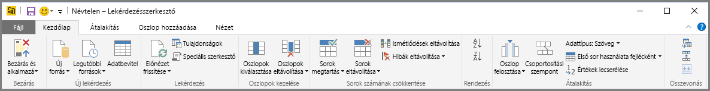

# Lekérdezések áttekintése a Power BI Desktopban
A Power BI Desktop segítségével adatokhoz csatlakozhat, lenyűgöző, alapvető fontosságú jelentéseket hozhat létre, és megoszthatja munkája eredményét másokkal, akik az Ön munkája alapján megalapozottabb üzleti döntéseket hozhatnak.

A Power BI Desktopban három nézet érhető el:

* **Jelentés** nézet – ebben a nézetben a lekérdezések segítségével lenyűgöző vizualizációkat hozhat létre, amelyeket tetszése szerint rendezhet el akár több oldalon, valamint megoszthat másokkal.
* **Adatok** nézet – a jelentésben szereplő adatokat adatmodell-formátumban jelenítheti meg, így értékeket adhat hozzá, új oszlopokat hozhat létre és kezelheti a kapcsolatokat.
* **Kapcsolatok** nézet – megtekintheti az adatmodellben létrehozott kapcsolatok grafikus ábrázolását, illetve szükség szerint kezelheti és módosíthatja a kapcsolatokat.

Ezeket a nézeteket a Power BI Desktop három bal oldali ikonjának egyikére kattintva érheti el. Az alábbi ábrán a **Jelentés** nézet van kiválasztva, amelyet az ikon melletti sárga sáv jelöl.  

A Power BI Desktophoz tartozik a Power Query-szerkesztő is. A Power Query-szerkesztővel csatlakozhat egy vagy több adatforráshoz, igény szerint formázhatja és alakíthatja át az adatokat, majd az elkészült modellt betöltheti a Power BI Desktopba.

Ez a dokumentum áttekintést nyújt az adatok Power Query-szerkesztőben való használatáról, de korántsem teljeskörű. A dokumentum végén a támogatott adattípusokkal kapcsolatos részletes leírásokra mutató hivatkozásokat talál. Útmutatást kaphat az adatokhoz való kapcsolódáshoz, az adatok formálásához, kapcsolatok létrehozásához és az első lépésekhez is.

Először azonban ismerkedjen meg a Power Query-szerkesztővel.

## Power Query-szerkesztő
A Power Query-szerkesztő megnyitásához válassza a **Lekérdezések szerkesztése** lehetőséget a Power BI Desktop **Kezdőlapján**.  

Adatkapcsolatok hiányában a Power Query-szerkesztő üres panelként jelenik meg, amely készen áll az adatok fogadására.  

Egy lekérdezés betöltése után a Power Query-szerkesztő nézete máris érdekesebbé válik. Ha csatlakoztatja az alábbi webes adatforrást, a Power Query-szerkesztő betölti az információkat az adatokról, és hozzáláthat az alakításukhoz:

[*https://www.bankrate.com/retirement/best-and-worst-states-for-retirement/*](https://www.bankrate.com/retirement/best-and-worst-states-for-retirement/)

Lássuk, hogyan fest a Power Query-szerkesztő az adatkapcsolat létrehozása után:

1. A menüszalagon számos gomb aktív, amelyekkel a lekérdezésben szereplő adatokat kezelheti.
2. A bal oldali panelen lévő listából kijelölheti, megtekintheti és alakíthatja a lekérdezéseket.
3. A középső panelen a kiválasztott lekérdezésből származó adatok jelennek meg, amelyeket formázhat.
4. Megjelenik a **Lekérdezés beállításai** panel, amelyen a lekérdezés tulajdonságai, valamint az alkalmazott lépések szerepelnek.  
   
   

A továbbiakban mind a négy említett területet: a menüszalagot, a Lekérdezések panelt, az Adat nézetet és a Lekérdezés beállításai panelt is bemutatjuk.

## A Lekérdezések menüszalag
A Power Query-szerkesztő menüszalagja négy lapból áll: **Kezdőlap**, **Átalakítás**, **Oszlop hozzáadása** és **Nézet**.

A **Kezdőlap** a gyakori lekérdezési feladatokat tartalmazza.

Az adatokhoz való csatlakozáshoz és a lekérdezés létrehozásának megkezdéséhez válassza az **Új forrás** lehetőséget. Ekkor megjelenik a leggyakoribb adatforrásokat tartalmazó menü.  

További információ az elérhető adatforrásokról: **Adatforrások**. További információ az adatokhoz való csatlakozásról, példákkal és a szükséges lépésekkel: **Csatlakozás adatokhoz**.

Az **Átalakítás** lap többek között az alábbi gyakori adatátalakítási feladatokat teszi elérhetővé:

* Oszlopok hozzáadása vagy eltávolítása
* Adattípusok módosítása 
* Oszlopok felosztása 
* Más adatközpontú feladatok

További információ az adatok átalakításáról, példákkal: [Oktatóanyag: Adatok formázása és összevonása a Power BI Desktopban](https://docs.microsoft.com/power-bi/desktop-shape-and-combine-data).

Az **Oszlop hozzáadása** lap az oszlopok hozzáadásával, az oszlop adatainak formázásával és az egyéni oszlopok hozzáadásával kapcsolatos további feladatokat tartalmaz. Az alábbi ábrán az **Oszlop hozzáadása** lap látható.  

A menüszalagon található **Nézet** fül segítségével állíthatja be, hogy mely panelek és ablakok jelenjenek meg. Ezen kívül a Speciális szerkesztő megjelenítéséhez is használható. Az alábbi ábrán a **Nézet** fül látható.  

Hasznos tudnivaló, hogy a menüszalagon elérhető feladatok közül sokat a középső panelen, egy oszlopra vagy egyéb adatra jobb gombbal kattintva is elérhet.

## A bal oldali (Lekérdezések) panel
A bal oldali **Lekérdezések** panelen megjelenik az aktív lekérdezések száma és a lekérdezés neve. Ha a bal oldali panelen kiválaszt egy ablaktáblát, a benne szereplő adatok megjelennek a középső panelen, ahol igény szerint átalakíthatók és formázhatók. Az alábbi ábrán egy lekérdezés látható a bal oldali panelen.  

## A középső (Adatok) panel
A középső panelen, vagy más néven az **Adatok** panelen a kiválasztott lekérdezésből származó adatok jelennek meg. A **Lekérdezés** nézet feladatainak legnagyobb része ezen a panelen végezhető el.

Az alábbi ábrán a korábban létrehozott webes adatkapcsolat látható. A **Termék** oszlop van kijelölve, a fejlécen pedig a jobb kattintással megjelenített elérhető menüpontok láthatók. Figyelje meg, hogy a helyi menü elemei megegyeznek a menüszalag fülein szereplő gombokkal.  

A helyi menü egyik elemére (vagy a menüszalag egyik gombjára) kattintva a lekérdezés elvégzi az adott lépést az adatokon. A lépést ki is menti a lekérdezés részeként. A **Lekérdezés beállításai** panel sorrendben rögzíti ezeket a lépéseket, a következő szakaszban leírtak szerint.  

## A jobb oldali (Lekérdezés beállításai) panel
A jobb oldali **Lekérdezés beállításai** panelen jelenik meg a lekérdezéshez tartozó összes lépés. Például a következő ábrán a **Lekérdezés beállításai** panel **Alkalmazott lépések** szakaszában megjelenik, hogy az imént módosította az **Overall Score** (Összpontszám) oszlop típusát.

A lekérdezésen végrehajtott további módosítási lépéseket az **Alkalmazott lépések** szakaszban rögzíti a rendszer.

Lényeges, hogy a mögöttes adatok *nem* módosulnak. A Power Query-szerkesztő csak az adatnézetet állítja és alakítja át. Ugyanígy alakítja a mögöttes adatokkal végzett összes olyan művelet nézetét is, amely a Power Query-szerkesztő által átalakított adatnézet miatt van végrehajtva.

A **Lekérdezés beállításai** panelen igény szerint átnevezheti, törölheti, vagy átrendezheti a lépéseket. Ehhez kattintson a jobb gombbal az **Alkalmazott lépések** szakaszra, és válasszon a megjelenő helyi menüből. A rendszer minden lekérdezési lépést az **Alkalmazott lépések** panelen látható sorrendben végez el.

## Speciális szerkesztő
A **Speciális szerkesztővel** megtekintheti azt a kódot, amelyet a Power Query-szerkesztő hoz létre az egyes lépésekhez. Ennek használatával saját alakítási kódot is írhat. A speciális szerkesztő elindításához a menüszalagon válassza a **Nézet** elemet, majd a **Speciális szerkesztő** lehetőséget. Ekkor megjelenik az aktuális lekérdezési kódot tartalmazó ablak.  

A kódot a **Speciális szerkesztő** ablakban közvetlenül szerkesztheti. Az ablak bezárásához válassza a **Kész** vagy a **Mégse** gombot.  

## A munka mentése
Ha késznek ítéli a lekérdezést, válassza Power Query-szerkesztő **Fájl7** menüjének **Bezárás és Alkalmazás** pontját. Ez a művelet alkalmazza a módosításokat és bezárja a szerkesztőt.  

A Power BI Desktop egy párbeszédpanelen jeleníti meg a folyamat állapotát.  

Ha elkészült, a Power BI Desktoppal *.pbix*-fájl formájában is kimentheti a munkáját.

A munka mentéséhez válassza a **Fájl** \> **Mentés** (vagy **Fájl** \> **Mentés másként**) lehetőséget, ahogy azt az alábbi ábra is mutatja.  

## Következő lépések
A Power BI Desktop műveletek és lehetőségek széles tárházát tartalmazza. A program képességeivel kapcsolatos további információkért lásd az alábbi forrásanyagokat:

* [Mi az a Power BI Desktop?](../fundamentals/desktop-what-is-desktop.md)
* [Adatforrások a Power BI Desktopban](../connect-data/desktop-data-sources.md)
* [Csatlakozás adatokhoz a Power BI Desktopban](../connect-data/desktop-connect-to-data.md)
* [Oktatóanyag: Adatok formázása és kombinálása a Power BI Desktoppal](../connect-data/desktop-shape-and-combine-data.md)
* [Gyakori lekérdezési feladatok végrehajtása a Power BI Desktopban](desktop-common-query-tasks.md)   
