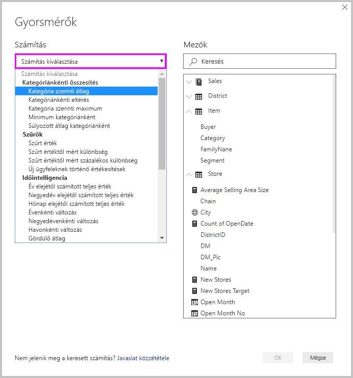
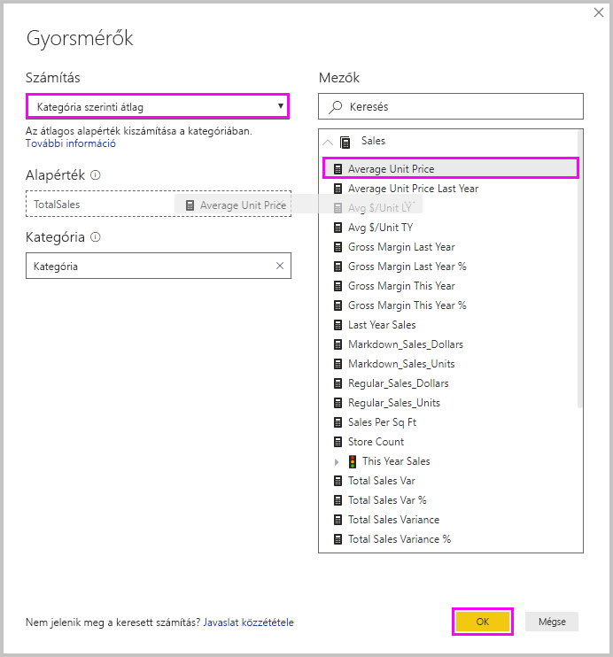
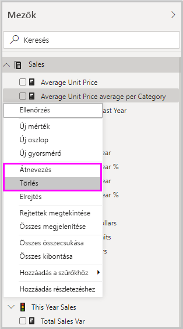

# Gyorsmérők használata általános számításokhoz
A *Gyorsmérők* használatával könnyedén végrehajthat általános és nagy igényű számításokat. A gyorsmérők a színfalak mögött Data Analysis Expressions- (DAX-) parancsokat futtatnak, majd az eredményeket használatra készen megjelenítik a jelentésben. A DAX-ot nem kell megírnia, a párbeszédpanelen megadott bemeneti adatok alapján már készen áll. Számos számítási kategória áll rendelkezésre, és az egyes számításokat módosíthatja is az igényei szerint. Ami a legjobb, hogy megtekintheti a gyorsmérő által végrehajtott DAX-ot, így megismerheti a DAX-ot, vagy bővítheti az ismereteit.

## Gyorsmérő létrehozása

Ha gyorsmérőt szeretne létrehozni a Power BI Desktopban, a **Mezők** panel egyik eleme mellett kattintson a jobb gombbal a három pontra ( **...** ), vagy jelölje ki azt, majd válassza a megjelenő menüből az **Új gyorsmérő** lehetőséget. 

Kattinthat a jobb gombbal egy meglévő vizualizáció **Értékek** panelének bármelyik értéke mellett lévő legördülő nyílra is, és kiválaszthatja az **Új gyorsmérő** lehetőséget a menüből. 

Az **Új gyorsmérő** kiválasztásakor megjelenik a **Gyorsmérők** ablak, amelyben kiválaszthatja a kívánt számítást és azokat a mezőket, amelyekben futtatni kívánja a számítást. 

Válassza ki a **Számítás választása** mezőt a rendelkezésre álló gyorsmérők hosszú listájának megjelenítéséhez. 

A gyorsmérők öt számítási típusa és számításaik a következők:

* **Kategóriánkénti összesítés**
  * Kategória szerinti átlag
  * Kategóriánkénti eltérés
  * Kategória szerinti maximum
  * Minimum kategóriánként
  * Súlyozott átlag kategóriánként
* **Szűrők**
  * Szűrt érték
  * Szűrt értéktől mért különbség
  * Szűrt értéktől mért százalékos különbség
  * Új ügyfeleknek történő értékesítések
* **Időintelligencia**
  * Év elejétől számított teljes érték
  * Negyedév elejétől számított teljes érték
  * Hónap elejétől számított teljes érték
  * Évenkénti változás
  * Negyedévenkénti változás
  * Havonkénti változás
  * Gördülő átlag
* **Összegek**
  * Göngyölített összeg
  * A kategória végösszege (szűrőkkel)
  * A kategória végösszege (szűrők nélkül)
* **Matematikai műveletek**
  * Összeadás
  * Kivonás
  * Szorzás
  * Osztás
  * Százalékos különbség
  * Korrelációs együttható
* **Szöveg**
  * Csillagos minősítés
  * Értékek összefűzött listája

Ha szeretné az új gyorsmérőkkel vagy az alapul szolgáló DAX-képletekkel kapcsolatos ötleteit beküldeni, tekintse meg a cikk végét.

> [!NOTE]
> Az SQL Server Analysis Services (SSAS) élő kapcsolatok használatakor bizonyos Gyorsmérők elérhetők. A Power BI Desktop csak azokat a gyorsmérőket jeleníti meg, amelyek támogatottak a kapcsolatban részt vevő SSAS-verzióhoz. Ha csatlakozik egy SSAS élő adatforráshoz, és nem lát bizonyos Gyorsmérőket a listában, annak az az oka, hogy az az SSAS-verzió, amelyhez kapcsolódik, nem támogatja az adott gyorsmérők megvalósításához használt DAX-parancsokat.

Miután kiválasztotta a gyorsmérőhöz használni kívánt számításokat és mezőket, válassza az **OK** gombot. Az új gyorsmérő megjelenik a **Mezők** panelen, az alapul szolgáló DAX-képlet pedig a képletsávban. 

## Gyorsmérő – példa
Lássunk egy gyorsmérőt működés közben.

Az alábbi Mátrix vizualizáció különböző termékek értékesítéséről jelenít meg egy táblázatot. Ez egy alapszintű táblázat, amelyben az egyes kategóriákhoz tartozó értékesítési végösszegek szerepelnek.

Ha kiválasztotta a Mátrix vizualizációt, kattintson a **TotalSales** (Összes értékesítés) melletti legördülő nyílra az **Értékek** területen, és válassza az **Új gyorsmérő** lehetőséget. 

A **Gyorsmérők** ablakban a **Számítás** területen válassza a **Kategória szerinti átlag** lehetőséget. 

Húzza át az **Átlagos egységár** elemet a **Mezők** panelről az **Alapérték** mezőbe. Hagyja a **Kategóriát** a **Kategória** mezőben, majd válassza az **OK** gombot. 

Amikor kiválasztja az **OK** gombot, több érdekes dolog is történik.

1. A Mátrix vizualizáció egy új oszloppal rendelkezik, amely a **Kategória szerinti átlagos egységárat** mutatja.
   
2. Az új gyorsmérőhöz tartozó DAX-képlet megjelenik a képletsávban. A DAX-képlettel kapcsolatos további információkért tekintse meg a [következő szakaszt](#learn-dax-by-using-quick-measures).
   
3. Az új gyorsmérő kijelölve és kiemelve jelenik meg a **Mezők** panelen. 

Az új gyorsmérő a jelentés bármely vizualizációja számára elérhető, nem csak az Ön által létrehozott vizualizáció számára. Az alábbi képen egy gyors oszlopdiagram vizualizációja látható, amely az új gyorsmérő mező használatával lett létrehozva.

## A DAX megismerése a gyorsmérők használatával
A gyorsmérők egyik nagyszerű előnye, hogy megjelenítik a mértéket implementáló DAX-képletet. Amikor kiválaszt egy gyorsmérőt a **Mezők** panelen, megjelenik a **Képletsáv**, ahol látható a DAX-képlet, amelyet a Power BI a mérték megvalósításához hozott létre.

A képletsáv nem csak a mérték mögötti képletet jeleníti meg, de ami talán ennél is fontosabb, azt is, hogyan hozhatja létre a gyorsmérők alapjául szolgáló DAX-képleteket.

Tegyük fel, hogy szüksége van egy éves adatokat összevető számításra, de nem biztos benne, hogyan építse fel a DAX-képletet, vagy ötlete sincs, hol kezdje. Ahelyett, hogy tovább törné a fejét, létrehozhat egy gyorsmérőt az **Évenkénti változás** számítással, és megnézheti, hogyan jelenik meg a vizualizációban, és hogyan működik a DAX-képlet. Ezután közvetlenül a DAX-képleten hajthatja végre a módosításokat, vagy létrehozhat egy hasonló mértéket, amely megfelel az igényeinek és elvárásainak. Olyan, mintha egy tanár azonnal megválaszolná a néhány kattintással feltett „mi lenne, ha” típusú kérdéseit. 

A gyorsmérőket bármikor eltávolíthatja a modellből, ha nem nyerik el a tetszését. Egyszerűen kattintson a jobb gombbal a mérték melletti három pontra ( **...** ), és válassza a **Törlés** lehetőséget. A gyorsmérőket bármikor át is nevezheti a kívánt módon, ha kiválasztja az **Átnevezés** lehetőséget a menüből. 

## Korlátozások és megfontolandó szempontok
Figyelembe kell venni néhány korlátozást és szempontot.

- A **Mezők** panelhez hozzáadott gyorsmérőket a jelentés bármely vizualizációjával használhatja.
- A gyorsmérőhöz tartozó DAX-ot bármikor megtekintheti, ehhez jelölje ki a mértéket a **Mezők** szakaszban, és a képlet megjelenik a képletsávban.
- A gyorsmérők csak akkor érhetők el, ha a modell módosítható. Ez nincs így, ha egyes élő kapcsolatokkal dolgozik. A SSAS táblázatos élő kapcsolatok az előzőekben leírtak szerint támogatottak.
- Nem tud időintelligencia gyorsmérőt létrehozni, ha DirectQuery módban dolgozik. Az ezekben a gyorsmérőkben használt DAX-függvények negatív hatással vannak a teljesítményre, amikor a program T-SQL-utasításokká fordítja le őket az adatforrásnak való küldéshez.

> [!IMPORTANT]
> A gyorsmérők DAX-utasításaiban a vesszők csak argumentumelválasztóként funkcionálnak. Ha az Ön Power BI Desktop-verziója olyan nyelvű, amely tizedeselválasztóként használja a vesszőket, a gyorsmérők nem fognak megfelelően működni.

### Az időintelligencia és a gyorsmérők
Használhatja saját egyéni dátumoszlopait az időintelligenciát használó gyorsmérőkhöz. Ha egy külső táblázatos modellt használ, ellenőriznie kell, hogy a modell létrehozásakor az adott tábla elsődleges dátum oszlopa dátumtáblázatként lett-e megjelölve, amint az a [Jelölés megadása dátumtáblázatként az időintelligencia használatához](https://docs.microsoft.com/sql/analysis-services/tabular-models/specify-mark-as-date-table-for-use-with-time-intelligence-ssas-tabular) című cikkben szerepel. Ha egy saját dátumtáblázatot importál, győződjön meg arról, hogy az dátumtáblázatként van megjelölve, ahogy az a [Dátumtáblák beállítása és használata a Power BI Desktopban](desktop-date-tables.md) című cikkben szerepel.

### További információ és példák
Van olyan ötlete egy gyorsmérőre, amely még nem valósult meg? Kitűnő! Látogasson el [Power BI Ideas](https://go.microsoft.com/fwlink/?linkid=842906) oldalra, és küldje be azokat a gyorsmérőkre vonatkozó ötleteit a DAX-képletekkel együtt, amelyeket viszont szeretne látni a Power BI Desktopban. Ezután megvizsgáljuk, hogy azok bekerülhetnek-e a gyorsmérők egy jövőbeli kiadásába.

