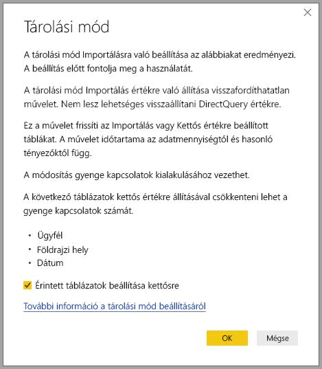

# Tárolási mód kezelése a Power BI Desktopban

A Microsoft Power BI Desktopban megadható a táblák tárolási módja. A tárolási mód használatával szabályozható, hogy a Power BI Desktop gyorsítótárazza-e a memóriában a táblák adatait a jelentésekhez. 

A tárolási mód beállítása több előnnyel is jár. Az egyes táblák tárolási módja külön adható meg a modellben. Ezzel a művelettel egyetlen adathalmazt engedélyez, ami az alábbi előnyökkel jár:

* **Lekérdezési teljesítmény**: Amikor a felhasználók vizualizációkkal dolgoznak a Power BI-jelentésekben, a rendszer Data Analysis Expressions- (DAX-) lekérdezéseket továbbít az adathalmazhoz. Az adatok memóriabeli gyorsítótárazása a tárolási mód helyes beállításával fokozza a lekérdezési teljesítményt és a jelentések kezelhetőségét.

* **Nagy adathalmazok**: A nem gyorsítótárazott táblák nem foglalnak memóriát gyorsítótárazás céljára. Olyan adathalmazokhoz, amelyek túl nagyok vagy szerteágazóak ahhoz, hogy teljes egészükben gyorsítótárazva legyenek a memóriában, engedélyezheti az interaktív elemzést. Ön döntheti el, hogy mely táblákat érdemes gyorsítótárazni, és melyeket nem.

* **Adatfrissítés optimalizálása**: A nem gyorsítótárazott táblákat nem kell frissítenie. Csökkentheti a frissítések időigényét, ha csak a szolgáltatói szerződés és az üzleti igények kielégítéséhez szükséges adatokat gyorsítótárazza.

* **Közel valós idejű követelmények**: A közel valós idejű kezelést igénylő táblákat az adatok késésének csökkentése érdekében jobb nem gyorsítótárazni.

* **Visszaírás**: A visszaírás által az üzleti felhasználók feltételes forgatókönyveket vizsgálhatnak a cellaértékek módosításával. Az egyéni alkalmazások módosításokat hajthatnak végre az adatforráson. A nem gyorsítótárazott táblákban a változás azonnal megjelenik, így a következmények azonnal elemezhetők.

A Power BI Desktop tárolási mód beállítása három kapcsolódó funkció egyike:

* **Összetett modellek**: Lehetővé teszik, hogy egy jelentés kettő vagy több adatkapcsolattal, köztük DirectQuery-kapcsolatokkal és importálással, vagy ezek bármilyen kombinációjával rendelkezzen. További információ: [Összetett modellek használata a Power BI Desktopban](desktop-composite-models.md).

* **Több a többhöz kapcsolatok**: Az összetett modellekkel a táblák között *több-a-többhöz kapcsolatok* hozhatók létre. A több-a-többhöz kapcsolatokban megszűnik az egyedi értékek követelménye a táblákban. Ráadásul ez a korábbi áthidaló megoldásokat is szükségtelenné teszi, például új táblák bevezetését a kapcsolatok létrehozásához. További információk: [Több a többhöz kapcsolatok a Power BI Desktopban](desktop-many-to-many-relationships.md).

* **Tárolási mód**: A tárolási móddal mostantól megadható, hogy mely vizualizációk igényelnek a háttér-adatforrásokba irányuló lekérdezéseket. Azok a vizualizációk, amelyekhez nincs szükség lekérdezésre, importálva lesznek még akkor is, ha DirectQuery-alapúak. Ez a funkció segíti a teljesítmény javulását, és csökkenti a háttérrendszerek leterheltségét. Korábban még az egyszerű vizualizációk, például a szeletelők is kezdeményeztek a háttérbeli forrásokba irányuló lekérdezéseket. 

## A Tárolási mód tulajdonság használata

A **Tárolási mód** olyan tulajdonság, amely a modell minden egyes táblájához beállítható, és azt szabályozza, hogy hogyan gyorsítótárazza a Power BI a tábla adatait.

A **Tárolási mód** tulajdonság beállításához vagy az aktuális beállítás megtekintéséhez: 

1. **Modell** nézetben jelölje ki azt a táblát, amelynek tulajdonságait megtekinteni vagy módosítani kívánja. 
2. A **Tulajdonságok** panelen bontsa ki a **Speciális** szakaszt, majd gördítse le a **Tárolási mód** listát.

   

A **Tárolási mód** tulajdonság az alábbi három érték egyikére állítható be:

* **Importálás**: Az így beállított, importált táblák gyorsítótárazva vannak. A Power BI-adathalmazra irányuló, importált táblákból adatokat visszaadó lekérdezések csak a gyorsítótárazott adatokon hajthatók végre.

* **DirectQuery**: Az így beállított táblák nincsenek gyorsítótárazva. A Power BI-adathalmazra irányuló &mdash;például DAX-lekérdezések&mdash;, illetve a DirectQuery-táblákból adatokat visszaadó lekérdezések csak igény szerinti lekérdezéseknek az adatforráson való futtatásával hajthatók végre. Az adatforrásra irányuló lekérdezések az adott adatforrás lekérdezési nyelvét (például SQL) használják.

* **Kettős**: Az így beállított táblák gyorsítótárazottként és nem gyorsítótárazottként is viselkedhetnek a Power BI-adathalmazra irányuló lekérdezés környezetétől függően. Bizonyos esetekben a lekérdezések a gyorsítótárazott adatokból vannak teljesítve. Más esetekben a lekérdezések teljesítése úgy történik, hogy a rendszer egy igény szerinti lekérdezést futtat az adatforráson.

Egy tábla **Tárolási módjának** **Importálás** értékűre állítása *visszafordíthatatlan* művelet. Ezt a tulajdonságot a beállítása után nem lehet **DirectQuery** vagy **Kettős** értékre módosítani.

> [!NOTE]
> A **Kettős** tárolási módot a Power BI Desktopban és a Power BI szolgáltatásban is használhatja.

## A DirectQuery és Kettős táblákra vonatkozó megkötések

A Kettős táblákra a DirectQuery-táblákéval azonos funkcionális megkötések érvényesek. Ezek közé tartozik az M átalakítások korlátozása és a DAX-függvények korlátozott használata a számított oszlopokban. Bővebb információért olvassa el [a DirectQuery használatának következményeit](../connect-data/desktop-directquery-about.md#implications-of-using-directquery) bemutató cikket.

## A Kettős beállítás továbbadása
Tekintsük meg az alábbi egyszerű modellt, amelyben minden tábla egyetlen, az Importálást és a DirectQuery-t is támogató forrásból származik.

Tegyük fel, hogy kezdetben a modell minden táblája **DirectQuery** beállítású. Ha a **SurveyResponse** tábla **tárolási módját** **Importálás** értékűre állítja, az alábbi figyelmeztetési ablak jelenik meg:

A dimenziótáblákat (**Customer**, **Geography** és **Date**) beállíthatja **Kettős** típusúra, hogy az adathalmazban csökkenjen a gyenge kapcsolatok száma, és javuljon a teljesítmény. Ahol az összekapcsolás logikája nem küldhető le a forrásrendszerekhez, ott a gyenge kapcsolatokban általában legalább egy DirectQuery-tábla is szerepel. Mivel a Kettős tulajdonságú táblák DirectQuery és Importálás módúként is viselkedhetnek, ez a helyzet elkerülhető.

A propagálási logika úgy van megtervezve, hogy segítsen a sok táblát tartalmazó modellek esetében. Tegyük fel, hogy a modellje 50 táblát tartalmaz, és csak bizonyos tény- (tranzakciós) táblákat kell gyorsítótárazni. A Power BI Desktop logikája kiszámítja a dimenziótáblák legszűkebb halmazát, amelyet **Kettős** értékűre kell beállítani, így ezt Önnek nem kell megtennie.

A propagálási logika csak az egy-a-többhöz kapcsolatok „egy” oldalát járja be.

## Példa a tárolási mód használatára
Folytatva az előző szakaszban megkezdett példát, tegyük fel, hogy a következő tárolásimód-beállításokat alkalmaztuk:

| Táblázat                   | Tárolási mód         |
| ----------------------- |----------------------| 
| Értékesítés                 | DirectQuery          | 
| SurveyResponse        | Importálás               | 
| Dátum                  | Kettős                 | 
| Ügyfél              | Kettős                 | 
| Földrajzi hely             | Kettős                 | 

Ezek a tárolásimód-tulajdonságok a következő viselkedést eredményezik, feltéve hogy a **Sales** tábla jelentős mennyiségű adatot tartalmaz:
* A Power BI Desktop gyorsítótárazza a dimenziótáblákat (**Date**, **Customer** és **Geography**), hogy a megjelenítendő szeletelőértékek lekérésekor gyors legyen a jelentések kezdeti betöltése.
* A Power BI Desktop nem gyorsítótárazza a **Sales** táblát. A Power BI Desktop az alábbi eredményeket biztosítja azzal, hogy nem gyorsítótárazza ezt a táblát:
    * Az adatfrissítési idők javulnak, a memóriahasználat pedig csökken.
    * A jelentéseknek a **Sales** táblán alapuló lekérdezései **DirectQuery**-módban futnak. Ezek a lekérdezések tovább tarthatnak, de közelebb állnak a valós időhöz, mert nem járnak gyorsítótárazási késéssel.

* A jelentéseknek a **SurveyResponse** táblán alapuló lekérdezései a memóriabeli gyorsítótárból adnak vissza választ, ezért viszonylag gyorsak.

## A gyorsítótárat érintő vagy elkerülő lekérdezések

Ha az SQL Profilert a Power BI Desktop diagnosztikai portjára csatlakoztatja, a következő események nyomkövetésével megállapítható, hogy mely lekérdezések érintik vagy kerülik el a gyorsítótárat:

* Queries Events\Query Begin
* Query Processing\Vertipaq SE Query Begin
* Query Processing\DirectQuery Begin

Minden *Query Begin* (lekérdezés kezdete) eseménynél ellenőrizze az azonos *ActivityID* tevékenységazonosítóval rendelkező többi eseményt. Ha például nincs *DirectQuery Begin* esemény, *Vertipaq SE Query Begin* esemény viszont van, akkor a lekérdezés a gyorsítótárból kapott választ.

A Kettős módú táblákra hivatkozó lekérdezések lehetőség szerint a gyorsítótárból adnak vissza adatokat, egyébként a DirectQueryre hagyatkoznak.

A korábbi példát folytatva a következő lekérdezés csak a **Kettős** módban lévő **Date** tábla egyik oszlopára hivatkozik. Így tehát a lekérdezésnek a gyorsítótárhoz kell fordulnia:

A következő lekérdezés csak a **DirectQuery** módban lévő **Sales** tábla egyik oszlopára hivatkozik. Így tehát *nem* fordulhat a gyorsítótárhoz:

A következő lekérdezés érdekessége, hogy mindkét oszlop szerepel benne. Ez a lekérdezés elkerüli a gyorsítótárat. Számítani lehetett volna arra, hogy a **CalendarYear** értékeket a gyorsítótárból, a **SalesAmount** értékeket pedig a forrásból kéri le, majd kombinálja az eredményeket, ez azonban kevésbé volna hatékony, mint a forrásrendszerhez továbbítani a SUM/GROUP BY műveletet. A műveletet a forrásnak leküldve a visszaadott sorok száma valószínűleg sokkal kisebb lesz: 

> [!NOTE]
> Ez a viselkedés más, mint a [több-a-többhöz kapcsolatok viselkedése a Power BI Desktopban](desktop-many-to-many-relationships.md), amikor gyorsítótárazott és nem gyorsítótárazott táblák kombinálásáról van szó.

## A gyorsítótárakat szinkronizálva kell tartani

Az előző szakaszban bemutatott lekérdezések szemléltették, hogy a Kettős táblák bizonyos esetekben érintik, más esetekben elkerülik a gyorsítótárat. Emiatt előfordulhat, hogy ha a gyorsítótár elavul, a rendszer különböző értékeket ad vissza. A lekérdezések végrehajtása nem kísérli meg elfedni az adatokkal kapcsolatos problémákat például azzal, hogy a DirectQuery-eredményeket a gyorsítótárazott értékekkel való egyezés alapján szűri. Önnek kell ismernie a saját adatfolyamait, és azok alapján terveznie. Léteznek bevált módszerek az ilyen eseteknek a forrásnál való kezelésére, ha szükséges.

A **Kettős** tárolási mód teljesítmény-optimalizálás. Csak úgy szabad használni, hogy ne veszélyeztesse az üzleti követelmények teljesítését. Másféle viselkedés eléréséhez fontolja meg a [Több-a-többhöz kapcsolatok a Power BI Desktopban](desktop-many-to-many-relationships.md) című cikkben ismertetett módszerek használatát.

## Adatnézet
Ha az adathalmazban legalább egy tábla **Importálás** vagy **Kettős** tárolási módra van beállítva, akkor megjeleníthető az **Adatnézet** lap.

Az **Adatnézetben** kijelölt Kettős és Importálás módú táblákhoz megjelennek a gyorsítótárazott adatok. A DirectQuery-táblák adatai nem láthatók, és megjelenik egy üzenet, amely szerint a DirectQuery-táblák nem jeleníthetők meg.

## Korlátozások és szempontok

A tárolási módnak erre a verziójára és az összetett modellekkel való viszonyára bizonyos korlátozások vonatkoznak.

Az alábbi élő kapcsolatú (többdimenziós) források nem használhatók összetett modellekkel:

* SAP HANA
* SAP Business Warehouse
* SQL Server Analysis Services
* Power BI-adathalmazok
* Azure Analysis Services

Ha ezekhez a többdimenziós forrásokhoz a DirectQuery használatával csatlakozik, nem tud más DirectQuery-forráshoz csatlakozni vagy importált adatokkal kombinálni.

A DirectQuery használatára vonatkozó korlátozások az összetett modellek használatára is érvényesek. Sok ilyen korlátozás jelenleg táblánként értendő, a tábla tárolási módjától függően. Egy importált tábla egy számított oszlopa például hivatkozhat más táblákra, egy DirectQuery-tábla számított oszlopai viszont továbbra is csak a táblán belüli oszlopokra hivatkozhatnak. Más korlátozások a modell egészére vonatkoznak, ha a modellen belül bármelyik tábla DirectQuery módban van. A QuickInsights- és a Q&A-funkciók például nem érhetők el a modellben, ha a táblázatok bármelyikének tárolási módja DirectQuery. 

## Következő lépések

Az összetett modellekkel és a DirectQueryvel kapcsolatos további információkért tekintse meg a következő cikkeket:
* [Összetett modellek a Power BI Desktopban](desktop-composite-models.md)
* [Több a többhöz kapcsolatok a Power BI Desktopban](desktop-many-to-many-relationships.md)
* [A DirectQuery használata a Power BI-ban](../connect-data/desktop-directquery-about.md)
* [A DirectQuery által támogatott adatforrások a Power BI-ban](../connect-data/power-bi-data-sources.md)
