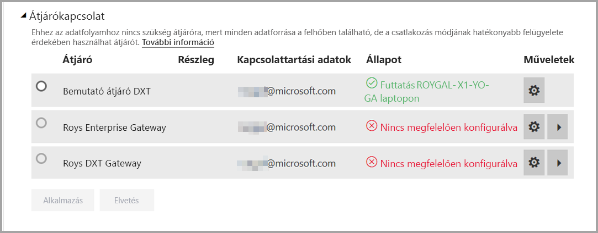
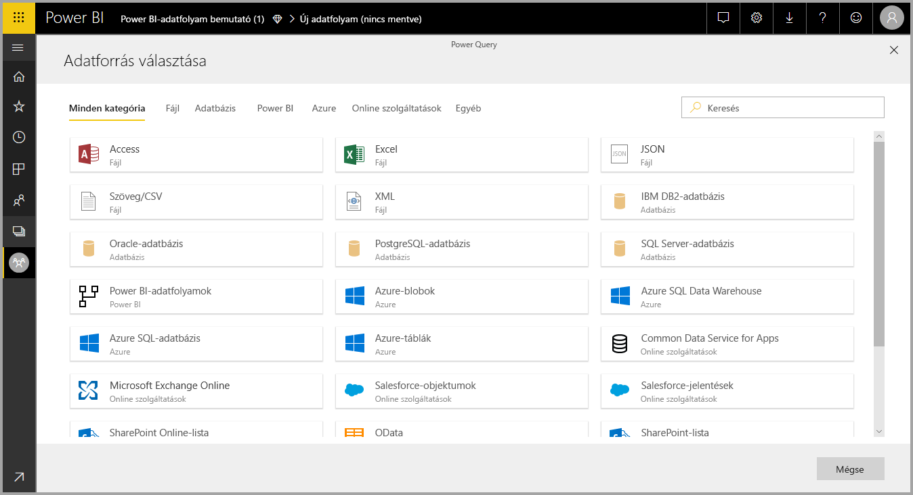
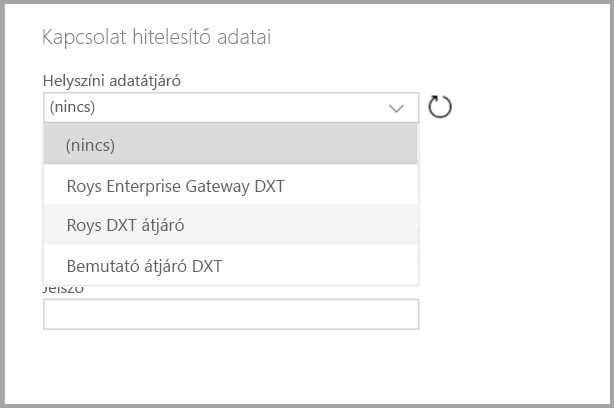

# Adatfolyamok használata helyszíni adatforrásokkal

Az **adatfolyamokkal** létrehozhat adatgyűjteményt többféle forrásból, kitisztíthatja és átalakíthatja az adatokat, majd betöltheti a Power BI-tárba. Adatfolyam létrehozásakor érdemes lehet helyszíni adatforrásokat használni. Ez a cikk tisztázz az adatfolyamok létrehozásával kapcsolatos követelményeket és a **vállalati átjáró** konfigurálásának módját a kapcsolatok engedélyezéséhez.

## Vállalati átjáró konfigurálása az adatfolyamokkal való használatra

Ha átjáróval szeretne adatfolyamot létrehozni, a felhasználónak az Enterprise Gateway rendszergazdájának kell lennie, vagy a rendszergazdának meg kell osztania vele a használni kívánt adatforrást. 

> [!NOTE]
> Az adatfolyamok csak vállalati átjárók használatakor támogatottak.

## Helyszíni adatforrás használata egy adatfolyamban

Adatfolyam létrehozásakor válasszon egy helyszíni adatforrást az adatforrások listájából amint az a következő képen látható.

Miután elvégezte a kijelölést, meg kell adnia a vállalati átjáró csatlakozási adatait, amelyeket a helyszíni adatok elérésére fog használni. Ki kell választania az átjárót, és meg kell adnia a hitelesítő adatokat a kiválasztott átjáróhoz.

## Az átjáró figyelése

A vállalati átjáróban az adatfolyamot ugyanúgy figyelheti, ahogyan az adatkészlet-átjárókat figyeli.

A Power BI adatfolyam beállítási képernyőjén figyelheti az adatfolyam átjárójának állapotát, és adatfolyamokat rendelhet hozzá az átjáróhoz az alábbi ábrának megfelelően.

## Az átjáró módosítása

Az adott adatfolyamhoz használt vállalati átjárót kétféleképpen módosíthatja:

1. **A szerkesztőeszközből** – Az összes lekérdezéshez hozzárendelt átjárót az adatfolyam-szerkesztő eszközzel módosíthatja.

    > [!NOTE]
    > Az adatfolyam megpróbálja megtalálni vagy létrehozni a szükséges adatforrásokat az új átjáróval. Ha ezt nem tudja végrehajtani, addig nem lehet módosítani az átjárót, amíg minden adatfolyam elérhetővé nem válik a kiválasztott átjárón.

2. **A beállítások képernyőről** – A Power BI szolgáltatásban az adatfolyam beállítások képernyőjén lehet módosítani a hozzárendelt átjárót.

Vállalati átjárókkal kapcsolatos további információkért lásd a [Helyszíni adatátjárók](../connect-data/service-gateway-onprem.md) szakaszt.

## Megfontolandó szempontok és korlátozások

Van néhány a vállalati átjárók és adatfolyamok használatával kapcsolatos ismert korlát:

* Minden egyes adatfolyam csak egy átjárót használhat. Ennek következtében az összes lekérdezést azonos átjáró használatával kell konfigurálni.
* Az átjáró módosítása hatással van a teljes adatfolyamra.
* Ha több átjáróra van szükség, az ajánlott eljárás több adatfolyam létrehozása (minden átjáróhoz egyet) és a számítási vagy entitásreferencia szolgáltatás használata az adatok egyesítésére.
* Az adatfolyamok csak vállalati átjárók használatával támogatottak. Személyes átjárók nem lesznek kiválaszthatók a legördülő listákban és a beállítások képernyőin.

## Következő lépések

Ennek a cikknek az elolvasásával helyszíni adatforrás adatfolyamokhoz való használatával kapcsolatos információkat ismerhetett meg, valamint azt, hogyan használhat és konfigurálhat átjárókat ezeknek az adatoknak az elérésére. A következő cikkek szintén hasznosak lehetnek

* [Önkiszolgáló adatelőkészítés adatfolyamokkal](service-dataflows-overview.md)
* [Adatfolyamok létrehozása és használata a Power BI-ban](service-dataflows-create-use.md)
* [Számított entitások használata a Power BI Premiumban](service-dataflows-computed-entities-premium.md)
* [Fejlesztői erőforrások Power BI-adatfolyamokhoz](service-dataflows-developer-resources.md)

A Power Queryvel és az ütemezett frissítésekkel kapcsolatos további információkért olvassa el ezeket a cikkeket:
* [Lekérdezések áttekintése a Power BI Desktopban](desktop-query-overview.md)
* [Ütemezett frissítés beállítása](../connect-data/refresh-scheduled-refresh.md)

A Common Data Modellel kapcsolatos további információkért olvassa el a áttekintését tartalmazó cikket:
* [Common Data Model – áttekintés](https://docs.microsoft.com/powerapps/common-data-model/overview)
