# A Mátrix vizualizáció használata a Power BI-ban
A **Mátrix** vizualizációs funkcióval mátrixvizualizációkat (vagy más néven *táblázatokat*) hozhat létre a **Power BI Desktop** és a **Power BI szolgáltatás** jelentéseiben, és a mátrixban keresztkiemelést alkalmazhat más vizualizációkkal. Továbbá kiválaszthat sorokat, oszlopokat vagy egyetlen cellát is, és keresztkiemeléssel láthatja el őket. Egy vagy több kijelölt cellát kimásolhat és beilleszthet más alkalmazásokba is. Végül az elrendezési terület jobb kihasználásának érdekében, a mátrixvizualizáció támogatja a lépcsőzetes elrendezést.

A mátrix számos funkcióval rendelkezik, amelyeket a cikk következő szakaszaiban be is mutatunk.

## Jelentéstémák
A mátrix- és táblázatvizualizációk az alkalmazott **jelentéstéma** stílusát tükrözik (beleértve a színeket is). Előfordulhat, hogy nem ezeket a színeket szeretné használni a mátrixvizualizációban. Ezt a **Jelentési téma** konfigurációjában módosíthatja. A témákról szóló további információkért tekintse meg a [**jelentési témák a Power BI Desktopban történő használatát**](../desktop-report-themes.md) ismertető szakaszt.

## Hogyan számítja ki a Power BI az összegeket?

A **Mátrix** vizualizáció használatának ismertetése előtt fontos megérteni, hogy a Power BI hogyan számítja ki a táblázatok és mátrixok összegeit és részösszegeit. Az összegeket és részösszegeket tartalmazó sorok esetén a mögöttes adatok összes sorának mértéke adja az összeget, *nem* csak a látható vagy megjelenített sorok értékeinek összege. Ez azt jelenti, hogy az összeget tartalmazó sorban a várttól eltérő értékek szerepelhetnek. 

Tekintse meg az alábbi **Mátrix** vizualizációkat. 

Ebben a példában a jobb szélső **Mátrix** vizualizáció minden sora az egyes értékesítő/dátum kombinációk *összegét* mutatja. Azonban mivel egy értékesítő több dátummal együtt is szerepel, a számok többször is előfordulhatnak. A mögöttes adatok pontos formája, valamint a látható adatok egyszerű összeadása így nem felel meg egymásnak. Ez egy gyakori trend akkor, ha az összegzett érték egy egy-a-többhöz kapcsolat egyéni oldalán áll.

Az összegek és a részösszegek megtekintésekor vegye figyelembe, hogy ezek az értékek a mögöttes adatokon alapulnak, és nem kizárólag a látható értékeken. 

<!-- use Nov blog post video

## Expanding and collapsing row headers
There are two ways you can expand row headers. The first is through the right-click menu. You’ll see options to expand the specific row header you clicked on, the entire level or everything down to the very last level of the hierarchy. You have similar options for collapsing row headers as well.

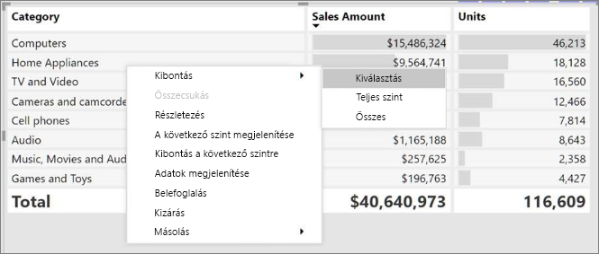

You can also add +/- buttons to the row headers through the formatting pane under the row headers card. By default, the icons will match the formatting of the row header, but you can customize the icons’ color and size separately if you want. 
Once the icons are turned on, they work similarly to the icons from PivotTables in Excel.

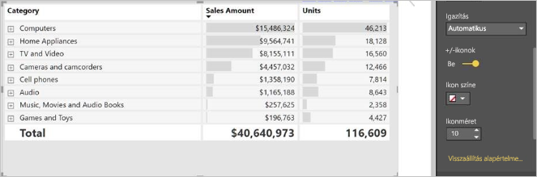

The expansion state of the matrix will save with your report. It can be pinned to dashboards as well, but consumers will need to open up the report to change the state. Conditional formatting will only apply to the inner most visible level of the hierarchy. Note that this expand/collapse experience is not currently supported when connecting to AS servers older than 2016 or MD servers.

Watch the following video to learn more about expand/collapse in the matrix:

-->
## Részletes elemzés használata a Mátrix vizualizációval
A **Mátrix** vizualizációval számos érdekes, korábban nem elérhető részletes elemzési tevékenység hajtható végre. Például a részletes elemzés sorok, oszlopok vagy külön szakaszok és cellák használatával. Vessünk egy pillantást ezek működésére.

### Sorazonosítókon végzett részletes elemzés
Amikor a **Vizualizációk** ablaktáblán több mezőt ad hozzá a **Mezők** terület **Sorok** szakaszához, engedélyezi a mátrixvizualizáció sorain végzett részletes elemzést. Ez hasonlít egy hierarchia létrehozásához, amely utána lehetővé teszi a hierarchia részletezését (majd a felhatolást), és az adatok elemzését minden szinten.

Az alábbi képen a **Sorok** szakasz egy *Kategória* és egy *Alkategória* részt tartalmaz, létrehozva egy csoportosítást (vagy hierarchiát) a részletezhető sorokban.

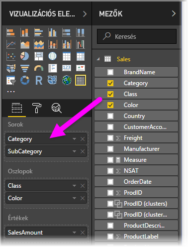

Ha a vizualizáció a **Sorok** szakaszban csoportosítást tartalmaz, a vizualizáció megjeleníti a *részletezés* és *kibontás* ikont a vizualizáció bal felső sarkában.

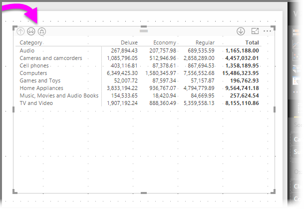

Az egyéb vizualizációk részletezési és kibontási viselkedéséhez hasonlóan, ha ezekre a gombokra kattint, akkor lehetőség nyílik a részletezésre (vagy felhatolásra) a hierarchián keresztül. Ebben az esetben lehatolhatunk a *Kategóriából* az *Alkategóriához*, ahogy az alábbi képen is látható, ahol a „lehatolás egy szinttel” ikon (a lefelé mutató villa) lett kiválasztva.

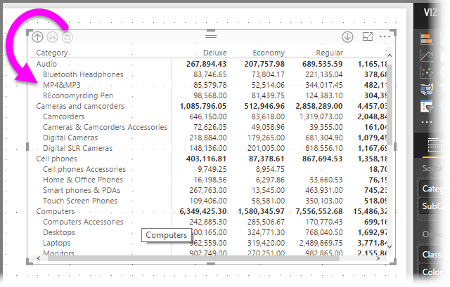

Az ikonok használatán kívül a jobb gombbal is kattinthat bármelyik sorazonosítóra, és részletes elemzést végezhet, ha kiválasztja ezt a lehetőséget a megjelenő menüből.

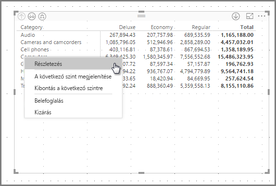

Figyelje meg, hogy van néhány lehetőség a megjelenő menüben, amely különböző eredményekhez vezet:

A **Részletes elemzés** kiválasztása kibontja az *ahhoz* a sorszinthez tartozó mátrixot, *kivéve* az egyéb összes sorfejlécet, annak a sorazonosítónak a kivételével, amelyre a jobb gombbal kattintott. Az alábbi képen a *Számítógépekre* a jobb gombbal kattintottak, és a **Részletes elemzés** lett kiválasztva. Figyelje meg, hogy egyéb legfelső szintű sorok már nem jelennek meg a mátrixban. Ez a fajta részletezés olyan hasznos funkció, amely a **keresztkiemelés** szakaszban válik igazán hasznossá.

Ha a **Felhatolás** ikonra kattint, visszajut az előző, legfelső szintű nézethez. Ha ezután a **Következő szint megjelenítése** lehetőséget választja a helyi menüből, megjelenik a következő szinten (ebben az esetben az *Alkategória* mezőben) lévő elemek betűrendbe szedett listája, a magasabb szintű hierarchiakategorizálás nélkül.

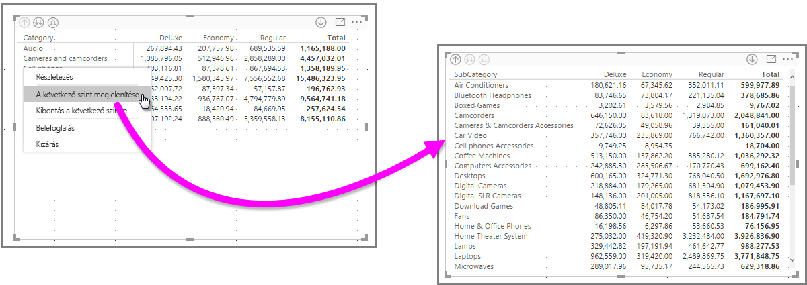

Ha a bal felső sarokban található **Felhatolás** ikonra kattint, hogy a mátrix megjelenítse a legfelső szintű kategóriákat, majd a jobb gombbal ismét kattint, és kiválasztja a **Kibontás a következő szintre** elemet, a következő vizualizáció jelenik meg.

A **Belefoglalás** és a **Kizárás** menüelemet is használhatja annak a sornak (és bármely alkategóriának) a kizáráshoz (vagy eltávolításához) a mátrixból, amelyre a jobb gombbal kattintott.

### Oszlopfejléceken végzett részletes elemzés
A Sorokon végzett részletes elemzéshez hasonlóan az **Oszlopokon** is végezhet részletes elemzést. Az alábbi képen két mező található az **Oszlopok** mező területén, egy ahhoz hasonló hierarchiát létrehozva, amilyet a sorokhoz használtunk a cikk korábbi szakaszában. Az **Oszlopok** mező területén az *Osztály* és a *Szín* található.

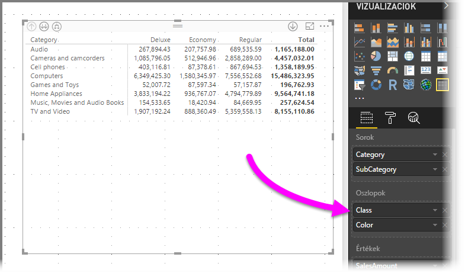

A **Mátrix** vizualizációban, ha a jobb gombbal az oszlopra kattintunk, megjelenik a részletes elemzés elvégzésének lehetősége. Az alábbi képen a jobb gombbal kattintottunk a *Deluxe* elemre, és kiválasztottuk a **Részletes elemzést**.

A **Részletes elemzés** kiválasztása esetén megjelenik a *Deluxe* oszlophierarchiájának következő szintje, ami ebben az esetben a *Szín*.

A helyi menü többi eleme ugyanúgy működik az oszlopok, ahogy a sorok esetében (lásd az előző, a **sorazonosítókon végzett részletes elemzést** ismertető szakaszt). **Megjelenítheti a következő szintet**, **kibonthat a következő szintre**, és a sorokhoz hasonlóan **belefoglalhatja** vagy **kizárhatja** az oszlopokat.

> [!NOTE]
> A részletes elemzés és felhatolás ikonjai a mátrixvizualizáció bal felső sarkában csak a sorokra vonatkoznak. Ha oszlopokon szeretne részletes elemzést végezni, a helyi menüt kell használnia (a jobb gombbal kattintva).
> 
> 

## Lépcsőzetes elrendezés mátrixvizualizációkkal
A **Mátrix** vizualizáció automatikusan behúzza egy hierarchia alkategóriáit minden szülő alatt; ezt **Lépcsőzetes elrendezésnek** hívjuk.

A mátrixvizualizáció *eredeti* verziójában az alkategóriák egy teljesen külön oszlopban jelentek meg, több helyet foglalva a vizualizációban. Az alábbi képen az eredeti **Mátrix** vizualizáció egy táblája látható. Figyelje meg, hogy az alkategóriák külön oszlopban vannak.

Az alábbi képen a **Mátrix** vizualizáció látható **Lépcsőzetes elrendezéssel**. Figyelje meg, hogy a *Számítógépek* kategória saját, kis mértékben behúzott alkategóriákkal rendelkezik (Számítógép-kiegészítők, Asztali számítógépek, Laptopok, Monitorok stb.), ezzel átláthatóbb és tömörebb vizualizációt biztosít.

A lépcsőzetes elrendezés beállításait egyszerűen módosíthatja. Ha a **Mátrix** vizualizáció van kiválasztva, a **Vizualizációk** ablaktábla **Formátum** szakaszában (festőhenger ikon) bontsa ki a **Sorazonosítók** szakaszt. Két lehetőség érhető el: a **Lépcsőzetes elrendezés** váltógomb (amely ki- vagy bekapcsolja ezt az elrendezést) és a **Lépcsőzetes elrendezés behúzása** (a behúzás mértékét adja meg képpontokban).

Ha kikapcsolja a **Lépcsőzetes elrendezést**, az alkategóriák egy másik oszlopban jelennek meg, nem pedig a szülőkategória alatt behúzva.

## Részösszegek a mátrixvizualizációkkal
A részösszegeket a soroknál és oszlopoknál is ki- vagy bekapcsolhatja a mátrixvizualizációkban. Az alábbi képen látható, hogy a sorok részösszegei **be** vannak kapcsolva.

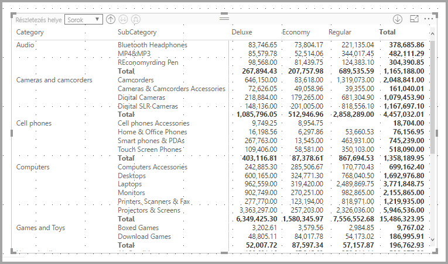

A **Vizualizációk** ablaktábla **Formátum** szakaszában bontsa ki a **Részösszegek** kártyát, és állítsa a **Sorok részösszegei** csúszkát a **Ki** beállításra. Ha így tesz, a részösszegek nem jelennek meg.

Ugyanez a folyamat vonatkozik az oszlopok részösszegeire.

## Keresztkijelölés a mátrixvizualizációkkal
A **Mátrix** vizualizációval a mátrix bármely eleme kiválasztható a keresztkijelölés alapjaként. Válasszon ki egy oszlopot a **Mátrixban**, ez az oszlop ki lesz emelve csakúgy, mint a jelentés lapon látható bármely egyéb vizualizáció. Ez a keresztkijelölési mód az egyéb vizualizációk és az adatpont-kiválasztások közös funkciója volt, de ugyanez a funkció már a **Mátrix** vizualizációnál is elérhető.

Továbbá a Ctrl+kattintás is használható a keresztkijelöléshez. Például az alábbi képen alkategóriák egy gyűjteménye lett kiválasztva a **Mátrix** vizualizációból. Figyelje meg, hogy a vizualizációból ki nem választott elemek kiszürkítve jelennek meg, és az oldalon található egyéb vizualizációk a **Mátrix** vizualizációban végzett kijelöléseket tükrözik.

## A Power BI értékeinek másolása és felhasználása más alkalmazásokban

A mátrix vagy táblázat rendelkezhet olyan tartalommal, amelyet fel szeretne használni más alkalmazásokban (például: Dynamics CRM, Excel) vagy más Power BI-jelentésekben. Ha a Power BI-ban a jobb gombbal kattint egy vagy több kijelölt cellára, kimásolhatja azokat a vágólapra, majd beillesztheti egy másik alkalmazásba.

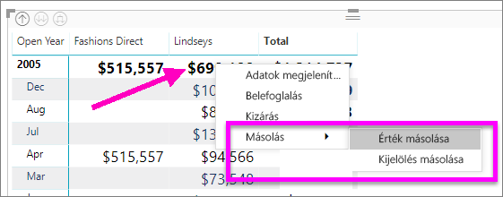

* Ha egyetlen cella értékét szeretné másolni, jelölje ki a cellát, kattintson a jobb gombbal, és válassza az **Érték másolása** lehetőséget. A cella formázatlan értéke felkerül a vágólapra, ahonnan beillesztheti egy másik alkalmazásba.

    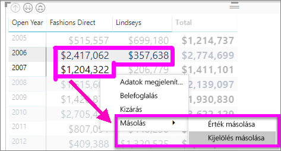

* Ha több cellát szeretne másolni, jelölje ki a cellatartományt, vagy a CTRL billentyűt nyomva tartva jelöljön ki egy vagy több cellát. A másolat tartalmazni fogja az oszlopok és a sorok fejléceit.

    

## Árnyékolás és betűtípus mátrixvizualizációkkal
A **Mátrix** vizualizációval **Feltételes formázást** (színek és árnyékolás) alkalmazhat a mátrixban található cellák hátterére, valamint magára a szövegre és az értékekre is.

Feltételes formázás alkalmazásához a következő lehetőségek közül választhat, ha ki van választva egy mátrixvizualizáció:

* A **Mezők** ablaktáblán kattintson a jobb gombbal a Mezőre, és a menüből válassza a **Feltételes formázás** elemet.
  
  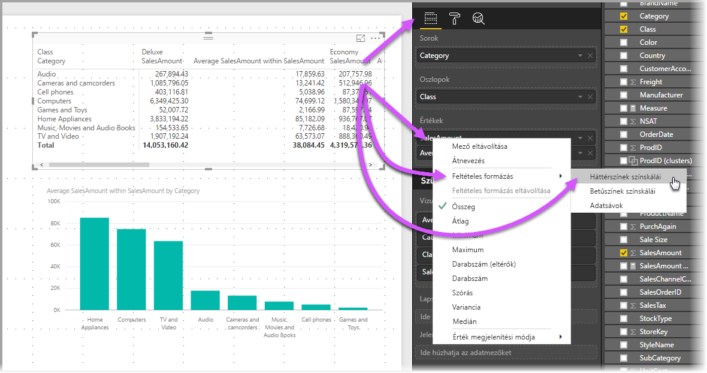
* Vagy a **Formátum** ablaktáblán bontsa ki a **Feltételes formázás** kártyát, és állítsa a **Háttérszínek színskálái** vagy a **Betűszínek színskálái** csúszkát **Be** állapotúra. Bármelyik beállítás bekapcsolása után megjelenik a *Speciális vezérlők* hivatkozása, amely lehetővé teszi a színek és a színformátum értékeinek testreszabását.
  
  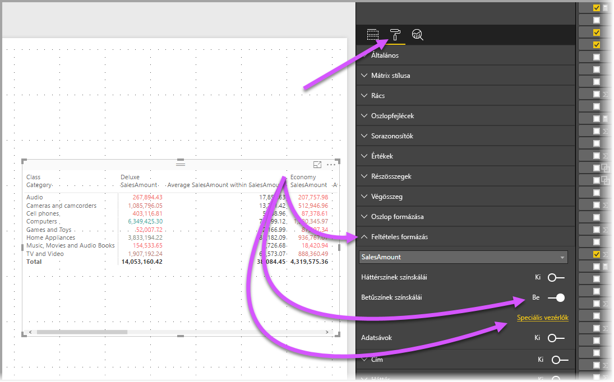

Bármelyik módszerrel ugyanaz az eredmény érhető el. A *Speciális vezérlők* kiválasztása az alábbi párbeszédpanelt jeleníti meg, amely lehetővé teszi a módosítások végrehajtását:

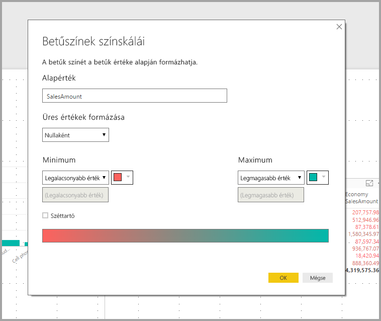

## Következő lépések

[Pontdiagramok és buborékdiagramok a Power BI-ban](power-bi-visualization-scatter.md)

[Vizualizációtípusok a Power BI-ban](power-bi-visualization-types-for-reports-and-q-and-a.md)