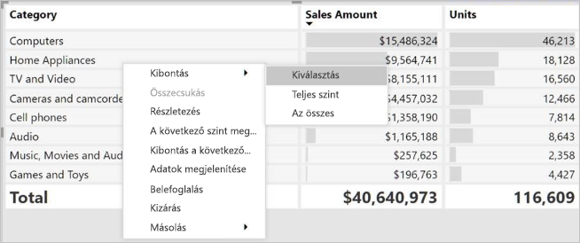

# A Mátrix vizualizáció használata a Power BI-ban
A **mátrix** visual hasonlít egy **tábla**.  Egy tábla támogatja a 2 dimenziók és az adatokat egybesimított, jelentése az ismétlődő értékek jelenik meg, és nem összevontan jelennek meg. Mátrix megkönnyíti a különböző adatokat közérthetően, több dimenzióban a keresztben megjelenítendő – támogatja a lépcsőzetes elrendezést. A mátrix automatikusan összesíti az adatokat, és lehetővé teszi, hogy a részletezés le. 

Mátrix vizualizációkat hozhat létre **Power BI Desktop** és **Power BI szolgáltatás** jelentéseket és a jelentésoldalon lévő többi vizualizációval a mátrix keresztkiemelést elemek. Például válassza ki a sorokat, oszlopokat és még az egyes cellák szabadon kereszt-kiemeléshez. Ezenkívül az egyes cellák és több cella van kijelölve másolható és illeszthetők be más alkalmazásokat. 

A mátrix számos funkcióval rendelkezik, amelyeket a cikk következő szakaszaiban be is mutatunk.

## Hogyan számítja ki a Power BI az összegeket?

A **Mátrix** vizualizáció használatának ismertetése előtt fontos megérteni, hogy a Power BI hogyan számítja ki a táblázatok és mátrixok összegeit és részösszegeit. Az összegeket és részösszegeket tartalmazó sorok esetén a mögöttes adatok összes sorának mértéke adja az összeget, *nem* csak a látható vagy megjelenített sorok értékeinek összege. Ez azt jelenti, hogy az összeget tartalmazó sorban a várttól eltérő értékek szerepelhetnek. 

Vessen egy pillantást az alábbi mátrix vizualizációkat. 

Ebben a példában a mátrixvizualizáció jobb szélső, minden egyes sorára jelenik-e meg a *összeg* az egyes értékesítő/dátum kombinációk. Azonban mivel egy értékesítő több dátummal együtt is szerepel, a számok többször is előfordulhatnak. A mögöttes adatok pontos formája, valamint a látható adatok egyszerű összeadása így nem felel meg egymásnak. Ez egy gyakori trend akkor, ha az összegzett érték egy egy-a-többhöz kapcsolat egyéni oldalán áll.

Az összegek és a részösszegek megtekintésekor vegye figyelembe, hogy ezek az értékek a mögöttes adatokon alapulnak, és nem kizárólag a látható értékeken. 

<!-- use Nov blog post video

## Expanding and collapsing row headers
There are two ways you can expand row headers. The first is through the right-click menu. You’ll see options to expand the specific row header you clicked on, the entire level or everything down to the very last level of the hierarchy. You have similar options for collapsing row headers as well.

You can also add +/- buttons to the row headers through the formatting pane under the row headers card. By default, the icons will match the formatting of the row header, but you can customize the icons’ color and size separately if you want. 
Once the icons are turned on, they work similarly to the icons from PivotTables in Excel.

The expansion state of the matrix will save with your report. It can be pinned to dashboards as well, but consumers will need to open up the report to change the state. Conditional formatting will only apply to the inner most visible level of the hierarchy. Note that this expand/collapse experience is not currently supported when connecting to AS servers older than 2016 or MD servers.

Watch the following video to learn more about expand/collapse in the matrix:

-->
## Részletezés használata a mátrix vizualizációval lefelé
A mátrixvizualizáció teheti sokféle érdekes Lehatolási tevékenység, amely nem elérhető. Például a részletes elemzés sorok, oszlopok vagy külön szakaszok és cellák használatával. Vessünk egy pillantást ezek működésére.

### Sorazonosítókon végzett részletes elemzés
Amikor a **Vizualizációk** ablaktáblán több mezőt ad hozzá a **Mezők** terület **Sorok** szakaszához, engedélyezi a mátrixvizualizáció sorain végzett részletes elemzést. Ez hasonlít egy hierarchia létrehozásához, amely utána lehetővé teszi a hierarchia részletezését (majd a felhatolást), és az adatok elemzését minden szinten.

Az alábbi ábrán a **sorok** szakasz tartalmaz *Sales stage* és *lehetőség mérete*, egy csoportosítást (vagy hierarchia) létrehozása a részletezhető sorokban azokat a sorokat.

Ha a vizualizáció a **Sorok** szakaszban csoportosítást tartalmaz, a vizualizáció megjeleníti a *részletezés* és *kibontás* ikont a vizualizáció bal felső sarkában.

Az egyéb vizualizációk részletezési és kibontási viselkedéséhez hasonlóan, ha ezekre a gombokra kattint, akkor lehetőség nyílik a részletezésre (vagy felhatolásra) a hierarchián keresztül. Ebben az esetben lehatolhatunk a *Sales stage* való *lehetőség mérete*, ahol a Lehatolás egy szintű ikon (a lefelé mutató Villa) lett kiválasztva, az alábbi ábrán látható módon.

Az ikonok használatán kívül válassza ki bármelyik sorazonosítóra, és részletes elemzést végezhet, a megjelenő menüben kiválasztja.

Figyelje meg, hogy van néhány lehetőség a megjelenő menüben, amely különböző eredményekhez vezet:

Kiválasztásával **részletes elemzést** kibővíti a mátrixa *, amely* sorszinthez, *kivételével* más sorfejlécek, kivéve a kiválasztott sor fejlécére. Az alábbi képen **javaslat** > **részletes elemzést** lett kiválasztva. Figyelje meg, hogy egyéb legfelső szintű sorok már nem jelennek meg a mátrixban. Ez a fajta részletezés olyan hasznos funkció, amely a **keresztkiemelés** szakaszban válik igazán hasznossá.

Válassza ki a **Felhatolás** ikonra az előző, legfelső szintű nézethez való visszatéréshez. Ha, és válassza ki **javaslat** > **következő szint megjelenítése**, kap egy növekvő elemek szedett listája a következő szinten (ebben az esetben a *lehetőség mérete* mező), anélkül, hogy a magasabb szintű hierarchia-Kategorizálás.

Válassza ki a **Felhatolás** a Mátrix megjelenítése az összes legfelső szintű kategóriákat, majd válassza a bal felső sarokban lévő ikonra **javaslat** > **Kibontás a következő szintre**, az mindkét szintjeit a hierarchia - az összes értékek *Sales stage* és *lehetőség mérete*.

Is használhatja a **Kibontás** menüpont, továbbá a megjelenítését.  Válassza ki például **javaslat** > **Kibontás** > **kijelölés**. A Power BI egy teljes sor megjeleníti az egyes *Sales stage* és mind a *lehetőség mérete* beállításai *javaslat*.

### Oszlopfejléceken végzett részletes elemzés
Lehatoláshoz hasonlóan, a sorok részletes keresztül, akkor is részletezésével **oszlopok**. Az alábbi képen két mező található vannak a **oszlopok** mezők területen-hierarchia létrehozása hasonló használtunk a cikk korábbi részében a sorokat. Az a **oszlopok** mező területén, hogy *régió* és *szegmens*. Amint a második mező hozzá lett adva **oszlopok**, egy új legördülő menüben megjelenik a Vizualizáció jelenleg látható **sorok**.

Részletezés oszlopokon, jelölje be **oszlopok** származó a *részletezés helye* , hogy a mátrix bal felső sarokban található menüben. Válassza ki a *kelet* régióban, és válassza a **részletes elemzést**.

Amikor kiválaszt **részletes elemzést**, az oszlop hierarchiájának következő szintjére *régió > kelet* jeleníti meg, amely ebben az esetben *Opportunity count*. A többi régió jeleníti meg, de szürkén jelenik meg.

A menüben a többi sort ilyen ugyanúgy működik az oszlopok (lásd az előző szakaszt **sorazonosítókon részletezés**). Is **következő szint megjelenítése** és **Kibontás a következő szintre** oszlopokkal, ahogy a sorok is.

> [!NOTE]
> A részletes elemzés és felhatolás ikonjai a mátrixvizualizáció bal felső sarkában csak a sorokra vonatkoznak. Ha oszlopokon szeretne részletes elemzést végezni, a helyi menüt kell használnia (a jobb gombbal kattintva).
> 
> 

## Lépcsőzetes elrendezés mátrixvizualizációkkal
A **Mátrix** vizualizáció automatikusan behúzza egy hierarchia alkategóriáit minden szülő alatt; ezt **Lépcsőzetes elrendezésnek** hívjuk.

A mátrixvizualizáció *eredeti* verziójában az alkategóriák egy teljesen külön oszlopban jelentek meg, több helyet foglalva a vizualizációban. Az alábbi képen az eredeti **Mátrix** vizualizáció egy táblája látható. Figyelje meg, hogy az alkategóriák külön oszlopban vannak.

Az alábbi képen a **Mátrix** vizualizáció látható **Lépcsőzetes elrendezéssel**. Figyelje meg, hogy a *Számítógépek* kategória saját, kis mértékben behúzott alkategóriákkal rendelkezik (Számítógép-kiegészítők, Asztali számítógépek, Laptopok, Monitorok stb.), ezzel átláthatóbb és tömörebb vizualizációt biztosít.

A lépcsőzetes elrendezés beállításait egyszerűen módosíthatja. Ha a **Mátrix** vizualizáció van kiválasztva, a **Vizualizációk** ablaktábla **Formátum** szakaszában (festőhenger ikon) bontsa ki a **Sorazonosítók** szakaszt. Két lehetőség érhető el: a **Lépcsőzetes elrendezés** váltógomb (amely ki- vagy bekapcsolja ezt az elrendezést) és a **Lépcsőzetes elrendezés behúzása** (a behúzás mértékét adja meg képpontokban).

Ha kikapcsolja a **Lépcsőzetes elrendezést**, az alkategóriák egy másik oszlopban jelennek meg, nem pedig a szülőkategória alatt behúzva.

## Részösszegek a mátrixvizualizációkkal
A részösszegeket a soroknál és oszlopoknál is ki- vagy bekapcsolhatja a mátrixvizualizációkban. Az alábbi képen látható, hogy a sorok részösszegei **be** vannak kapcsolva.

A **Vizualizációk** ablaktábla **Formátum** szakaszában bontsa ki a **Részösszegek** kártyát, és állítsa a **Sorok részösszegei** csúszkát a **Ki** beállításra. Ha így tesz, a részösszegek nem jelennek meg.

Ugyanez a folyamat vonatkozik az oszlopok részösszegeire.

## Keresztkijelölés a mátrixvizualizációkkal
A **Mátrix** vizualizációval a mátrix bármely eleme kiválasztható a keresztkijelölés alapjaként. Válasszon ki egy oszlopot a **Mátrixban**, ez az oszlop ki lesz emelve csakúgy, mint a jelentés lapon látható bármely egyéb vizualizáció. Ez a keresztkijelölési mód az egyéb vizualizációk és az adatpont-kiválasztások közös funkciója volt, de ugyanez a funkció már a **Mátrix** vizualizációnál is elérhető.

Továbbá a Ctrl+kattintás is használható a keresztkijelöléshez. Például az alábbi képen alkategóriák egy gyűjteménye lett kiválasztva a **Mátrix** vizualizációból. Figyelje meg, hogy a vizualizációból ki nem választott elemek kiszürkítve jelennek meg, és az oldalon található egyéb vizualizációk a **Mátrix** vizualizációban végzett kijelöléseket tükrözik.

## A Power BI értékeinek másolása és felhasználása más alkalmazásokban

A mátrix vagy táblázat rendelkezhet olyan tartalommal, amelyet fel szeretne használni más alkalmazásokban (például: Dynamics CRM, Excel) vagy más Power BI-jelentésekben. Ha a Power BI-ban a jobb gombbal kattint egy vagy több kijelölt cellára, kimásolhatja azokat a vágólapra, majd beillesztheti egy másik alkalmazásba.

* Ha egyetlen cella értékét szeretné másolni, jelölje ki a cellát, kattintson a jobb gombbal, és válassza az **Érték másolása** lehetőséget. A cella formázatlan értéke felkerül a vágólapra, ahonnan beillesztheti egy másik alkalmazásba.

    

* Ha több cellát szeretne másolni, jelölje ki a cellatartományt, vagy a CTRL billentyűt nyomva tartva jelöljön ki egy vagy több cellát. A másolat tartalmazni fogja az oszlopok és a sorok fejléceit.

    

## Árnyékolás és betűtípus mátrixvizualizációkkal
A mátrixvizualizáció a alkalmazni **feltételes formázás** (színek és árnyékolás és az adatok sávok) a mátrix, és található cellák hátterére is feltételes formázás alkalmazásához a szövegre és az értékekre is.

Feltételes formázás alkalmazásához, válassza ki a mátrix vizuális és nyissa meg a **formátum** ablaktáblán. Bontsa ki a **feltételes formázás** kártya és a **háttérszín**, **betűszínt**, vagy **adatsávok**, kapcsolja be a csúszkát a **a**. Az alábbi lehetőségek egyikét bekapcsolásával jeleníti meg egy hivatkozást a *speciális vezérlők*, mely lehetővé teszi, hogy testre szabni a színek és a színformátum értékeinek.
  
  

Válassza ki *speciális vezérlők* egy párbeszédpanel, amely lehetővé teszi a módosítások végrehajtását megjelenítéséhez. Ez a példa bemutatja a párbeszédpanelen **adatsávok**.

## Következő lépések

[Pontdiagramok és buborékdiagramok a Power BI-ban](power-bi-visualization-scatter.md)

[Vizualizációtípusok a Power BI-ban](power-bi-visualization-types-for-reports-and-q-and-a.md)