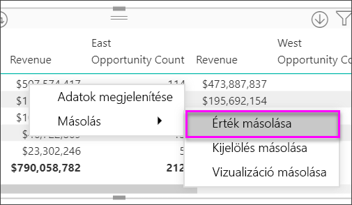
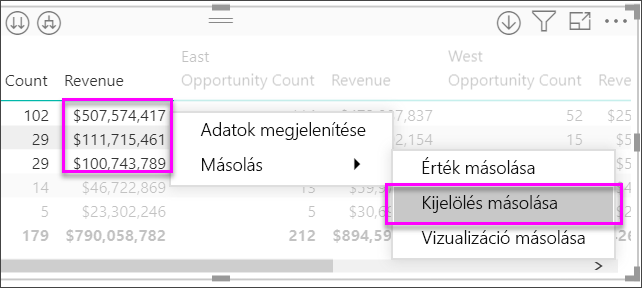

# Mátrixvizualizációk létrehozása a Power BI-ban

[!INCLUDE [power-bi-visuals-desktop-banner](../includes/power-bi-visuals-desktop-banner.md)]

A Mátrix vizualizáció egy táblázathoz hasonlít.  A táblázatok kétdimenziósak, és az adatok simák, vagyis az ismétlődő értékek is megjelennek, és nincsenek összesítve. Egy mátrixszal könnyebben megjeleníthetők a fontos adatok több dimenzióban, ez ugyanis lépcsőzetes elrendezést is támogat. A mátrix automatikusan összesíti az adatokat és elérhetővé teszi a részletezést. 

Mátrixvizualizációkat a **Power BI Desktop** jelentéseiben hozhat létre, és a mátrix elemeire keresztkiemelést alkalmazhat a jelentésoldalon lévő más vizualizációkkal. Kiválaszthat például sorokat, oszlopokat vagy egyetlen cellát is, és keresztkiemeléssel láthatja el őket. Egy vagy több kijelölt cellát ki is másolhat és beilleszthet más alkalmazásokba. 

A mátrix számos funkcióval rendelkezik, amelyeket a cikk következő szakaszaiban be is mutatunk.

## Hogyan számítja ki a Power BI az összegeket?

A mátrixvizualizáció használatának ismertetése előtt fontos tisztázni, hogy a Power BI hogyan számítja ki a táblázatok és mátrixok összegeit és részösszegeit. Az összegeket és részösszegeket tartalmazó sorok esetén a Power BI a mögöttes adatok összes sorának mértékét határozza meg, nem egyszerűen összeadja a látható vagy megjelenített sorok értékeit. Ez azt jelenti, hogy az összeget tartalmazó sorban a várttól eltérő értékek szerepelhetnek.

Tekintse meg az alábbi mátrixvizualizációkat. 

Ebben a példában a jobb szélső Mátrix vizualizáció minden sora az egyes értékesítő/dátum kombinációkhoz tartozó *összeget* mutatja. Azonban mivel egy értékesítő több dátummal együtt is szerepel, a számok többször is előfordulhatnak. A mögöttes adatok pontos formája, valamint a látható adatok egyszerű összeadása így nem felel meg egymásnak. Ez egy gyakori trend akkor, ha az összegzett érték egy egy-a-többhöz kapcsolat egyéni oldalán áll.

Amikor összegeket vagy részösszegeket lát, ne feledkezzen meg arról, hogy ezek az értékek a mögöttes adatokon alapulnak. Nem egyszerűen a megjelenített értékekből vannak kiszámítva.

## Sorok fejlécének kibontása és összecsukása
A sorfejlécek kibontása kétféleképpen lehetséges. Az első a jobb gombbal kattintva a helyi menüben érhető el. Itt találhat menüpontokat a kijelölt sorfejléc, a teljes szint vagy minden más kibontásához egészen a hierarchia utolsó szintjéig. A sorfejlécek összecsukásához is hasonló beállítások állnak rendelkezésre.

A sorok fejléceihez a formázási panellel is hozzáadhat +/- gombokat a **Sorfejlécek** kártya alatt. Alapértelmezés szerint az ikonok megegyeznek a sor fejlécének formázásával, de a színeket és a méreteket külön is testre szabhatja, ha szeretné.

Az ikonok a bekapcsolásuk után hasonlóképpen működnek, mint az Excel PivotTable-ikonjai.

A mátrix bővítési állapotát a rendszer a jelentéssel együtt menti. A mátrix kitűzhető az irányítópultra kibontva vagy összecsukva. Ha ki van jelölve az irányítópult-csempe, és megnyílik a jelentés, a bővítési állapot továbbra is módosítható a jelentésben. 

> [!NOTE]
> Ha az Analysis Services többdimenziós modelljén alapuló jelentést készít, a kibontás/összecsukás esetén figyelembe kell vennie néhány speciális szempontot is, ha a modell az alapértelmezett tag funkciót használja. További információt a [Többdimenziós modellek használata a Power BI-ban](../desktop-default-member-multidimensional-models.md) című témakörben talál.

## Részletes elemzés használata a Mátrix vizualizációval
Mátrixvizualizációval számos érdekes, korábban nem elérhető részletes elemzési tevékenység hajtható végre. Például a részletes elemzés sorok, oszlopok vagy külön szakaszok és cellák használatával. Vessünk egy pillantást ezek működésére.

### Sorazonosítókon végzett részletes elemzés

Amikor a Vizualizációk panelen több mezőt ad hozzá a **Mezők** terület **Sorok** szakaszához, engedélyezi a mátrixvizualizáció sorain végzett részletes elemzést. Ez hasonlít egy hierarchia létrehozásához, amely utána lehetővé teszi a hierarchia részletezését (majd a felhatolást), és az adatok elemzését minden szinten.

Az alábbi képen a **Sorok** szakasz tartalmazza az *Értékesítési fázis* és a *Lehetőség mérete* elemeket, létrehozva egy csoportosítást (vagy hierarchiát) a részletezhető sorokban.

Ha a vizualizáció a **Sorok** szakaszban csoportosítást tartalmaz, a vizualizáció megjeleníti a *részletezés* és *kibontás* ikont a vizualizáció bal felső sarkában.

Az egyéb vizualizációk részletezési és kibontási viselkedéséhez hasonlóan, ha ezekre a gombokra kattint, akkor lehetőség nyílik a részletezésre (vagy felhatolásra) a hierarchián keresztül. Ebben az esetben lehatolhatunk az *Értékesítési fázistól* a *Lehetőség méretéig*, ahogy az alábbi képen is látható, ahol a „lehatolás egy szinttel” ikon (a lefelé mutató villa) lett kiválasztva.

Az ikonok használatán kívül bármelyik sorazonosító kiválasztásával is részletes elemzést végezhet, ha kiválasztja ezt a lehetőséget a megjelenő menüből.

Figyelje meg, hogy van néhány lehetőség a megjelenő menüben, amely különböző eredményekhez vezet:

A **Részletezés** kiválasztása kibontja az *ahhoz* a sorszinthez tartozó mátrixot, *kivéve* az egyéb összes sorfejlécet, annak a sorazonosítónak a kivételével, amelyet kiválasztott. Az alábbi ábrán az **Ajánlattétel** > **Részletezés** lett kiválasztva. Figyelje meg, hogy egyéb legfelső szintű sorok már nem jelennek meg a mátrixban. Ez a fajta részletezés olyan hasznos funkció, amely a keresztkiemelés szakaszában válik igazán hasznossá.

A **Felhatolás** ikonra kattintva visszatérhet az előző felső szintű nézethez. Ha ezután az **Ajánlattétel** > **Következő szint megjelenítése** lehetőséget választja, megjelenik a következő szinten (ebben az esetben a *Lehetőség mérete* mezőben) lévő elemek növekvően rendezett listája, a magasabb szintű hierarchiakategorizálás nélkül.

Válassza a bal felső sarokban lévő **Felhatolás** ikont, hogy a mátrix összes felső szintű kategóriája megjelenjen, majd válassza az **Ajánlattétel** > **Kibontás a következő szintig** lehetőséget, hogy a hierarchia mindkét szintjéhez (*Értékesítési fázis* és *Lehetőség mérete*) tartozó értékek megjelenjenek.

A megjelenítés tovább szabályozható a **Kibontás** menüponttal.  Válassza például az **Ajánlattétel** > **Kibontás** > **Kijelölés** lehetőséget. A Power BI minden *Értékesítési fázishoz* egy összegsort jelenít meg, az *Ajánlattétel* esetében viszont a *Lehetőség* mérete mező összes lehetőségét.

### Oszlopfejléceken végzett részletes elemzés
A sorokon végzett részletes elemzéshez hasonlóan az oszlopokon is végezhet részletes elemzést. Az alábbi képen két mező található az **Oszlopok** mező területén, egy ahhoz hasonló hierarchiát létrehozva, amilyet a sorokhoz használtunk a cikk korábbi szakaszában. Az **Oszlopok** mező területén a *Régió* és a *Szegmens* található. Amikor a második mező fel lett véve az **Oszlopok** területre, új legördülő menü jelent meg a vizualizáción, amely jelenleg a **Sorok** lehetőséget mutatja.

Az oszlopok szerinti részletezéshez válassza az **Oszlopok** lehetőséget a mátrix bal felső sarkában található *Részletezés helye* menüből. Jelölje ki a *Keleti* régiót, majd válassza a **Részletezés** lehetőséget.

A **Részletezés** kiválasztásakor megjelenik a *Régió > Keleti* oszlophierarchiájának következő szintje, ami ebben az esetben a *Lehetőségek száma*. A másik régió rejtett.

A többi menüelem ugyanúgy működik az oszlopok, ahogy a sorok esetében (lásd az előző, a **sorazonosítókon végzett részletes elemzést** ismertető szakaszt). Oszlopok szerint ugyanúgy **megjelenítheti a következő szintet** és **kibonthat a következő szintig**, mint a sorok esetében.

> [!NOTE]
> A részletes elemzés és felhatolás ikonjai a mátrixvizualizáció bal felső sarkában csak a sorokra vonatkoznak. Ha oszlopokon szeretne részletes elemzést végezni, a helyi menüt kell használnia (a jobb gombbal kattintva).

## Lépcsőzetes elrendezés mátrixvizualizációkkal

A Mátrix vizualizáció automatikusan behúzza egy hierarchia alkategóriáit minden szülő alatt; ezt Lépcsőzetes elrendezésnek hívjuk.

A mátrixvizualizáció eredeti verziójában az alkategóriák egy teljesen külön oszlopban jelentek meg, több helyet foglalva a vizualizációban. Az alábbi képen az eredeti Mátrix vizualizáció egy táblája látható. Figyelje meg, hogy az alkategóriák külön oszlopban vannak.

Az alábbi képen a Mátrix vizualizáció látható Lépcsőzetes elrendezéssel. Figyelje meg, hogy a *Számítógépek* kategória saját, kis mértékben behúzott alkategóriákkal rendelkezik (Számítógép-kiegészítők, Asztali számítógépek, Laptopok, Monitorok stb.), ezzel átláthatóbb és tömörebb vizualizációt biztosít.

A lépcsőzetes elrendezés beállításait egyszerűen módosíthatja. Ha a Mátrix vizualizáció van kiválasztva, a **Vizualizációk** panel **Formátum** szakaszában (festőhenger ikon) bontsa ki a Sorazonosítók szakaszt. Két lehetőség érhető el: a Lépcsőzetes elrendezés váltógomb (amely ki- vagy bekapcsolja ezt az elrendezést) és a Lépcsőzetes elrendezés behúzása (a behúzás mértékét adja meg képpontokban).

Ha kikapcsolja a Lépcsőzetes elrendezést, a Power BI egy külön oszlopban jeleníti meg az alkategóriákat, nem pedig a szülőkategória alatt behúzva.

## Részösszegek és végösszegek a mátrixvizualizációkkal

A részösszegeket a soroknál és oszlopoknál is ki- vagy bekapcsolhatja a mátrixvizualizációkban. Az alábbi képen látható, hogy a sorok részösszegei **Be** vannak kapcsolva, és megjelenítésük alul történik.

Ha bekapcsolja **Részösszegeket** és felvesz egy címkét, a Power BI hozzáad egy sort és ugyanazt a címkét a végösszeg értékéhez. A végösszeg formázásához válassza a **Végösszeg** formázási beállítását. 

Ha ki szeretné kapcsolni a részösszegeket és a végösszeget, a vizualizációk ablaktábla formátum szakaszában bontsa ki a **Részösszegek** kártyát. A sorok részösszegei csúszkát húzza a **Ki** állapotra. Ebben az esetben a részösszegek nem jelennek meg.

Ugyanez a folyamat vonatkozik az oszlopok részösszegeire.

## Feltételes ikonok hozzáadása
Vizuális jelzéseket adhat hozzá a táblához vagy mátrixhoz *feltételes ikonokkal*. 

A Vizualizációk panel formátum szakaszában bontsa ki a **Feltételes formázás** kártyát. Az **Ikonok** csúszkát húzza a **Be** állapotba, majd válassza a **Speciális vezérlők** lehetőséget.

Állítsa be a mátrix feltételeit, ikonjait és színét, és válassza az **OK** lehetőséget. Ebben a példában egy piros jelölőt használunk az alacsony értékekhez, lila kört a magas értékekhez, és sárga háromszöget a kettő közé eső minden más értékhez. 

## Keresztkijelölés a mátrixvizualizációkkal

A Mátrix vizualizációval a mátrix bármely eleme kiválasztható a keresztkijelölés alapjaként. Ha kijelöli egy mátrix egy oszlopát, a Power BI kiemeli ezt az oszlopot, ahogyan a jelentéslapon lévő többi vizualizáció is. Ez a keresztkijelölési mód az egyéb vizualizációk és az adatpont-kiválasztások közös funkciója volt, de ugyanez a funkció már a Mátrix vizualizációnál is elérhető.

Továbbá a Ctrl+kattintás is használható a keresztkijelöléshez. Például az alábbi képen alkategóriák egy gyűjteménye lett kiválasztva a Mátrix vizualizációból. Figyelje meg, hogy a vizualizációból ki nem választott elemek kiszürkítve jelennek meg, és az oldalon található egyéb vizualizációk a Mátrix vizualizációban végzett kijelöléseket tükrözik.

## A Power BI értékeinek másolása és felhasználása más alkalmazásokban

Egy mátrix vagy táblázat tartalmazhat olyan adatokat, amelyeket szeretne más alkalmazásokban használni: Dynamics CRM-ben, Excelben és más Power BI-jelentésekben. Ha a Power BI-ban a jobb gombbal kattint egy vagy több kijelölt cellára, kimásolhatja azokat a vágólapra. Ez után beillesztheti őket egy másik alkalmazásba.

* Ha egyetlen cella értékét szeretné másolni, jelölje ki a cellát, kattintson a jobb gombbal, és válassza az **Érték másolása** lehetőséget. A cella formázatlan értéke felkerül a vágólapra, ahonnan beillesztheti egy másik alkalmazásba.

    

* Ha több cellát szeretne másolni, jelölje ki a cellatartományt, vagy a CTRL billentyűt nyomva tartva jelöljön ki egy vagy több cellát. 

    

* A másolat tartalmazni fogja az oszlopok és a sorok fejléceit.

    

* Ha magáról a vizualizációról szeretne olyan másolatot készíteni, amely csak a kijelölt cellákat tartalmazza, akkor jelöljön ki egy vagy több cellát a CTRL+jobb-klikk módszerrel, majd válassza a **Vizualizáció másolása** lehetőséget.

    

* A másolat egy újabb mátrixvizualizáció lesz, de csak a kimásolt adatokat fogja tartalmazni.

    

## Mátrix értékének beállítása egyéni URL-címként

Ha egy olyan oszloppal vagy mértékkel rendelkezik, amely webhelyek URL-címeit tartalmazza, akkor feltételes formázással aktív hivatkozásokként alkalmazhatja ezeket az URL-címeket a mezőkre. Ezt a lehetőséget a **Feltételes formázás** kártya alatt találja meg a Formázás panelen.

Kapcsolja be a **webes URL-címet**, majd válassza ki az oszlop URL-címéhez használni kívánt mezőt. Az alkalmazás után az adott mező (oszlop) értékei aktív hivatkozásokká válnak. Vigye föléjük az egérmutatót a hivatkozás megjelenítéséhez, és válassza ki a hivatkozást az oldalra való ugráshoz. 

További információt a [Táblázatok feltételes formázása](../desktop-conditional-table-formatting.md) című témakörben talál.

## Árnyékolás és betűtípus mátrixvizualizációkkal
A Mátrix vizualizációval Feltételes formázást (színek, árnyékolás és adatsávok) alkalmazhat a mátrixban található cellák hátterére, valamint magára a szövegre és az értékekre is.

Feltételes formázáshoz jelölje ki a mátrixvizualizációt, és nyissa meg a **Formázás** panelt. Bontsa ki a **Feltételes formázás** kártyát, és kapcsolja **Be** a **Háttérszín**, **Betűszín** vagy **Adatsávok** lehetőséget. Egy ilyen beállítás bekapcsolása után megjelenik a *Speciális vezérlők* hivatkozása, amely lehetővé teszi a színek és a színformátum értékeinek testreszabását.
  
  

Válassza a *Speciális vezérlők* hivatkozást, így megjelenik egy párbeszédpanel, amelyen végrehajthatja a beállításokat. Ez a példa az **Adatsávok** párbeszédpanelt mutatja be.

## Megfontolandó szempontok és hibaelhárítás

* Ha a mátrix celláiban vagy fejléceiben lévő szöveges adatok sortörést jelző karaktereket tartalmaznak, a program kizárólag akkor veszi őket figyelembe, ha bekapcsolja a Sortörés beállítást az elemhez tartozó formázási panel kártyáján. 

## Következő lépések

[A Power BI-hoz készült Power Apps-vizualizációk](power-bi-visualization-powerapp.md)

[Vizualizációtípusok a Power BI-ban](power-bi-visualization-types-for-reports-and-q-and-a.md)
