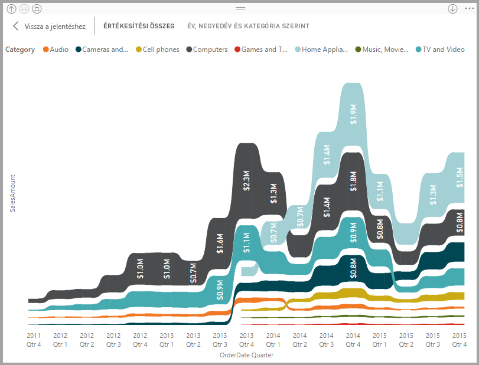
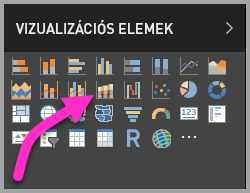

# Szalagdiagramok használata a Power BI-ban
Szalagdiagramok használatával megjelenítheti az adatokat, és gyorsan felderítheti a legmagasabb rangú (legnagyobb értéket képviselő) adatkategóriát. A szalagdiagramokkal hatékonyan ábrázolható a rangok időbeli változása: minden időszakban a legmagasabb rangú (értékű) kategória látható felül. 

## Szalagdiagram létrehozása
A leírás követéséhez nyissa meg a [Kiskereskedelmi elemzési minta jelentést](../sample-retail-analysis.md). 

1. Szalagdiagram létrehozásához válassza a **szalagdiagram** lehetőséget a **Vizualizációk** panelen.

    

    A szalagdiagramok szalagok segítségével kapcsolják az adatkategóriákat a vizualizált időfolyamhoz, így megtekintheti, hogy az egyes kategóriák milyen rangsorban állnak egymáshoz képest a diagram x tengelyén (amely általában az idővonal).

2. Válassza ki a **Tengely**, **Jelmagyarázat** és **Érték** mezőket.  Ebben a példában a következőket választottuk: **Dátum**, **Kategória** és **Folyó évi értékesítések**.  

    

    Mivel az adathalmaz csak egy év adatait tartalmazza, az **Év** mezőt is eltávolítottuk a **Tengelyről**. 

3. A szalagdiagram kéthavonta mutatja be a rangsorolást. Figyelje meg a rang időbeli változását.  Az Otthon kategória például a harmadik helyről a negyedikre, majd ismét a harmadikra lép. Az Ifjúsági kategória júliusban a harmadik helyről az ötödikre lép. 

    

## Szalagdiagram formázása
Szalagdiagram létrehozásakor a formázási lehetőségek a **Vizualizációk** panel **Formázás** szakaszában találhatók. A szalagdiagramok formázási lehetőségei a halmozott oszlopdiagramokéhoz hasonlóak, amelyeken kívül további, csak a szalagokra vonatkozó formázási lehetőségeket is tartalmaznak.

A szalagdiagramok formázási beállításaival módosításokat végezhet.

* A **Térköz** beállítással módosíthatja a szalagok közötti üres terület méretét. A szám az oszlop maximális magasságának százalékos arányát jelenti.
* Az **Egyeztetés a sorozat színével** beállítással megadhatja, hogy a szalagok színe megegyezzen az adatsorozat színével. Ha **ki** van kapcsolva, a szalagok szürke színűek.
* Az **Átlátszóság** beállítással megadhatja a szalagok átlátszóságának mértékét. Az alapértelmezett érték 30.
* A **Határ** beállítással sötét szegélyt állíthat be a szalagok felső és alsó határához. A szegélyek alapértelmezés szerint ki vannak kapcsolva.

Mivel a szalagdiagram y tengelyén nincsenek feliratok, érdemes lehet adatfeliratokat felvenni. A Formázás panelen válassza az **Adatfeliratok** lehetőséget. 

Állítsa be adatfeliratai formázását.  Példánkban a szöveg színét fehérre, a tizedesjegyek számát nullára, a megjelenítési egységeket pedig ezresekre. 

## Következő lépések

[Pontdiagramok és buborékdiagramok a Power BI-ban](power-bi-visualization-scatter.md)

[Vizualizációtípusok a Power BI-ban](power-bi-visualization-types-for-reports-and-q-and-a.md)