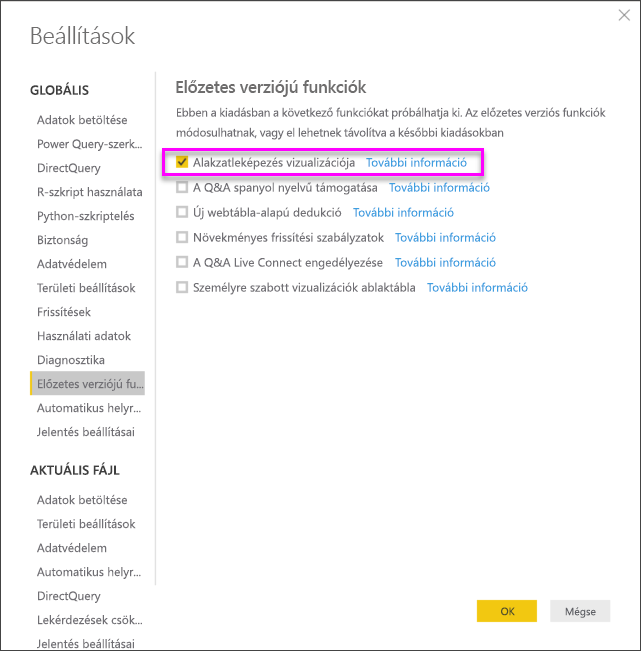
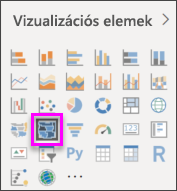
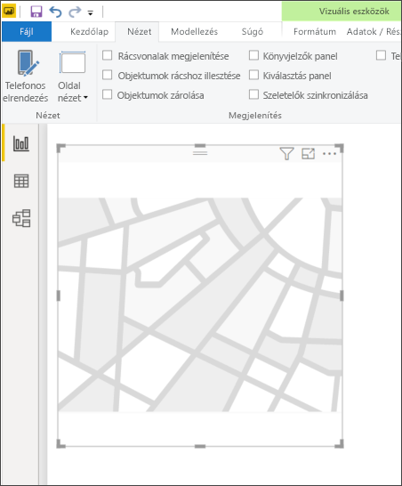
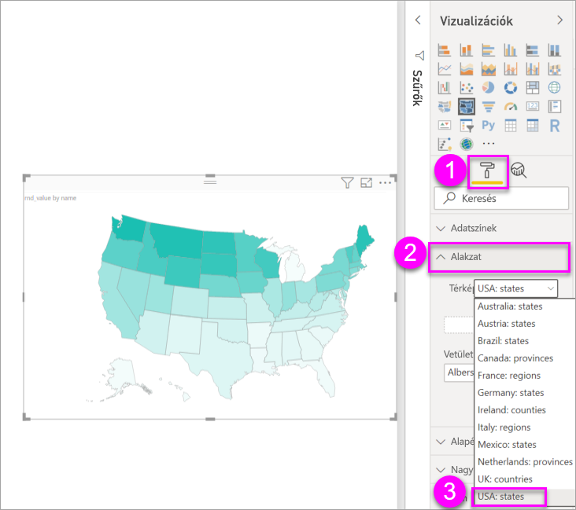
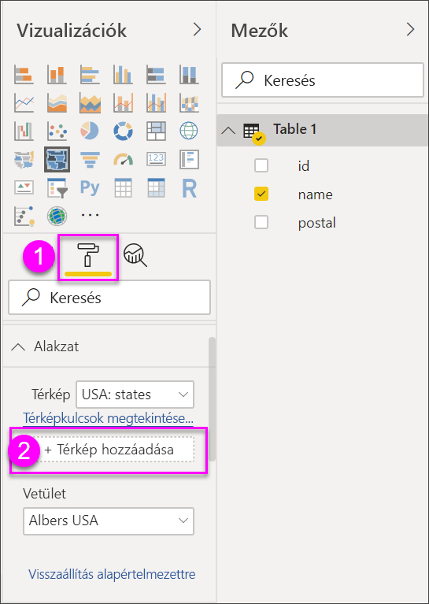
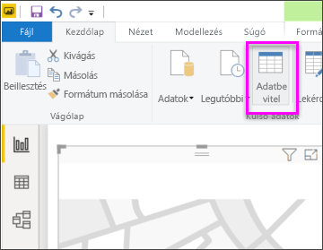
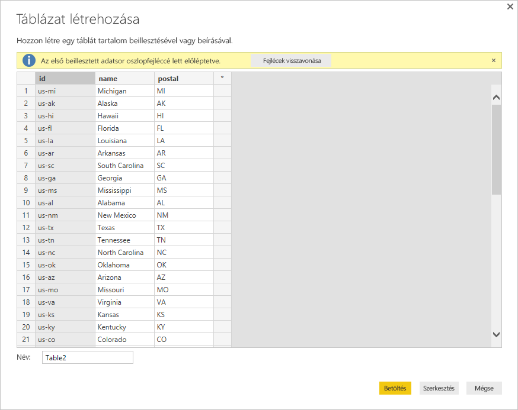

# Alakzatleképezés vizualizáció létrehozása a Power BI Desktopban (előzetes verzió)

[!INCLUDE [power-bi-visuals-desktop-banner](../includes/power-bi-visuals-desktop-banner.md)]

Hozzon létre egy **Alakzatleképezés** vizualizációt a régiók különböző színek használatával történő összehasonlításához a térképen. A **Leképezés** vizualizációval szemben az **Alakzatleképezés** vizualizáció nem képes az adatpontok pontos földrajzi helyének megjelenítésére a térképen. Ehelyett alkalmazásának fő célja a régiók relatív összehasonlításának megjelenítése egy térképen eltérő színezéssel.

Az **Alakzatleképezés** vizualizációk olyan TopoJSON-leképezéseken alapulnak, amelyek lenyűgöző képességei révén saját maga készítette egyedi térképeket használhat. többek között például földrajzi térképeket, ülésrendeket, alaprajzokat vagy egyéb térképeket. Az **Alakzatleképezés** előzetes verziójában egyéni térképek használata nincs támogatva.

## Alakzatleképezések létrehozása
Az **Alakzatleképezés**-vezérlőt az előzetes verzióhoz mellékelt térképekkel tesztelheti, vagy használhatja saját egyéni térképeit is, ha azok megfelelnek az alábbi, **Egyéni térképek használata** című szakaszban megadott követelményeknek.

Az **Alakzatleképezés** vizualizáció előzetes verziójú funkció, és azt a Power BI Desktopban engedélyezni kell. Az **Alakzat leképezése** funkció engedélyezéséhez válassza a **Fájl > Lehetőségek és beállítások > Lehetőségek > Előzetes verziójú funkciók** lehetőséget, majd jelölje be az **Alakzatleképezés vizualizációja** jelölőnégyzetet. Miután ezt beállította, újra kell indítania a Power BI Desktopot.

Az **Alakzat leképezése** funkció engedélyezését követően válassza az **Alakzat leképezése** ikont a **Vizualizációk** panelen.

A Power BI Desktop létrehoz egy üres **Alakzat leképezése** vizualizációs tervezési vásznat.

A következő lépések végrehajtásával hozhat létre **Alakzatleképezést**:

1. A **Mezők** panelen húzza át a régiók neveit (vagy azok rövidítéseit) tartalmazó adatmezőt a **Hely** gyűjtőbe, valamint egy adatmérték-mezőt az **Színtelítettség** gyűjtőbe (ekkor még nem jelenik meg a térkép).

   > [!NOTE]
   > Az **Alakzat leképezése** funkció teszteléséhez a térképadatok gyors beszerzéséről az alábbi, **Térképadatok beszerzése** című szakaszban olvashat.
   > 
   > 

   
2. A **Formátum** beállítási panelen bontsa ki az **Alakzat** pontot, és válasszon ki egy lehetőséget a **Szabványos térképek** legördülő listából az adatok megjelenítéséhez. Ekkor a renderelés megjelenik, ahogy az a következő képen látható.

   

   > [!NOTE]
   > A jelen cikk végén lévő **Régiókulcsok** szakaszban megtalálja a térképes régiók kulcsainak táblázatos gyűjteményét, amelynek segítségével elvégezheti az **Alakzat leképezése** vizualizáció tesztelését.
   > 
   > 
3. Ezután módosíthatja a térképet a formázási beállításokkal, például az **Alapértelmezett szín**, a **Nagyítás** és egyéb lehetőségekkel. Emellett hozzáadhat kategória-szintű adatoszlopot is a **Jelmagyarázat** gyűjtőhöz, így a térképes régiókat kategóriák alapján osztályozhatja.

## Egyéni térképek használata
Egyéni térképek használatára is lehetőség van az **Alakzatleképezés** funkcióval, ha azok formátuma **TopoJSON**. Ha a térkép más formátumban van, különböző online eszközök (például a [**Map Shaper**](https://mapshaper.org/)) segítségével konvertálhatja *alakzatfájljait* vagy *GeoJSON* formátumú térképeit **TopoJSON** formátumba.

A **TopoJSON** formátumú térképfájl használatához vegyen fel egy Alakzatleképezés vizualizációt a jelentésbe, valamint néhány adatot a *Hely* és az *Színtelítettség* gyűjtőkbe. Ezt követően jelölje ki a **Vizualizációk** panelen a **Formátum** szakaszt (az alábbi képen (1) számmal jelölve), majd bontsa ki az **Alakzat** szakaszt, és válassza a **+ Térkép hozzáadása** lehetőséget.

## Egyéni térkép minta
Az *Amerikai Egyesült Államok ügyvédi hivatala* minden évben egy éves pénzügyi jelentést ad ki a peres ügyeikhez kapcsolódó adatokról.  Minden jelentés megtalálható a lenti hivatkozáson.

https://www.justice.gov/usao/resources/annual-statistical-reports

Mivel az államok több körzetre oszthatók, egy egyéni térképet kell használnunk.  Az Egyesült Államok igazságügyi körzeteit tartalmazó **TopoJSON** térkép a **Power BI Desktopba** való importálásával vizualizálhatjuk az éves pénzügyi adatokat kerületi ügyészségekre bontva.  Az alábbi kép egy példa erről a térképről.

Az egyes államtérképekkel is érdekes műveleteket végezhet, és még részletesebb adatokat jeleníthet meg a bennük található körzetek alapján. 

Ha szeretne ezzel az adatkészlettel és vizualizációval kísérletezni, a következő hivatkozással letöltheti a jelentés létrehozásához használt eredeti PBIX-fájlt.

* [Egyéni térkép bemutató. PBIX-fájl](https://download.microsoft.com/download/1/2/8/128943FB-9231-42BD-8A5D-5E2362C9D589/DistrictAttorneyFiscalReport.pbix)

## Térképadatok lekérése
Az adatoknak a modellbe történő gyors betöltéséhez (erre az **Alakzat leképezése** funkció teszteléséhez van szükség) kimásolhatja a cikk végén található egyik táblát, majd válassza az **Adatbevitel** lehetőséget a **Kezdőlap** menüszalagján.

Ha többoszlopos adatokkal rendelkezik, akkor illessze be az adatokat egy szerkesztő alkalmazásba, például az Excelbe, majd másolja le egyenként az adatoszlopokat. Ezután beillesztheti az adatokat a Power BI Desktopba. A rendszer a felső sort automatikusan fejlécként azonosítja.

Megadhat egy új oszlopot úgy, hogy egyszerűen begépeli az új oszlop nevét (a jobb oldali üres oszlopba), majd értékeket vesz fel mindegyik cellába, ahogy az Excelben is tenné. Ha végzett, válassza a **Betöltés** lehetőséget, és a tábla hozzáadódik a Power BI Desktop adatmodelljéhez.

> [!NOTE]
> Ha országokkal vagy régiókkal dolgozik, használjon hárombetűs rövidítést annak biztosításához, hogy a geokódolás megfelelően működjön a térképalapú vizualizációk esetében. *Ne* használjon kétbetűs rövidítéseket, mert ez esetben lehetséges, hogy egyes országok vagy régiók felismerése nem történik meg megfelelően.
> 
> Ha csak a kétbetűs rövidítéseket ismeri, tekintse meg ezt a [külső blogbejegyzést](https://blog.ailon.org/how-to-display-2-letter-country-data-on-a-power-bi-map-85fc738497d6#.yudauacxp), amely az országok és régiók kétbetűs rövidítéseinek a hárombetűs rövidítéseknek való megfeleltetését ismerteti.
> 
> 

## Előnézeti viselkedés és követelmények
Néhány megfontolandó szempont és követelmény az **Alakzat leképezése** funkció jelen előzetes kiadásához:

* Az **Alakzatleképezés** vizualizáció előzetes verziójú funkció, és azt a Power BI Desktopban engedélyezni kell. Az **Alakzat leképezése** funkció engedélyezéséhez válassza a **Fájl > Lehetőségek és beállítások > Lehetőségek > Előzetes verziójú funkciók** lehetőséget, majd jelölje be az **Alakzatleképezés vizualizációja** jelölőnégyzetet.
* Jelenleg rendelkeznie kell egy **Színtelítettség** gyűjtővel is, amely a **Jelmagyarázat** besorolás megfelelő működéséhez lett beállítva.
* Az **Alakzat leképezése** végleges kiadott verziója rendelkezni fog egy felhasználói felülettel, amelyen megjelennek az aktuálisan kiválasztott térképhez a térképkulcsok (nincs meghatározva a végleges verzió kiadási dátuma, és az **Alakzat leképezése** még előzetes verziójú). Ebben az előzetes kiadásban a térképrégiók kulcsait megkeresheti ennek a cikknek a következő **Régiókulcsok** szakaszában található táblázatokban.
* Az **Alakzat leképezése** vizualizáció legfeljebb 1500 adatpontot tud majd ábrázolni.

## Régiókulcsok

Az **Alakzat leképezése** funkció a jelen előzetes kiadás alábbi **régiókulcsaival**tesztelhető.

### Ausztrália: államok

| ID | röv | iso | név | ir.szám |
| --- | --- | --- | --- | --- |
| au-wa |WA |AU-WA |Nyugat-Ausztrália |WA |
| au-vic |Vic |AU-VIC |Victoria |VIC |
| au-tas |Tas |AU-TAS |Tasmania |TAS |
| au-sa |SA |AU-SA |Dél-Ausztrália |SA |
| au-qld |Qld |AU-QLD |Queensland |QLD |
| au-nt |NT |AU-NT |Északi terület |NT |
| au-nsw |NSW |AU-NSW |Új-Dél-Wales |NSW |
| au-act |ACT |AU-ACT |Ausztrál fővárosi terület |ACT |

### Ausztria: tartományok

| ID | iso | név | név (magyarul) | ir.szám |
| --- | --- | --- | --- | --- |
| at-wi |AT-9 |Wien |Bécs |WI |
| at-vo |AT-8 |Vorarlberg |Vorarlberg |VO |
| at-tr |AT-7 |Tirol |Tirol |TR |
| at-st |AT-6 |Steiermark |Stájerország |ST |
| at-sz |AT-5 |Salzburg |Salzburg |SZ |
| at-oo |AT-4 |Oberösterreich |Felső-Ausztria |OO |
| at-no |AT-3 |Niederösterreich |Alsó-Ausztria |NEM |
| at-ka |AT-2 |Kärnten |Karintia |KA |
| at-bu |AT-1 |Burgenland |Burgenland |BU |

### Brazília: államok

| ID |
| --- |
| Tocantins |
| Pernambuco |
| Goiás |
| Sergipe |
| Sao Paulo |
| Santa Catarina |
| Roraima |
| Rondônia |
| Rio Grande do Sul |
| Rio Grande do Norte |
| Río de Janeiro |
| Piauí |
| Paraná |
| Paraíba |
| Pará |
| Minas Gerais |
| Mato Grosso |
| Maranhão |
| Mato Grosso do Sul |
| Distrito Federal |
| Ceará |
| Espírito Santo |
| Bahía |
| Amazonas |
| Amapá |
| Alagoas |
| Acre |
| 1 vitatott zóna |
| Vitatott 2. zóna |
| Vitatott 3. zóna |
| Vitatott 4. zóna |

### Kanada: tartományok

| ID | iso | név | ir.szám |
| --- | --- | --- | --- |
| ca-nu |CA-NU |Nunavut |NU |
| ca-nt |CA-NT |Északnyugati területek |NT |
| ca-yt |CA-YT |Yukon |YT |
| ca-sk |CA-SK |Saskatchewan |SK |
| ca-qc |CA-QC |Quebec |QC |
| ca-pe |CA-PE |Prince Edward-sziget |PE |
| ca-on |CA-ON |Ontario |ON |
| ca-ns |CA-NS |Nova Scotia |NS |
| ca-nl |CA-NL |Új-Fundland és Labrador |NL |
| ca-nb |CA-NB |Új-Brunswick |NB |
| ca-mb |CA-MB |Manitoba |MB |
| ca-bc |CA-BC |Brit Columbia |BC |
| ca-ab |CA-AB |Alberta |AB |

### Franciaország: régiók

| ID | név | név (magyarul) |
| --- | --- | --- |
| Auvergne-Rhone-Alpes |  |  |
| Bourgogne-Franche-Comte |  |  |
| Bretagne |Bretagne |Bretagne |
| Közép-Loire-völgy |Közép-Loire-völgy |Közép-Loire-völgy |
| Corse |Corse |Korzika |
| Grand Est |  |  |
| Guadeloupe | |   |
| Felső-Franciaország |  |  |
| Île-de-France |Île-de-France |Île-de-France |
| Réunion |  |  |
| Mayotte  |  |  |
| Normandia |Normandia |  |
| Új-Aquitania |  |  |
| Okcitánia  |  |  |
| Loire mente |Loire mente |Loire mente |
| Provence-Alpes-Côte d'Azur |Provence-Alpes-Côte d'Azur |Provence-Alpes-Côte d'Azur |
|  |  |  |

### Németország: tartományok

| ID | iso | név | név (magyarul) | ir.szám |
| --- | --- | --- | --- | --- |
| de-be |DE-BE |Berlin |Berlin |BE |
| de-th |DE-TH |Thüringen |Türingia |TH |
| de-st |DE-ST |Sachsen-Anhalt |Szász-Anhalt |ST |
| de-sn |DE-SN |Sachsen |Szászország |SN |
| de-mv |DE-MV |Mecklenburg-Elő-Pomeránia |Mecklenburg-Elő-Pomeránia |MV |
| de-bb |DE-BB |Brandenburg |Brandenburg |BB |
| de-sh |DE-SH |Schleswig-Holstein |Schleswig-Holstein |SH |
| de-sl |DE-SL |Saar-vidék |Saar-vidék |SL |
| de-rp |DE-RP |Rheinland-Pfalz |Rajna-vidék-Pfalz |RP |
| de-nw |DE-NW |Nordrhein-Westfalen |Észak-Rajna-Vesztfália |NW |
| de-ni |DE-NI |Niedersachsen |Alsó-Szászország |NI |
| de-he |DE-HE |Hessen |Hessen |HE |
| de-hh |DE-HH |Hamburg |Hamburg |HH |
| de-hb |DE-HB |Bréma |Bréma |HB |
| de-by |DE-BY |Bayern |Bajorország |ESZERINT |
| de-bw |DE-BW |Baden-Württemberg |Baden-Württemberg |BW |

### Írország: megyék

| ID |
| --- |
| Wicklow |
| Wexford |
| Westmeath |
| Waterford |
| Sligo |
| Tipperary |
| Roscommon |
| Offaly |
| Monaghan |
| Meath |
| Mayo |
| Louth |
| Longford |
| Limerick |
| Leitrim |
| Laoighis |
| Kilkenny |
| Kildare |
| Kerry |
| Galway |
| Dublin |
| Donegal |
| Cork |
| Clare |
| Cavan |
| Carlow |

### Olaszország: régiók

| ID | iso | név | név (magyarul) | ir.szám |
| --- | --- | --- | --- | --- |
| it-vn |IT-34 |Veneto |Veneto |VN |
| it-vd |IT-23 |Valle d'Aosta |Valle d'Aosta |VD |
| it-um |IT-55 |Umbria |Umbria |UM |
| it-tt |IT-32 |Trentino-Alto Adige |Trentino-Alto Adige |TT |
| it-tc |IT-52 |Toscana |Toszkána |TC |
| it-sc |IT-82 |Sicilia |Szicília |SC |
| it-sd |IT-88 |Sardegna |Szardínia |SD |
| it-pm |IT-21 |Piemont |Piemont |PM |
| it-ml |IT-67 |Molise |Molise |ML |
| it-mh |IT-57 |Marche |Marche |MH |
| it-lm |IT-25 |Lombardia |Lombardia |LM |
| it-lg |IT-42 |Liguria |Liguria |LG |
| it-lz |IT-62 |Lazio |Lazio |LZ |
| it-fv |IT-36 |Friuli-Venezia Giulia |Friuli-Venezia Giulia |FV |
| it-er |IT-45 |Emilia-Romagna |Emilia-Romagna |ER |
| it-cm |IT-72 |Campania |Campania |CM |
| it-lb |IT-78 |Calabria |Calabria |LB |
| it-bc |IT-77 |Basilicata |Basilicata |BC |
| it-pu |IT-75 |Apulia |Puglia |PU |
| it-ab |IT-65 |Abruzzo |Abruzzo |AB |

### Mexikó: államok

| ID | rövidítés | iso | név | név (magyarul) | ir.szám |
| --- | --- | --- | --- | --- | --- |
| mx-zac |Zac. |MX-ZAC |Zacatecas |Zacatecas |ZA |
| mx-yuc |Yuc. |MX-YUC |Yucatán |Yucatán |YU |
| mx-ver |Ver. |MX-VER |Veracruz |Veracruz |VE |
| mx-tla |Tlax. |MX-TLA |Tlaxcala |Tlaxcala |TL |
| mx-tam |Tamps. |MX-TAM |Tamaulipas |Tamaulipas |TM |
| mx-tab |Tab. |MX-TAB |Tabasco |Tabasco |TB |
| mx-son |Son. |MX-SON |Sonora |Sonora |SO |
| mx-sin |Sin. |MX-SIN |Sinaloa |Sinaloa |SI |
| mx-slp |S.L.P. |MX-SLP |San Luis Potosí |San Luis Potosí |SL |
| mx-roo |Q.R. |MX-ROO |Quintana Roo |Quintana Roo |QR |
| mx-que |Qro. |MX-QUE |Querétaro |Querétaro |QE |
| mx-pue |Pue. |MX-PUE |Puebla |Puebla |PU |
| mx-oax |Oax. |MX-OAX |Oaxaca |Oaxaca |OA |
| mx-nle |N.L. |MX-NLE |Nuevo León |Új-León |NL |
| mx-nay |Nay. |MX-NAY |Nayarit |Nayarit |NA |
| mx-mor |Mor. |MX-MOR |Morelos |Morelos |MR |
| mx-mic |Mich. |MX-MIC |Michoacán |Michoacán |MC |
| mx-mex |Méx. |MX-MEX |México |México |MX |
| mx-jal |Jal. |MX-JAL |Jalisco |Jalisco |JA |
| mx-hid |Hgo. |MX-HID |Hidalgo |Hidalgo |HI |
| mx-gro |Gro. |MX-GRO |Guerrero |Guerrero |GR |
| mx-gua |Gto. |MX-GUA |Guanajuato |Guanajuato |GT |
| mx-dur |Dgo. |MX-DUR |Durango |Durango |DU |
| mx-dif |CDMX. |MX-DIF |Ciudad de México |Mexikóváros |DF |
| mx-col |Col. |MX-COL |Colima |Colima |CL |
| mx-coa |Coah. |MX-COA |Coahuila |Coahuila |CA |
| mx-chh |Chih. |MX-CHH |Chihuahua |Chihuahua |CH |
| mx-chp |Chis. |MX-CHP |Chiapas |Chiapas |CP |
| mx-cam |Camp. |MX-CAM |Campeche |Campeche |CM |
| mx-bcs |B.C.S. |MX-BCS |Déli-Alsó-Kalifornia |Déli-Alsó-Kalifornia |BS |
| mx-bcn |B.C. |MX-BCN |Alsó-Kalifornia |Alsó-Kalifornia |BN |
| mx-agu |Ags. |MX-AGU |Aguascalientes |Aguascalientes |AG |

### Hollandia: tartományok

| ID | iso | név | név (magyarul) |
| --- | --- | --- | --- |
| nl-zh |NL-ZH |Zuid-Holland |Dél-Holland |
| nl-ze |NL-ZE |Zeeland |Zeeland |
| nl-ut |NL-UT |Utrecht |Utrecht |
| nl-ov |NL-OV |Overijssel |Overijssel |
| nl-nh |NL-NH |Noord-Holland |Észak-Holland |
| nl-nb |NL-NB |Noord-Brabant |Észak-Brabant |
| nl-li |NL-LI |Limburg |Limburg |
| nl-gr |NL-GR |Groningen |Groningen |
| nl-ge |NL-GE |Gelderland |Gelderland |
| nl-fr |NL-FR |Fryslân |Frízföld |
| nl-fl |NL-FL |Flevoland |Flevoland |
| nl-dr |NL-DR |Drenthe |Drenthe |

### Egyesült Királyság: országok

| ID | iso | név |
| --- | --- | --- |
| gb-wls |GB-WLS |Wales |
| gb-sct |GB-SCT |Skócia |
| gb-nir |GB-NIR |Észak-Írország |
| gb-eng |GB-ENG |Anglia |

### Egyesült Államok: államok

| ID | név | ir.szám |
| --- | --- | --- |
| us-mi |Michigan |MI |
| us-ak |Alaszka |AK |
| us-hi |Hawaii |HI |
| us-fl |Florida |FL |
| us-la |Louisiana |LA |
| us-ar |Arkansas |AR |
| us-sc |Dél-Karolina |SC |
| us-ga |Grúzia |GA |
| us-ms |Mississippi |MS |
| us-al |Alabama |AL |
| us-nm |Új-Mexikó |NM |
| us-tx |Texas |TX |
| us-tn |Tennessee |TN |
| us-nc |Észak-Karolina |NC |
| us-ok |Oklahoma |0 E |
| us-az |Arizona |AZ |
| us-mo |Missouri |MO |
| us-va |Virginia |VA |
| us-ks |Kansas |KS |
| us-ky |Kentucky |KY |
| us-co |Colorado |CO |
| us-md |Maryland |MD |
| us-wv |Nyugat-Virginia |WV |
| us-de |Delaware |DE |
| us-dc |District of Columbia |DC |
| us-il |Illinois |IL |
| us-oh |Ohio |OH |
| us-ca |Kalifornia |CA |
| us-ut |Utah |UT |
| us-nv |Nevada |NV |
| us-in |Indiana |IN |
| us-nj |New Jersey |NJ |
| us-ri |Rhode Island |RI |
| us-ct |Connecticut |CT |
| us-pa |Pennsylvania |PA |
| us-ny |New York |NY |
| us-ne |Nebraska |NE |
| us-ma |Massachusetts |MA |
| us-ia |Iowa |IA |
| us-nh |New Hampshire |NH |
| us-or |Oregon |OR |
| us-mn |Minnesota |MN |
| us-vt |Vermont |VT |
| us-id |Idaho |ID |
| us-wi |Wisconsin |WI |
| us-wy |Wyoming |WY |
| us-sd |South Dakota |SD |
| us-nd |Észak-Dakota |ND |
| us-me |Maine |ME |
| us-mt |Montana |MT |
| us-wa |Washington |WA |

## További lépések

* [Mátrix vizualizációk a Power BI-ban](desktop-matrix-visual.md)

* [Vizualizációk típusai a Power BI-ban](power-bi-visualization-types-for-reports-and-q-and-a.md)
