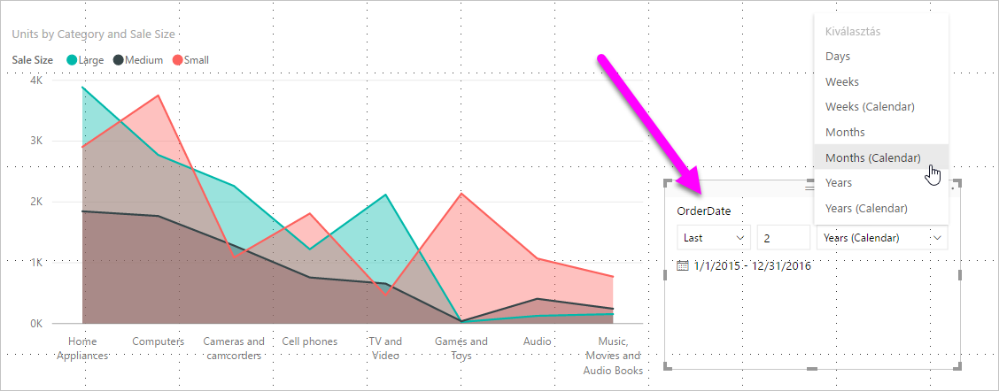
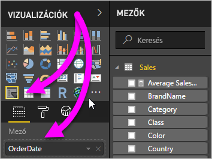
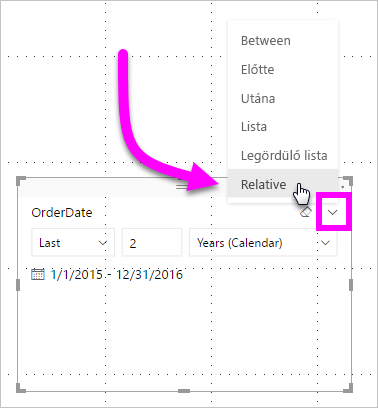
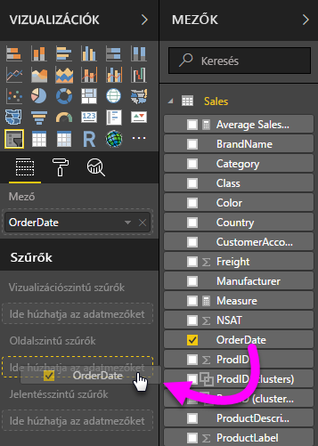
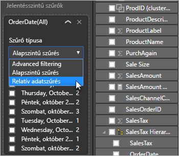
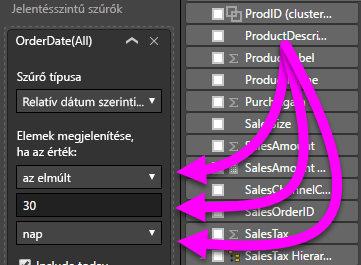

# Relatív dátumszeletelő és -szűrő használata a Power BI Desktopban

A **relatív dátumszeletelővel** vagy **relatív dátumszűrővel** időalapú szűrőket alkalmazhat az adatmodellek bármely dátumoszlopára. A **relatív dátumszeletelővel** például a megjelenítést az utóbbi 30 napban (vagy hónapban, naptári hónapban stb.) történt értékesítési eseményekre korlátozhatja. Az adatok frissítésekor a relatív időszak automatikusan alkalmazza a vonatkozó relatív dátumkorlátokat.

## A relatív dátumtartomány-szeletelő használata

A relatív dátumszeletelőt bármely más szeletelőhöz hasonlóan használhatja. Hozzon létre egy **szeletelő** vizualizációt a jelentéshez, majd válasszon ki egy dátumértéket a **Mező** értékeként. A következő képen az *OrderDate* mező van kiválasztva.

Válassza ki a szeletelőt a vásznon, majd a lefelé mutató nyilat a szeletelő vizualizáció jobb felső sarkában. Ha a vizualizáció rendelkezik dátumadatokkal, a menüben megjelenik a **Relatív** beállítás.

A relatív dátumszeletelőnél válassza a *Relatív* lehetőséget.

Ezután válassza ki a beállításokat.

A *relatív dátumszeletelő* első beállításainál a következő lehetőségek közül választhat:

* Utolsó

* Következő

* Ez a

A *relatív dátumszeletelő* második (középső) beállításában egy szám beírásával megadhatja a relatív dátumtartományt.

A harmadik beállításban kiválaszthatja a dátummértéket. A következők közül választhat:

* Napok

* Hetek

* Hetek (naptári)

* Hónapok

* Hónapok (naptári)

* Évek

* Évek (naptári)

Ha kiválasztja a **Hónapok** lehetőséget a listából, és megadja a *2* értéket a középső beállításban, a következő fog történni:

* ha ma július 20-a van,

* a szeletelő által korlátozott vizualizációk adatai az előző két hónapra korlátozva jelennek meg,

* ami a május 20-tól július 20-ig (a mai napig) tartó időszakot jelenti.

Összehasonlításképp, ha a *Hónapok (naptár)* elemet választotta volna, a vizualizációk a május 1-től június 30-ig tartó időszakra (az utolsó két teljes naptári hónapra) lennének korlátozva.

## A relatív dátumtartomány-szűrő használata

Relatív dátumtartomány-szűrőt is létrehozhat az egyes jelentésoldalakhoz vagy a teljes jelentéshez. Ehhez húzzon egy dátummezőt a **Lapszintű szűrők** vagy a **Jelentési szint szűrői** területre a **Mező** panelen:

Itt már módosíthatja a relatív dátumtartományt. Az eljárás a **relatív dátumszeletelő** testreszabásához hasonlít. Válassza a **Relatív dátum szerinti szűrés** lehetőséget a **Szűrő típusa** legördülő menüből.

A **Relatív dátum szerinti szűrés** kiválasztása után itt is három beállítás módosítható, köztük a középső numerikus mező, ahogy a szeletelő esetében is.

## Korlátozások és szempontok

A **relatív dátumtartomány-szeletelők** és -szűrők használatára jelenleg a következő korlátozások és szempontok vonatkoznak.

* A **Power BI** adatmodelljei nem tartalmaznak időzóna-információkat. A modellek tudják tárolni az időadatokat, de nem jelölik az időzónákat.

* A szeletelők és a szűrők minden esetben az UTC-időn alapulnak. Így ha beállít egy szűrőt egy jelentésben, majd elküldi azt egy másik időzónában tartózkodó munkatársának, mindketten ugyanazokat az adatokat fogják látni. Hacsak nem az UTC időzónában vannak, Önnek és a munkatársának figyelembe kell vennie az időeltolódást.

* A helyi időzónában rögzített adatok a **Lekérdezésszerkesztővel** alakíthatók át UTC-idővé.

## Következő lépések

A következőkben megismerheti [a csoportosítás és dobozolás használatát a Power BI Desktopban](../desktop-grouping-and-binning.md).
