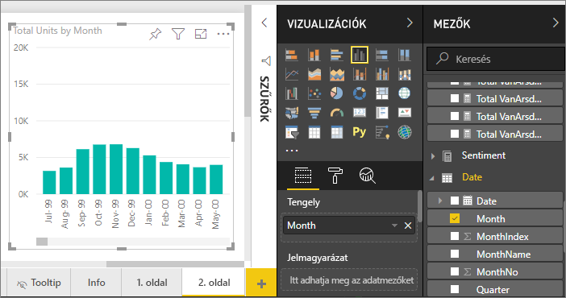
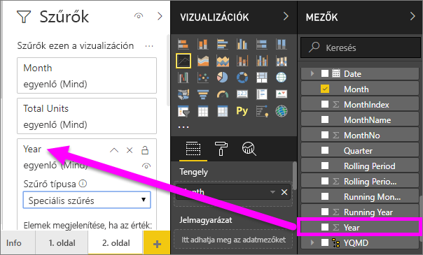
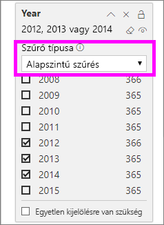
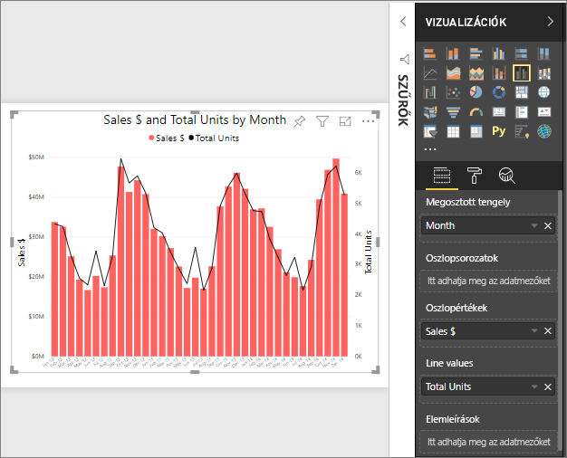
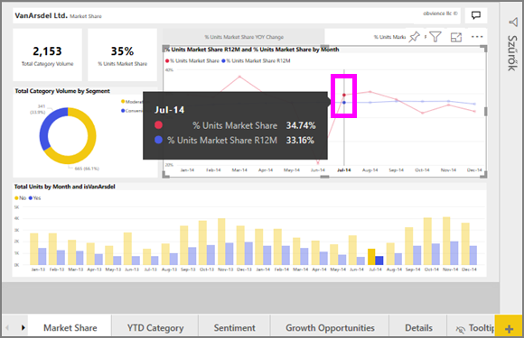

# Vonaldiagramok a Power BI-ban
Egy vonaldiagram adatpontok sorozata, amelyet egyenes szakaszokkal összekötött pontok ábrázolnak. Egy vonaldiagram egy vagy több vonalat is tartalmazhat. A vonaldiagramoknak X és Y tengelye van. 

## Vonaldiagram létrehozása
Ezen útmutatás a Értékesítési és marketing mintaalkalmazást használja egy olyan vonaldiagram létrehozásához, mely az ez évi értékesítést jeleníti meg kategória szerint. A lépések követéséhez töltse le a mintaalkalmazást az appsource.com webhelyről.

1. Kezdje a műveletet egy üres jelentésoldalon. Ha a Power BI szolgáltatást használja, mindenképpen a [Szerkesztési nézetében](../service-interact-with-a-report-in-editing-view.md) nyissa meg a jelentést.

2. A Mezők panelen válassza az **Értékesítési adatok** \> **Összes egység**, majd a **Dátum** > **Hónap** elemet.  A Power BI oszlopdiagramot hoz létre a jelentésvásznon.

    

4. Ezt konvertálja vonaldiagrammá úgy, hogy a vonaldiagram-sablont választja a Vizualizációk panelen. 

    
   

4. Szűrje a vonaldiagramot úgy, hogy a 2012-2014 időszak adatait mutassa. Ha a Szűrők panel össze van csukva, most bontsa ki. A Mezők panelről válassza a **Dátum** \> **Év** elemet, és húzza a Szűrők panelre. Helyezze el a **Szűrők ezen a vizualizáción** fejléc alatt. 
     
    

    Módosítsa a **Speciális szűrést** **Alapszintű szűrésre**, majd jelölje ki a **2012**, **2013** és **2014** értéket.

    

6. Ha szeretné, [módosíthatja a diagram szövegének méretét és színét](power-bi-visualization-customize-title-background-and-legend.md). 

    

## További vonalak felvétele a diagramra
Egy vonaldiagram több különböző vonalból állhat. Bizonyos esetekben a vonalak értékei annyira eltérőek lehetnek, hogy nem jól ábrázolhatók együtt. Most további vonalakat veszünk fel az aktuális diagramra, majd bemutatjuk a diagram formázási lehetőségeit, ha a vonalak által ábrázolt adatok nagyon eltérőek. 

### További vonalak felvétele
Az összes régió összes egységének egy vonallal való ábrázolása helyett válasszuk szét az összes egységet régiónként. Vegyen fel újabb vonalakat úgy, hogy a Jelmagyarázat területre húzza a **Földrajzi hely** > **Régió** elemet.

   

### Két Y tengely használata
Hogyan oldható meg, hogy az összes értékesítés és az összes egység egy diagramon legyen ábrázolva? Az értékesítési mérőszámok sokkal nagyobbak az egységekénél, így ez a diagram használhatatlan. Az összes egységet ábrázoló piros vonal értéke mintha végig 0 lenne.

   

Nagyon különböző értékek egy diagramon való ábrázolására a kombinált diagram használható. A kombinált diagramokat a [Kombinált diagramok a Power BI-ban](power-bi-visualization-combo-chart.md) című cikk ismerteti. Az alábbi példában úgy ábrázoljuk egy diagramon az összes értékesítést és az összes egységet, hogy felveszünk egy második Y tengelyt. 

   

## Kiemelés és keresztszűrés
További információ a Szűrök ablaktábla használatáról: [Szűrők hozzáadása jelentésekhez](../power-bi-report-add-filter.md).

Egy adatpont kijelölése egy vonaldiagramon keresztkiemelést és keresztszűrést végez a jelentés oldalon lévő többi vizualizáción és viszont. A lépések követéséhez nyissa meg a **Piaci részesedés** lapot.  

A vonaldiagram adatpontjaiban az X tengely és az Y tengely egy-egy értéke találkozik. Egy adatpont kijelölésekor a Power BI jelölőkkel mutatja meg, hogy melyik pont (egy vonal esetén) vagy pontok (kettő vagy több vonal esetén) alapján végzi a keresztkiemelést és keresztszűrést a jelentésoldal többi vizualizációján. Ha a vizualizáció nagyon zsúfolt, a Power BI a kattintás helyéhez legközelebbi pontot választja ki a vizualizáción.

Ebben a példában a kijelölt adatpont a következőket foglalja magában: 2014. július, R12 egység piaci részesedése 33,16%, egységek piaci részesedése 34,74%.

Az oszlopdiagramon a keresztkiemelést, a tárcsán a keresztszűrést figyelheti meg.

A keresztkiemelések és keresztszűrések használatának módját a [Vizualizációk közötti interakciók Power BI-jelentésekben](../service-reports-visual-interactions.md) című cikk ismerteti.

## Megfontolandó szempontok és hibaelhárítás
* Egy vonaldiagramnak nem lehet két Y tengelye.  Ehhez kombinált diagramot kell használnia.
* A fenti példákban a diagramok formázásakor sok egyéb mellett növeltük a betűméretet, megváltoztattuk a betűk színét, címet adtunk a tengelyeknek, középre igazítottuk a diagram címét és a jelmagyarázatot, és minkét tengely kezdőpontját nullára állítottuk be. A Formázás panel (festőhenger ikon) szinte korlátlan lehetőségeket kínál, hogy tetszése szerint alakítsa a diagram megjelenését. Ezt úgy sajátíthatja el a legjobban, ha megnyitja és maga fedezi fel a Formázás panelt.

## Következő lépések

[Vizualizációtípusok a Power BI-ban](power-bi-visualization-types-for-reports-and-q-and-a.md)

