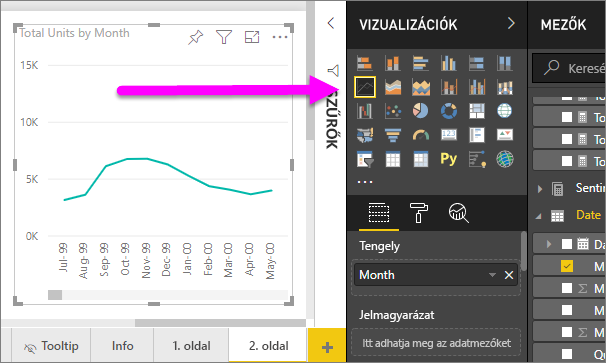

# Vonaldiagramok Power BI-ban
Egy vonaldiagramot egy sorozat pont által képviselt és csatlakoztatott egyenes vonalak adatpont. Előfordulhat, hogy egy vonaldiagramot egy vagy több sort. Vonaldiagramok az X és Y-tengely rendelkezik. 

## Hozzon létre egy vonaldiagramot
Ezen utasítások használata az értékesítési és Marketing minta alkalmazást hozhat létre egy vonaldiagramot, amely az Ez évi értékesítést jeleníti meg kategória szerint. Hogy követni tudja, lekérheti a mintaalkalmazás appsource.com.

1. Kezdje a műveletet egy üres jelentésoldalon. Ha a Power BI szolgáltatást használja, mindenképpen a [Szerkesztési nézetében](../service-interact-with-a-report-in-editing-view.md) nyissa meg a jelentést.

2. A mezők panelen válassza ki a **SalesFact** \> **egységek összesen**, és válassza ki **dátum** > **hónap**.  A Power BI létrehoz egy oszlopdiagramot a jelentésvásznon.

    

4. Vonaldiagram átalakítása vonal diagram sablon kiválasztásával a Vizualizációk panelen. 

    
   

4. Szűrheti a vonaldiagram az adatok megjelenítése a 2012-2014 évben. Ha a szűrők panel nincs kibontva, bontsa ki azt. A mezők panelen válassza ki a **dátum** \> **év** , majd húzza a szűrők panel. Dobja el, a címsor alatt **szűrők a vizualizációban**. 
     
    

    Változás **speciális szűrők** való **alapszintű szűrők** válassza **2012**, **2013** és **2014**.

    

6. Ha szeretné, [módosíthatja a diagram szövegének méretét és színét](power-bi-visualization-customize-title-background-and-legend.md). 

    

## További sorok hozzáadása a diagram
Vonaldiagramok számos különböző sorokba is rendelkezhet. És bizonyos esetekben az értékek a sorok, hogy nem jelennek meg problémamentesen eltérő lehet. Tekintsük át az aktuális további sorokat diagram, és megismerheti, hogyan formázhatja tábláról a diagramra, amikor képviseli a sorok értékei nagyon eltérő hozzáadása. 

### További sorok hozzáadása
Helyett minden régió esetében az összes egység megnézzük, a diagram egy sorba, hozzunk ossza ki az összes egység, régió szerint. Adja hozzá a további sorokat húzásával **földrajzi** > **régió** , a jelmagyarázat jól.

   

### Két Y tengely használata
Mi történik, ha szeretné teljes értékesítési és ugyanezen a diagramon az összes egység? Értékesítési szám, így sokkal nagyobb egység számok, így a vonaldiagram használhatatlan. Valójában a összes egység piros vonal jelenik meg nulla.

   

Magas széttartó értékeket egy diagramon megjeleníthető egy kombinált diagramot használja. Olvassa el az összes talál a kombinált diagramok további [kombinált diagramok a Power bi-ban](power-bi-visualization-combo-chart.md). Az alábbi példában is megjelenítjük értékesítési és összes egység együtt egy diagramon egy második Y tengely hozzáadásával. 

   

## Megfontolandó szempontok és hibaelhárítás
* Egy vonaldiagram két Y tengely nem rendelkezhet.  Használja helyette a kombinált diagram kell.
* A fenti példákban a diagramok betűméret növelése, módosítsa a betűk színe, adja hozzá a Tengelycímek, center a diagram címének és a jelmagyarázat, indítsa el mindkét tengelyt, nulla és egyéb lett formázva. A formázás ablaktáblát (festőhenger ikon) a végtelen lehetőségek, hogy a diagramok tekintse meg a kívánt módon való rendelkezik. A legjobban megérteni, hogy nyissa meg a formázás ablaktáblát, és Fedezze fel.

## Következő lépések

[Vizualizációtípusok a Power BI-ban](power-bi-visualization-types-for-reports-and-q-and-a.md)

