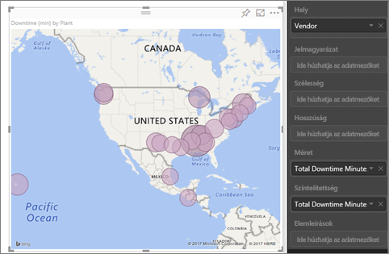
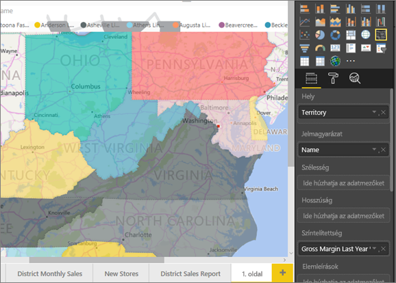
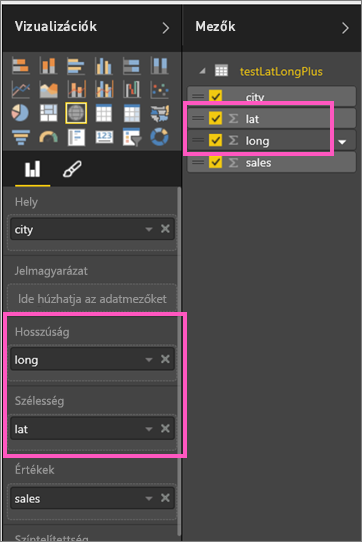

# Tippek és trükkök Power BI-térképvizualizációkhoz
A Power BI integrálva van a Bing Térképekkel alapértelmezett térképkoordináták biztosításához (ez a geokódolás nevű folyamat), így térképeket hozhat létre. Együtt algoritmusokat használnak a megfelelő hely azonosításához, de ez néha csak feltételezésen alapul. Ha a Power BI nem tudja egyedül létrehozni a térkép-vizualizációt, igénybe veszi a Bing Térképek segítségét. 

Lehetséges, hogy Önnek vagy a cégnek frissítenie kell a tűzfalat, hogy engedélyezze a hozzáférést azokhoz az URL-címekhez, amelyeket a Bing a geokódoláshoz használ.  Ezek az alábbiak:
* https://dev.virtualearth.net/REST/V1/Locations
* https://platform.bing.com/geo/spatial/v1/public/Geodata
* https://www.bing.com/api/maps/mapcontrol

A helyes geokódolás valószínűségének növelése érdekében használja az alábbi tippeket. Az első tippgyűjteményt akkor használhatja, ha hozzáféréssel rendelkezik magához az adatkészlethez. A második tippgyűjtemény olyan tippeket tartalmaz, amelyeket a Power BI-ban végezhet el, ha nem fér hozzá az adatkészlethez. Az utolsó gyűjtemény pedig URL-eket taralmaz

## Mit küld el a rendszer a Bing Térképeknek?
A Power BI szolgáltatás és a Power BI Desktop a térkép-vizualizációhoz szükséges geoadatokat küldi el a Bingnek. Ezek tartalmazhatják a **Hely**, **Szélesség** és **Hosszúság** gyűjtők adatait és a **Jelentésszintű szűrők**, **Oldalszintű szűrők** vagy a **Vizualizációszintű szűrők** gyűjtők geomezőit. Az, hogy pontosan mit küld el a rendszer, térképtípusonként eltérő. További tudnivalókért lásd a [Bing Térképek adatvédelmi tájékoztatóját](https://go.microsoft.com/fwlink/?LinkID=248686).

* Térképek (buboréktérképek) esetében, ha a szélesség és a hosszúság meg van adva, akkor a rendszer nem küld adatokat a Bingnek. Egyéb esetben a **Hely** (és szűrő) gyűjtőkben található adatokat a rendszer elküldi a Bingnek.     
* Kitöltött térképekhez szükség van egy mezőre a **Hely** gyűjtőben akkor is, ha a szélesség és hosszúság meg van adva. Bármely, a **Hely**, **Szélesség** vagy **Hosszúság** gyűjtőben található adatot a rendszer elküldi a Bingnek.
  
    A lenti példában a **Szállító** mező geokódoláshoz lett használva, így a Bing minden szállítói adatot megkap. A **Méret** és **Színtelítettség** gyűjtőkben lévő adatokat a rendszer nem küldi el a Bingnek.
  
    
  
    A lenti második példában a **Terület** mező geokódoláshoz lett használva, így a Bing minden területre vonatkozó adatot megkap. A **Jelmagyarázat** és **Színtelítettség** gyűjtőkben lévő adatokat a rendszer nem küldi el a Bingnek.
  
    

## Az adatkészletben: tippek a mögöttes adatkészlet fejlesztéséhez
Ha hozzáféréssel rendelkezik a térkép-vizualizáció létrehozásához használt adatkészlethez, érdemes megtenni néhány dolgot a helyes geokódolás valószínűségének növelése érdekében.

**1. Földrajzi mezők kategorizálása a Power BI Desktopban**

A Power BI Desktopban biztosíthatja a mezők helyes geokódolását úgy, hogy az adatmezőkön beállítja az *Adatkategóriát*. Válassza ki a kívánt táblát, lépjen a **Speciális** menüszalagra, majd állítsa az **Adatkategóriát** **Cím**, **Város**, **Kontinens**, **Ország/régió**, **Megye**, **Irányítószám**, **Állam** vagy **Tartomány** lehetőségre. Ezek az adatkategóriák segítenek a Bingnek helyesen kódolni az adatokat. További tudnivalókért lásd az [adatok kategorizálását a Power BI Desktopban](../desktop-data-categorization.md). Ha élőben csatlakozik az SQL Server Analysis Serviceshez, be kell állítania a Power BI-n kívüli adatkategorizálást az [SQL Server Data Tools (SSDT)](https://docs.microsoft.com/sql/ssdt/download-sql-server-data-tools-ssdt) használatával.

**2. Több helyoszlop használata.**    
 Időnként az adatkategóriák beállítása a térképekhez nem elég, hogy a Bing helyesen megállapítsa a szándékait. Néhány megjelölés nem egyértelmű, mivel a hely több országban vagy régióban is megtalálható. Például ***Southampton*** Angliában, Pennsylvaniában és New Yorkban is található.

A Power BI a Bing [strukturálatlan URL-sablon szolgáltatását](https://msdn.microsoft.com/library/ff701714.aspx) használja a bármely ország címérték-készletein alapuló szélességi és hosszúsági koordináták lekéréséhez. Ha az adatok nem tartalmaznak elég helyadatot, adja hozzá azokat az oszlopokat, és kategorizálja őket megfelelően.

 Például ha csak Város oszloppal rendelkezik, a Bing nehezen tudja elvégezni a geokódolást. Adjon hozzá további geooszlopokat, hogy egyértelművé tegye a helyet.  Néha egyetlen további helyoszlop hozzáadása is elég az adatkészlethez – ebben az esetben ez az állam/megye. Ne felejtse el helyesen kategorizálni, ehhez lásd az 1. lépést.

Győződjön meg arról, hogy minden mező csak a kategorizáláshoz társított, adott információval rendelkezik.  Például a Város helymezője **Southampton**, ne **Southampton, New York** legyen.  A cím helymezője **1 Microsoft Way**, és ne **1 Microsoft Way, Redmond, WA** legyen.

**3. Adott Szélesség és Hosszúság használata**

Adjon hozzá szélességi és hosszúsági értékeket az adatkészlethez. Ezzel megszünteti a kétértelműséget, és gyorsabban kaphatja vissza az eredményeket. A Szélesség és Hosszúság mezőnek *Tizedes tört* formátumban kell lennie, amit az adatmodellben állíthat be.

<iframe width="560" height="315" src="https://www.youtube.com/embed/ajTPGNpthcg" frameborder="0" allowfullscreen></iframe>

**4. Hely kategória használata teljes helyinformációkkal rendelkező oszlopokhoz**

Bár javasoljuk a geohierarchiák használatát a térképekben, ha teljes földrajzi információkkal rendelkező egyetlen hely oszlopot kell használnia, az adatkategorizálást **Hely** lehetőségre állíthatja. Például ha az oszlopban található adat egy teljes cím – 1 Microsoft Way, Redmond Washington 98052 –, ez az általánosított adatkategória a Binggel működik a legjobban. 

## A Power BI-ban: tippek jobb eredmények eléréséhez a térkép-vizualizációk használatakor
**1. Szélesség és hosszúság mezők használata (ha vannak ilyenek)**

Ha a Power BI-ban a használt adatkészlet szélesség és hosszúság mezővel rendelkezik, mindenképpen használja őket!  A Power BI speciális gyűjtőkkel rendelkezik, amelyek segítenek a térképadatok egyértelművé tételében. Egyszerűen húzza a szélességi adatokat tartalmazó mezőt a **Vizualizációk > Szélesség** területre.  Tegye ugyanezt a hosszúsági adatokkal. Ha így tesz, ki kell töltenie a *Hely* mezőt is egy vizualizáció létrehozásakor. Ellenkező esetben az adatok alapértelmezés szerint összesítve lesznek, így például a szélesség és hosszúság államszinten lesz párosítva, nem városszinten.

 

## A geohierarchiák használatával részletesen elemezheti a hely különböző szintjeit
Ha az adatkészlet már rendelkezik helyadatok különböző szintjeivel, Ön és a munkatársai használhatják a Power BI-t *geohierarchiák* létrehozásához. Ehhez húzzon több mezőt a **Hely** gyűjtőbe. Az ilyen módon együtt használt mezők geohierarchiává állnak össze. A lenti példában a következőkhöz adtunk hozzá geomezőt: Ország/régió, Állam és Város. A Power BI-ban Ön és a munkatársai le- és felhatolást végezhetnek ennek a geohierarchiának a használatával.

  

   

Ha a geohierarchiákkal végez le- vagy felhatolást, fontos tudnia, hogyan működnek az egyes részletezési gombok, és mit küld el a rendszer a Bing Térképeknek. 

* A jobb szélen található, Részletezési mód nevű gomb  lehetővé teszi egy hely kiválasztását a térképen, és hogy szintenként részletes elemzést végezzen az adott helyen. Például ha bekapcsolja a Részletes elemzést, és Észak-Amerikára kattint, lejjebb kerül a hierarchia következő szintjére – Észak-Amerika esetében az államokhoz. A geokódolásnál a Power BI a Bing Térképeknek csak Észak-Amerikáról küld országra és államra vonatkozó adatokat.  
* A bal oldalon 2 további részletes elemzési lehetőség van. Az első lehetőség () az összes hely hierarchiájának következő szintjére hatol le, egyszerre. Például ha aktuálisan az országok jelennek meg, használja ezt a lehetőséget a következő szintre (az államokhoz) lépéshez, és a Power BI az összes országra vonatkozó államadatot megjeleníti. A geokódolásnál a Power BI a Bing Térképeknek minden helyről küld államra vonatkozó adatokat (de országadatokat nem). Ez a lehetőség akkor hasznos, ha a hierarchia egyik szintje sem kapcsolódik a felette lévő szinthez. 
* A második lehetőség –  – annyiban tér el a Részletes elemzéstől, hogy nem kell a térképre kattintania.  Ezzel a hierarchia következő szintjére lép, de megjegyzi az aktuális szint kontextusát. Például ha aktuálisan az országok jelennek meg, és erre az ikonra kattint, lejjebb kerül a hierarchia következő szintjére – az államokhoz. A geokódolásnál a Power BI minden államról és a hozzájuk kapcsolódó országról adatokat küld a Bing Térképeknek, hogy segítse a pontosabb geokódolást. A legtöbb térképen vagy ezt, vagy a jobb szélen található Részletes elemzés lehetőséget fogja használni, így annyi adatot küldhet el a Bingnek a pontos helyinformációk érdekében, amennyi csak lehetséges. 

## Következő lépések
[Power BI-vizualizáció részletes elemzése](../consumer/end-user-drill.md)

[Power BI-vizualizációk](power-bi-report-visualizations.md)

További kérdései vannak? [Kérdezze meg a Power BI közösségét](http://community.powerbi.com/)

