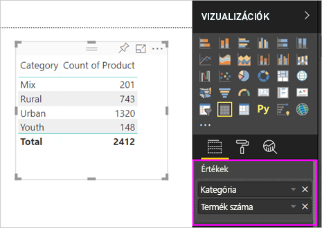
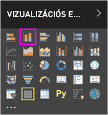
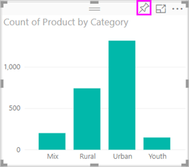

# 1\. rész – Vizualizációk hozzáadása Power BI-jelentéshez

A cikk röviden bemutatja a vizualizációk jelentésekben történő létrehozását. Tartalma a Power BI szolgáltatásra és a Power BI Desktopra is vonatkozik. Magasabb szintű ismertetést ennek a sorozatnak a [2. része](power-bi-report-add-visualizations-ii.md) kínál. Amanda bemutatja, hogyan lehet különbözőképpen létrehozni, szerkeszteni és formázni a vizualizációkat a jelentésvásznon. Ezután Ön is megpróbálhatja létrehozni a saját jelentését a [Értékesítési és marketing minta](../sample-datasets.md) segítségével.

<iframe width="560" height="315" src="https://www.youtube.com/embed/IkJda4O7oGs" frameborder="0" allowfullscreen></iframe>

## Jelentés megnyitása és egy üres lap hozzáadása

1. Nyisson meg egy [jelentést Szerkesztési nézetben](../service-interact-with-a-report-in-editing-view.md).

    Ez az oktatóanyag az [Értékesítési és marketing mintát](../sample-datasets.md) használja.

1. Ha a **Mezők** panel nem látható, a nyíl ikonnal tudja megnyitni.

   

1. Adjon hozzá egy üres lapot a jelentéshez.

## Vizualizációk hozzáadása a jelentéshez

1. A vizualizáció létrehozásához válasszon egy mezőt a **Mezők** panelen.

    Kiindulhat egy numerikus mezőből, például: **Értékesítési adatok** > **Értékesítési összeg**. A Power BI létrehoz egy oszlopdiagramot egyetlen oszloppal.

    

    Kezdheti olyan kategóriamezővel is, mint a **Név** vagy a **Termék**. A Power BI egy táblázatot hoz létre, és hozzáadja az adott mezőt az **Értékek** területhez.

    

    Kiindulhat akár olyan földrajzi mezőből is, mint a **Földrajzi hely** > **Város**. a Power BI a Bing Maps segítségével egy térképi vizualizációt hoz létre.

    

1. Hozzon létre egy vizualizációt, majd módosítsa a típusát. Válassza ki a **Termék** > **Kategória**, majd a **Termék** > **Termékek száma** lehetőséget, és adja hozzá mindkettőt az **Értékekhez**.

   

1. Módosítsa a vizualizációt oszlopdiagrammá a **Halmozott oszlopdiagram** ikon választásával.

   

1. Ha vizualizációkat hoz létre egy jelentésben, [rögzítheti őket az irányítópulton](../service-dashboard-pin-tile-from-report.md). A vizualizáció rögzítéséhez kattintson a rajzszög ikonra .

   
  
## Következő lépések

 Folytatás:

* [2. rész: Vizualizációk hozzáadása Power BI-jelentésekhez](power-bi-report-add-visualizations-ii.md)

* [Használhatja a vizualizációkat](../consumer/end-user-reading-view.md) a jelentésben.

* [Még hatékonyabban használhatja a vizualizációkat](power-bi-report-visualizations.md).

* [Mentheti a jelentést](../service-report-save.md).
