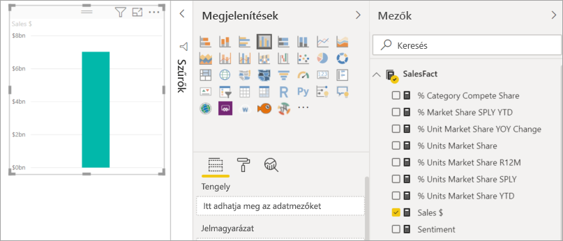
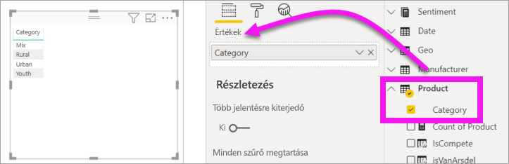
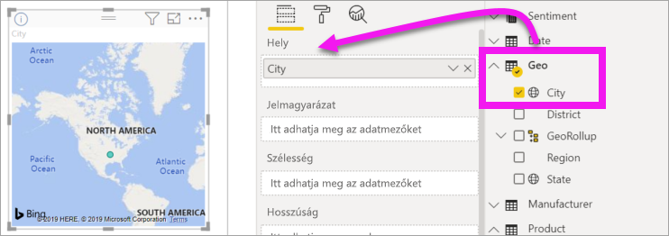
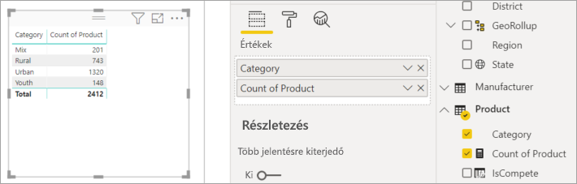
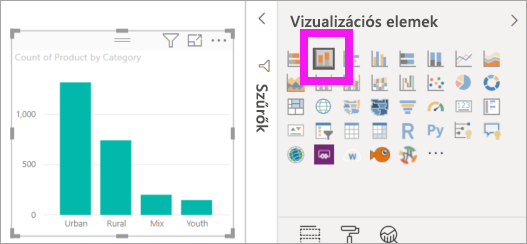
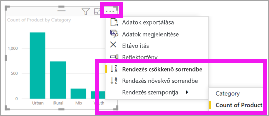

# 1\. rész – Vizualizációk hozzáadása Power BI-jelentéshez

[!INCLUDE [power-bi-visuals-desktop-banner](../includes/power-bi-visuals-desktop-banner.md)]

A cikk röviden bemutatja a vizualizációk jelentésekben történő létrehozását. Tartalma a Power BI szolgáltatásra és a Power BI Desktopra is vonatkozik. Magasabb szintű ismertetést ennek a sorozatnak a [2. része](power-bi-report-add-visualizations-ii.md) kínál. Amanda bemutatja, hogyan lehet különbözőképpen létrehozni, szerkeszteni és formázni a vizualizációkat a jelentésvásznon. Ezután Ön is megpróbálhatja létrehozni a saját jelentését a [Értékesítési és marketing minta](../sample-datasets.md) segítségével.

<iframe width="560" height="315" src="https://www.youtube.com/embed/IkJda4O7oGs" frameborder="0" allowfullscreen></iframe>

## Előfeltételek

Ez az oktatóanyag az [Értékesítési és marketing PBIX-fájlt](http://download.microsoft.com/download/9/7/6/9767913A-29DB-40CF-8944-9AC2BC940C53/Sales%20and%20Marketing%20Sample%20PBIX.pbix) használja.

1. A Power BI Desktop menüsorának bal felső részén válassza a **Fájl** > **Megnyitás** lehetőséget
   
2. Keresse meg az **Értékesítési és marketing minta PBIX-fájl** példányát

1. Nyissa meg az **Értékesítési és marketing minta PBIX-fájlt** jelentésnézetben .

1. Kiválasztás  új oldal hozzáadásához.

## Vizualizációk hozzáadása a jelentéshez

1. A vizualizáció létrehozásához válasszon egy mezőt a **Mezők** panelen.

    Kezdjen egy olyan numerikus mezővel, mint például a **Sales** (Értékesítés) > **TotalSales** (Értékesítés összesen). A Power BI létrehoz egy oszlopdiagramot egyetlen oszloppal.

    

    Kezdheti olyan kategóriamezővel is, mint a **Név** vagy a **Termék**. A Power BI egy táblázatot hoz létre, és hozzáadja az adott mezőt az **Értékek** területhez.

    

    Kiindulhat akár olyan földrajzi mezőből is, mint a **Földrajzi hely** > **Város**. a Power BI a Bing Maps segítségével egy térképi vizualizációt hoz létre.

    

## A vizualizáció típusának módosítása

 Hozzon létre egy vizualizációt, majd módosítsa a típusát. 
 
 1. Válassza ki a **Termék** > **Kategória**, majd a **Termék** > **Termékek száma** lehetőséget, és adja hozzá mindkettőt az **Értékekhez**.

    

1. Módosítsa a vizualizációt oszlopdiagrammá a **Halmozott oszlopdiagram** ikon választásával.

   

1. A vizualizáció rendezési módjának módosításához válassza a **További műveletek** (...) lehetőséget.  A rendezési beállításokkal módosíthatja a rendezés irányát (növekvő vagy csökkenő), és módosíthatja a rendezéshez használt oszlopot (**Rendezési szempont**).

   
  
## Következő lépések

 Folytatás:

* [2. rész: Vizualizációk hozzáadása Power BI-jelentésekhez](power-bi-report-add-visualizations-ii.md)

* [Használhatja a vizualizációkat](../consumer/end-user-reading-view.md) a jelentésben.

