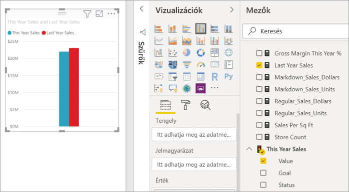
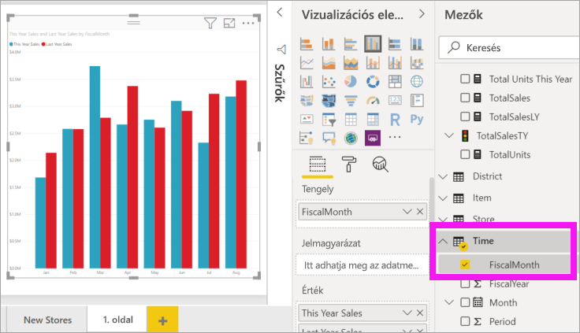
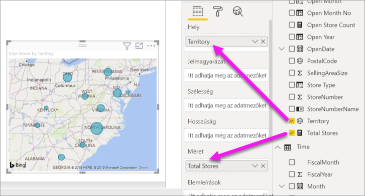
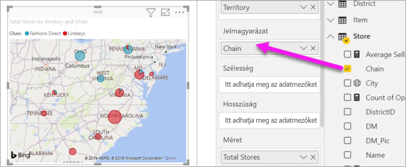

# 2\. rész – Vizualizációk hozzáadása Power BI-jelentésekhez

[!INCLUDE [power-bi-visuals-desktop-banner](../includes/power-bi-visuals-desktop-banner.md)]

Az [1. részben](power-bi-report-add-visualizations-i.md) alapszintű képi megjelenítéseket hozott létre a mezők neve melletti jelölőnégyzetek bejelölésével.  A 2. részben megtudhatja, hogyan hozhat létre és módosíthat vizualizációkat az egér húzásával, valamint a **Mezők** és a **Vizualizációk** panel nyújtotta lehetőségek teljes körű kiaknázásával.

## Új képi megjelenítés létrehozása
Ebben az oktatóanyagban a Kiskereskedelmi elemzés adathalmaz felhasználásával létrehozunk néhány fontosabb vizualizációt.

## Előfeltételek

Ez az oktatóanyag a [Kiskereskedelmi elemzési minta PBIX-fájlt](https://download.microsoft.com/download/9/6/D/96DDC2FF-2568-491D-AAFA-AFDD6F763AE3/Retail%20Analysis%20Sample%20PBIX.pbix) használja.

1. A Power BI Desktop menüsorának bal felső részén válassza a **Fájl** > **Megnyitás** lehetőséget.
   
2. Keresse meg a **Kiskereskedelmi elemzési minta PBIX-fájlt**

1. Nyissa meg a **Kiskereskedelmi elemzési minta PBIX-fájlt** jelentésnézetben .

1. Kiválasztás  új oldal hozzáadásához.

## Vizualizációk hozzáadása a jelentéshez

A vizualizáció létrehozásához válasszon egy mezőt a **Mezők** panelen. A létrehozott vizualizáció típusa a kiválasztott mező típusától függ. A Power BI az adattípus alapján határozza meg, milyen vizualizáción jelenítse meg az eredményeket. A vizualizáció úgy módosítható, hogy a Vizualizációk panel kiválaszt egy másik ikont. Vegye figyelembe, hogy nem minden vizualizáció lesz alkalmas az adott adatok megjelenítésére. Földrajzi adatok például nem ábrázolhatók jól tölcsér- vagy vonaldiagramon. 

### A folyó évi értékesítési adatokat a tavalyiakkal összevető területdiagram felvétele

1. Az **Értékesítés** táblában válassza az **Idei értékesítés** > **Érték** és a **Tavalyi értékesítések** mezőket. A Power BI létrehoz egy oszlopdiagramot.  Ez a diagram érdekes, és érdemes lehet jobban feltárni. Hogy néz ki az értékesítés havi bontásban?  
   
   

2. Az Idő tábláról húzza a **FiscalMonth** elemet a **Tengely** területre.  
   

3. [Módosítása a vizualizációt](power-bi-report-change-visualization-type.md) területdiagramra.  Számos különféle vizualizációtípusból választhat – ha segítségre van szüksége a választáshoz, olvassa át [az egyes típusok leírását, a bevált gyakorlatokra vonatkozó tanácsokat és az oktatóanyagokat](power-bi-visualization-types-for-reports-and-q-and-a.md). Válassza ki a területdiagram ikont a Vizualizációk panelen..

4. Rendezze a vizualizációt a **További műveletek** (...) lehetőség, majd a **Rendezés alapja** >  **FiscalMonth** elem kiválasztásával.

5. [A képi megjelenítés átméretezéséhez](power-bi-visualization-move-and-resize.md) jelölje ki a képi megjelenítést, majd fogja meg és húzza a külső körvonalak valamelyikét. Legyen elég széles ahhoz, hogy a görgetősáv már eltűnjön, de egy másik képi megjelenítés még elférjen mellette.
   
   
6. [Mentse a jelentést](../service-report-save.md).

### Térképi megjelenítés hozzáadása az értékesítések helyek szerinti megjelenítéséhez

1. Az **Üzletek** táblában válassza a **Terület** elemet. Húzza az **Összes üzlet** elemet a Méret területre. A Power BI felismeri, hogy a Terület helyet jelöl, ezért egy térképi megjelenítést hoz létre.  
   

2. Adjon hozzá egy jelmagyarázatot.  Ha az adatokat az üzletek neve szerint szeretné ábrázolni, húzza a Jelmagyarázat területre a **Store** > **Chain** (Üzlet>Üzletlánc) elemet.  
   

## Következő lépések
* További információk [a Power BI-jelentésekben lévő vizualizációkról](power-bi-report-visualizations.md).  
* További kérdései vannak? [Kérdezze meg a Power BI közösségét](https://community.powerbi.com/)

