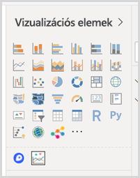

# Vizualizációk Power BI-jelentésekben

A vizualizációk az adatokból nyert megállapításokat jelenítik meg. Egy Power BI-jelentés állhat egyetlen oldalból, amelyen csak egy vizualizáció szerepel, de előfordulhatnak olyan jelentések is, amelyek számos vizualizációt tartalmazó oldalakból állnak. A Power BI szolgáltatásban a vizualizációkat a [jelentésekből irányítópultokra lehet rögzíteni](../service-dashboard-pin-tile-from-report.md).

Fontos különbséget tenni a *jelentéstervezők* és a *jelentésfelhasználók* között.  Ha Ön az a személy, akik a jelentést létrehozza vagy módosítja, akkor Ön tervező.  A tervezőknek szerkesztési jogosultságuk van a jelentéshez és az alapul szolgáló adathalmazhoz. A Power BI Desktopban ez azt jelenti, hogy megnyithatja az adatkészletet Adatnézetben, és vizualizációkat hozhat létre Jelentés nézetben. A Power BI szolgáltatásban ez azt jelenti, hogy megnyithatja az adathalmazt vagy a jelentést a jelentésszerkesztőben [Szerkesztési nézetben](../consumer/end-user-reading-view.md). Ha a jelentést vagy az irányítópultot [megosztották Önnel](../consumer/end-user-shared-with-me.md), akkor Ön a jelentés *felhasználója*. A jelentést és a rajta szereplő vizualizációkat megtekintheti és használhatja, de nem végezhet annyi módosítást, amennyit egy *tervező*.

A Power BI Vizualizációk paneljén számos különféle típusú vizualizáció érhető el.

A [Microsoft AppSource közösségi oldalon](https://appsource.microsoft.com) azonban még nagyobb választékban talál [letölthető](https://appsource.microsoft.com/marketplace/apps?page=1&product=power-bi-visuals) [egyéni vizualizációkat](../developer/visuals/custom-visual-develop-tutorial.md), amelyeket a Microsoft és a közösség tett elérhetővé.

<iframe width="560" height="315" src="https://www.youtube.com/embed/SYk_gWrtKvM?list=PL1N57mwBHtN0JFoKSR0n-tBkUJHeMP2cP" frameborder="0" allowfullscreen></iframe>

Ha még nem használta a Power BI-t, vagy fel szeretné frissíteni a tudását, az alábbi hivatkozásokat követve megismerkedhet a Power BI-vizualizációk használatának alapfogalmaival.  A (cikk bal oldalán látható) Tartalomjegyzék alapján további hasznos információkhoz juthat.

## Vizualizáció hozzáadása a Power BI-ban

A jelentések oldalain különböző [vizualizációkat hozhat létre](power-bi-report-add-visualizations-i.md). Böngésszen [az elérhető vizualizációk és a rájuk vonatkozó oktatóanyagok](power-bi-visualization-types-for-reports-and-q-and-a.md) között. 

## Egyéni vizualizáció feltöltése és használata a Power BI-ban

Önállóan létrehozott vagy a [Microsoft AppSource közösségi webhelyéről](https://appsource.microsoft.com/marketplace/apps?product=power-bi-visuals) letöltött egyéni vizualizációkat is használhat. Kreatív kedvében van? Merüljön el a forráskódban, és használja [fejlesztői eszközeinket](../developer/visuals/custom-visual-develop-tutorial.md) egy új típusú vizualizáció létrehozásához, amelyet aztán [a közösség többi tagjával is megoszthat](../developer/office-store.md). Az egyéni vizualizációk fejlesztéséről az [Egyéni Power BI-vizualizáció fejlesztése](../developer/visuals/custom-visual-develop-tutorial.md) című cikkben található további információ.

## A vizualizációs ablaktábla személyre szabása (előzetes verzió)

Ha azt veszi észre, hogy ugyanazt az egyéni vizualizációt használja számos jelentésben, az egyéni vizualizációt rögzítheti a vizualizációs ablaktáblán. Az ablaktáblára való rögzítéséhez kattintson a jobb gombbal a vizualizációra.

A rögzítését követően a vizualizáció többi beépített vizualizációval együtt aktív lesz. A vizualizációt a rendszer a bejelentkezéshez használt fiókjához kötötte, így minden új, Ön által létrehozott jelentés automatikusan magában fogja foglalni ezt a vizualizációt, feltéve, hogy bejelentkezett. Így nagyon egyszerűen általános használatúvá tehető egy adott vizualizáció, anélkül, hogy minden egyes jelentéshez külön hozzá kellene adni.

Amíg ez a funkció előzetes verzióban érhető el, a rögzített vizualizációk csak a Power BI Desktopban láthatók. A funkció használatához emellett be kell jelentkeznie.

## Vizualizáció típusának módosítása

Próbálkozhat [a vizualizáció típusának módosításával](power-bi-report-change-visualization-type.md), hogy megtalálja azt, amelyik a legjobban illik az adataihoz.

## A vizualizáció rögzítése

Ha a vizualizáció pont úgy néz ki, ahogy szeretné, a Power BI szolgáltatásban csempeként [rögzítheti az irányítópultra](../service-dashboard-pin-tile-from-report.md). Ha rögzítés után megváltoztatja a jelentésben használt vizualizációt, az irányítópulton lévő csempe nem változik. Ha például vonaldiagram volt, akkor az is marad, noha a jelentésben fánkdiagrammá alakította át.

## Korlátozások és szempontok
- Az adatforrástól és a mezők számától függően (mérőszámok vagy oszlopok) előfordulhat, hogy a vizualizációk lassan töltenek be.  Javasoljuk, hogy a vizualizációkat korlátozza összesen 10–20 mezőre a jobb olvashatóság és teljesítmény érdekében. 

- A vizualizációkra érvényes felső korlát 100 mező (mérőszámok és oszlopok). Ha a vizualizáció betöltése sikertelen, csökkentse a mezők számát.   

## Következő lépések

* [Vizualizációtípusok a Power BI-ban](power-bi-visualization-types-for-reports-and-q-and-a.md)
* [Egyéni vizualizációk](../power-bi-custom-visuals.md)
