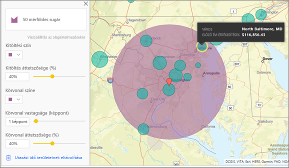

# ArcGIS-térképek létrehozása a Power BI Desktopban

[!INCLUDE [power-bi-visuals-desktop-banner](../includes/power-bi-visuals-desktop-banner.md)]

Ez az oktatóanyag egy ArcGIS Maps for Power BI-térképet létrehozó személy szemszögéből van megírva. Ha a *tervező* megosztja az ArcGIS Maps for Power BI-térképet egy kollégájával, az illető megtekintheti és használhatja a térképet, azonban nem mentheti a módosításokat. További információ az ArcGIS Maps-térképek megtekintéséről: [Az ArcGIS Maps for Power BI-térképek használata](power-bi-visualizations-arcgis.md).

Az ArcGIS-térképek és a Power BI együttes használata új lehetőségeket kínál a térképkezelésben, amelyek messze túlmutatnak a pontok térképeken való elhelyezésén. Az alaptérképekhez, helytípusokhoz, témákhoz, szimbólumstílusokhoz és referenciarétegekhez elérhető beállításokkal lenyűgöző és informatív térképes vizualizációk hozhatók létre. A térképen megjelenített mérvadó adatrétegek és a térbeli elemzés egyesítésével jobban megértheti a vizualizációban szereplő adatokat.

 Az ArcGIS Maps for Power BI-térképek mobileszközökön nem hozhatók létre, de megtekinthetők és használhatók. Lásd: [ArcGIS-térképek használata a Power BI-ban](power-bi-visualizations-arcgis.md).

> [!NOTE]
> A Power BI jelentéskészítő kiszolgálóhoz egyelőre nem használható az ArcGIS Maps for Power BI vizualizáció.

> [!TIP]
> A GIS az angol Geographic Information System (térinformatikai rendszer) kifejezés rövidítése.

Az alábbi példa sötétszürke vásznon ábrázolja hőtérképként a regionális értékesítéseket a rendelkezésre álló jövedelem 2016-os középértékét jelölő demográfiai rétegen. Amint azt a továbbiakban is látni fogja, az ArcGIS Maps for Power BI-térképek szinte korlátlan térképes megjelenítési lehetőségekkel, demográfiai adatmegjelenítésekkel és igen figyelemreméltó térképi vizualizációkkal rendelkeznek, amelyekkel a lehető legszemléletesebb módon mutathatja be az adatait.

> [!TIP]
> Számos példát és beszámolót találhat az [ESRI ArcGIS Maps for Power BI-oldalán](https://www.esri.com/powerbi). Ezután tekintse meg az Esri [ArcGIS Maps for Power BI termékének Első lépések oldalát](https://doc.arcgis.com/en/maps-for-powerbi/get-started/about-maps-for-power-bi.htm) is.

## Felhasználói beleegyezés
Az ArcGIS Maps for Power BI szolgáltatója az Esri (https://www.esri.com). Az ArcGIS Maps for Power BI használatára az Esri szerződési feltételei és adatvédelmi szabályzata vonatkoznak. Ha a Power BI-felhasználó használni kívánja az ArcGIS Maps for Power BI vizualizációit, el kell fogadnia a feltételeket.

**Forrásanyagok**

[Feltételek](https://go.microsoft.com/fwlink/?LinkID=826322)

[Adatvédelmi irányelvek](https://go.microsoft.com/fwlink/?LinkID=826323)

[Az ArcGIS Maps for Power BI termékoldala](https://www.esri.com/powerbi)

## Előfeltételek

Ez az oktatóanyag a Power BI Desktopot és a [Kiskereskedelmi elemzési minta .PBIX-fájlt](https://download.microsoft.com/download/9/6/D/96DDC2FF-2568-491D-AAFA-AFDD6F763AE3/Retail%20Analysis%20Sample%20PBIX.pbix) használja. ArcGIS Maps for Power BI-térképek a Power BI szolgáltatásban is létrehozhatók. 

1. A menüsor bal felső részén válassza a **Fájl** \> **Megnyitás** lehetőséget
   
2. Keresse meg a helyi számítógépen mentett **Kiskereskedelmi elemzési minta .PBIX-fájlt**.

1. Nyissa meg a **Kiskereskedelmi elemzési mintát** jelentésnézetben .

1. Kiválasztás  új oldal hozzáadásához.

   
## ArcGIS Maps for Power BI-térképvizualizáció létrehozása

Figyelje meg, hogyan hoz létre Will néhány vizualizációt, majd az alábbi lépések alapján próbálja ki Ön is a [Kiskereskedelmi elemzési minta .PBIX-fájl](../sample-datasets.md) használatával.
    

   > [!NOTE]
   > Ez a videó a Power BI Desktop egy régebbi verzióját használja.
   > 

> [!VIDEO https://www.youtube.com/embed/EKVvOZmxg9s]

1. A Vizualizációk panelen válassza az ArcGIS Maps for Power BI ikont.
   
        

2. A Power BI egy üres sablont ad hozzá a jelentésvászonhoz. Ebben az oktatóanyagban az ingyenes verziót használjuk.
   
   

3. A **Mezők** panelen húzzon egy adatmezőt a **Hely** vagy a **Szélesség** és/vagy **Hosszúság** gyűjtőkbe. Ebben a példában az **Üzlet > Város** adatokat használjuk.
   
   > [!NOTE]
   > Az ArcGIS Maps for Power BI automatikusan érzékeli, hogy a kiválasztott mezők formaként vagy pontként jeleníthetők meg a legjobban a térképen. Az alapértelmezett beállítást a beállítások között módosíthatja (lásd alább).
   > 
   > 
   
    

4. A **Mezők** panelen húzzon egy mértéket a **Méret** gyűjtőbe, így megadja az adatok megjelenítésének módját. Ebben a példában az **Értékesítés > Előző évi értékesítés** adatokat használjuk.
   
    

Létrehozta első ArcGIS Maps for Power BI-térképét. Most pontosítsuk és formázzuk a térképet alaptérképekkel, helytípusokkal, témákkal és egyebekkel.

## Az ArcGIS Maps for Power BI-térképek beállításai és formázása
Az **ArcGIS Maps for Power BI** formázási funkcióinak elérése:

1. A vizualizáció jobb felső sarkában található **További műveletek** (...) elemet, majd a **Szerkesztés** lehetőséget választva érheti el a további funkciókat.
   
   
   
   Az vizualizáció területe megnő, és a felső részén megjelennek az elérhető funkciók. Az egyes funkciók kiválasztásakor megnyílik egy részletes lehetőségeket tartalmazó feladatpanel. 
   
   
   

> [!TIP]
> Az **Esri**[átfogó dokumentációt](https://go.microsoft.com/fwlink/?LinkID=828772) biztosít az **ArcGIS Maps for Power BI** szolgáltatáskészletére vonatkozóan.

### Alaptérképek
Négy alaptérkép áll rendelkezésre: sötétszürke vászon, világosszürke vászon, OpenStreetMap és utcák.  Az ArcGIS standard alaptérképe az *Streets* (Utcák).

Egy alaptérkép alkalmazásához válassza ki azt a feladatpanelen.

### Hely típusa
Az ArcGIS Maps for Power BI automatikusan észleli az adatok az adott térképen való megjelenítésének legjobb módszerét. A points (pontok) és a boundaries (határok) lehetőség közül választ. A Location type (Hely típusa) beállítással pontosíthatja ezt a választást.

A **Boundaries** (Határok) megjelenítés csak akkor használható, ha az adatok standard földrajzi értékeket tartalmaznak. Az ArcGIS Maps for Power BI automatikusan meghatározza a térképen megjelenítendő formát. A standard geometriai értékek közé tartoznak az országok, a tartományok, az irányítószámok stb. Azonban a GeoCodinghoz hasonlóan előfordulhat, hogy a Power BI nem észleli, hogy egy mezőnek alapértelmezés szerint határnak kellene lennie, vagy hogy nem talál határértéket az adatokhoz.  

### A térkép témája
Négy térképtéma áll rendelkezésre. A Power BI automatikusan kiválasztja a **Csak hely** vagy a **Méret** témát a **Helyhez** hozzáadott mező(k) és a **Méret** gyűjtők alapján. A térkép alapértelmezett értéke **Méret**, mivel mindkét gyűjtőhöz adtunk hozzá mezőket. Próbálja ki a többi témát, majd térjen vissza a **Mérethez**, mielőtt továbblépne a következő lépésre.  

<table>
<tr><th>Téma</th><th>Leírás</th>
<tr>
<td>Csak hely</td>
<td>A Location (Hely) gyűjtőhöz hozzáadott mező alapján jeleníti meg az adatpontokat vagy a kitöltött határokat a térképen.</td>
</tr>
<tr>
<td>Hőtérkép</td>
<td>Az adatok intenzitását jeleníti meg a térképen. A nagyobb tevékenységű vagy magasabb értékű területeket intenzívebb és ragyogó színek jelölik. </td>
</tr>
<tr>
<td>Méret</td>
<td>A Size (Méret) gyűjtőhöz hozzáadott mező alapján jeleníti meg az adatpontokat a térképen.</td>
</tr>
<tr>
<td>Fürtözés</td>
<td>A megadott fürtsugáron belüli pontok egyetlen szimbólumba vannak csoportosítva, amely a térkép adott területén lévő pontok számát jelöli. </td>
</tr>
</table>

### Szimbólumstílus
Szimbólumstílusok használatával pontosíthatja az adatok térképen való megjelenítését. A szimbólumstílusok a kiválasztott Location type (Hely típusa) és Map theme (Térképtéma) kontextusától függenek. Az alábbi példában a Map theme (Térképtéma) a **Size** (Méret) értékre van beállítva, továbbá számos szimbólumstílus-, átlátszósági, stílus- és méretbeállítás van megadva. 

### Gombostűk
A térkép egyes pontjaira gombostűk hozzáadásával hívhatja fel a figyelmet.  

1. Kattintson a **Pins** (Gombostűk) fülre.
2. Adja meg a kulcsszavakat (pl. címek, helyek és hasznos helyek) a keresőmezőben, és válasszon a legördülő menüből. Ekkor egy szimbólum jelenik meg a térképen, a térkép pedig automatikusan ráközelít az adott helyre. A rendszer helykártyákként menti a keresési találatokat a Gombostűk panelen. Legfeljebb 10 helykártya menthető.
   
   
3. A Power BI egy gombostűt ad hozzá a helyhez, a gombostű színe pedig módosítható.
   
   
4. Gombostűk hozzáadása és törlése.
   
   

### Utazási idő
A Drive Time (Utazási idő) panelen kiválaszthat egy helyet, és meghatározhatja, hogy mely térképelemek találhatók még egy adott távolságon vagy utazási időn belül. Az alábbi példában egy Washington D.C. körüli 80 kilométer sugarú kör látható.  Kövesse az alábbi lépéseket egy saját utazási időt megjelenítő réteg létrehozásához. 
    

1. Válassza ki az egyszeres kijelölési eszközt, majd válasszon ki egy rögzítést vagy egy buborékot. Ebben a példában a Charlotte Douglas repülőtér rögzítését választottuk ki

   
   
   > [!TIP]
   > Könnyebb kiválasztani a helyet, ha nagyít a térképen. A + ikonra kattintva vagy az egér görgetésével nagyíthat.
   > 
   > 
2. Tegyük fel, hogy néhány napra a Charlotte Douglas repülőtérre repül, és szeretné kideríteni, hogy mely üzletláncok vannak autóval elérhető közelségben. Módosítsa a Search area (Keresési terület) beállítást a **Drive time** (Utazási idő) értékre, a Distance (Távolság) beállítást pedig **25** percre. Kattintson az OK gombra.    
   
    

    

3. Két áruház található autóval 25 percen belül. A sugár lila színnel jelenik meg. Kattintson bármely helyre a részletek megjelenítéséhez. A sugarat a szín és a körvonal módosításával formázhatja is.
   
    

### Referenciaréteg
#### Reference Layer – Demographics (Referenciaréteg – Demográfiai adatok)
Az ArcGIS Maps for Power BI számos demográfiai réteget tartalmaz, amelyekkel kontextusba helyezheti a Power BI-ban tárolt adatokat.

1. Válassza ki a **Reference layer** (Referenciaréteg) fület, és válassza a **Demographics** (Demográfiai adatok) lehetőséget.
2. Minden réteghez tartozik egy jelölőnégyzet. A réteg térképhez való hozzáadásához jelölje be a kívánt jelölőnégyzeteket.  Ebben a példában a háztartás átlagos bevételét adtuk hozzá. 
   
    
3. Minden réteg interaktív. A részletek megjelenítéséhez mutasson rá egy buborékra. Kattintson egy árnyékolt területre a részletek diagramok formájában való megjelenítéséhez. Itt a 28227-as irányítószámot választottuk ki, és két diagramot tekinthetünk meg.
   
    

#### Reference Layer - ArcGIS (Referenciaréteg – ArcGIS)
Az ArcGIS Online szolgáltatás használatával a vállalatok nyilvános webes térképeket tehetnek közzé. Ezen felül az Esri válogatott webes térképeket kínál a Living Atlason keresztül. Az ArcGIS lapon az összes nyilvános webes térkép és Living Atlas-térkép között kereshet, és referenciarétegként hozzáadhatja őket a térképhez.

1. Kattintson a **Reference layer** (Referenciaréteg) fülre, és válassza az **ArcGIS** lehetőséget.
2. Írja be a keresési kifejezéseket, majd válasszon egy térképréteget. Ebben a példában az egyesült államokbeli kongresszusi körzeteket választottuk.
   
    
3. Ha szeretné megtekinteni a részleteket, válasszon egy árnyékolt területet a *Kiválasztás referenciarétegről* eszköz megnyitásához: A referenciaréteg-választó eszközzel határokat vagy objektumokat választhat ki a referenciarétegen.

 

## Adatpontok kiválasztása
Az ArcGIS Maps for Power BI öt kijelölési módot kínál az adatok pontos és gyors kiválasztásának támogatására.

A kijelölés mód módosításához vigye az egérmutatót az egyszeres kijelölés eszköz fölé, ahogyan az alábbi ábrán látható. Ekkor megjelenik a többi eszközt tartalmazó rejtett sáv:

Minden eszköz egyedi módot kínál az adtok kijelölésére: 

 Egyes adatpontok kijelölése.

 A térképre rajzolt négyszögbe foglalt összes adatpont kijelölése.

 A referenciafóliákon lévő határvonalak és sokszögek használhatók a bennfoglalt adatok kijelölésére.

 Az adatok egy pufferréteg használatával jelölhetők ki.

 Az egymáshoz hasonló adatpontok kijelölését teszi lehetővé.

> [!NOTE]
> Egyszerre legfeljebb 250 adatpont jelölhető ki.
> 
> 

 

## A súgó használata
Az **Esri**[átfogó dokumentációt](https://go.microsoft.com/fwlink/?LinkID=828772) biztosít az **ArcGIS Maps for Power BI** szolgáltatáskészletére vonatkozóan.

A Power BI [**ArcGIS Maps for Power BI** termékkel kapcsolatos közösségi csatornáján](https://go.microsoft.com/fwlink/?LinkID=828771) felteheti kérdéseit, megtalálhatja a legfrissebb információkat, jelentheti a hibákat és válaszokat kaphat.

Amennyiben fejlesztési javaslatai vannak, azokat a [Power BI ötletlistájához](https://ideas.powerbi.com) adja hozzá.

 

## Az ArcGIS Maps for Power BI cégen belüli használata
A Power BI használatával a tervezők, a bérlői rendszergazdák és a rendszergazdák kezelhetik az ArcGIS Maps for Power BI használatát. Az alábbiakban megtalálhatja az egyes szerepkörökben elvégezhető lépéseket. 

### Tervezői lehetőségek
A Power BI Desktopban a tervezők letilthatják az ArcGIS Maps for Power BI-t a Biztonság lapon. Válassza a **Fájl** > **Lehetőségek és beállítások**, majd a **Beállítások** > **Biztonság** lehetőséget. Ha le van tiltva, az ArcGIS Maps alapértelmezés szerint nem töltődik be.

### Bérlői rendszergazdai beállítások
A PowerBI.com-on a bérlői rendszergazdák az összes felhasználó számára kikapcsolhatják az ArcGIS Maps for Power BI-t. Válassza a **Beállítások** > **Felügyeleti portál** > **Bérlői beállítások** lehetőséget. Ha az ArcGIS Maps for Power BI le van tiltva, a Power BI Vizualizációk paneljén nem fog megjelenni az ikonja.

### Informatikai rendszergazdai beállítások
A Power BI Desktop támogatja a **Csoportszabályzatok** használatát az ArcGIS Maps for Power BI használatának letiltásához a cég összes üzembe helyezett számítógépén.

<table>
<tr><th>Attribútum</th><th>Érték</th>
</tr>
<tr>
<td>key</td>
<td>Software\Policies\Microsoft\Power BI Desktop&lt;/td&gt;
</tr>
<tr>
<td>valueName</td>
<td>EnableArcGISMaps</td>
</tr>
</table>

Az 1 (decimális) érték engedélyezi az ArcGIS Maps for Power BI használatát.

A 0 (decimális) érték letiltja az ArcGIS Maps for Power BI használatát.

## Megfontolandó szempontok és korlátozások
Az ArcGIS Maps for Power BI az alábbi szolgáltatásokban és alkalmazásokban érhető el:

<table>
<tr><th>Szolgáltatás/alkalmazás</th><th>Elérhetőség</th></tr>
<tr>
<td>Power BI Desktop</td>
<td>Igen</td>
</tr>
<tr>
<td>Power BI service (app.powerbi.com)</td>
<td>Igen</td>
</tr>
<tr>
<td>Power BI mobilalkalmazások</td>
<td>Igen</td>
</tr>
<tr>
<td>Power BI webes közzététel</td>
<td>Nem</td>
</tr>
<tr>
<td>Power BI Embedded</td>
<td>Nem</td>
</tr>
<tr>
<td>Power BI szolgáltatás beágyazása (PowerBI.com)</td>
<td>Nem</td>
</tr>
</table>

Azokban a szolgáltatásokban és alkalmazásokban, ahol az ArcGIS Maps for Power BI nem elérhető, a képi megjelenítésben üres vizualizáció jelenik meg a Power BI emblémával.

Az utcacímek geokódolása során csak az első 1500 cím lesz geokódolva. A helynevek és országok geokódolására az 1500 címes korlát nem vonatkozik.

 

**Hogyan működik az ArcGIS Maps for Power BI?**
Az ArcGIS Maps for Power BI szolgáltatója az Esri (https://www.esri.com). Az ArcGIS Maps for Power BI használatára az Esri [szerződési feltételei](https://go.microsoft.com/fwlink/?LinkID=8263222) és [adatvédelmi szabályzata](https://go.microsoft.com/fwlink/?LinkID=826323) vonatkoznak. Ha a Power BI-felhasználó használni kívánja az ArcGIS Maps for Power BI vizualizációit, el kell fogadnia a feltételeket (részletekért tekintse meg a felhasználói beleegyezésről szóló szakaszt).  Az Esri ArcGIS Maps for Power BI az Esri használati feltételeinek és adatvédelmi szabályzatának hatálya alá tartozik, amelyek elérhetők a beleegyező párbeszédpanelről. Az ArcGIS Maps for Power BI első használata előtt minden felhasználónak el kell fogadnia a feltételeket. Miután a felhasználók elfogadták a feltételeket, a program elküldi a vizualizációhoz tartozó adatokat az Esrinek geokódolásra, amelyne során a helyadatok térképen megjeleníthető szélességi és hosszúsági adatokká lesznek átalakítva. Érdemes annak tudatában használni a szolgáltatást, hogy az Esri minden, adatvizualizációhoz tartozó adatot megkaphat. Az Esri olyan szolgáltatásokat nyújt, mint az alaptérképek, térelemzés, geokódolás és hasonlók. Az ArcGIS Maps for Power BI vizualizáció ezekkel a szolgáltatásokkal egy SSL-kapcsolaton keresztül kommunikál, amelyet egy Esri által nyújtott és fenntartott tanúsítvány véd. További információt az ArcGIS Maps for Power BI szolgáltatásról az Esri [ArcGIS Maps for Power BI termékoldalán](https://www.esri.com/powerbi) találhat.

Amikor egy felhasználó az ArcGIS Maps for Power BI egy, az Esri által ajánlott Plus-előfizetésére regisztrál, közvetlen kapcsolatba kerül az Esrivel. A Power BI nem küld személyes felhasználói adatokat az Esrinek. A felhasználó a bejelentkezés után megadja a saját AAD-identitását egy Esri által nyújtott AAD-alkalmazásnak. Ezzel személyes adatokat oszt meg közvetlenül az Esrivel. Ha egy felhasználó Plus-tartalmakat ad meg egy ArcGIS Maps for Power BI-vizualizációhoz, a többi felhasználónak szintén Plus-előfizetésre lesz szüksége az adott tartalom megtekintéséhez vagy szerkesztéséhez. 

Az Esri ArcGIS Maps for Power BI működésével kapcsolatos részletes technikai kérdésekkel az Esri támogatási oldalához fordulhat.

**Milyen adatok lesznek elküldve az Esrinek?**
Arról, hogy a rendszer milyen adatokat továbbít az Esrinek, az ő [dokumentációs webhelyükön](https://doc.arcgis.com/en/maps-for-powerbi/get-started/data-transfer.htm) olvashat.

**Van valamilyen díja az ArcGIS Maps for Power BI használatának?**

Az **Esri** felár nélkül biztosítja az ArcGIS Map for Power BI szolgáltatást. El kell fogadnia a felhasználói szerződést.  

**Hibaüzenetet kapok Power BI Desktopban arról, hogy megtelt a gyorsítótár**

Ez egy programhiba, amelynek a javítása folyamatban van.  Addig is a gyorsítótár ürítéséhez törölje a fájlokat a következő helyről: C:\Users\\AppData\Local\Microsoft\Power BI Desktop\CEF, majd indítsa újra a Power BI-t.

**Támogatja az ArcGIS Maps for Power BI az Esri-alakzatfájlok használatát?**

Az ArcGIS Maps for Power BI automatikusan észleli a standard határokat, például az országok/régiók, államok/tartományok, illetve irányítószámok határait. Ha saját alakzatokat kell megadnia, ezt a [Shape Maps for Power BI Desktop](desktop-shape-map.md) használatával teheti meg.

**Offline is megtekinthetem az ArcGIS-térképeimet?**

Nem, a térképek megjelenítéséhez a Power BI-nak kapcsolódnia kell a hálózathoz.

**Csatlakozhatok az ArcGIS Online-fiókomhoz a Power BI-ból?**

Jelenleg nem. [Szavazzon erre az ötletre](https://ideas.powerbi.com/forums/265200-power-bi-ideas/suggestions/9154765-arcgis-geodatabases), és e-mailben értesítjük, ha hozzákezdtünk a funkció fejlesztéséhez.  

## Következő lépések
[Az Önnel megosztott ArcGIS-térképek használata](power-bi-visualizations-arcgis.md)

[Az ArcGIS Maps for Power BI elérhetőségét bejelentő blogbejegyzés](https://powerbi.microsoft.com/blog/announcing-arcgis-maps-for-power-bi-by-esri-preview/)

További kérdései vannak? [Kérdezze meg a Power BI közösségét](https://community.powerbi.com/)

