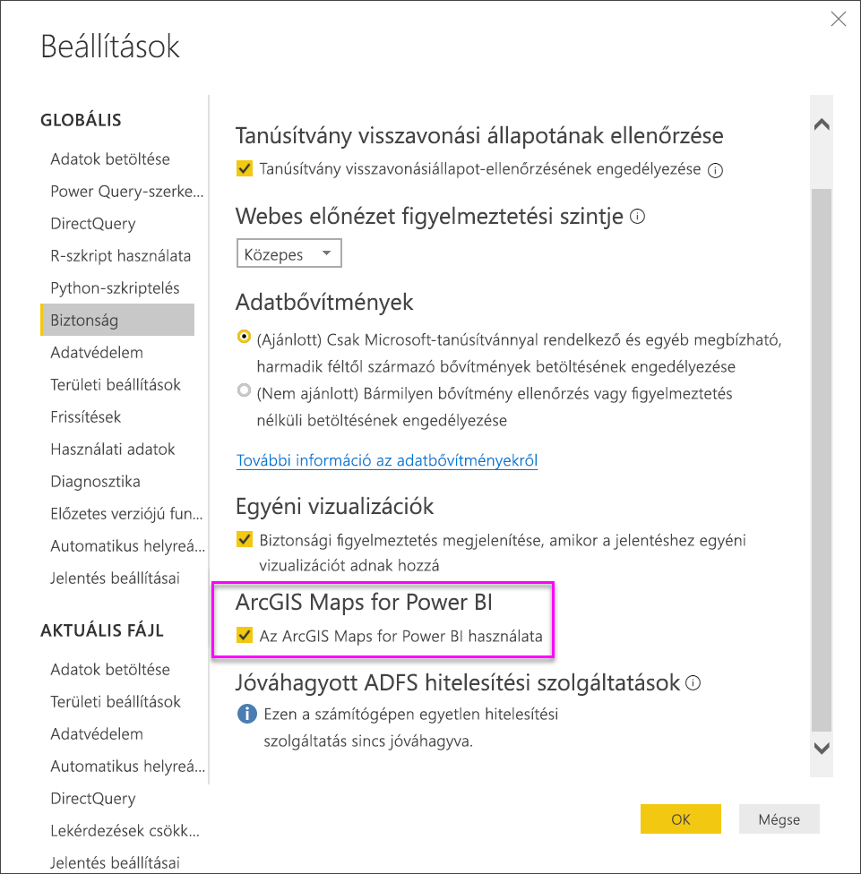

# ESRI ArcGIS-térképek a Power BI Desktopban

[!INCLUDE [power-bi-visuals-desktop-banner](../includes/power-bi-visuals-desktop-banner.md)]

Ez az oktatóanyag az ArcGIS-térképet létrehozó személy szemszögéből van megírva. Ha a készítő megosztja az ArcGIS-térképet egy kollégájával, az illető megtekintheti és használhatja a térképet, azonban nem mentheti a módosításokat. További információ az ArcGIS-térképek megtekintéséről: [Az ArcGIS-térképek használata](power-bi-visualizations-arcgis.md).

Az ArcGIS-térképek és a Power BI együttes használata új lehetőségeket kínál a térképkezelésben, amelyek messze túlmutatnak a pontok térképeken való elhelyezésén. Az alaptérképekhez, helytípusokhoz, témákhoz, szimbólumstílusokhoz és referenciarétegekhez elérhető beállításokkal lenyűgöző és informatív térképes vizualizációk hozhatók létre. A térképen megjelenített mérvadó adatrétegek és a térbeli elemzés egyesítésével jobban megértheti a vizualizációban szereplő adatokat.

 Az ArcGIS-térképek mobileszközökön nem hozhatók létre, de megtekinthetők és használhatók. Lásd: [ArcGIS-térképek használata a Power BI-ban](power-bi-visualizations-arcgis.md).

> [!TIP]
> A GIS az angol Geographic Information System (térinformatikai rendszer) kifejezés rövidítése.

Az alábbi példa sötétszürke vásznon ábrázolja hőtérképként a regionális értékesítéseket a rendelkezésre álló jövedelem 2016-os középértékét jelölő demográfiai rétegen. Amint azt a továbbiakban is látni fogja, az ArcGIS-térképek szinte korlátlan térképes megjelenítési lehetőségekkel, demográfiai adatmegjelenítésekkel és igen figyelemreméltó térképi vizualizációkkal rendelkeznek, amelyekkel a lehető legszemléletesebb módon mutathatja be az adatait.

> [!TIP]
> Példákat és beszámolókat az [ESRI Power BI-oldalán](https://www.esri.com/powerbi) talál. Ezután tekintse meg az esri [ArcGIS Maps for Power BI termékének Első lépések oldalát](https://doc.arcgis.com/en/maps-for-powerbi/get-started/about-maps-for-power-bi.htm) is.

## Felhasználói beleegyezés
Az ArcGIS Maps for Power BI szolgáltatója az Esri (www.esri.com). Az ArcGIS Maps for Power BI használatára az Esri szerződési feltételei és adatvédelmi szabályzata vonatkoznak. Ha a Power BI-felhasználó használni kívánja az ArcGIS Maps for Power BI vizualizációit, el kell fogadnia a feltételeket.

**Forrásanyagok**

[Feltételek](https://go.microsoft.com/fwlink/?LinkID=826322)

[Adatvédelmi irányelvek](https://go.microsoft.com/fwlink/?LinkID=826323)

[Az ArcGIS Maps for Power BI termékoldala](https://www.esri.com/powerbi)

 

### ArcGIS-térkép engedélyezése a ***Power BI Desktopban (app.powerbi.com)***
Ez az oktatóanyag a [Kiskereskedelmi elemzési minta .PBIX-fájlt](http://download.microsoft.com/download/9/6/D/96DDC2FF-2568-491D-AAFA-AFDD6F763AE3/Retail%20Analysis%20Sample%20PBIX.pbix
) használja. Az **ArcGIS Maps for Power BI** engedélyezése:

1. A menüsor bal felső részén válassza a **Fájl** \> **Megnyitás** lehetőséget
   
2. Keresse meg a helyi számítógépen mentett **Kiskereskedelmi elemzési minta .PBIX-fájlt**.

1. Nyissa meg a **Kiskereskedelmi elemzési mintát** jelentésnézetben .

1. Kiválasztás  új oldal hozzáadásához.

   
3. A Vizualizációk panelen válassza az ArcGIS Maps for Power BI ikont.
   
    
4. A Power BI hozzáad egy üres ArcGIS-térképsablont a jelentésvászonhoz.
   
   

 

## ArcGIS-térképes vizualizáció létrehozása
Figyelje meg, hogyan hoz létre Will néhány ArcGIS-térképes vizualizációt, majd az alábbi lépések alapján próbálja ki Ön is, a [Kiskereskedelmi elemzési minta .PBIX-fájl](../sample-datasets.md) használatával.
   > [!NOTE]
   > Ez a videó a Power BI Desktop egy régebbi verzióját használja.
   > 
   > 
<iframe width="560" height="315" src="https://www.youtube.com/embed/EKVvOZmxg9s" frameborder="0" allowfullscreen></iframe>

1. A **Mezők** panelen húzzon egy adatmezőt a **Hely** vagy a **Szélesség** és/vagy **Hosszúság** gyűjtőkbe. Ebben a példában az **Üzlet > Város** adatokat használjuk.
   
   > [!NOTE]
   > Az ArcGIS Maps for Power BI automatikusan érzékeli, hogy a kiválasztott mezők formaként vagy pontként jeleníthetők meg a legjobban a térképen. Az alapértelmezett beállítást a beállítások között módosíthatja (lásd alább).
   > 
   > 
   
    

3. A **Mezők** panelen húzzon egy mértéket a **Méret** gyűjtőbe, így megadja az adatok megjelenítésének módját. Ebben a példában az **Értékesítés > Előző évi értékesítés** adatokat használjuk.
   
    

## Az ArcGIS-térképek beállításai és formázása
Az **ArcGIS Maps for Power BI** formázási funkcióinak elérése:

1. Válassza a vizualizáció jobb felső sarkában található három pontot, majd a **Szerkesztés** lehetőség kiválasztásával nyissa meg a további funkciókat.
   
   
   
   Az elérhető funkciók a vizualizáció felső részén jelennek meg. Az egyes funkciók kiválasztásakor megnyílik egy részletes lehetőségeket tartalmazó feladatpanel. 
   
   
   
   > [!NOTE]
   > A beállításokra és funkciókra vonatkozó további információkért lásd az alábbi **Részletes dokumentációt**.
   > 
   > 

 

## Részletes dokumentáció
Az **Esri** [átfogó dokumentációt](https://go.microsoft.com/fwlink/?LinkID=828772) biztosít az **ArcGIS Maps for Power BI** szolgáltatáskészletére vonatkozóan.

## Funkciók áttekintése
### Alaptérképek
Négy alaptérkép áll rendelkezésre: sötétszürke vászon, világosszürke vászon, OpenStreetMap és utcák.  Az ArcGIS standard alaptérképe az utcák.

Ha alkalmazni kíván egy alaptérképet, válassza ki a feladatpanelen.

### Hely típusa
Az ArcGIS Maps for Power BI automatikusan észleli az adott térkép megjelenítésének legjobb módját. A Points (Pontok) vagy a Boundaries (Határok) lehetőségek közül választ. A Location Type (Hely típusa) beállítással pontosíthatja ezt a választást.

A **Boundaries** (Határok) megjelenítés csak akkor használható, ha az adatok standard földrajzi értékeket tartalmaznak. Az Esri automatikusan meghatározza a térképen megjelenítendő formát. A standard geometriai értékek közé tartoznak az országok, a tartományok, az irányítószámok stb. Azonban a GeoCodinghoz hasonlóan előfordulhat, hogy a Power BI nem észleli, hogy a határnak alapértelmezés szerint határnak kellene lennie, vagy hogy nem rendelkezik határértékkel az adatokhoz.  

### A térkép témája
Négy térképtéma áll rendelkezésre. A Location Only (Csak hely) és a Size (Méret) témákat a rendszer automatikusan kiválasztja a helyhez kapcsolt mezők alapján, majd hozzáadja a **Méret** gyűjtőhöz a Power BI Mezők paneljén. Jelenleg a **Méret** van használatban, amit most az **Intenzitástérképre** cserélünk, de ne felejtse el letiltani az **intenzitástérképet**, mielőtt továbbhalad a következő lépésre.  

<table>
<tr><th>Téma</th><th>Leírás</th>
<tr>
<td>Location Only (Csak hely)</td>
<td>Az adatpontokat vagy a kitöltött határokat a Location Type (Hely típusa) beállításai alapján jeleníti meg.</td>
</tr>
<tr>
<td>Heat Map (Hőtérkép)</td>
<td>Intenzitási adatmegjelenítést ábrázol a térképen.</td>
</tr>
<tr>
<td>Size (Méret)</td>
<td>A méretezett adatpontokat a mezők panel méret gyűjtőjében szereplő érték alapján rajzolja fel.</td>
</tr>
<tr>
<td>Clustering (Fürtözés)</td>
<td>A térkép régióiban szereplő adatpontok számát jeleníti meg. </td>
</tr>
</table>

### Symbol Style (Szimbólumstílus)
A szimbólumstílusok használatával pontosítható az adatok térképen való megjelenése. A szimbólumstílusok a Hely típusa és a kiválasztott Térképtéma kontextusától függenek. Az alábbi példában a Térkép típusa **Méret** értékre van beállítva, továbbá számos átlátszósági, valamint stílus- és méretbeállítás van megadva. 

### Gombostűk
A térkép egyes pontjaira gombostűk hozzáadásával hívhatja fel a figyelmet.  

1. Kattintson a **Pins** (Gombostűk) fülre.
2. Adja meg a kulcsszavakat (pl. címek, helyek és hasznos helyek) a keresőmezőben, és válasszon a legördülő menüből. Ekkor egy szimbólum jelenik meg a térképen, a térkép pedig automatikusan ráközelít az adott helyre. A rendszer helykártyákként menti a keresési találatokat a Gombostűk panelen. Legfeljebb 10 helykártya menthető.
   
   
3. A Power BI egy gombostűt ad hozzá a helyhez, a gombostű színe pedig módosítható.
   
   
4. Gombostűk hozzáadása és törlése.
   
   

### Utazási idő
A Drive Time (Utazási idő) panelen kiválaszthat egy helyet, és meghatározhatja, hogy mely térképelemek találhatók még egy adott távolságon vagy utazási időn belül.  
    

1. Válassza a **Drive Time** (Utazási idő) fület, és válassza az egyszeres vagy többszörös kijelölés eszközt. Egyszeres kijelöléssel jelölje ki a Washington, D.C.-hez tartozó gombostűt

   
   
   > [!TIP]
   > A hely kiválasztása egyszerűbb, ha ráközelít a térképen (a + ikon használatával).
   > 
   > 
2. Tegyük fel, hogy néhány napra Washington D.C.-be kell repülnie, és arra kíváncsi, hogy melyik üzletek érhetők el ésszerű utazási időn belül. Módosítsa a Search Area (Keresési terület) beállítást **Radius** (Sugár) értékre, a Distance (Távolság) értékét pedig **50** mérföldre, majd válassza az OK lehetőséget.    
   
    

3. A sugár lila színnel jelenik meg. Kattintson bármely helyre a részletek megjelenítéséhez. A sugarat a szín és a körvonal módosításával formázhatja is.
   
    

### Referenciaréteg
#### Reference Layer – Demographics (Referenciaréteg – Demográfiai adatok)
Az ArcGIS Maps for Power BI számos demográfiai réteget tartalmaz, amelyekkel kontextusba helyezheti a Power BI-ban tárolt adatokat.

1. Válassza ki a **Reference layer** (Referenciaréteg) fület, és válassza a **Demographics** (Demográfiai adatok) lehetőséget.
2. Minden réteghez tartozik egy jelölőnégyzet. A réteg térképhez való hozzáadásához jelölje be a kívánt jelölőnégyzeteket.  Ebben a példában a háztartás átlagos bevételét adtuk hozzá. 
   
    
3. Minden réteg interaktív. A buborékok fölé mozgatott kurzorhoz hasonlóan a térkép árnyékolt területeire kattintva megtekintheti a részleteket. 
   
    

#### Reference Layer - ArcGIS (Referenciaréteg – ArcGIS)
Az ArcGIS Online szolgáltatás használatával a vállalatok nyilvános webes térképeket tehetnek közzé. Ezen felül az Esri válogatott webes térképeket kínál a Living Atlason keresztül. Az ArcGIS lapon az összes nyilvános webes térkép és Living Atlas-térkép között kereshet, és referenciarétegként hozzáadhatja őket a térképhez.

1. Kattintson a **Reference layer** (Referenciaréteg) fülre, és válassza az **ArcGIS** lehetőséget.
2. Írja be a keresési kifejezéseket, majd válasszon egy térképréteget. Ebben a példában az egyesült államokbeli kongresszusi körzeteket választottuk.
   
    
3. Ha szeretné megtekinteni a részleteket, válasszon egy árnyékolt területet a *Kiválasztás referenciarétegről* eszköz megnyitásához: A referenciaréteg-választó eszközzel határokat vagy objektumokat választhat ki a referenciarétegen.

 

## Adatpontok kiválasztása
Az ArcGIS Maps for Power BI öt kijelölési módot kínál az adatok pontos és gyors kiválasztásának támogatására.

A kijelölés mód módosításához vigye az egérmutatót az egyszeres kijelölés eszköz fölé, ahogyan az alábbi ábrán látható. Ezzel a többi eszközt tartalmazó rejtett sáv is megjelenik:

Minden eszköz egyedi módot kínál az adtok kijelölésére: 

 Egyes adatpontok kijelölése.

 A térképre rajzolt négyszögbe foglalt összes adatpont kijelölése.

 A referenciafóliákon lévő határvonalak és sokszögek használhatók a bennfoglalt adatok kijelölésére.

 Az adatok egy pufferréteg használatával jelölhetők ki.

 Az egymáshoz hasonló adatpontok kijelölését teszi lehetővé.

> [!NOTE]
> Egyszerre legfeljebb 250 adatpont jelölhető ki.
> 
> 

 

## A súgó használata
Az **Esri** [átfogó dokumentációt](https://go.microsoft.com/fwlink/?LinkID=828772) biztosít az **ArcGIS Maps for Power BI** szolgáltatáskészletére vonatkozóan.

A Power BI [**ArcGIS Maps for Power BI** termékkel kapcsolatos közösségi csatornáján](https://go.microsoft.com/fwlink/?LinkID=828771) felteheti kérdéseit, megtalálhatja a legfrissebb információkat, jelentheti a hibákat és válaszokat kaphat.

Amennyiben fejlesztési javaslatai vannak, azokat a [Power BI ötletlistájához](https://ideas.powerbi.com) adja hozzá.

 

## Az ArcGIS Maps for Power BI cégen belüli használata
A Power BI használatával a felhasználók, a bérlői rendszergazdák és az informatikai rendszergazdák eldönthetik, hogy szeretnék-e használni az ArcGIS Maps for Power BI-t. Az egyes szerepkör az alábbi lépésekkel kezelhetik az ArcGis-térképek használatát. 

### Felhasználói beállítások
A Power BI Desktopban a felhasználók kikapcsolhatják az ArcGIS Maps for Power BI használatát, ha a Biztonság lap **Fájl** > **Beállítások és lehetőségek** területén a **Beállítások** > **Biztonság** lehetőséget választva letiltják azt. Ha le van tiltva, az ArcGIS Maps alapértelmezés szerint nem töltődik be.

### Bérlői rendszergazdai beállítások
A PowerBI.com webhelyen a bérlői rendszergazdák minden bérlői felhasználó számára letilthatják az ArcGIS Maps for Power BI használatát, ha kikapcsolják a beállítást a **Beállítások** > **Felügyeleti portál** > **Bérlői beállítások** menüben. Ebben az esetben a Power BI vizualizációk panelén nem fog megjelenni az ArcGIS Maps for Power BI ikon.

### Informatikai rendszergazdai beállítások
A Power BI Desktop támogatja a **Csoportszabályzatok** használatát az ArcGIS Maps for Power BI használatának letiltásához a cég összes üzembe helyezett számítógépén.

<table>
<tr><th>Attribútum</th><th>Érték</th>
</tr>
<tr>
<td>key</td>
<td>Software\Policies\Microsoft\Power BI Desktop&lt;/td&gt;
</tr>
<tr>
<td>valueName</td>
<td>EnableArcGISMaps</td>
</tr>
</table>

Az 1 (decimális) érték engedélyezi az ArcGIS Maps for Power BI használatát.

A 0 (decimális) érték letiltja az ArcGIS Maps for Power BI használatát.

## Megfontolandó szempontok és korlátozások
Az ArcGIS Maps for Power BI az alábbi szolgáltatásokban és alkalmazásokban érhető el:

<table>
<tr><th>Szolgáltatás/alkalmazás</th><th>Elérhetőség</th></tr>
<tr>
<td>Power BI Desktop</td>
<td>Igen</td>
</tr>
<tr>
<td>Power BI szolgáltatás (PowerBI.com)</td>
<td>Igen</td>
</tr>
<tr>
<td>Power BI mobilalkalmazások</td>
<td>Igen</td>
</tr>
<tr>
<td>Power BI webes közzététel</td>
<td>Nem</td>
</tr>
<tr>
<td>Power BI Embedded</td>
<td>Nem</td>
</tr>
<tr>
<td>Power BI szolgáltatás beágyazása (PowerBI.com)</td>
<td>Nem</td>
</tr>
</table>

Azokban a szolgáltatásokban és alkalmazásokban, ahol az ArcGIS Maps for Power BI nem elérhető, a képi megjelenítésben üres vizualizáció jelenik meg a Power BI emblémával.

Az utcacímek geokódolása során csak az első 1500 cím lesz geokódolva. A helynevek és országok geokódolására az 1500 címes korlát nem vonatkozik.

 

**Hogyan működik az ArcGIS Maps for Power BI?**
Az ArcGIS Maps for Power BI szolgáltatója az Esri (www.esri.com). Az ArcGIS Maps for Power BI használatára az Esri [szerződési feltételei](https://go.microsoft.com/fwlink/?LinkID=8263222) és [adatvédelmi szabályzata](https://go.microsoft.com/fwlink/?LinkID=826323) vonatkoznak. Ha a Power BI-felhasználó használni kívánja az ArcGIS Maps for Power BI vizualizációit, el kell fogadnia a feltételeket (részletekért tekintse meg a felhasználói beleegyezésről szóló szakaszt).  Az Esri ArcGIS Maps for Power BI az Esri használati feltételeinek és adatvédelmi szabályzatának hatálya alá tartozik, amelyek elérhetők a beleegyező párbeszédpanelről. Az ArcGIS Maps for Power BI első használata előtt minden felhasználónak el kell fogadnia a feltételeket. Miután a felhasználók elfogadták a feltételeket, a program elküldi a vizualizációhoz tartozó adatokat az Esrinek geokódolásra, amelyne során a helyadatok térképen megjeleníthető szélességi és hosszúsági adatokká lesznek átalakítva. Érdemes annak tudatában használni a szolgáltatást, hogy az Esri minden, adatvizualizációhoz tartozó adatot megkaphat. Az Esri olyan szolgáltatásokat nyújt, mint az alaptérképek, térelemzés, geokódolás és hasonlók. Az ArcGIS Maps for Power BI vizualizáció ezekkel a szolgáltatásokkal egy SSL-kapcsolaton keresztül kommunikál, amelyet egy Esri által nyújtott és fenntartott tanúsítvány véd. További információt az ArcGIS Maps for Power BI szolgáltatásról az Esri [ArcGIS Maps for Power BI termékoldalán](https://www.esri.com/powerbi) találhat.

Amikor egy felhasználó az ArcGIS Maps for Power BI egy, az Esri által ajánlott Plus-előfizetésére regisztrál, közvetlen kapcsolatba kerül az Esrivel. A Power BI nem küld személyes felhasználói adatokat az Esrinek. A felhasználó a bejelentkezés után megadja a saját AAD-identitását egy Esri által nyújtott AAD-alkalmazásnak. Ezzel személyes adatokat oszt meg közvetlenül az Esrivel. Ha egy felhasználó Plus-tartalmakat ad meg egy ArcGIS Maps for Power BI-vizualizációhoz, a többi felhasználónak szintén Plus-előfizetésre lesz szüksége az adott tartalom megtekintéséhez vagy szerkesztéséhez. 

Az Esri ArcGIS Maps for Power BI működésével kapcsolatos részletes technikai kérdésekkel az Esri támogatási oldalához fordulhat.

**Milyen adatok lesznek elküldve az Esrinek?**
Arról, hogy milyen adatok lesznek elküldve az Esrinek, az ő [dokumentációjukban](https://doc.arcgis.com/en/maps-for-powerbi/get-started/data-transfer.htm) olvashat.

**Van valamilyen díja az ArcGIS Maps for Power BI használatának?**

Az ArcGIS Maps for Power BI minden Power BI-felhasználó számára elérhető külön költségvonzatok nélkül. Ezt az összetevőt az **Esri** biztosítja, ezért használata az **Esri** használati feltételeinek és adatvédelmi szabályzatának elfogadásához kötött, ahogy az a cikkben korábban olvasható.

**Hibaüzenetet kapok Power BI Desktopban arról, hogy megtelt a gyorsítótár**

Ez egy programhiba, amelynek a javítása folyamatban van.  Addig is a gyorsítótár ürítéséhez törölje a fájlokat a következő helyről: C:\Users\\AppData\Local\Microsoft\Power BI Desktop\CEF, majd indítsa újra a Power BI-t.

**Támogatja az ArcGIS Maps for Power BI az Esri-alakzatfájlok használatát?**

Az ArcGIS Maps for Power BI automatikusan észleli a standard határokat, például az országok/régiók, államok/tartományok, illetve irányítószámok határait. Ha saját alakzatokat kell megadnia, megteheti a [Shape Maps for Power BI Desktop (előzetes verzió)](desktop-shape-map.md) használatával.

**Offline is megtekinthetem az ArcGIS-térképeimet?**

Nem, a térképek megjelenítéséhez a Power BI-nak kapcsolódnia kell a hálózathoz.

**Csatlakozhatok az ArcGIS Online-fiókomhoz a Power BI-ból?**

Jelenleg nem. [Szavazzon erre az ötletre](https://ideas.powerbi.com/forums/265200-power-bi-ideas/suggestions/9154765-arcgis-geodatabases), és e-mailben értesítjük, ha hozzákezdtünk a funkció fejlesztéséhez.  

## Következő lépések
[Az Önnel megosztott ArcGIS-térképek használata](power-bi-visualizations-arcgis.md)

[Az ArcGIS Maps for Power BI elérhetőségét bejelentő blogbejegyzés](https://powerbi.microsoft.com/blog/announcing-arcgis-maps-for-power-bi-by-esri-preview/)

További kérdései vannak? [Kérdezze meg a Power BI közösségét](http://community.powerbi.com/)

