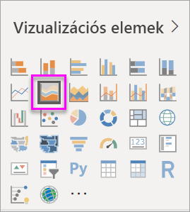

# Alapszintű területdiagram létrehozása és használata

[!INCLUDE[consumer-appliesto-nyyn](../includes/consumer-appliesto-nyyn.md)]

[!INCLUDE [power-bi-visuals-desktop-banner](../includes/power-bi-visuals-desktop-banner.md)]

Az alapszintű területdiagram (más néven a rétegzett területdiagram) a vonaldiagramon alapul. A tengely és a vonal közötti terület a mennyiségek jelzése érdekében színnel van kitöltve. 

A területdiagramokon jól látható a változások nagysága időre vetítve, és a használatukkal hatékonyan mutatható meg a teljes érték egy trend mentén. Például a nyereség időbeli alakulását jelző adatok felrajzolhatóak területdiagramként, és így megmutatható a teljes nyereség.

> [!NOTE]
> A jelentés egy Power BI-munkatárssal való megosztásához mindkettőjüknek Power BI Pro-licenccel kell rendelkezniük, vagy a jelentésnek egy Premium kapacitásban kell lennie.

## Mikor érdemes alapszintű területdiagramot használni?
Az alapszintű területdiagram remek választás a következőkhöz:

* az időre vetített mennyiségi trendek kimutatásához és összehasonlításához 
* a fizikailag megszámlálható halmazokat jelölő egyéni sorozatokhoz

### Előfeltételek
Ez az oktatóanyag a [Kiskereskedelmi elemzési minta PBIX-fájlt](https://download.microsoft.com/download/9/6/D/96DDC2FF-2568-491D-AAFA-AFDD6F763AE3/Retail%20Analysis%20Sample%20PBIX.pbix) használja.

1. A menüsor bal felső részén válassza a **Fájl** > **Megnyitás** lehetőséget
   
2. Keresse meg a **Kiskereskedelmi elemzési minta PBIX-fájlt**

1. Nyissa meg a **Kiskereskedelmi elemzési minta PBIX-fájlt** jelentésnézetben .

1. Kiválasztás  új oldal hozzáadásához.

## Alapszintű területdiagram létrehozása
 

1. Ezekkel a lépésekkel létrehozhat egy területdiagramot, amely az ez évi és az előző évi értékesítést jeleníti meg havi bontásban.
   
   a. A Mezők panelen válassza a **Sales \> Last Year Sales** (Értékesítés > Előző évi értékesítés) és **This Year Sales > Value** (Idei értékesítés > Érték) lehetőségeket.

   

   b.  A Vizualizációk ablaktábla Területdiagram ikonjára kattintva konvertálja a diagramot alapszintű területdiagrammá.

   
   
   c.  Adja hozzá a **Time \> FiscalMonth** elemet a **Tengely** gyűjtőhöz.   
   
   
   d.  A diagram havi bontásban való megjelenítéséhez kattintson a három pontra (...) a vizualizáció jobb felső sarkában, és válassza a **Rendezés hónapok szerint** lehetőséget. Ha módosítani szeretné a rendezési elvet, kattintson ismét a három pontra, majd válassza a **Növekvő sorrend** vagy a **Csökkenő sorrend** lehetőséget.

## Kiemelés és keresztszűrés
További információ a Szűrök ablaktábla használatáról: [Szűrők hozzáadása jelentésekhez](../create-reports/power-bi-report-add-filter.md).

A diagram egy meghatározott területét a terület felső szegélyének kiválasztásával jelölheti ki.  Más típusú vizualizációktól eltérően az alapszintű területdiagram kiválasztásakor nem történik keresztszűrés ugyanannak a jelentésoldalnak a többi vizualizációjával (ha vannak ilyenek). A területdiagramokat magukat azonban a jelentésoldalon lévő többi vizualizáció képes keresztszűrni. 

1. A kipróbálásához válassza ki a területdiagramot, és másolja a **New Store Analysis** jelentésoldalra (CTRL-C és CTRL-V).
2. Válassza ki az egyik, majd a másik árnyalt területet a területdiagramon. A lapon lévő többi vizualizáción semmilyen változás nem látható.
1. Most válasszon ki egy elemet. Figyelje meg, milyen hatással van ez a területdiagramra – keresztszűrés lesz érvényben rajta.

     

További információt a [Vizualizációk interakciói a jelentésekben](../create-reports/service-reports-visual-interactions.md) című témakörben talál

## Megfontolandó szempontok és hibaelhárítás   
* [Jelentés nevének akadálymentesítése a fogyatékkal élők számára](../desktop-accessibility.md)
* Az alapszintű területdiagramok az értékek összehasonlításához nem jól használhatóak, mivel a rétegzett területek kitakarják egymást. A Power BI átlátszósággal jelzi a területek fedését. Ez azonban csak két vagy három külön terület esetén működik. Ha háromnál több mérték trendjeit szeretné összehasonlítani, próbáljon inkább vonaldiagramokat alkalmazni. Ha háromnál több mérték mennyiségét szeretné összehasonlítani, próbáljon inkább faszerkezetes térképet alkalmazni.

## Következő lépés
[Power BI-jelentések](power-bi-visualization-card.md)  

