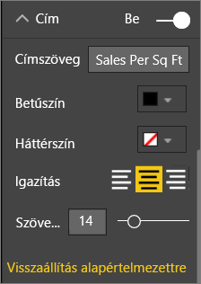
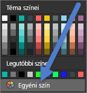
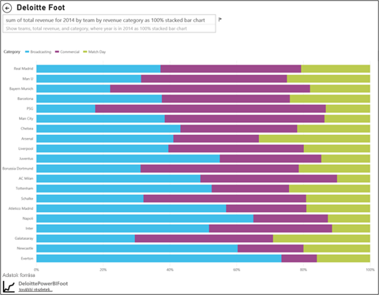

# <a name="best-design-practices-for-reports-and-visuals"></a>Ajánlott eljárások jelentések és vizualizációk megalkotásához

Ez a cikk a Power BI szolgáltatásban történő jelentéstervezés bevált gyakorlatait mutatja be. Tárgyalja a jelentésekre és a jelentéseket felépítő oldalakra és egyéni vizualizációkra vonatkozó tervezési alapelveket. Az ajánlott eljárások nagy része az irányítópultok tervezésére is érvényes.

> [!NOTE]
> A cikkben szereplő javaslatok útmutatóként szolgálnak, amelyeket bármikor alkalmazhat, ha jónak látja őket. Persze minden lentebb ismertetett alapelvhez tartoznak jogos kivételek.

Reméljük, hogy a cikk hasznos kiindulópontként szolgál Önnek, és alkalmazni fogja a belőle tanultakat a saját jelentéseire és vizualizációira, valamint csatlakozik a közösséghez a [Microsoft Power BI-közösség](http://community.powerbi.com/) oldalán. A BI-jelentéstervezés és a vizualizációhasználat jelenleg felkapott témák. Számos véleményvezér, blogger és webhely foglalkozik részletesen a BI-jelentéstervezéssel. A cikk végén felsorolunk néhányat ezek közül.

> *Eláraszt minket az információ, bár nem azért, mert túl sok van belőle, hanem azért, mert nem tudjuk kezelni.*
– Stephen Few

## <a name="a-look-at-the-landscape-and-terminology"></a>Egy pillantás a témára és a terminológiára

A Power BI-ban a jelentések egy vagy több oldalból állhatnak. Az oldalakat együtt jelentésnek hívjuk. A jelentés alapvető elemei a vizualizációk, a különálló képek és a szövegmezők. Az egyes adatpontoktól a jelentés elemein át a jelentésoldalig számtalan formázási lehetőség áll rendelkezésre.

Elsőként a jelentés tervezési fázisát vizsgáljuk meg, majd az alapvető jelentéstervezési elveket, ezt követően áttérünk a vizualizációtervezés elveire, végül pedig ismertetjük az egyes vizualizációtípusok ajánlott eljárásait.

A Power BI-jelentések létrehozásáról és használatáról részletes útmutatót [A Power BI elsajátítása](https://powerbi.microsoft.com/learning/) című cikkben találhat.

## <a name="before-you-build-your-first-visualization-focus-on-requirements"></a>Az első vizualizáció fejlesztése előtt kezdje a követelményekkel

A jelentések létrehozása már az első vizualizáció fejlesztése előtt megkezdődik. Egy jó jelentés ugyanis tervezést igényel. Fontos tudni, hogy milyen adatokkal kell dolgoznia, és lejegyezni a jelentés követelményeit. Tegye fel magának a következő kérdéseket:

* Mik az üzleti igények?

* Hogyan fogják használni az olvasók az adatokat?

* Kik fogják használni az adatokat?

* Milyen döntéseket szeretne meghozni az olvasó a jelentés alapján?

Az ezekre a kérdésekre adott válasz határozza meg a jelentés kialakítását. Minden jelentésnek közölnie kell valamit. Fontos, hogy ez az üzenet megfeleljen az üzleti igénynek. Esetenként csábító lehet, hogy drámai adatokat megjelenítő vizualizációkat adjon hozzá a jelentéshez, de ha azok nem felelnek meg az üzleti igénynek, a jelentés nem lesz hasznos. Sőt az ilyen vizualizációk a felhasználók figyelmét el is terelhetik. Emellett azt is tapasztalhatja, hogy a döntés meghozatalához szükséges információ nem található meg az adatok között. Felmérhetők a szükséges feltételek a jelentéssel?

A jelentések használhatók megfigyelésre, elemzésekre, előrejelzésekre, mérésekre, kezelésre, tesztelésre és más funkciók elvégzésére. Az üzleti igény lehet például egy olyan értékesítési jelentés, amely a teljesítményt méri. Ehhez olyan jelentést tervezhet, amely a jelenlegi eladásokat a korábbiakhoz hasonlítja, valamint összehasonlítja azokat a versenytársak adataival, és tartalmaz néhány KPI-t, amely riasztásokat idéz elő. Az olvasók mélyen elemezhetik az értékesítési mutatókat, így azonosíthatják azokat a boltbezárásokat vagy ellátási lánccal kapcsolatos problémákat, amelyek hatással vannak az értékesítésre. Egy másik esetben üzletenként, régiónként, termékenként, évszakonként és más szempontok alapján elemezhetik az értékesítési adatokat.

Fontos ismernie a jelentés olvasóit. Olyan jelentést hozzon létre, amely számukra ismert terminológiát alkalmaz, és olyan szintű részletes és összetett adatokat nyújt, amelyek megfelelnek a tudásszintjüknek. Több mint egy fajta ügyfele van? Egy jelentés nem mindig megfelelő minden ügyfélnek. Tervezzen szakértelmen alapuló jelentésoldalakat. Ügyeljen rá, hogy az oldalakat világosan felcímkézze, hogy az olvasók megtalálhassák a nekik megfelelőt. Másik lehetőségként szeletelőket használhat, az ügyfelek így saját igényeik szerint alakíthatják az oldalakat. Ha az ügyfelet is bevonja a tervezési folyamatba, biztosan nem készít majd olyan jelentést, amely nem hasznos a számára. Ha elvétené ezt a hibát, legyen kész újrakezdeni és ismételni.

Az üzleti igények, az ügyfelek és a használni kívánt metrikák azonosítása után a következő lépés a történet bemutatásához megfelelő vizualizációk kiválasztása. Gondolja végig, hogyan jelenítheti meg ezeket a vizualizációkat lehető leghatékonyabb módon. Kezdjük a jelentéstervezés alapelveivel.

## <a name="principles-of-report-design"></a>A jelentéstervezés alapelvei

A jelentésoldalakon csak korlátozott mennyiségű hely áll rendelkezésre, így az egyik legnehezebb művelet minden elemet elhelyezni úgy, hogy az adatok könnyen átláthatók maradjanak. És ne feledkezzünk meg a tetszetős jelentések vonzerejéről. Meg kell találni az egyensúlyt az esztétikus és hasznos jelentés között.

Vessünk egy pillantást az elrendezésre, az érthetőségre és az esztétikára.

### <a name="layout-of-the-report-canvas"></a>A jelentésvászon elrendezése

A jelentésvászon véges területtel rendelkezik. Ha nem fér el minden elem egyetlen jelentésoldalon, bontsa a jelentést több oldalra. A jelentésoldalakat testre szabhatja egy konkrét célközönség (például a HR, az informatikai, az értékesítési vagy az SLT részleg) számára. De egy konkrét üzleti kérdés alapján is:

* „Hogyan hatnak a hibák a leállásokra?”

* „Mi a marketingkampányunk hatása a hangulatra?”

Célszerű lehet bizonyos esetekben egymásra épülő információkban elrendezve testreszabni. Például az első oldal egy áttekintés vagy egy figyelemfelkeltő üzenet, a második oldal az adattörténet folytatása, a harmadik oldal a történet kibontása és így tovább. Ha az egész jelentés elfér egy oldalon, az is megfelelő lehet. Ha mégsem, hozzon létre új jelentésoldalakat, amelyek logikusan bontják részekre a tartalmat. Ne felejtsen el leíró és hasznos neveket adni az oldalaknak.

Képzeljen el egy művészeti galériát. Nem lenne jó ötlet 50 műalkotást egy apró szobába zsúfolni, zsúfolásig megtölteni székekkel, majd pedig minden egyes falat különböző színűre festeni. Kurátorként olyan alkotásokat választana, amelyek egy közös tematikára épülnek. Úgy helyezné el őket, hogy a látogatóknak bőven legyen helyük körbejárni és elgondolkodni rajtuk. Akár olyan információs kártyákat is helyezne az alkotások mellé, amelyek ismertetik a művet. Nem véletlen, hogy a legtöbb modern galériában nem mintásak a falak!

Ebben a cikkben egy olyan jelentésmintával kezdünk, amelyen még sokat kell dolgozni. Az ajánlott eljárások és a tervezés elveinek alkalmazásával a jelentés egyre jobbá válik.


**1. ábra: Ezen a csúnya jelentésen még sokat kell dolgozni**

A fenti példa számos területtel (elrendezés) kapcsolatos tervezési problémát illusztrál, amelyekről a továbbiakban beszélünk:

* Igazítás, sorrend és közelség

* A hely és a rendezés helytelen használata

* Zsúfoltság

### <a name="alignment-order-and-proximity"></a>Igazítás, sorrend és közelség

A jelentés elemeinek elrendezése hatással van a szövegértésre, és végigvezeti az olvasót a jelentésoldalon. Az elemek elhelyezése az olvasás módjára is utal. Ez lehet egy „itt kezdődik és itt folytatódik” típusú elrendezés, vagy egy „ez a három elem összefügg” olvasási mód.

* Számos kultúrában az emberek balról jobbra, valamint fentről lefelé olvasnak. A jelentés legfontosabb elemét a bal felső sarokban helyezze el. A többi vizualizációt pedig logikus navigálás és szövegértés szerint rendezze.

* Azokat az elemeket, amelyeknél az olvasónak választania kell (például a szeletelőket), helyezze a hozzájuk tartozó vizualizációk bal oldalára.

* Az összefüggő elemeket helyezze egymáshoz közel. A közelség ugyanis arra utal, hogy az egyes elemek összetartoznak.

* A kapcsolatok átadásának másik módja egy szegély vagy színes háttér hozzáadása az összefüggő elemekhez. Ugyancsak jó megoldás, ha egy elválasztót helyez el a jelentés különálló szakaszai között.

* Térközökkel darabolja a jelentésoldal szakaszait.

* Töltse ki a jelentésoldalt. Ha azt tapasztalja, hogy sok kitöltetlen hely van az oldalon, nagyítsa fel a vizualizációkat vagy kicsinyítse le a vásznat.

* A jelentés elemeinek méretezésénél a célszerűség alapján járjon el. Ne hagyja, hogy a rendelkezésre álló hely szabja meg az egyes vizualizációk méretét.

* A fontos elemeket jelenítse meg a többinél nagyobbként, vagy egy vizuális elemmel (például egy nyíllal) hívja fel rájuk a figyelmet.

* A jelentésoldal elemeit rendezze szimmetrikusan vagy szándékosan aszimmetrikusan.

Most vizsgáljuk meg közelebbről az igazítást.

#### <a name="alignment"></a>Igazítás

Az igazítás nem azt jelenti, hogy a különböző összetevőknek ugyanakkora méretűnek kell lenniük. Azt sem, hogy a jelentés minden sorának ugyanannyi összetevőt kell tartalmaznia. Csupán annyit, hogy az oldalt célszerű úgy strukturálni, hogy az segítse a navigációt és az olvashatóságot.

A frissített jelentésünkben láthatjuk, hogy annak összetevői már a bal és a jobb oldalra vannak igazítva. A jelentés sorait emellett vízszintesen és függőlegesen igazítottuk. A szeletelők a megfelelő vizualizációk bal oldalára kerültek.


**2. ábra: A csúnya jelentésminta már jobban néz ki az elrendezés javításainak köszönhetően**

A Power BI eszközeivel igazíthatja a vizualizációkat. Ha több vizualizációt jelöl ki a Power BI Desktopban, a **Vizuális eszközök** szalagfül **Igazítás** és **Elosztás** lehetőségével egyeztetheti a vizualizációk elhelyezését.


**3a. ábra: Vizuális eszközök igazítása a Power BI Desktopban**


**3b. ábra: Vizuális eszközök igazítása a Power BI szolgáltatásban**

A Power BI szolgáltatásban és a Power BI Desktopban a vizualizációk méretét és elhelyezését is pontosan irányíthatja. Ezeket a beállításokat az **Általános** lap **formázási** panelén adhatja meg az egyes vizualizációkhoz:


**4. ábra: A vizualizáció pontos elhelyezésének beállítása**

A mintajelentés oldalán (2. ábra) a Power BI a két kártya és a nagy méretű szegély **X pozíciójának** értékét 200-ra igazítja.

#### <a name="fit-to-the-space"></a>Igazítás a területhez

Használja ki a rendelkezésre álló területet. Ha tudja, hogy az olvasók hogyan fogják megjeleníteni a jelentést, ezt vegye figyelembe a tervezésnél. Csökkentse az üres területet, így kitöltheti a vásznat. Próbáljon meg olyan elrendezést kialakítani, hogy ne kelljen az egyes vizualizációkhoz görgetősávokat használni. Töltse ki a helyet úgy, hogy ne tűnjenek zsúfoltnak a vizualizációk.

##### <a name="adjust-the-page-size"></a>Az oldalméret módosítása

Az oldalméret csökkentésével az egyes elemek nagyobbak lesznek az oldal méretéhez képest. Ehhez jelöljön ki egy tetszőleges vizualizációt az oldalon, és használja az **Oldalméret** lapot a **formázási** panelen.

Ez a jelentésoldal **4:3** arányú oldalméretről **16:9** arányra módosult. Megfigyelheti, hogy az elrendezés sokkal jobban illeszkedik a 16:9 arányú mérethez. Így még a görgetősávot is el tudjuk távolítani a második vizualizációból.


**5a. ábra: A jelentés 4:3 arányú oldalmérettel**


**5b. ábra: A jelentés 16:9 arányú oldalmérettel**

Az olvasók 4:3, 16:9 vagy egyéb oldalarányban fogják megtekinteni a jelentést? Kis vagy nagy méretű képernyőkön? Esetleg minden lehetséges képernyőarányban és -méretben? Ezeket tartsa szem előtt a tervezéskor.

A mintajelentésünk oldala kissé zsúfoltnak tűnik. Vizualizációk kijelölése nélkül:

1. Válassza  a **Formázás** panel megnyitásához.

1. Bontsa ki az **Oldalméret** beállításait.

1. A **Típus** legyen **Egyéni**.

1. A **Magasság** legyen **900**.

    

**6. ábra: Az oldal magasságának növelése**

#### <a name="reduce-clutter"></a>A zsúfoltság csökkentése

A zsúfolt jelentésoldalak nehezen értelmezhetők első pillantásra, így olyan túlzónak tűnhetnek, hogy az olvasók meg sem próbálják áttekinteni. Távolítsa el a felesleges jelentéselemeket. Ne adjon hozzá olyan funkciókat, amelyek valójában nem segítik az áttekinthetőséget. A jelentésoldalnak a lehető legátláthatóbban, leggyorsabban és legösszefüggőbben kell átadnia az információt.

Edward Tufte a *The Visual Display of Quantitative Information* (A mennyiségi adatok vizuális megjelenítése) című könyvében ezt „adat–tinta aránynak” nevezi. Lényegében távolítson el minden olyan elemet, amely nem alapvető fontosságú.

Az eltávolított elemeknek köszönhetően nő a térköz a jelentésoldalon. Így több helye lesz alkalmazni az [Igazítás, sorrend és közelség](#alignment-order-and-proximity) szakaszban tanultakat.

A mintaoldalunk máris jobban mutat. Sok felesleges elemet távolítottunk el, és alakzatokkal csoportosítottunk más elemeket. Eltávolítottuk a háttérképet, a felesleges nyíl alakzatot és a szövegmezőt, egy vizualizációt egy másik oldalra helyeztünk, és egyéb módosításokat hajtottunk végre. Emellett megnöveltük az oldalméretet, így a rendelkezésre álló térközt is.


**7. ábra: A zsúfoltságától megszabadított csúnya jelentésmintánk**

### <a name="tell-a-story-at-a-glance"></a>Egy történet egy pillantásra

A jelentés legjobb tesztje az, ha olyanok is gyorsan, magyarázat nélkül megértik a tartalmát, akik először találkoznak vele. Az olvasóknak átláthatják első pillantásra, hogy miről szól az egész oldal, az egyes diagramok és a táblázatok.

Amikor az olvasók a jelentésre pillantanak, jó esetben azonnal arra az elemre összpontosítanak, amelyet Ön elsőnek szánt. Ezután innen folytatják balról jobbra, illetve fentről lefelé. Ezt a viselkedést vizuális jelzésekkel módosíthatja, például szövegmezőcímkékkel, alakzatokkal, szegélyekkel, valamint a méret és a színek módosításával.

#### <a name="text-boxes"></a>Szövegmezők

Néha a vizualizációk címei nem elegendők az információ átadásához. Szövegmezők hozzáadásával kommunikálhat a jelentés olvasóival. A szövegmezők informálhatnak a jelentésoldalról, a vizualizációk csoportjairól vagy egyetlen vizualizációról. Megmagyarázhatják az eredményeket vagy részletesen meghatározhatnak egy vizualizációt, egy vizualizáció összetevőit vagy a vizualizációk közötti kapcsolatot. A szövegmezőkkel felhívhatja a figyelmet egyes elemekre különböző feltételek alapján.

A Power BI szolgáltatás felső menüsorában válassza a **Szövegmező** lehetőséget. (A Power BI Desktopban válassza a **Szövegmező** lehetőséget a menüszalag **Beszúrás** területén.)


**8. ábra: Szövegmező hozzáadása a Power BI szolgáltatásban**

Írjon be szöveget az üres szövegmezőbe. Ezután a vezérlőkkel állítsa be a betűtípust, a méretet, az igazítást és a további paramétereket. A fogópontok segítségével méretezze át a mezőt.


**9. ábra: A szövegdoboz formázása**

Ne vigye túlzásba! Ha egy jelentés túl sok szöveget tartalmaz, az elterelheti a figyelmet a vizualizációkról. Ha azt tapasztalja, hogy a jelentésoldal csak akkor érthető, ha rengeteg szöveget tartalmaz, érdemes az egészet újrakezdenie. Tud olyan vizualizációt használni, amely önmagában jobban szemlélteti az átadandó üzenetet? Tudja módosítani a vizualizáció címét, hogy az érthetőbb legyen?

#### <a name="text"></a>Szöveg

Hozzon létre egy szövegstílusról szóló útmutatót, és alkalmazza a jelentés minden oldalára. Válasszon ki néhány betűtípust, -méretet és -színt. Alkalmazza az útmutatót a szöveges elemekre. Használja emellett hanem a vizualizációkon belüli betűtípusokra is. Erről többet [A vizualizációk részét képező címek és címkék](#titles-and-labels-that-are-part-of-the-visualizations) című szakaszban tudhat meg. Adjon meg szabályokat a félkövér és dőlt betűtípus, a nagyobb betűméret, az egyes színek és egyéb beállítások használatára. Ne használjon csupa nagybetűkkel írt vagy aláhúzott szövegeket.

#### <a name="shapes"></a>Alakzatok

Az alakzatok is segíthetik a navigációt és a szövegértést. Az alakzatokkal összefüggő információkat csoportosíthat, fontos adatokat emelhet ki, és nyilakkal irányíthatja a tekintetet. Az alakzatokkal az olvasók könnyebben megtalálják, hol kezdjék az olvasást, és könnyebben értelmezik a jelentést. Tervezői szókifejezéssel élve ez a *kontraszt*.


**10a. ábra: Alakzatok a Power BI szolgáltatásban**


**10b. ábra: Alakzatok a Power BI Desktopban**

Hogy néz ki jelenleg a mintaoldalunk? A 11. ábrán egy letisztultabb, kevésbé zsúfolt oldalt láthatunk, amelyben következetesek a szövegméret, a betűtípusok és a színek. A bal felső sarokban található oldalcím tudatja velünk, miről szól az oldal.


**11. ábra: A mintajelentés az alkalmazott útmutatásokkal és címmel ellátva**

A példánkban a jelentésoldal címét a bal felső sarokban helyeztük el – ide néznek először az olvasók. A betűméret 28-as, a betűtípus pedig Segoe Bold, a szöveg így kitűnik az oldalból. A szövegstílusra vonatkozó útmutatónkat követve nincs háttér, a címek feketék, az oldalon jelmagyarázat található, és címkékkel láttuk el az elemeket. Mindezeket az oldal összes vizualizációjára alkalmaztuk, ahol ez lehetséges volt (a kombinált diagram tengelyei és címkéi nem szerkeszthetők). Ezenfelül a következő elemeket konfiguráltuk az útmutató alapján:

* Kártyák: A **Kategória címkét** **kikapcsoltuk**, a **Címet** **bekapcsoltuk**, a betűméretet 12 pontosra állítottuk, fekete színnel, középre igazítva.

* Vizualizációk címei: **Bekapcsolt** állapotban állítsa 12 pontos betűméretre és igazítsa balra.

* Szeletelők: A **Fejlécet** **kikapcsoltuk**, a **Címet** pedig **be**. Az **Elemek** > **Szöveg** értékét hagyja szürkén és 10 pontos betűméreten.

* Pont- és oszlopdiagramok: használjon fekete betűtípust az X és Y tengelyekhez, valamint azok címeihez.

#### <a name="color"></a>Szín

A színnel következetessé teheti a jelentést. A színekről bővebben értekezünk a [Vizualizációtervezés alapelvei](#principles-of-visual-design) című szakaszban. Itt a színválasztás tudatosságáról ejtünk szót. Ezzel ugyanis elkerülheti, hogy az olvasók a nehéz átláthatóság miatt ne tudják gyorsan megérteni a jelentést. A túl sok világos szín megterhelő a szemnek. Ez a szakasz tulajdonképpen arról szól, hogyan ne használjuk a színeket.

#### <a name="backgrounds"></a>Hátterek

A jelentésoldalak háttereinek beállításakor olyan színeket válaszon, amelyek nem szorítják háttérbe a jelentés adatait, nem ellentétesek az oldal többi színével, és általában nem bántják a szemet. Fontos észben tartani, hogy egyes színek meghatározott jelentéssel bírnak. Az Egyesült Államokban például a vörös a jelentésekben általában „valami rosszat” jelent.


**12. ábra: A jelentés hátterének beállítása**

Nem műalkotást készítünk, hanem egy használatra szánt jelentést. Olyan színt válasszon, amely könnyebben olvashatóvá teszi az oldalakat és kiemeli a jelentés elemeit. Egy, a weblapok szín- és vizualizációhasználatát vizsgáló kutatás szerint a nagyobb kontraszt egyes színek között gyorsabb megértést eredményez. Két tanulmány foglalkozik a témával:

* [Weblapok szövegeinek és háttérszínének hatása a vizuális keresésre](https://www.sciencedirect.com/science/article/pii/S0141938202000410)

* [Weblapok vizuális összetettségének és esztétikai karaktereinek a felhasználók általi megítélése](https://www.researchgate.net/publication/301362579_Determining_Users'_Perception_of_Web_Page_Visual_Complexity_and_Aesthetic_Characteristics)

A mintajelentésünkre alkalmaztunk néhány színekkel kapcsolatos ajánlott eljárást (20. és 21. ábra). A legszembetűnőbb a háttérkép feketére módosítása. A sárga túl világos volt, és megerőltette a szemet. Emellett a **Count of athlete name by year and class** (Sportolók neveinek száma évek és érmek szerint) diagramon a sávok sárga része észrevehetetlen volt a sárga háttér előtt. Fekete (vagy fehér) háttérrel a lehető legtöbb kontrasztot kihozhatjuk a jelentésből, és a vizualizációkra terelhetjük a figyelmet.

Ezekkel a további lépésekkel javítottunk a mintajelentésen:

#### <a name="page-title"></a>Oldalcím

Amikor feketére módosítottuk a hátteret, eltűnt a cím, mert a szövegmező csak fekete betűszínt engedélyez. A probléma orvoslására egy szövegmezőcímet adtunk hozzá:

1. Jelölje ki a szövegmezőt és törölje a szöveget.

1. A **Vizualizációk** lapon kapcsolja **be** a **Cím** beállítást.

1. Az **Cím** kibontásához válassza a mutató nyilat.

1. A **Címszöveg** mezőbe írja be a **Nyári olimpiai játékok** szöveget.

1. A **Betűszín** legyen fehér.

    

    **13. ábra: Oldalcím hozzáadása**

#### <a name="cards"></a>Kártyák

A kártyák vizualizációi:

1. Válassza  a **Formázás** panel megnyitásához.

1. A **Hátteret** kapcsolja **be**.

1. Adja meg a fehér színt, **0%-os** **átlátszósággal**.

    

1. Ezután kapcsolja **be** a **Címet**.

1. Adjon meg fehér **betűszínt** és fekete **háttérszínt**.

    

#### <a name="slicers"></a>Szeletelők

Eddig a két szeletelőnek eltérő formázása volt. Ez tervezési szempontból értelmetlen. Mindkét szeletelő esetén: 

1. Módosítsa a háttérszínt tengerkékre.

    

    **14. ábra: Szeletelő háttérszínének módosítása**

    A tengerkék jó választás, mert illeszkedik az oldal színpalettájába – megtalálható a tematikus térképen, a faszerkezetes térképen és az oszlopdiagramon is.

1. Adjon hozzá egy vékony fehér szegélyt.

    

    **15. ábra: Szegély hozzáadása a szeletelőhöz**

1. A szürke betűszín nehezen látható a tengerkék háttér előtt, ezért módosítsa az **Elemek** színét fehérre.

    

    **16. ábra: Szeletelő betűszínének módosítása**

1. Végül a **Cím** területen módosítsa fehérre a **betűszínt**, és adja hozzá egy fekete **háttérszínt**.

    

    **17. ábra: Szeletelőcím formázása**

#### <a name="rectangle-shape"></a>Téglalap alak

A téglalap is eltűnt a fekete háttér előtt. A probléma orvoslásához:

1. Jelölje ki az alakzatot.

1. Az **Alakzat formázása** panelen kapcsolja **be** a **Háttér** beállítást.

    

    **18. ábra: Az alakzat formázása**

#### <a name="column-charts-bubble-chart-filled-map-and-treemap"></a>Oszlopdiagramok, buborékdiagram, tematikus térkép és faszerkezetes térkép

A jelentésoldal többi vizualizációjához adjon fehér hátteret. A **Formázás** panelen:

1. Bontsa ki a **Háttér** beállítást.

1. Állítsa a **színt** fehérre.

1. Módosítsa az **átlátszóságot** 0-ra.

    

    **19. ábra: Fehér háttér hozzáadása a többi vizualizációhoz**

Íme a jelentés az újraformázás után:


**20. ábra: Mintajelentés a színek ajánlott eljárásainak alkalmazásával (fekete háttér)**


**21. ábra: Mintajelentés a színek ajánlott eljárásainak alkalmazásával (fekete háttér)**

### <a name="aesthetics"></a>Esztétika

Arról, hogy mit tekintünk esztétikai elemeknek, már szót ejtettünk: igazítás, szín, betűtípusok, és zsúfoltság. Akad még azonban néhány ajánlott eljárás, amelyről érdemes beszélni. Ezek a jelentések általános megjelenésével foglalkoznak.

Ne feledje: a jelentés funkciója nem az, hogy szép legyen, hanem az, hogy megfeleljen az üzleti igénynek. Persze bizonyos fokú szépség is hasznos lehet, különösképp, ha az első benyomásokról van szó. Tony Bodoh, Nashville-i szaktanácsadó szerint „Az érzelmek egy pillanattal a logika előtt aktiválódnak.” Az olvasók először érzelmi szinten reagálnak a jelentésoldalra. Csak utána értelmezik részletesebben. Ha az oldal rendezetlennek, zavarosnak, amatőrnek tűnik, előfordulhat, hogy az olvasó egyáltalán nem jut el az információig.

Wayne Eckerson, blogger és TechTarget iparági elemző egy kiváló hasonlattal érzékelteti ezt. A jelentéstervezés olyan, mint egy szoba dekorálása. Idővel olyan tárgyakkal díszíti, mint egy váza, egy kanapé, egy dohányzóasztal vagy egy festmény. Külön-külön mind szereti ezeket a tárgyakat. És bár mindegyikük jó dekorációs elem a lakásban, együtt már elnyomják egymást vagy megosztják a figyelmet.

Az alábbiakra koncentráljon:

* Hozzon létre egy közös témát vagy külsőt a jelentéshez, és alkalmazza a jelentés minden oldalára.

* Az önálló képeket és egyéb grafikus elemeket az átadandó információ kiegészítésére használja, és ügyeljen rá, hogy ne tereljék el a figyelmet.

* Alkalmazza az eddig megtanult ajánlott eljárásokat.

## <a name="principles-of-visual-design"></a>A vizualizációtervezés alapelvei

Megvizsgáltuk a jelentéstervezés alapelveit, valamint azt, hogyan rendezhetjük a jelentések elemeit úgy, hogy az könnyen befogadható legyen. Most áttérünk a vizualizációk tervezésének alapelveire. Az ezt követő szakaszban pedig az egyes vizualizációkat vesszük szemügyre, és a leggyakoribb típusok ajánlott eljárásait ismertetjük.

Itt nem a mintajelentéssel, hanem más példákkal dolgozunk. A vizualizációtervezés alapelveinek ismertetése után visszatérünk a mintajelentéshez, és alkalmazzuk az imént tanultakat. Ehhez lépésenkénti útmutatást adunk.

### <a name="planning--choose-the-right-visual"></a>Tervezés – a megfelelő vizualizáció kiválasztása

Ahogyan a jelentés maga is jelentős tervezést igényel, ugyanúgy az egyes vizualizációk is. Tegye fel magának a kérdést: „Milyen információt szeretnék átadni ezzel a vizualizációval?” Ezt követően döntse el, melyik vizualizációtípus a legmegfelelőbb a feladatra. Egy értékesítési ciklus folyamatait bemutathatja sávdiagramként, azonban lehet, hogy egy vízesés- vagy tölcsérdiagram mégis jobban illene hozzá. Ha segítségre van szüksége ehhez a folyamathoz, olvassa el a cikk utolsó, [Vizualizációtípusok és ajánlott eljárások](#visual-types-and-best-practices) című szakaszát. Ez a gyakori vizualizációk ajánlott eljárásait ismerteti. Ne lepődjön meg, ha az elsőként választott vizualizációtípus nem a legjobb megoldás lesz végül. Próbáljon ki több típust, így megtapasztalhatja, melyik illik a legmegfelelőbben az információhoz.

Fontos megérteni a kategorikus és a mennyiségi adatok közti különbséget, és tisztában lenni azzal, hogy mely vizualizációtípusok milyen típusú adatokkal működnek a legjobban. A mennyiségi adatok gyakran mértékek, így általában numerikus értékkel bírnak. A kategorikus adatok gyakran dimenziók, így csoportosíthatók. Ezekről részletesebben [A megfelelő mérték kiválasztása](#choose-the-right-measure) című szakaszban beszélünk.

Álljon ellen a kísértésnek, és ne használjon díszes vagy összetett vizualizációkat csak azért, hogy lenyűgözőbbnek hasson a jelentés. A legjobb választás az információ átadására legegyszerűbb lehetőség. A vízszintes sávdiagramok és az egyszerű vonaldiagramok gyorsan át tudják adni az információt. Mindenki számára ismerősek és kényelmesek, és a legtöbb olvasó könnyen értelmezi őket. További előnyük, hogy a közönség nagy része balról jobbra, illetve fentről lefelé olvas, ezek a diagramtípusok így könnyen áttekinthetők és befogadhatók.

Kell görgetni a vizualizáción belül? Ha lehetséges, kerülje az olyan megoldásokat, ahol igen. Alkalmazzon szűrőket, hierarchiákat és részletezéseket. Ha ezek segítségével sem tud megszabadulni a görgetősávtól, válasszon másik vizualizációtípust. Ha mindenképp görgethető vizualizációt használ, a vízszintes görgetés könnyebben befogadható az olvasók számára, mint a függőleges.

Még ha a történethez illő legjobb vizualizációt is választja, további segítségre lehet szüksége. Itt válnak fontossá a címkék, a címek, a menük, a szín és a méret. Ezekről az elemekről később, a [Tervezési elemek](#design-elements) című szakaszban beszélünk.

### <a name="choose-the-right-measure"></a>A megfelelő mérték kiválasztása

Elég meggyőző a vizualizáció által közölt üzenet? Számít ez egyáltalán? Ne készítsen vizualizációkat csak azért, hogy legyenek. Lehet, hogy úgy gondolta, hogy az adatok egy érdekes történetet vázolnak fel, de mégsem így van. Ne féljen az újrakezdéstől és az érdekesebb információk keresésétől. Az is lehet, hogy az információ jó, csak máshogy kell mérni.

Tegyük fel például, hogy az értékesítési vezetők sikerét szeretné mérni. Milyen mérték használható ehhez? Ez a legjobban az összes eladás vagy az összes profit vizsgálatával mérhető vajon? Az előző év növekedésének vagy egy kitűzött cél elérésének mérésével? Tegyük fel, hogy Értékesítési Éva hozta a legnagyobb profitot. Ha Ön egy sávdiagramon jelenítené meg értékesítőkre lebontva az összes profitot, a kollégáihoz képest Éva igazi sztárnak tűnne. De ha Éva magas értékesítési költségeket halmozott fel (utazási, szállítási vagy előállítási költségek, és hasonlók), csak az értékesítéseket nézve már nem olyan kitűnő az eredmény.

#### <a name="reflect-reality-dont-distort-reality"></a>A valóság visszaadása/a valóság hiteles ábrázolása

Létrehozhatók olyan vizualizációk, amelyek eltorzítják a valóságot. Létezik egy webhely, ahol az adatokkal foglalkozó szakemberek megoszthatják a rossznak ítélt vizualizációkat. A megjegyzések között a közös nevezőt a vizualizációt létrehozó és terjesztő cégben való csalódottság jelenti. Egy rossz vizualizáció pedig azt az üzenetet küldi, hogy a cég nem megbízható.

Ezért fontos, hogy olyan vizualizációkat hozzon létre, amelyek nem torzítják szándékosan a valóságot, és nem manipuláltan mutatják be az Ön által átadni kívánt információt. Íme egy példa:


**22. ábra: Torzított valóság egy diagramon**

Ebben a példában úgy látszik, mintha nagy különbség lenne a négy cég között, és CorpB sokkal sikeresebb lenne a többi cégnél. Azonban megfigyelheti, hogy az X tengely nem a nullánál kezdődik, a cégek közti különbség pedig a hibahatáron belül esik. Íme ugyanazok az adatok, az X tengely azonban most nullánál kezdődik.


**23. ábra: Valósághű diagram**

Az olvasók általában azt feltételezik, hogy az X tengely nullánál kezdődik. Ha nem ott kezdi, azt úgy tegye, hogy ne torzuljanak az eredmények. Érdemes lehet hozzáadni valamilyen vizuális vagy szöveges jelzést, amely felhívja a figyelmet a normától való eltérésre.

### <a name="design-elements"></a>Tervezési elemek

Ha kiválasztotta a típust és a mértéket, és létrehozta a vizualizációt, ideje finomhangolni a megjelenítést, hogy az a lehető leghatékonyabb legyen. Ez a szakasz a következőkkel foglalkozik:

* Elrendezés, terület és méret

* Szöveges elemek: címkék, jegyzetek, menük, címek

* Rendezés

* Vizualizációk közti interakció

* Szín

#### <a name="tweaking-visuals-for-best-use-of-space"></a>A vizualizációk optimalizálása a helykihasználáshoz

Ha több diagramot szeretne egy jelentésben elhelyezni, az adat–tinta arány maximálásával kiemelheti az adatok történetét. Ahogyan már említettük, Edward Tufte alkotta meg az „adat–tinta arányt”. A cél az, hogy minél több jelölést eltávolítsunk a diagramról úgy, hogy ez ne befolyásolja annak értelmezhetőségét.

A lenti első diagramhalmazban felesleges tengelyfeliratok találhatók: **2014. január**, **2014. április** és hasonlók. A címben ismétlődik a **dátum szerint** elem. A diagramok címeinek is vízszintes helyet kell hagyni minden diagram esetében. A diagramcímek eltávolításával és a különálló tengelyfeliratok bekapcsolásával eltávolítottunk néhány feliratot, és jobban kihasználtuk a rendelkezésre álló helyet. A felső két diagram tengelyfeliratait is eltávolíthatjuk, így tovább csökkenthetjük a „tintamennyiséget”, és több hely marad az adatoknak.

Ha egy-egy konkrét időtartamra szeretné felhívni a figyelmet, vonalakat vagy téglalapokat rajzolhat a diagramok mögé. Így vezetheti a szem mozgását és segítheti az összehasonlításokat.


**24. ábra: Előtte**


**25. ábra: Utána**

**Tengelycímek be- és kikapcsolása**

1. A vizualizáció aktiválásához kattintson rá.

1. Válassza  a **Formázás** panel megnyitásához.

1. Bontsa ki az **X tengely** vagy az **Y tengely** beállításait.

1. Húzza a **Cím** csúszkát be- vagy kikapcsolt állapotra.

    

    **26. ábra: Tengelycímek be- és kikapcsolása**

##### <a name="to-turn-axis-labels-on-and-off"></a>Tengelyfeliratok be- és kikapcsolása

1. A vizualizáció aktiválásához kattintson rá.

1. Válassza  a **Formázás** panel megnyitásához.

1. Az **X tengely** és az **Y tengely** mellett is csúszkák találhatók.

1. Ezzel be- és kikapcsolhatja a tengelyfeliratokat.

    

    **27. ábra: Tengelyfeliratok be- és kikapcsolása**

    > [!TIP]
    > Az Y tengely feliratainak kikapcsolása például akkor lehet hasznos, ha bekapcsolta az **Adatfeliratok** beállítást.

##### <a name="to-remove-visual-titles"></a>Vizualizációk címeinek eltávolítása

1. A vizualizáció aktiválásához kattintson rá.

1. Válassza  a **Formázás** panel megnyitásához.

1. Állítsa a **Cím** csúszkát **kikapcsolt** állapotra.

    

    **28. ábra: Címek eltávolítása a vizualizációkból**

Vegye figyelembe, hogy az olvasók hogyan tekintik majd meg a jelentést. Győződjön meg róla, hogy a vizualizációk és a szöveg elég nagy és sötét ahhoz, hogy megfelelően olvasható legyen. Ha egy arányosan nagyobb vizualizációt helyezett el az oldalon, az olvasók azt gondolhatják, hogy az a legfontosabb. Hagyjon elegendő helyet a jelentés vizualizációi között, hogy a jelentés ne tűnjön zsúfoltnak és zavarosnak. A vizualizációk igazításával irányíthatja az olvasók tekintetét.

##### <a name="to-resize-a-visual"></a>A vizualizációk átméretezése

1. A vizualizáció aktiválásához kattintson rá.

1. A fogópontok egyikének húzásával állítson a méreten.

    

    **29. ábra: Vizualizáció átméretezése**

##### <a name="to-move-a-visual"></a>Vizualizációk áthelyezése

1. A vizualizáció aktiválásához kattintson rá.

1. Jelölje ki és nyomja le a vizualizáció tetején található fogósávot

1. Húzza a vizualizációt az új helyre.

    

    **30. ábra: Vizualizációk áthelyezése**

#### <a name="titles-and-labels-that-are-part-of-the-visualizations"></a>A vizualizációk részét képező címek és címkék

Ügyeljen rá, hogy a címek és a címkék olvashatók és egyértelműek legyenek. A címek és címkék szövegeinek optimális méretűnek és könnyen észrevehető színűnek kell lenniük. Emlékszik még a stílusra vonatkozó útmutatóra (a fenti [Szöveg](#text) szakaszból)? Ne használjon túl sok színt és méretet – a túl sok betűméret és betűszín zsúfolttá és zavarossá teheti az oldalt. Érdemes azonos betűszínt és betűméretet használni az egyes jelentésoldalak minden vizualizációjához. Az oldalak címeinek azonos igazítást állítson be.

**A Formázás panel**

Az alább felsorolt formázási módosításokat a  érheti el. a **Formázás** panel megnyitásához.


**31. ábra: A Formázás panel megnyitása**

Ezután válasszon egy vizualizációt, és kapcsolja **be**. Példák a vizualizációs elemekre: **X tengely**, **Y tengely**, **Cím**, **Adatfeliratok** és **Jelmagyarázat**. Az alábbi példában a **Cím** elemet láthatjuk.



**32. ábra: Vizualizáció címének formázása**

##### <a name="set-the-text-size"></a>Szövegméret megadása

A szövegméretet megadhatja a címek és adatfeliratok esetében, azonban az X és Y tengely, valamint a jelmagyarázat esetében nem. Különösen az adatfeliratok esetében, próbálgasson különböző variációkat a **Megjelenítési egységekre** és a **tizedesjegyek** számára. Végül meg fogja találni a jelentéshez optimális szintű részletezést.

##### <a name="set-the-text-alignment"></a>Szöveg igazítása

A szöveget balra, jobbra vagy középre igazíthatja. Válasszon egyet, és használja ugyanazt a beállítást az oldal összes vizualizációjához.

##### <a name="set-the-text-position"></a>Szöveg pozíciójának megadása

A szöveg helyzetét egyes Y tengelyek és a jelmagyarázat esetében módosíthatja. Akármelyik beállítást választja, használja ugyanazt a többi Y tengelyhez, valamint a többi jelmagyarázathoz.

##### <a name="set-the-title-and-label-length"></a>Cím és címke hosszának beállítása

Módosítsa a címek, tengelycímek, adatfeliratok és jelmagyarázatok hosszát. Ha ezek közül az elemek közül bármelyiket megjeleníti, a hossz (valamint a szövegméret) beállításával biztosíthatja, hogy a Power BI jelenítsen meg csonkolt szövegeket:

* A **Cím** és a **Jelmagyarázat** esetén a beállítás **Címszöveg**. Adja meg a vizualizációban megjelenő címet.

* Az **X tengely** és az **Y tengely** esetén a megfelelő beállítás a **Stílus**, ahol egy legördülő menüből kel választania.

* Az **Adatfeliratok** esetén a megfelelő beállítás a **Megjelenítés** és a **Tizedes tört**. A **Megjelenítési** legördülő menüből válassza ki a mértékegységet: **millió**, **ezer**, **nincs**, **automatikus**, és hasonlók. A **Tizedes tört** mezőben adja meg, hány tizedes törtet jelenítsen meg a Power BI.

##### <a name="set-the-text-color"></a>Szövegszín megadása

A szöveg színét címek, tengelyek és adatfeliratok esetén módosíthatja.

#### <a name="titles-and-labels-that-arent-part-of-the-visualizations"></a>A vizualizációk részét nem képező címek és címkék

A cikk korábbi szakaszában beszéltünk a szövegmezők a jelentésoldalakhoz való hozzáadásáról. Néha a vizualizációk címei nem elegendők az információ átadásához. Szövegmezők hozzáadásával további információt közvetíthet az olvasóknak.

Ha nem szeretné, hogy a jelentésoldal túl zsúfolt vagy zavaros legyen, következetesen használja a szövegmezők betűtípusait, méreteit, színeit és igazítását. Ha módosítani szeretné egy szövegmező szövegét, jelölje ki a szövegmezőt. Ekkor megjelenik a formázási menü.


**33. ábra: Szövegmező betűtípusának formázása**

#### <a name="sorting"></a>Rendezés

A vizualizációk rendezésével egyszerűen megoldható, hogy az információt gyorsan át lehessen adni. Ha például a sávdiagramokat a sávok értéke szerint csökkenő vagy növekvő sorrendbe rendezi, gyorsan megmutathat jelentős növekedési adatokat anélkül, hogy több helyet használna.

Diagram rendezése:

1. Válassza a diagram jobb felső sarkában található három pontot.

1. Válassza a **Rendezés** lehetőséget.

1. Válassza ki azt a mezőt, amely alapján rendezni szeretne, valamint a rendezés irányát.

További információ: [Vizualizációk rendezési módjának módosítása](../consumer/end-user-change-sort.md).

#### <a name="chart-interaction-and-interplay"></a>Diagramok közötti interakciók és kölcsönhatások

A Power BI egyik legfigyelemreméltóbb funkciója a diagramok egymás közti interakcióinak módosítása. Az alapértelmezett interakció a diagramok keresztkijelölése: amikor kijelöl egy adatpontot, a többi diagramban található kapcsolódó adatok kiemelődnek, a nem kapcsolódó adatok pedig elhalványulnak. Ezt a viselkedést felülírhatja, és bármelyik diagramot használhatja valós szűrőként. Így helyet takaríthat meg az oldalon. A Power BI szolgáltatásban válassza a **Vizualizációk interakciói** menüt a menüsávon a módosítás elvégzéséhez.


**34. ábra: Vizualizáció-interakciók**

Ezután az oldal minden vizualizációjához válasszon egy műveletet: szűrés, kiemelés vagy semmi. Nem minden vizualizációt emelhet ki. Ezekhez a kiemelés vezérlő nem lesz elérhető. További információ: [Vizuális interakciók a Power BI-jelentésekben](../consumer/end-user-interactions.md).

> [!TIP]
> Az olyan olvasók számára, akik még nem ismerik a Power BI-t, a jelentések kiválasztása és az így elérhető interakciók nem feltétlenül magától értetődőek. Szövegdobozokkal segíthet eligazodni a választható elemek között, így több információt adhat át.

#### <a name="the-use-of-color-in-visuals"></a>Színek használata a vizualizációkban

A cikk egy korábbi szakaszában már beszéltünk a színhasználat megtervezésének fontosságáról. Ebben a szakaszban találhatók átfedések, azonban itt főleg arról lesz szó, hogy hogyan érdemes használni a színeket az egyes vizualizációkban. Itt is ugyanazon elvek mentén haladunk: a színekkel összefűzheti a jelentést, kiemelheti a fontos adatokat, és segítheti az olvasókat a vizualizációk értelmezésében. Túl sok különböző szín zavaró lehet. Az olvasó így nem fogja tudni, hova kell néznie. Ne áldozza fel az olvashatóságot a szépségért. Csak akkor adjon hozzá színeket, ha az segíti a szövegértést.

> [!TIP]
> Fontos, hogy ismerje a célközönséget és a lényeges, színekkel kapcsolatos szabályokat. Az Egyesült Államokban például a zöld szín általában „jó” dolgokat, míg a piros „rossz” dolgokat jelöl.

Az alábbi szakaszok a következőkkel foglalkoznak:

* Adatok színe

* Adatfeliratok színe

* Kategorikus értékek színe

* Numerikus értékek színe

##### <a name="use-colors-to-highlight-interesting-data"></a>Lényeges adatok kiemelése színekkel

A színhasználat legegyszerűbb módja az adatpontok színének módosítása figyelemfelkeltés céljából. Ebben a példában a szín változása a váltakozó nyári és téli olimpiai játékok 4 évesről 2 éves ciklusra módosulását jelzi.


**35. ábra: A történet ismertetése színekkel**

Az adatpontok színét a **Formázás** panel **Adatszínek** fülén módosíthatja. Ha az adatpontokat egyenként szeretné beállítani, ügyeljen rá, hogy **Az összes megjelenítése** beállítás **be** legyen kapcsolva.


**36. ábra: Adatpontok színeinek beállítása**

> [!NOTE]
> A Power BI egy alapértelmezett témával látja el a jelentések vizualizációit. A témák színei változatosságot és kontrasztot nyújtanak. Ha nem a téma alapértelmezett színeit szeretné használni, válassza az **Egyéni szín** lehetőséget.
>
> 
>
> **37. ábra: Egyéni szín választása**

A Power BI Desktopban még a **kiugró adatokat** vagy egy sor egy szakaszát is kiemelheti egy második színkészlet használatával:


**38. ábra: Kiugró adatok megjelenítése a Power BI Desktopban**

Itt az **Outliers** (Kiugró adatok) sorozat csak ott jelenik meg, ahol az augusztusi átlaghőmérséklet 60°F alá esik. Ezt egy DAX-oszlopban, az alábbi képlettel hoztuk létre:

```
Outliers = if(Editions[Temp]<60, Editions[Temp], BLANK())
```

Ebben a példában három kiugró adat szerepel: **1952**, **1956**, és **2000**.

##### <a name="colors-for-labels-and-titles"></a>Címkék és címek színei

Az elérhető formázási lehetőségek böngészésekor számos olyan helyet talál majd, ahol színekkel láthatja el a címeket és a jelmagyarázatokat. Módosíthatja például az adatfeliratok és a tengelycímek színeit. Azonban legyen óvatos. Általában érdemes egyetlen színt használni minden vizualizáció címéhez. A tanulmány útmutatásaihoz mind tartoznak kivételes esetek. Azonban csak jó okkal érdemes megszegni a szabályokat.

##### <a name="colors-for-categorical-values"></a>Kategorikus értékek színe

A sorozatokat tartalmazó diagramokhoz általában tartozik egy kategorikus érték a jelmagyarázatban. Például az alábbi jelmagyarázat minden színe más-más ország vagy régió kategóriáját jelzi.


**39. ábra: Alapértelmezett színek**

A Power BI által alapértelmezettként használt színek jól elkülönítik a kategorikus értékeket, így azokat könnyű megkülönböztetni egymástól. Az emberek néha megváltoztatják ezeket a színeket, hogy azok illeszkedjenek a vállalati sémához, ez azonban problémákhoz vezethet.


**40. ábra: Egy szín árnyalatai**

Ha csak egy árnyalatot használ, és a színerősséget módosítja, a vizualizáció egy hamis sorrend érzetét keltheti a kategóriák között. Ez a megoldás azt sugallja, hogy a sötét buborékok feljebb vagy alacsonyabban helyezkednek el egy képzeletbeli skálán, mint a világosabb árnyalatúak. Az ilyesfajta kategorikus értékeknél – a betűrendi sorrendet leszámítva – általában nincs velejáró sorrend.

Az alapértelmezett színek módosításához válassza  a **Formázás** panel megnyitásához, majd válassza az **Adatszínek** lehetőséget.

##### <a name="colors-for-numerical-values"></a>Numerikus értékek színe

Azon mezők esetében, amelyeknél előfordul velejáró sorrend és numerikus érték, értékenként is kiszínezheti az adatpontokat. Az adatpontok értékenkénti színezésével megjelenítheti az értékek eloszlását az adatok között, és lehetővé teheti a Power BI-nak, hogy egy diagramon két változót is bemutasson. A következő diagram például nyilvánvalóvá teszi, hogy bár Kína szerezte a legtöbb érmet, Japán és Thaiföld több olimpiai játékon vett részt.


**41. ábra: Adatpontok színezése érték szerint**

A diagram létrehozásához tegye a következőket:

1. A vizualizáció aktiválásához kattintson rá.

1. Válassza  a **Formázás** panel megnyitásához.

1. Válassza az **Adatszínek** > Beállítások > **Feltételes formázás** lehetőséget:

    

    **42. ábra: A Feltételes formázás elem kiválasztása**

1. Módosítsa a színeket az **Alapértelmezett szín – *Adatszínek*** párbeszédpanelen.

    

    **43. ábra: A színtelítettséghez használt színek módosítása**

A színekkel kihangsúlyozhatja egy központi érték eltéréseit is. Például zöldre színezheti a pozitív értékeket, és pirosra a negatívakat. Ha színeket rendel a pozitív és negatív értékekhez, tartsa szem előtt a kulturális különbségeket. Nem minden kultúra használ pirosat a rossz, illetve zöldet a jó dolgok megjelenítéséhez.


**44. ábra: Központi érték eltéréseinek hangsúlyozása színekkel**

### <a name="principles-of-visual-design--applied-to-example-report-page"></a>A vizualizációtervezés alapelvei – a mintajelentés oldalain alkalmazva

Most pedig alkalmazzuk a fent ismertetett alapelveket a mintajelentésünkre.


**45. ábra: A mintajelentés (előtte)**


**46. ábra: A mintajelentés (utána)**

#### <a name="what-did-we-do"></a>Mit módosítottunk?

| Item | Leírás |
| ---- | ----------- |
| Szeletelő | Szeletelő: egy oldalszintű szűrő hozzáadásával és csak az **arany**, **ezüst** és **bronz** értékek kijelölésével eltávolítottuk az üres területeket a szeletelőkből. <br> A **kijelölésvezérlőket** **kikapcsoltuk** az **Egyetlen elem kijelölése** és **Az összes kijelölése** lehetőségek esetén. |
| Buborék | A jelmagyarázatban annyi elem található, hogy nem férnek el a képernyőn. Eltávolítottuk a jelmagyarázatot, és helyette bekapcsoltuk a **Kategóriacímkéket**. Az ügyfelek mostantól a kurzort a buborékok felé helyezve tekinthetik meg a részleteket.<br> Lerövidítettük a címet és eltávolítottuk az „ország/régió alapján” elemet, mivel ez egyértelműnek tűnik. <br> **Bekapcsoltuk** a tengelyfeliratokat mindkét esetben, így érthetőbbé tettük a diagramot. |
| Kartogram | Feltűnőbbé tettük az **Adatszínek** módosításával. <br> Bekapcsoltuk a **Széttartó** beállítást, a **Minimum** értéket pedig rózsaszínre, míg a **Maximum** értéket pirosra állítottuk.
| Fatérkép | Eltávolítottuk a kizárólag az Egyesült Államokra vonatkozó szűrőt. <br> Az **Adatfeliratokat** 1 tizedesjegyre állítottuk. <br> A vizualizáció a **Class** (Érem) mezőt használta, amely nem hasznos, mivel szinte mindig 33%-ot fog mutatni a három éremhez: Arany, ezüst és bronz. <br> Egy másik, érdekesebb mezőt választottunk, a **nemet**. Az Aquatics (Vízi sportok) színét kékre, az Athletics (Atlétika) színét pedig szürkére módosítottuk.
| Felső sávdiagram | Lerövidítettük a címet, eltávolítottuk az adatfeliratokat és kikapcsoltuk a jelmagyarázat címét. <br> Módosítottuk a cím szórendjét, hogy megegyezzen a lenti diagrammal.
| Alsó sávdiagram | Év szerint növekvő sorrendbe állítottuk, hogy megegyezzen a fenti diagrammal. <br> A színeket az érmeknek megfelelően módosítottuk. <br> Módosítottuk a címet. <br> Kikapcsoltuk a jelmagyarázatot, hogy több hely maradjon az adatoknak. <br> Bekapcsoltuk az adatfeliratokat. Ezek nem a jelentésben jelennek meg, mivel a vizualizáció túl kicsi ahhoz, hogy olvashatók legyenek. Ehelyett a vizualizáció a **Fókusz** módban való megnyitásakor jelennek meg. További információ a [Fókusz módról](../consumer/end-user-focus.md). <br> Az **Elemleírásokhoz** egy **Count of Event (Distinct)** (Események száma [eltérők]) elemet adtunk hozzá. Az elemleírások így már azt is tudatják az olvasóval, hogy hány eseményt tartottak meg az adott évben. |
| Vizualizáció-interakciók | Mindkét kártya esetén kikapcsoltuk az interakciókat, mivel azt szeretnénk, hogy mindig a meccsek és a sportok összességét mutassák. |

## <a name="visual-types-and-best-practices"></a>Vizualizációtípusok és ajánlott eljárások

A Power BI natív módon számos vizualizációtípust nyújt. Emellett a Microsoft és a Power BI közösségeiben is elérhető számos egyéni vizualizáció – a lehetőségek tárháza így akkora, hogy itt fel sem tudnánk sorolni. Tekintsük meg hát a leggyakrabban használt natív vizualizációtípusok némelyikét.

### <a name="line-charts"></a>Vonaldiagramok


A vonaldiagramokkal hatékonyan érzékeltetheti az adatváltozásokat az idő függvényében. Ha táblázatokba rendezzük az adatokat, nem igazán kapjuk ugyanazt az eredményt, mintha a szemünkkel ki tudnánk szúrni a kimagasló vagy rendkívül alacsonyan elhelyezkedő értékeket, valamint a ciklusokat és trendeket. Az alábbi példa az elnyert érmek számának trendjeit és az érmeket nyerő sportolók számát jeleníti meg.


**47. ábra: Vonaldiagramok**

#### <a name="best-practices"></a>Ajánlott eljárások

* Amikor valaki megtekint egy vonaldiagramot, elsőként a görbe alakját veszi észre. Ez azt jelenti, hogy olyan X tengelyt kell létrehoznia, amely jelentést ad a görbének. Ilyen például az idő vagy az eloszlási kategóriák. Ha kategorikus mezőket (például termék vagy földrajz) helyez el az X tengelyen, a vonaldiagram nem lesz érdekes. A görbe alakja ugyanis nem közvetítene értelmes információkat.

* Ha több diagramot helyez el egymás alatt, hogy könnyebben összehasonlíthasson sorozatokat, helyezze egy vonalba az X tengelyeket. Szűrőkkel győződjön meg róla, hogy a Power BI azonos értéktartományokat jelenít meg. Ha dátumtartományokat használ, győződjön meg róla, hogy azok megegyeznek. Például 1896 és 2012 között mindkét diagramon.

* Használja ki teljesen a területet. Amennyiben ezt megteheti az adataival, állítsa be úgy az Y tengely **kezdő-** és **végpontjait**, hogy azok megszüntessék a diagram tetején és alján található üres területet. Ez segít az adatpontokra helyezni a hangsúlyt. A **kezdő-** és **végpontok** beállítása:

  1. A vizualizáció aktiválásához kattintson rá.

  1. Válassza  a **Formázás** panel megnyitásához.
  
  1. Bontsa ki az **Y tengely** területet, és adja meg a **Kezdete** és **Vége** pontokat.
  
      
  
      **48. ábra: A kezdő- és végpontok beállítása**

* A **kezdő-** és **végpontok** beállításának másik lehetséges esete az, ha kettő vagy több diagramot hasonlít össze ugyanazon a lapon, azonos Y tengellyel. Ha például az összesített eseményszámra kíváncsi, az Egyesült Királyságnak pedig 1-től 70-ig, míg Ausztráliának 1-től 12-ig szerepelnek értékei, a két vonaldiagram merőben eltérő Y tengelyeket fog megjeleníteni (49. ábra). Így nehéz első ránézésre összehasonlítani őket. Ehelyett állítsa be ugyanazt az Y tengelyre vonatkozó tartományt mindkét diagramon (50. ábra).
  
  
  
  **49. ábra: Vonaldiagramok eltérő Y tengelyekkel**
  
  
  
  **50. ábra: Vonaldiagramok megegyező Y tengelyekkel**

További információ:

* [X és Y tengely tulajdonságainak testreszabása](power-bi-visualization-customize-x-axis-and-y-axis.md)

* [Vonaldiagramok és szabálytalan időközök: Nem működő kapcsolat](http://www.perceptualedge.com/articles/visual_business_intelligence/line_graphs_and_irregular_intervals.pdf)

* [Az adatvizualizációs alapjai: Vonaldiagramok](http://www.columnfivemedia.com/data-visualization-101-line-charts)

### <a name="bar-and-column-charts"></a>Sáv- és oszlopdiagramok


Ahogyan a vonaldiagramok az adatok az idő viszonyában való megjelenítésének szabványai, ugyanúgy a sávdiagramok a konkrét értékek különböző kategóriákban való megjelenítésének szabványai. Ha a sávokat szám alapján rendezi, azonnal megjelennek a legmagasabb értékek és az eloszlás. A vízszintes sávdiagramok jól működnek a hosszabb címkékkel.


**51. ábra: Vízszintes sávdiagram**

#### <a name="best-practices"></a>Ajánlott eljárások

* Jelenítse meg az értékek adatfeliratait. Így könnyebben azonosíthatók az egyes értékek. Az értékek adatfeliratainak megjelenítéséhez végezze el a következőket: 

  1. A vizualizáció aktiválásához kattintson rá.

  1. Válassza  a **Formázás** panel megnyitásához.
  
  1. Az **Adatfeliratok** elemet kapcsolja **be**.

      

      **52. ábra: Az adatfeliratok bekapcsolása**

* A fenti sávdiagram hasznos egy mérték számos más mértékkel, egy adott időben való összehasonlítására. Míg a vonaldiagram egy időtartam alatt megjelenő trendet mutatott be, a sávdiagram egyetlen kategória egy adott időben alkalmazható trendjét jeleníti meg. Első pillantásra láthatjuk a sávdiagramon, hogy Spanyolországban az egyik legmagasabb a munkanélküliségi ráta a világon, 24,70%.

* Ha egy sáv- vagy oszlopdiagram nem fér el a kijelölt területen, a Power BI görgetősávokat ad hozzá. Ha lehetséges és szükséges is, strukturálja úgy a vizualizációt és a jelentést, hogy a teljes diagram látható legyen. Így az olvasó a teljes eloszlásról áttekintést kaphat. Ez sajnos nem lehetséges a mi példánkban a világ országainak száma miatt.

  Az értékek korlátozásának egyik módja a szűrő alkalmazása. Hozzáadhat például egy **vizualizációszintű** szűrőt, amely csak akkor jeleníti meg az országot, ha annak munkanélküliségi rátája 20% feletti.

* A sáv- és oszlopdiagramok részletezhetők. Így több információt jeleníthet meg egy vizualizáción belül anélkül, hogy több helyet használna fel. Az alábbi példa egy hierarchiát tartalmaz a régiók és az azon belüli országok számára. A régió sávjára duplán kattintva megjelennek a régiót alkotó országok. További információ a részletezés módjáról: [Részletezési mód vizualizációkban a Power BI-ban](../consumer/end-user-drill.md).
  
  
  
  **53. ábra: Részletezés**

További információ a sáv- és oszlopdiagramokról:

* [Az adatvizualizációs alapjai: Sávdiagramok](http://blog.newscred.com/article/data-visualization-101-bar-charts)

* [Adatvizualizációs gyűjtemény: Sávdiagram](http://www.datavizcatalogue.com/methods/bar_chart.html#.VYV-hY3bLJw)

* [Adatvizualizációs gyűjtemény: Többszörös sávdiagram](http://www.datavizcatalogue.com/methods/multiset_barchart.html#.VYV_gI3bLJw)

### <a name="stacked-bar-and-column-charts"></a>Halmozott sáv- és oszlopdiagramok


A sáv- és oszlopdiagramokhoz egy további dimenziót adhat hozzá a különböző kategóriák halmozásával. A diagram így egy általános trendről szolgáltat információt (a magasság vagy hosszúság alapján), azonban az egyes kategóriák hatását is megjeleníti a trendre nézve. Az alábbi diagram 2014 6 milliárd feletti bevételű futballcsapatainak legnagyobb bevételű csapatának általános növekedését mutatja.


**54. ábra: Halmozott oszlopdiagram**

A halmozott oszlopdiagramon láthatjuk, hogy a **teljes bevétel** idővel nő, és a **Commercial** (Kereskedelem) és a **Broadcasting** (Közvetítés) kategóriák szintén stabilan nőnek – ez hozzájárul a teljes bevétel növekedéséhez. Ezen a diagramon azonban nehéz összehasonlítani a három kategória egymásra gyakorolt hatását. Például hogyan viszonyul a Kereskedelem növekedése a Közvetítés vagy a Meccsnap növekedéséhez? Ezen adatok megjelenítéséhez jobb választás lenne egy vonaldiagram.


**55. ábra: Átalakítás vonaldiagrammá**

Ezen a vonaldiagramon könnyebben megfigyelhető, hogy a legnagyobb növekedésen a kereskedelmi bevétel esett át, ezt pedig a közvetítés és a meccsnap követi.

#### <a name="best-practices"></a>Ajánlott eljárások

* A sáv- és oszlopdiagramokhoz hasonlóan itt is megvan a vízszintes vagy függőleges megjelenítés lehetősége. Ha hosszú címkékkel dolgozik, a vízszintes jobb választás; idősorozatos adatokhoz jobban illik a függőleges megjelenítés.

* Ne használjon halmozott sáv- vagy oszlopdiagramokat, ha a trendeket vagy más változásokat az idő függvényében szeretné bemutatni. Ehhez sokkal praktikusabb a más típusú diagramok, például a vonaldiagramok használata.

* Az eloszlást teljes mennyiség vagy az összes százalékos aránya szerint is megjelenítheti.

* Ahogyan Few mondta,

    > *... Nehéz összehasonlítani egy halmozott sáv szegmenseit. Ha a szegmensek egymás mellett vannak, és felfelé növekednek egy azonos alapvonaltól, könnyű lenne összehasonlítani a magasságukat, azonban halmozva ez már sokkal nehezebb. Ezen kívül, bár könnyen látható, hogyan változott hónapról hónapra a bevétel, azt már sokkal nehezebb látni, hogy ez hogyan változott a többi kategóriában*.

* A 100%-ig halmozott diagramok használata jó választás, ha a százalékos értékek összege 100. Az alábbi példában csapatok szerinti kategóriaelosztást láthatunk. A százalékos értékek relatívak, így már első pillantásra is azonosíthatunk bizonyos trendeket. Az Everton bevétele elsősorban a közvetítésből származik (több mint 70%), míg a PSG ugyanebből csak 20% bevételt lát. A vízszintes megjelenítéssel könnyebb elhelyezni a csapatok címkéit és megfigyelni a bevételi típus hatását.

  

  **56. ábra: Vízszintes halmozott diagram**

További információ a halmozott diagramokról:

* [Adatvizualizációs gyűjtemény: Halmozott sávdiagramok](http://www.datavizcatalogue.com/methods/stacked_bar_graph.html#top)

* [Mikor hasznos a 100%-ig halmozott sávdiagram?](http://www.perceptualedge.com/blog/?p=2239)

### <a name="combo-bar-and-column-charts"></a>Kombinált sáv- és oszlopdiagramok


A Power BI-ban az oszlop- és vonaldiagramok egy kombinált diagramban egyesíthetők. Az alábbiak közül választhat: 

* Vonaldiagram és halmozott oszlopdiagram 

* Vonaldiagram és fürtözött oszlopdiagram

Értékes területet takaríthat meg a vásznon, ha két különálló vizualizációt egyesít.

A következő két képernyőkép egy egyesítés előtti és egy egyesítés utáni változatot mutat be.


 **57. ábra: Két külön diagramként**

Az első oldalon két különálló vizualizáció található: egy oszlopdiagram, amely a népességnövekedést szemlélteti az idő függvényében, és egy vonaldiagram, amely a GDP-t szemlélteti az idő függvényében. Ezek ideális alapanyagot nyújtanak egy kombinált diagramhoz, ugyanis megegyezik az X tengelyük (év) és az értékeik (2002-től 2012-ig). De miért ne vonhatnánk őket össze, és hasonlíthatnánk össze a trendeket egyetlen vizualizáción belül? A két diagram kombinációjával gyorsabban hasonlíthat össze adatokat.


 **58. ábra: Egy kombinált diagramként**

Az új jelentésoldal csak egy vizualizációt tartalmaz: egy vonal- és egy halmozott oszlopdiagramot. Ugyanígy egy vonal- és egy csoportosított oszlopdiagramot is készíthetünk. Most már könnyebb megtalálni a hasonlóságokat a trendek között. Láthatjuk, hogy 2008-ig a népesség és a GDP hasonló trendet követett. Azonban 2009-től kezdve a népességnövekedés megállt, a GDP pedig ingadozóvá vált.

#### <a name="best-practices"></a>Ajánlott eljárások

* A kombinált diagramok akkor a leghatékonyabbak, ha a két vizualizációnak legalább egy közös tengelye van.

* Figyeljen hát a tengelyekre! Könnyen olvasható és értelmezhető a kombinált diagramja? Vagy eltérő tartományokat és értékeket használ? Ha az oszlopdiagram Y tengelyének méretezése sokkal kisebb, mint a vonaldiagraménak, a kombinált diagram értelmezhetetlen képet fog adni. Figyelje meg a harmadik vonalat (tengerkék színnel) a diagram legalján.

   

   **59. ábra: Egy sikertelen vonaldiagram**

  A kombinált diagram akkor is értelmezhetetlen lesz, ha az oszlopdiagram és a vonaldiagram két különböző mértéket használ, Ön pedig nem hoz létre ennek megfelelően két tengelyt. Például: dollár és százalék. Fontos, hogy mindkét tengely szerepeljen a diagramon, így az olvasó könnyebben megértheti a diagramot. Célszerű tengelyfeliratokat is hozzáadnia.

  Két tengely létrehozásához tegye a következőket:

    1. A vizualizáció aktiválásához kattintson rá.

    1. Válassza  a **Formázás** panel megnyitásához.

    1. Bontsa ki az **Y tengelyt**, a **Másodlagos megjelenítése** beállítást pedig kapcsolja **be**.

          

          **60. ábra: Másodlagos tengely megtekintése**

    1. Kapcsolja **be** az **Y tengely (oszlop)**  > **címét**.

    1. Kapcsolja **be** az **Y tengely (vpnal)**  > **címét**.

  A diagram így fog kinézni:

  

  **61. ábra: Kombinált diagram létrehozása**

* Használja ki a két tengely nyújtotta előnyöket. Így több, különböző értéktartományú mértéket hasonlíthat össze, ha egyetlen vizualizáción szeretné bemutatni két mérték korrelációját.

További információ:

* [Kombinált diagram a Power BI-ban](power-bi-visualization-combo-chart.md)

* [Kettős mértékű tengelyek a grafikonokon: Mikor jó megoldás? ](http://www.perceptualedge.com/articles/visual_business_intelligence/dual-scaled_axes.pdf)

### <a name="scatter-chart"></a>Pontdiagram


Néha sok változót szeretnénk egyszerre megjeleníteni, egy pontdiagrammal pedig tökéletes áttekintést nyerhetünk. A pontdiagramok kettő (pont) vagy három (buborék) mennyiségi mérték kapcsolatát mutatják be. A pontdiagramok mindig két értéktengellyel rendelkeznek. A vízszintes tengely mentén numerikus adatok egy készletét ábrázolják, a függőleges tengely mentén pedig numerikus adatok egy másik készletét. A diagram pontokat jelenít meg az x és y numerikus értékek metszéspontjában, így egyetlen adatponttá kombinálja ezeket az értékeket. A Power BI ezeket az adatpontokat egyenletesen vagy egyenetlenül oszthatja el a vízszintes tengely mentén. Ez az adatoktól függ.

A buborékdiagramok buborékokkal helyettesítik az adatpontokat, a buborékok mérete pedig egy új dimenziót ad az adatoknak.

Az alábbi buborékdiagram Dél-Amerikáról szól, és az egy főre jutó GDP-t (Y tengely), a GDP-k összegét (X tengely) és a népességet hasonlítja össze országonként.


**62. ábra: Dél-Amerika GDP-je és népessége buborékdiagramon**

A buborékok mérete az adott ország teljes népességére utal. Brazília népessége (buborékmérete) a legnagyobb, emellett Dél-Amerika összesített GDP-jének legnagyobb része is az övé. Ez található a legmesszebb az X tengelyen. Azonban megfigyelheti, hogy Uruguay, Chile és Argentína egy főre jutó GDP-je nagyobb Brazíliáénál. Ezek feljebb helyezkednek el az Y tengelyen.

Ha egy lejátszási tengelyt is hozzáad, Hans Rosling módjára az idő függvényében is elmesélheti a történetet: [Részletes adatelemzés és reakció: Afrika teljesítményének megjelenítése a Microsoft Power View és a PPI segítségével](https://www.youtube.com/watch?v=PbaDBJWCeD4). Lejátszási tengely hozzáadásához húzzon egy Dátum és idő mezőt a **Lejátszási tengely** területére.

#### <a name="best-practices"></a>Ajánlott eljárások

* A pont- és buborékdiagramokkal remekül mesélheti el az adatok történetét. Azonban az adatok feltárására már nem annyira alkalmasak. Stephen Few épp erre hívja fel a figyelmet:

    > *Ennek a megközelítésnek az erőssége az adatok történetének pontos átadása. Amikor Rosling a diagram buborékjainak mozgását és az értékek változását magyarázza a fontos elemekre mutatva, az információ életre kel. Az animált buborékdiagramok azonban már sokkal kevésbé hatékonyak az adatok egyedül történő feltárására és értelmezésére. Kétlem, hogy Rosling ezzel a módszerrel akarná átadni az információt; inkább csak akkor, ha a közönség már ismeri azokat. A mozgó buborékok közül egyszerre csak eggyel tudunk foglalkozni, így az animációt egymás után többször le kell játszani, ha meg akarjuk érteni, mi is történik. A buborékokat beállíthatjuk úgy, hogy nyomot hagyjanak maguk után, így megfigyelhetjük egyes buborékok útvonalát, azonban ha ezt sok buborékhoz alkalmazzuk, a diagram gyorsan zsúfolttá válik. Lényegében arra szeretnék utalni, hogy nem ez a legjobb megoldás az információ részletes megjelenítésére és elemzésére.*

* X és Y tengely hozzáadásával mondja el a történetet. A buborékdiagramok esetében különösen sok olyan összetevő van, amelyek segítenek a vizualizációk megértésében.

* Adatfeliratokkal tegye értelmezhetőbbé a vizualizációt. A buborékdiagramok esetében különösen igaz, hogy ha túl sok elemet tartalmaz a jelmagyarázat, nehéz különbséget tenni a hasonló színek között. A fenti vizualizációban a Suriname-hoz, Kolumbiához és Ecuadorhoz tartozó színek hasonlóak a jelmagyarázatban.

* Létrehozott egy pontdiagramot, de csak egyetlen adatpontot lát, amely az X és Y tengely összes értékét összesíti? Esetleg a diagram egyetlen vízszintes vagy függőleges vonalon összesíti az összes értéket? Ezen problémák megoldásához adjon hozzá egy mezőt a **Részletek** területhez, így megadhatja, hogy a Power BI hogyan csoportosítsa az értékeket. A mezőnek egyedinek kell lennie minden egyes megjeleníteni kívánt ponthoz. További segítséget a [Power BI pont- és buborékdiagramokról szóló útmutatójában](power-bi-visualization-scatter.md) találhat.

### <a name="treemap-charts"></a>Fatérképdiagramok


A faszerkezetes térképekkel remek áttekintést adhat az egy egészt alkotó különböző összetevők relatív méretéről – különösen akkor, ha kategóriák szerint csoportosíthatja őket. Amikor egy új üzletet próbálok megérteni, a fő összetevőkről készített faszerkezetes térkép mindig sokat segít a dolgok általános elosztásának megértésében.

Az első lenti diagramban azonnal láthatja, hogy Brazília Dél-Amerika GDP-jének körülbelül felét teszi ki. Venezuela és Argentína pedig körülbelül ugyanakkorák.

Tegyük fel, hogy részletesebb kontextust szeretne úgy, hogy a legnagyobb GDP-jű országok hatása továbbra is látható legyen. Ehhez régiókra lebontott, kategóriánként (országonként) megjelenített vizualizációs hierarchiákat hozhat létre. A második faszerkezetes térképen első ránézésre a régiók relatív méretét mérhetjük fel. Ezután az egyes régiókban megtekinthetjük a legnagyobb hozzájárulással szolgáló országokat. Láthatjuk, hogy három nagy régiót különíthetünk el: Európa, Ázsia és Észak-Amerika. Ezeken belül könnyen felismerhetjük a legjobban teljesítő országokat/régiókat.

A faszerkezetes térkép legfőbb korlátja az, hogy nehéz bennük összehasonlítani a kisebb téglalapokat. Áttekintés céljára jól szolgál, azonban az összetevők relatív méretének megjelenítéséhez valószínűleg hasznosabb egy oszlop- vagy sávdiagram.

Az első faszerkezetes térkép nagy vonalakban érzékelteti a GDP-méretek sorrendjét. Azonban nehéz meghatározni a konkrét különbségeket az országok között, különösen a kisebb, címke nélküli mezőkben. Az ilyen adatokhoz, amikor egyszerű csoportosításokat szeretnénk összehasonlítani, jobb választás egy oszlop- vagy egy sávdiagram.


**63. ábra: Dél-Amerika GDP-jeinek összehasonlítása faszerkezetes térképen**

Itt egy újabb adatszintet adtunk hozzá, a régiót. Így láthatjuk a régiónkénti GDP-hozzájárulást. Emellett a régiókon belüli relatív viszonyokat is megfigyelhetjük. Ügyeljen arra, hogy nem összegző mértékekkel (például átlagokkal) előfordulhat, hogy a részek összege az összesítés szintjén nem a valós értéket adja.


**64. ábra: GDP régió és ország alapján faszerkezetes térképként**

További információ a fatérképekről:

* [Üzleti intelligencia feltárása fatérképes vizualizációkkal](http://www.perceptualedge.com/articles/b-eye/treemaps.pdf)

* [Adatvizualizációs gyűjtemény: Fatérkép](http://www.datavizcatalogue.com/methods/treemap.html#.VYhylI3bL7Y)

### <a name="other-charts"></a>Más típusú diagramok

#### <a name="pie-or-donut-charts"></a>Kör- vagy gyűrűdiagramok


A sáv-, oszlop- és vonaldiagramok általában a legtöbb célnak megfelelnek. Azt jól tudjuk, hogy az emberek nehezen értelmezik helyesen a kör- és gyűrűdiagramokat. Sőt ezek gyakran eltorzíthatják az adatokat. Ha lehet, kerülje az ilyen diagramok használatát. Stephen Few [Save the Pies for Dessert](https://www.perceptualedge.com/articles/08-21-07.pdf) címmel egy remek cikket írt a történetükről és veszélyeikről.

Itt az egyetlen hasznos felhasználási módjukat is megemlíti, a rész–egész kapcsolatok összehasonlítását. De még itt sem tesznek sokkal jobb szolgálatot egy 100%-ig halmozott sávdiagramnál.

Egy további érdekes cikket (és animációt) találhat a kördiagramokról a [Darkhorse Analytics webhelyén](http://www.darkhorseanalytics.com/blog/salvaging-the-pie).

#### <a name="radial-gauges--kpis"></a>Kör alakú mérőműszerek és KPI-k


A kör alakú mérőműszerek hasznos vizualizációk a kitűzött célhoz viszonyított teljesítmény mérésére, és az adminisztratív irányítópultokban is népszerűek. Azonban van két nagy hibájuk. A kördiagramokhoz hasonlóan nehéz értelmezni a színezett részt a teljes, 180 fokos ívhez vagy egy bázismezőhöz képest. Emellett nagy helyet foglal ahhoz képest, hogy csak egyetlen mértéket jelenít meg.

Ennek jó alternatívája az egyszerű KPI-vizualizáció:


A KPI-k ugyanakkora területen az értéket, az állapotot, a célt, a célhoz képest mért eltérést és a trendet is megjelenítik. A zöld szín pirosra változik, ha az adatok nem érik el a célt, illetve sárgára, ha egy köztes cél elérése sikerült. Jóval egyszerűbb olvasni és értelmezni a kör alakú mérőműszereknél.

További információ:

* [A Power BI kör alakú mérőműszer-diagramjai](power-bi-visualization-radial-gauge-charts.md)

* [KPI-vizualizációk](power-bi-visualization-kpi.md)

## <a name="conclusion"></a>Összegzés

Ideje élesben is kipróbálni az ajánlott eljárásokat. Maradjunk kapcsolatban: ossza meg velünk saját legjobb eljárásait! Nem ért egyet a javaslatainkkal, vagy egy remek kivételt talált, amellyel megszegheti a szabályokat? Ezekről is nagyon szívesen hallanánk.

További kérdései vannak? [Kérdezze meg a Power BI közösségét](http://community.powerbi.com/)

### <a name="book-recommendations"></a>Könyvajánló

A vizualizációtervezési technikákról számos jó könyv érhető el manapság. Stephen Few *Information Dashboard Design* (Információs irányítópultok tervezése) című könyve kötelező a témakörben. Két másik könyvben még részletesebben ír a vizualizációkról: *Show Me the Numbers* (Lássuk a számokat!) és a *Now You See It* (Így már látja?). Few-t és más szerzőket Edward R. Tufte ihlette, akinek *The Visual Display of Quantitative Information* (A mennyiségi adatok vizuális megjelenítése) című könyve klasszikusnak számít ezen a területen. Tufte írta emellett a *Visual Explanations* (Vizuális magyarázatok), az *Envisioning Information* (Az információk megjelenítése) és a *Beautiful Evidence* (Gyönyörű bizonyíték) című könyveket is. Andy Kirk új könyve – *Data Visualization: A Handbook for Data Driven Design* (Adatvizualizáció: adattervezési kézikönyv) is egy nagyszerű olvasmány. Néhány további ajánlott szerző: Lachlan James, William McKnight és Boris Evelson (Forrester), Darkhorse Analytics.
