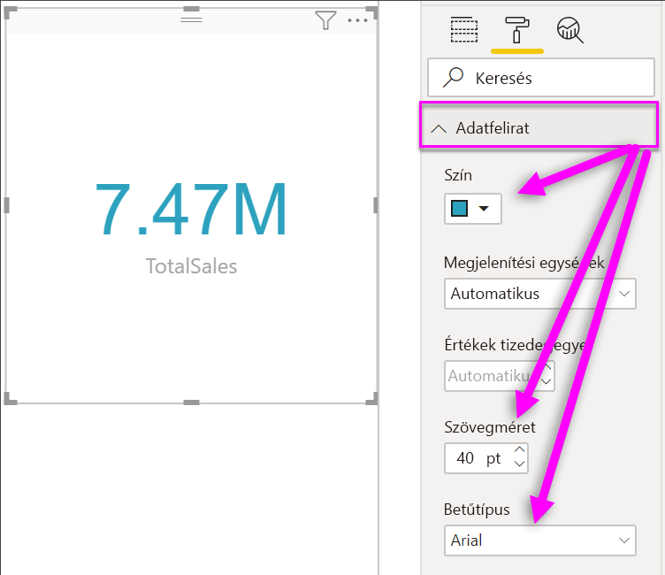
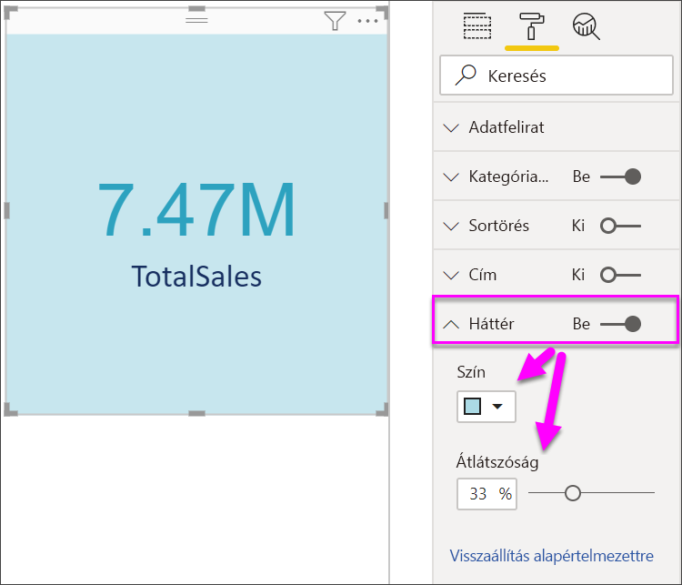

# Kártyavizualizációk létrehozása

[!INCLUDE[consumer-appliesto-nyyn](../includes/consumer-appliesto-nyyn.md)]

[!INCLUDE [power-bi-visuals-desktop-banner](../includes/power-bi-visuals-desktop-banner.md)]

Néha csupán egyetlen szám a legfontosabb, amit nyomon szeretne követni a Power BI-irányítópulton vagy -jelentésben, például az összesített értékesítés, az egy évre vetített piaci részesedés, vagy a lehetőségek száma összesen. Az ilyen típusú vizualizációkat *Kártyáknak* nevezzük. Csakúgy, mint szinte minden natív Power BI-vizualizáció, a Kártyák is a jelentésszerkesztővel vagy a Q&A-val hozhatók létre.

> [!NOTE]
> A jelentés egy Power BI-munkatárssal való megosztásához mindkettőjüknek Power BI Pro-licenccel kell rendelkezniük, vagy a jelentésnek egy Premium kapacitásban kell lennie.

## Előfeltétel

Ez az oktatóanyag a [Kiskereskedelmi elemzési minta PBIX-fájlt](https://download.microsoft.com/download/9/6/D/96DDC2FF-2568-491D-AAFA-AFDD6F763AE3/Retail%20Analysis%20Sample%20PBIX.pbix) használja

1. A menüsor bal felső részén válassza a **Fájl** \> **Megnyitás** lehetőséget
   
2. Keresse meg a **Kiskereskedelmi elemzési minta PBIX-fájlt**

1. Nyissa meg a **Kiskereskedelmi elemzési minta PBIX-fájlt** jelentésnézetben .

1. Kiválasztás  új oldal hozzáadásához.

## 1\. lehetőség Kártyák létrehozása a jelentésszerkesztővel

A kártya létrehozásának első módszere a jelentésszerkesztő használata a Power BI Desktopban.

1. Kezdjen egy üres jelentésoldalon, és válassza a **Store** \> **Open store count** (Üzlet > Nyitva lévő üzletek száma) mezőt.

    A Power BI létrehoz egy oszlopdiagramot ezzel az egy számmal.

   

2. A Vizualizációk panelen válassza a kártya ikont.

   

Ezzel sikeresen létrehozott egy kártyát a jelentésszerkesztővel. A következőkben egy másik lehetőséget mutatunk be a kártya létrehozására a Q&A kérdésmezője használatával.

## 2\. lehetőség Kártya létrehozása a Q&A kérdésmezőben
Másik lehetőségként a Q&A kérdésmezője is használható kártya létrehozására. A Q&A kérdésmező a Power BI Desktop jelentés nézetében érhető el.

1. Kezdje a műveletet egy üres jelentésoldalon

1. Az ablak felső részén válassza a **Kérdés feltevése** ikon. 

    A Power BI létrehoz egy kártyát és egy mezőt a kérdéshez. 

   

2. A kérdésmezőbe beírhatja például a „Tina összes értékesítése” szöveget.

    A kérdésmező javaslatokkal és újrafogalmazásokkal segíti, és végül megjeleníti az összesített számot.  

   

   

Ezzel sikeresen létrehozott egy kártyát a Q&A kérdésmezőjével. A további lépések a kártya igény szerinti formázását ismertetik.

## Kártya formázása
A címkék, szöveg, színét és egyebek módosításához több lehetőség áll rendelkezésre. A tanulás legjobb módja, ha létrehoz egy kártyát, és azután részletesebben is megismerkedik a Formázás ablaktábla lehetőségeivel. Bemutatunk néhányat az elérhető formázási lehetőségek közül. 

A Formázás panel a jelentések kártyáinak használatakor érhető el. 

1. Kezdő lépésként nyissa meg a Formázás ablaktáblát a festőhenger ikon kiválasztásával. 

    

2. A kártya kijelölése után bontsa ki az **Adatfelirat** elemet, majd módosítsa a színt, a méretet és a betűtípust. Ha több ezer üzlettel rendelkezik, akkor a **Megjelenítési egységek** használatával ezresével jelenítheti meg az üzleteket, és beállíthatja a tizedesjegyeket is. Például 125,8 e a 125 832,00 helyett.

    

3.  Bontsa ki a **Kategóriacímke** elemet, majd módosítsa a színt és a méretet.

    

4. Bontsa ki a **Háttér** elemet, és a csúszkát tolja „On” (Be) állásba.  Mostantól módosíthatja a háttérszínt és az átlátszóságot.

    

5. Folytassa is a formázási beállítások felfedezését, amíg a kártya pontosan olyan nem lesz, amilyennek kívánja. 

## Megfontolandó szempontok és hibaelhárítás
Ha a kereső mező nem látható, forduljon a rendszerszintű vagy a bérlői rendszergazdához.    

## Következő lépések
[Kombinált diagramok a Power BI-ban](power-bi-visualization-combo-chart.md)

[Vizualizációtípusok a Power BI-ban](power-bi-visualization-types-for-reports-and-q-and-a.md)
