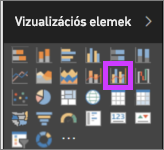
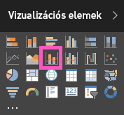

# Kombinált diagram a Power BI-ban

A kombinált diagramok olyan vizualizációk a Power BI-ban, amelyek egy vonaldiagramot és egy oszlopdiagramot kombinálnak egyetlen elemmé. A két diagram kombinációjával gyorsabban hasonlíthat össze adatokat.

A kombinált diagramoknak egy vagy két Y tengelyük lehet.

## Mikor érdemes kombinált diagramokat használni?

A kombinált diagramok használata nagyszerű választás, ha:

* van egy vonaldiagramja és egy oszlopdiagramja, amelyek ugyanazt az X tengelyt használják;

* több, különböző értéktartományú mértéket szeretne összehasonlítani;

* egyetlen vizualizáción szeretné bemutatni két mérték korrelációját;

* szeretné ellenőrizni, hogy egy mérték elér-e egy adott célt, amelyet egy másik mérték határoz meg;

* kevesebb helyet szeretne felhasználni a vásznon.

## Előfeltételek

A kombinált diagramok elérhetőek a Power BI szolgáltatásban és a Power BI Desktopban is. Ebben az oktatóanyagban a Power BI szolgáltatással fogunk kombinált diagramokat létrehozni. Ügyeljen rá, hogy rendelkezik megfelelő felhasználói hitelesítő adatokkal.

Nézze meg, hogyan hoz létre Will egy kombinált diagramot az Értékesítési és marketing mintát használva.

<iframe width="560" height="315" src="https://www.youtube.com/embed/lnv66cTZ5ho?list=PL1N57mwBHtN0JFoKSR0n-tBkUJHeMP2cP" frameborder="0" allowfullscreen></iframe>  

## Egyszerű, egytengelyes kombinált diagram létrehozása

A bemutatott lépések elvégzéséhez nyissa meg a Power BI szolgáltatást, és kapcsolódjon a **Kiskereskedelmi elemzési mintához**. Egy kombinált diagram létrehozásához jelentkezzen be a Power BI szolgáltatásba, majd válassza az **Adatok beolvasása** > **Minták** > **Kiskereskedelmi elemzési minta** > **Csatlakozás** lehetőséget. Ekkor megnyílik a **Kiskereskedelmi elemzési minta** irányítópultja.

1. A „Kiskereskedelmi elemzési minta” irányítópulton nyissa meg az **Áruházi értékesítések áttekintése** jelentést az **Összes áruház** csempe kiválasztásával.

1. Válassza a **Jelentés szerkesztése** elemet a jelentés Szerkesztési nézetben való megnyitásához.

1. Az oldal alján válassza a **+** jelent egy új jelentésoldal hozzáadásához.

1. Hozzon létre egy oszlopdiagramot, amely az idei év értékesítéseit és bruttó árrését jeleníti meg havi bontásban.

    1. A Mezők ablaktáblán válassza ki a **Sales** \> **This Year Sales** > **Érték** elemet.

    1. Húzza a **Sales** \> **Gross Margin This Year** elemet az **Érték** gyűjtőbe.

    1. Adja hozzá a **Time** \> **FiscalMonth** elemet a **Tengely** gyűjtőhöz.

        

1. A vizualizáció jobb felső sarkában válassza a három pontot, és válassza ki a **Rendezés szempontja > FiscalMonth** lehetőséget. A rendezési sorrend módosításához válassza ismét a három pontot, és válassza a **Növekvő rendezés** vagy a **Csökkenő rendezés** elemet.

1. Konvertálja az oszlopdiagramot kombinált diagrammá. Két kombinált diagram érhető el: **Vonal- és halmozott oszlopdiagram**, illetve **Vonal- és csoportosított oszlopdiagram**. Ha az oszlopdiagram van kiválasztva, a **Megjelenítések** ablaktáblán válassza a **Vonal- és fürtözött oszlopdiagram** lehetőséget.

    

1. A **Mezők** panelről húzza a **Sales** > **Last Year Sales** elemet a **Sorértékek** panelre.

    

    A kombinált diagramnak ekkor ehhez hasonlóan kell kinéznie:

    

## Kéttengelyes kombinált diagram létrehozása

Ebben a feladatban a bruttó árrést és az értékesítéseket fogjuk összehasonlítani.

1. Hozzon létre egy új vonaldiagramot, amely a **Gross Margin last year %** by **Month** (%-os bruttó árrés a tavalyi évben) értéket jeleníti meg havi bontásban. Válassza a három pontot, hogy **Hónap** és **Növekvő** sorrend szerint végezzen rendezést.

    

     A januári bruttó nyereség 35% volt, áprilisban egy 45%-os csúcs következett, amelyet júliusban egy esés, augusztusban pedig egy újabb csúcs követett. Az idei év értékesítéseire vonatkozóan is hasonló mintát fogunk látni, mint tavaly?

1. Adja hozzá a vonaldiagramhoz a **This Year Sales** > **Érték** és a **Last Year Sales** mezőt. A **Gross Margin Last Year %** (%-os bruttó árrés a tavalyi évben) skálája sokkal kisebb, mint a **Sales** (Értékesítések) skálája. Emiatt nehéz összehasonlítani őket.

    

1. Annak érdekében, hogy a vizualizáció könnyebben olvasható és értelmezhető legyen, alakítsa át a vonaldiagramot egy vonal- és halmozott oszlopdiagrammá.

    

1. Húzza át a **Tavalyi bruttó nyereség (%)** értéket az **Oszlopértékek** közül a **Sorértékek** közé. 

    

    A Power BI létrehoz két tengelyt, a szolgáltatás így különböző módokon méretezheti az adatkészleteket. A bal oldali az értékesítést méri dollárban, a jobb oldali pedig a százalékos arányt. És láthatjuk a választ a kérdésünkre: Igen, látunk egy hasonló mintát.

## Címek felvétele tengelyekhez

1. Válassza a festőhenger ikont  A Formázás ablaktábla megnyitása.

1. Az **Y tengely** kibontásához válassza a lefelé mutató nyilat.

1. Az **Y tengely (oszlop)** esetén adja meg az alábbi beállításokat:

    | Beállítás | Érték |
    | ------- | ----- |
    | Pozíció | Válassza a **Bal** elemet. |
    | Megjelenítési egységek | Válassza a **Millió** elemet. |
    | Cím | Kapcsolja **be** a csúszkát. |
    | Stílus | Válassza a **Csak a cím megjelenítése** elemet. |
    | Másodlagos megtekintése | Kapcsolja **be** a csúszkát.  Ez a kombinált diagramon belüli vonaldiagram formázási lehetőségeit jeleníti meg. |

1. Az **Y tengely (sor)** esetén adja meg az alábbi beállításokat:

    | Beállítás | Érték |
    | ------- | ----- |
    | Pozíció | Válassza a **Jobb** elemet. |
    | Cím | Kapcsolja **be** a csúszkát. |
    | Stílus | Válassza a **Csak a cím megjelenítése** elemet. |

    A kombinált diagram ekkor a dupla tengelyt címekkel együtt jeleníti meg.

    

1. Ha szeretné, módosíthatja a szöveg betűtípusát, méretét és színét, illetve más olyan beállításokat, amelyekkel javíthatja a diagram olvashatóságát és megjelenését.

Ezután az alábbiakat lehet érdemes elvégezni:

* [Kombinált diagram felvétele irányítópult-csempeként](../service-dashboard-tiles.md).

* [Mentse a jelentést](../service-report-save.md).

* [Jelentés nevének akadálymentesítése a fogyatékkal élők számára](../desktop-accessibility.md).

## Keresztkiemelés és keresztszűrés

Egy oszlop vagy egy sor kijelölése egy kombinált diagramon keresztkiemelést és keresztszűrést végez a jelentés oldalon lévő többi vizualizáción. Az alapértelmezett viselkedés módosításához használja a [Vizualizációs interakciók](../service-reports-visual-interactions.md) vezérlőt.

## Következő lépések

[Perecdiagramok a Power BI-ban](power-bi-visualization-doughnut-charts.md)

[Vizualizációtípusok a Power BI-ban](power-bi-visualization-types-for-reports-and-q-and-a.md)