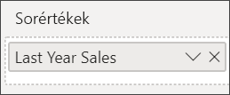

# Kombinált diagramok létrehozása és használata a Power BI-ban

[!INCLUDE[consumer-appliesto-nyyn](../includes/consumer-appliesto-nyyn.md)]

[!INCLUDE [power-bi-visuals-desktop-banner](../includes/power-bi-visuals-desktop-banner.md)]

A kombinált diagramok olyan vizualizációk a Power BI-ban, amelyek egy vonaldiagramot és egy oszlopdiagramot kombinálnak egyetlen elemmé. A két diagram kombinációjával gyorsabban hasonlíthat össze adatokat.

A kombinált diagramoknak egy vagy két Y tengelyük lehet.

## Mikor érdemes kombinált diagramokat használni?
A kombinált diagramok használata nagyszerű választás, ha:

* van egy vonaldiagramja és egy oszlopdiagramja, amelyek ugyanazt az X tengelyt használják;
* több, különböző értéktartományú mértéket szeretne összehasonlítani;
* egyetlen vizualizáción szeretné bemutatni két mérték korrelációját;
* szeretné ellenőrizni, hogy egy mérték elér-e egy adott célt, amelyet egy másik mérték határoz meg;
* kevesebb helyet szeretne felhasználni a vásznon.

> [!NOTE]
> A jelentés egy Power BI-munkatárssal való megosztásához mindkettőjüknek Power BI Pro-licenccel kell rendelkezniük, vagy a jelentésnek egy Premium kapacitásban kell lennie.

### Előfeltételek
Ez az oktatóanyag a [Kiskereskedelmi elemzési minta PBIX-fájlt](https://download.microsoft.com/download/9/6/D/96DDC2FF-2568-491D-AAFA-AFDD6F763AE3/Retail%20Analysis%20Sample%20PBIX.pbix) használja.

1. A menüsor bal felső részén válassza a **Fájl** > **Megnyitás** lehetőséget
   
2. Keresse meg a **Kiskereskedelmi elemzési minta PBIX-fájlt**

1. Nyissa meg a **Kiskereskedelmi elemzési minta PBIX-fájlt** jelentésnézetben .

1. Kiválasztás  új oldal hozzáadásához.

## Egyszerű, egytengelyes kombinált diagram létrehozása
Nézze meg, hogyan hoz létre Will egy kombinált diagramot az Értékesítési és marketing mintát használva.
   > [!NOTE]
   > Ez a videó a Power BI Desktop egy régebbi verzióját használja.
   > 
   > 
<iframe width="560" height="315" src="https://www.youtube.com/embed/lnv66cTZ5ho?list=PL1N57mwBHtN0JFoKSR0n-tBkUJHeMP2cP" frameborder="0" allowfullscreen></iframe>  

1. Induljon ki egy üres jelentésoldalból, majd hozzon létre egy oszlopdiagramot, amely az idei év értékesítéseit és bruttó árrését jeleníti meg havi bontásban.

    a.  A Mezők panelen válassza az **Értékesítés** \> **Idei értékesítések**  >  **Érték** elemet.

    b.  Húzza az **Értékesítés** \> **Idei bruttó nyereség** elemet az **Érték** gyűjtőbe.

    c. Válassza ki az **Idő** \> **Pénzügyi hónap** elemet, hogy hozzáadja a **Tengely** gyűjtőhöz.

    
5. Válassza a **More options** (...) lehetőséget a vizualizáció jobb felső sarkában, majd a **Rendezés szempontja > FiscalMonth** (Pénzügyi hónap) lehetőséget. A rendezési sorrend módosításához válassza ismét a három pontot, és válassza a **Növekvő rendezés** vagy a **Csökkenő rendezés** elemet. Ehhez a példához a **Rendezés növekvő sorrendben** van kiválasztva.

6. Konvertálja az oszlopdiagramot kombinált diagrammá. Két kombinált diagram érhető el: **Vonal- és halmozott oszlopdiagram**, illetve **Vonal- és csoportosított oszlopdiagram**. Ha az oszlopdiagram van kiválasztva, a **Megjelenítések** ablaktáblán válassza a **Vonal- és fürtözött oszlopdiagram** lehetőséget.

    
7. A **Mezők** ablaktábláról húzza az **Értékesítés** \> **Tavalyi értékesítések** elemet a **Sorértékek** gyűjtőbe.

   

   A kombinált diagramnak ekkor ehhez hasonlóan kell kinéznie:

   

## Kéttengelyes kombinált diagram létrehozása
Ebben a feladatban a bruttó árrést és az értékesítéseket fogjuk összehasonlítani.

1. Hozzon létre egy új vonaldiagramot, amely a **Gross Margin last year %** (%-os bruttó árrés a tavalyi évben) értéket jeleníti meg pénzügyi hónap a **FiscalMonth** szerinti bontásban. Válassza a három pontot, hogy **Hónap** és **Növekvő** sorrend szerint végezzen rendezést.  
A januári bruttó nyereség 35% volt, áprilisban egy 45%-os csúcs következett, amelyet júliusban egy esés, augusztusban pedig egy újabb csúcs követett. Az idei év értékesítéseire vonatkozóan is hasonló mintát fogunk látni, mint tavaly?

   
2. Adja hozzá a vonaldiagramhoz az **Idei értékesítés > Érték** és a **Múlt évi értékesítés** mezőt. A  **Gross Margin Last Year %** (%-os bruttó árrés a tavalyi évben) skálája sokkal kisebb, mint a **Sales** (Értékesítések) skálája, így nehéz összehasonlítani őket.      

   
3. Annak érdekében, hogy a vizualizáció könnyebben olvasható és értelmezhető legyen, alakítsa át a vonaldiagramot egy vonal- és halmozott oszlopdiagrammá.

   

4. Húzza át a **Tavalyi bruttó nyereség (%)** értéket az **Oszlopértékek** közül a **Sorértékek** közé. A Power BI létrehoz két tengelyt, ezzel lehetővé téve az adatkészletek eltérő skálázását: a bal tengely méri a pénzösszeget dollárban, a jobb pedig a százalékokat. És láthatjuk a választ a kérdésünkre: igen, látunk egy hasonló mintát.

       

## Címek felvétele tengelyekhez
1. Válassza a festőhenger ikont  A Formázás ablaktábla megnyitása.
1. Az **Y tengely** kibontásához válassza a lefelé mutató nyilat.
1. Az **Y tengely (Oszlop)** tulajdonságai között állítsa a **Pozíciót** **Balra**, a **Címet** **Be**, a **Stílust** **Csak a cím megjelenítése**, a **Megjelenítési egységeket** pedig **Millió** értékre.

   
4. Az **Y tengely (Oszlop)** területen görgessen lefelé, amíg meg nem jelenik a **Másodlagos mutatása** lehetőség. Mivel az Y tengelyekhez számos beállítás érhető el, esetleg mindkét görgetősávot használnia kell. A Másodlagos mutatása lehetőség a kombinált diagramon belüli vonaldiagram formázási lehetőségeit jeleníti meg.

   
5. Az **Y tengely (Sor)** részen hagyja a **Pozíció** tulajdonságot **Jobbra** értéken, kapcsolja **Be** a **Címet**, majd állítsa a **Stílust** **Csak a cím megjelenítése** értékre.

   A kombinált diagram ekkor már a címeikkel együtt jeleníti meg a két tengelyt.

   

6. Ha szeretné, módosíthatja a szöveg betűtípusát, méretét és színét, illetve más olyan beállításokat, amelyekkel javíthatja a diagram olvashatóságát és megjelenését.

Ezután az alábbiakat lehet érdemes elvégezni:

* [Kombinált diagram felvétele irányítópult-csempeként](../create-reports/service-dashboard-tiles.md).
* [Mentse a jelentést](../create-reports/service-report-save.md).
* [Jelentés nevének akadálymentesítése a fogyatékkal élők számára](../create-reports/desktop-accessibility-overview.md).

## Keresztkiemelés és keresztszűrés

Egy oszlop vagy egy sor kijelölése egy kombinált diagramon keresztkiemelést és keresztszűrést végez a jelentés oldalon lévő többi vizualizáción és viszont. Az alapértelmezett viselkedés módosításához használja a [Vizualizációs interakciók](../create-reports/service-reports-visual-interactions.md) vezérlőt.

## Következő lépések

[Perecdiagramok a Power BI-ban](power-bi-visualization-doughnut-charts.md)

[Vizualizációtípusok a Power BI-ban](power-bi-visualization-types-for-reports-and-q-and-a.md)
