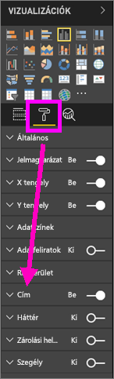
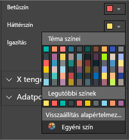
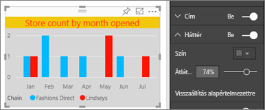
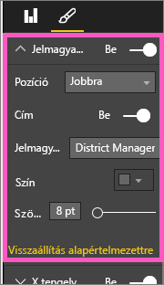
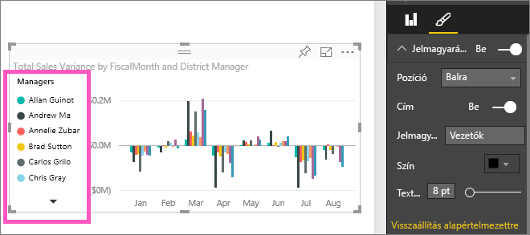

# A vizualizáció címeinek, jelmagyarázatainak és háttereinek testreszabása

Ezen oktatóanyag segítségével elsajátíthatja a vizualizációk testre szabására szolgáló különböző módszereket. A vizualizációk testreszabására számtalan lehetőség áll rendelkezésre. Ezek megismerésére a legjobb módszer a **Formázás** panel felfedezése (válassza a festőhenger ikont). Az első lépésekhez megtételéhez ez a cikk bemutatja, hogyan szabhatja testre a vizualizáció címét, jelmagyarázatát és hátterét.

Nem minden vizualizáció szabható testre. A részleteket a vizualizációk [teljes listájában](#visualization-types-that-you-can-customize) találja meg.

A videót 4:50-nél kezdve mutatja be a vizualizációk testreszabását:

<iframe width="560" height="315" src="https://www.youtube.com/embed/IkJda4O7oGs" frameborder="0" allowfullscreen></iframe>

Most az alábbi utasításokat követve megpróbálkozhat a saját adatai testre szabásával.

## Előfeltételek

- A Power BI szolgáltatás vagy a Power BI Desktop

- A Kiskereskedelmi elemzési minta jelentés

## Vizualizáció címének testreszabása jelentésekben

Hogy követni tudja a lépéseket, jelentkezzen be a [Power BI szolgáltatásba](https://app.powerbi.com), és nyissa meg a [Kiskereskedelmi elemzési minta](../sample-datasets.md) jelentést a [Jelentés szerkesztése](../service-interact-with-a-report-in-editing-view.md) nézetben.

> [!NOTE]
> Ha rögzít egy vizualizációt az irányítópulton, az irányítópult-csempévé válik. Maguk a csempék is testre szabhatók [új címekkel és alcímekkel és hiperhivatkozásokkal, és átméretezhetők](../service-dashboard-edit-tile.md).

1. Nyissa meg a **Kiskereskedelmi elemzési minta** **Új üzletek** oldalát.

1. Válassza a **Nyitva lévő üzletek száma nyitási hónap és üzletlánc szerint** fürtözött oszlopdiagramot.

1. A **Vizualizációk** panelen válassza a festőhenger ikont, hogy láthatóvá váljanak a formázási lehetőségek.

1. A **Cím** lehetőség kiválasztásával bontsa ki az adott szakaszt.

   

1. Állítsa át a **Cím** kapcsolót a **Be** állásba.

   

1. A cím módosításához írja be az *Üzletek száma nyitási hónap szerint* szöveget a **Címszöveg** mezőbe.

1. Módosítsa a **Betűszínt** narancssárgára, és a **Háttérszínt** citromsárgára.

    1. Válassza a legördülő listát, és válasszon egy színt a **Téma színei**, **Legutóbbi színek** vagy **Egyéni szín** közül.

        

    1. A színablak bezárásához válassza a legördülő menüt.

       Mentse a végrehajtott módosításokat.

       Ha vissza szeretné vonni a módosításokat, visszatérhet az alapértelmezett színekhez a színablak **Visszaállítás alapértelmezettre** lehetőségét választva.

1. Növelje a betűméretet a **12 pt** értékre.

1. A diagram címének utolsó testre szabásaként igazítsa azt a vizualizáció közepére.

    

Az oktatóanyag ezen pontján a fürtözött oszlopdiagram címe az alábbihoz hasonló:

Mentse a végrehajtott módosításokat és haladjon tovább a következő részre.

Az összes módosítás visszavonásához válassza a **Visszaállítás alapértelmezettre** lehetőséget a **Cím** testreszabási panel alján.

## Vizualizáció hátterek testreszabása

Ugyanazt a fürtözött oszlopdiagramot kiválasztva bontsa ki a **Háttér** beállításokat.

1. Állítsa **Be** értékre a **Háttér** kapcsolót.

1. Válassza a legördülő listát, és válasszon egy szürke árnyalatot.

1. Módosítsa az **Átlátszóságot** **74%** -ra.

Az oktatóanyag ezen pontján a fürtözött oszlopdiagram háttere az alábbihoz hasonló:

Mentse a végrehajtott módosításokat és haladjon tovább a következő részre.

Az összes módosítás visszavonásához válassza a **Visszaállítás alapértelmezettre** lehetőséget a **Háttér** testreszabási panel alján.

## Vizualizáció jelmagyarázatának testreszabása

1. Nyissa meg az **Overview** (Áttekintés) jelentésoldalt, és válassza ki a **Total Sales Variance by FiscalMonth and District Manager** (Teljes értékesítési szórásnégyzet pénzügyi hónap és kerületi menedzser szerint) diagramot.

1. A **Vizualizáció** lapon a festőhenger ikonra kattintva nyissa meg a Formátum panelt.

1. Bontsa ki a **Jelmagyarázat** beállításait:

      

1. Állítsa a **Jelmagyarázat** kapcsolót **Be** helyzetbe.

1. Helyezze át a jelmagyarázatot a vizualizáció bal oldalára.

1. Adjon címet a jelmagyarázathoz a **Cím** lehetőség **Bekapcsolásával**.

1. A **Jelmagyarázat neve** mezőbe írja be a *Vezetők* nevet.

Az oktatóanyag ezen pontján a fürtözött oszlopdiagram jelmagyarázata az alábbihoz hasonló:

Mentse a végrehajtott módosításokat és haladjon tovább a következő részre.

Az összes módosítás visszavonásához válassza a **Visszaállítás alapértelmezettre** lehetőséget a **Jelmagyarázat** testreszabási panel alján.

## Testre szabható vizualizációtípusok

Az alábbi lista a vizualizációkat és az azokhoz elérhető testreszabási lehetőségeket foglalja össze:

| Vizualizáció | Cím | Háttér | Jelmagyarázat |
|:--- |:--- |:--- |:--- |
| Terület | igen | igen |igen |
| Sáv | igen | igen |igen |
| Kártya | igen | igen |n.a. |
| Többsoros kártya | igen | igen | n.a. |
| Oszlop | igen | igen | igen |
| Kombinált | igen | igen | igen |
| Gyűrű | igen | igen | igen |
| Kartogram | igen | igen | igen |
| Tölcsér | igen | igen | n.a. |
| Kijelző | igen | igen | n.a. |
| KPI | igen | igen | n.a. |
| Vonal | igen | igen | igen |
| Térkép | igen | igen | igen |
| Mátrix | igen | igen | n.a. |
| Torta | igen | igen | igen |
| Pont | igen | igen | igen |
| Szeletelő | igen | igen | n.a. |
| Táblázat | igen | igen | n.a. |
| Szövegmező | nem | igen | n.a. |
| Fatérkép | igen | igen | igen |
| Vízesés | igen | igen | igen |

## Következő lépések

- [X és Y tengely tulajdonságainak testreszabása](power-bi-visualization-customize-x-axis-and-y-axis.md)

- [Bevezetés a színformázás és tengelytulajdonságok használatába](service-getting-started-with-color-formatting-and-axis-properties.md)

- [A Power BI szolgáltatás alapfogalmai felhasználók számára](../consumer/end-user-basic-concepts.md)

További kérdései vannak? [Kérdezze meg a Power BI közösségét](https://community.powerbi.com/)
