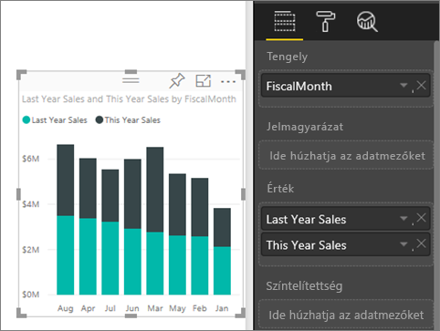
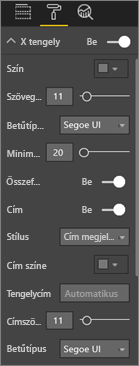
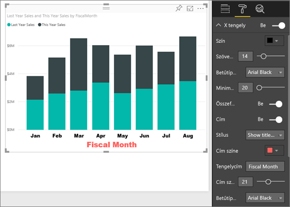
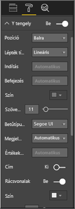
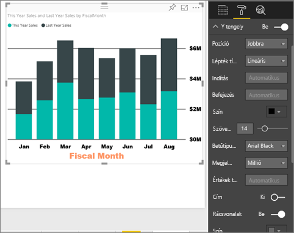
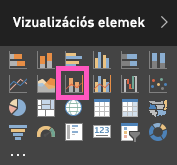
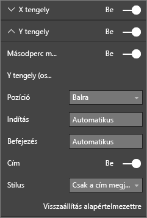

# X és Y tengely tulajdonságainak testreszabása

Az oktatóanyag segítségével sokféle módot elsajátíthat a vizualizációk X és Y tengelyének testreszabására. Nem minden vizualizációnak vannak tengelyei. A tortadiagramoknak például nincs tengelyük. A testreszabási lehetőségek pedig vizualizációnként változnak. Több beállítási lehetőség van annál, amennyit egyetlen cikkben bemutathatnánk, így a leggyakrabban használt tengelyek testreszabási lehetőségeit fogjuk átvenni, hogy Ön kényelmesen elsajátíthassa a vizualizációk **Formázás** paneljének használatát a Power BI-jelentések vásznán.  

> [!NOTE]
> A tartalom a Power BI szolgáltatásra és a Power BI Desktopra is vonatkozik. Azok a testreszabási lehetőségek, amelyek a **Formázás** (festőhenger ) ikon kiválasztásával érhetők el, a Power BI Desktopban is elérhetők.

Figyelje meg, hogyan szabja testre Amanda az X és az Y tengelyt. Különböző módszereket mutat be az összefűzés szabályozására a részletesség növelése és csökkentése során.

<iframe width="560" height="315" src="https://www.youtube.com/embed/9DeAKM4SNJM" frameborder="0" allowfullscreen></iframe>

## Előfeltételek

- A Power BI szolgáltatás

- Kiskereskedelmi elemzési mintajelentés

## Vizualizáció X és Y tengelyének testreszabása jelentésekben

Hogy követni tudja a lépéseket, jelentkezzen be a [Power BI szolgáltatásba](https://app.powerbi.com), és nyissa meg a [Kiskereskedelmi elemzési minta](../sample-datasets.md) jelentést a [Jelentés szerkesztése](../service-interact-with-a-report-in-editing-view.md) nézetben.

### Halmozott oszlopdiagramos vizualizáció létrehozása

A vizualizációt először létre kell hoznia, hogy testre szabhassa.

1. A Power BI szolgáltatásban bontsa ki a **Saját munkaterületet**.

1. Görgessen lefelé, és válassza ki a **Kiskereskedelmi elemzési mintát** az **Adathalmazok** listájából.

1. A **Vizualizációk** panelen válassza a halmozott oszlopdiagram ikont.

    

1. Az X tengely értékeinek beállításához válassza a **Mezők** panelről az **Idő** > **Pénzügyi hónap** elemet.

1. Az Y tengely értékeinek beállításához a **Mezők** panelről válassza az **Értékesítések** > **Múlt évi értékesítések** és az **Értékesítések** > **Folyó évi értékesítések** > **Érték** elemet.

    

### Az X tengely testreszabása

Most már testre szabhatja az X tengelyt.

1. A **Vizualizációk** panelen válassza a **Formázás** (festőhenger ikon ) lehetőséget a testreszabási beállítások megjelenítéséhez.

1. Bontsa ki az X tengely beállításait.

   

1. Állítsa az **X tengely** csúszkát **Be** helyzetbe.

    

    Az X tengely kikapcsolásának az egyik lehetséges oka az lehet, hogy ezzel helyet hagyjunk még több adatnak.

1. Formázza a szöveg színét, méretét és betűtípusát:

    - **Szín**: Válassza a feketét

    - **Szövegméret**: Adja meg a *14* értéket

    - **Betűtípus**: Válassza az **Arial Black** típust

1. Húzza a **Cím** csúszkát **Be** állásba az X tengely nevének megjelenítéséhez. Ez ebben az esetben **Pénzügyi hónap**.

1. Formázza a cím szövegének színét, méretét és betűtípusát:

    - **Cím színe**: Válassza a narancssárgát

    - **Tengelycím**: Írja be a *Pénzügyi hónap* nevet

    - **Cím szövegmérete**: Adja meg a *21* értéket

A testreszabás befejezése után a halmozott oszlopdiagram az alábbihoz lesz hasonló:

Mentse a végrehajtott módosításokat és haladjon tovább a következő részre.

Az összes módosítás visszavonásához válassza a **Visszaállítás alapértelmezettre** lehetőséget az **X tengely** testreszabási panel alján.

### Az Y tengely testreszabása

Most az Y tengelyt szabhatja testre.

1. Bontsa ki az Y tengely beállításait.

   

1. Állítsa az **Y tengely** csúszkát **Be** helyzetbe.  

    

    Az Y tengely kikapcsolásának az egyik lehetséges oka az lehet, hogy ezzel helyet hagyjunk még több adatnak.

1. Állítsa az Y tengely **Helyzetét** a **Jobb** oldalra.

1. Formázza a szöveg színét, méretét és betűtípusát:

    - **Szín**: Válassza a feketét

    - **Szövegméret**: Adja meg a *14* értéket

    - **Betűtípus**: Válassza az **Arial Black** típust

1. A **Megjelenítési egység** értéket állítsa **milliókra**, az **Érték tizedesjegyeit** pedig *0*-ra.

1. Ennél a vizualizációnál az Y tengely címe nem tesz hozzá a vizualizációhoz, így hagyja a **Cím** beállítást **kikapcsolva**.  

1. Emelje ki a rácsvonalat a szín módosításával és a vonalvastagság növelésével:

    - **Szín**: Válassza a sötétszürkét

    - **Vonalvastagság**: Adja meg a *2* értéket

A testreszabás elvégzése után az oszlopdiagramnak a következőhöz hasonlóan kell kinéznie:

## Dupla Y tengellyel rendelkező vizualizációk testreszabása

Először létrehozunk egy kombinált diagramot, amely azt ábrázolja, hogy a boltok számának milyen hatása van az értékesítésekre. Ez a diagram ugyanaz, amelyet a [Kombinált diagram oktatóanyagban](power-bi-visualization-combo-chart.md) létrehoztunk. Ez után megformázhatja a dupla Y tengelyt.

### Két Y tengellyel rendelkező diagram létrehozása

1. Hozzon létre egy új vonaldiagramot, amely az **Értékesítés > Tavalyi bruttó nyereség (%)** adatokat követi **Idő > Pénzügyi hónap** szerint.

    

    > [!NOTE]
    > A hónapok szerinti rendezéshez a [Rendezés más feltételek alapján](../consumer/end-user-change-sort.md#other) szakasz nyújt segítséget.

    Januárban a százalékos bruttó nyereség 35% volt, áprilisban elérte a 45%-os csúcsot, júniusban csökkent, majd augusztusban újabb csúcsot ért el. Az idei év értékesítéseire vonatkozóan is hasonló mintát fogunk látni, mint tavaly?

1. Adja hozzá a vonaldiagramhoz az **Idei értékesítés > Érték** és a **Múlt évi értékesítés** mezőt.

    

    A **Tavalyi bruttó nyereség (%)** (a **0%-os** rácsvonal mellett futó kék vonal) mérete sokkal kisebb, mint az **Értékesítés** mérete, ami megnehezíti az összehasonlítást. Az Y tengely címkéjének százalékos értékei pedig nevetségesek.

1. Annak érdekében, hogy a vizualizáció könnyebben olvasható és értelmezhető legyen, alakítsa át a vonaldiagramot egy vonal- és halmozott oszlopdiagrammá.

   

1. Húzza át a **Tavalyi bruttó nyereség (%)** értéket az **Oszlopértékek** közül a **Sorértékek** közé.

    

    Így megkapta az első szakaszban létrehozott halmozott oszlopdiagramot, egy azt átfedő vonaldiagrammal. Tetszés szerint a fentebb ismertetett módon a tengelyek betűszíne és betűmérete is formázható.

   

   A Power BI két Y tengelyt hoz létre, a szolgáltatás így különböző léptékben kezelheti az adathalmazokat. A bal oldali dollárban mér, a jobb oldali pedig a százalékban.

### A másodlagos Y tengely formázása

1. A **Vizualizációk** ablaktáblán válassza a festőhenger ikont, a formázási lehetőségek megjelenítéséhez.

1. Bontsa ki az Y tengely beállításait.

1. Görgessen lefelé, amíg meg nem találja a **Másodlagos mutatása** beállítást. Ellenőrizze, hogy ez **Be** van-e kapcsolva.

   

1. (Opcionális) Szabja testre a két tengelyt. Ha átállítja akár az oszloptengely, akár a sortengely **Pozíció** beállítását, akkor a két tengely helyet cserél.

### Címek hozzáadása a tengelyekhez

Ilyen összetett vizualizációk esetében sokat segíthet, ha címeket adunk a tengelyeknek.  A címek segítségével a munkatársai jobban megérthetik a vizualizáció által elmondott történetet.

1. Állítsa a **Cím** lehetőséget **Be** állásba az **Y tengely (Oszlop)** és az **Y tengely (Sor)** esetén is.

1. A **Stílus** beállításnál mindkettőhöz válassza a **Csak a cím megjelenítése** lehetőséget.

   

1. A kombinált diagram ekkor a dupla tengelyt címekkel együtt jeleníti meg.

   

További információ: [Tippek és trükkök a színformázáshoz a Power BI-ban](service-tips-and-tricks-for-color-formatting.md).

## Megfontolandó szempontok és hibaelhárítás

Ha a jelentés tulajdonosa az X tengelyt adat típusúként kategorizálta, akkor megjelenik a **Típus** beállítás, amelynél a folyamatos és a kategorikus beállítások közül lehet választani.

## Következő lépések

- [Vizualizációk a Power BI-jelentésekben](power-bi-report-visualizations.md)

- [A vizualizáció címeinek, jelmagyarázatainak és háttereinek testreszabása](power-bi-visualization-customize-title-background-and-legend.md)

- [Bevezetés a színformázás és tengelytulajdonságok használatába](service-getting-started-with-color-formatting-and-axis-properties.md)

- [A Power BI szolgáltatás alapfogalmai felhasználók számára](../consumer/end-user-basic-concepts.md)

További kérdései vannak? [Kérdezze meg a Power BI közösségét](http://community.powerbi.com/)
