# X és Y tengely tulajdonságainak testreszabása

[!INCLUDE [power-bi-visuals-desktop-banner](../includes/power-bi-visuals-desktop-banner.md)]

Az oktatóanyag segítségével elsajátíthatja a vizualizációk X és Y tengelyének testreszabását lehetővé tevő módok végrehajtását. Nem minden vizualizációnak vannak tengelyei. A tortadiagramoknak például nincs tengelyük. A testreszabási lehetőségek pedig vizualizációnként változnak. Több beállítási lehetőség van annál, amennyit egyetlen cikkben ismertetni lehetne, így csak a leggyakrabban használt testreszabási lehetőségeket fogjuk átvenni, hogy Ön elsajátíthassa a vizualizációk **Formázás** paneljének használatát a Power BI-jelentések vásznán.  

Figyelje meg, ahogy Amanda testre szabja az X és Y tengelyt. Különböző módszereket mutat be az összefűzés szabályozására a részletesség növelése és csökkentése során.

> [!NOTE]
> A videó készítése során a Power BI egy régebbi verzióját használták.

<iframe width="560" height="315" src="https://www.youtube.com/embed/9DeAKM4SNJM" frameborder="0" allowfullscreen></iframe>

## Előfeltételek

- Power BI Desktop

- [Kiskereskedelmi elemzési minta ](https://download.microsoft.com/download/9/6/D/96DDC2FF-2568-491D-AAFA-AFDD6F763AE3/Retail%20Analysis%20Sample%20PBIX.pbix)

## Új vizualizáció hozzáadása

A vizualizációt először létre kell hoznia, hogy testre szabhassa.

1. A Power BI Desktopban nyissa meg a Kiskereskedelmi elemzési mintát.  

2. Kattintson alul a sárga plusz ikonra egy új oldal hozzáadásához. 

    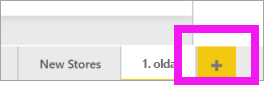

1. A **Vizualizációk** panelen válassza a halmozott oszlopdiagram ikont. Ezzel megjelenik egy üres sablon a jelentés vásznán.

    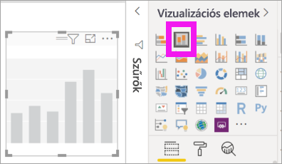

1. Az X tengely értékeinek beállításához válassza a **Mezők** panel **Idő** > **FiscalMonth** elemét.

1. Az Y tengely értékeinek beállításához a **Mezők** panelről válassza az **Értékesítések** > **múlt évi értékesítések** és az **Értékesítések** > **idei értékesítések** > **Érték** elemet.

    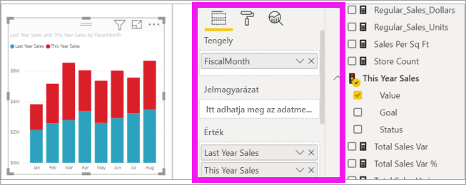

    Most már testre szabhatja az X tengelyt. A Power BI szinte korlátlan lehetőségeket biztosít a vizualizációk formázásához. 

## Az X tengely testreszabása
Az X tengely számos jellemzője testre szabható. Hozzáadhat és módosíthat adatcímkéket és az X tengely címét. A kategóriáknál módosítható a sávok, oszlopok, vonalak és területek szélessége, mérete és kitöltése, az értékeknél pedig módosíthatók a megjelenítési egységek, a tizedesjegyek és a rácsvonalak. Az alábbi példa egy oszlopdiagram testreszabását mutatja be. Hozzáadunk néhány testreszabási elemet, hogy megismerkedhessen pár lehetőséggel, a többit pedig önállóan fedezhesse fel.

### Az X tengely címkéinek testreszabása
Az X tengely címkéi a diagramban az oszlopok alatt jelennek meg. Jelenleg halványszürkék, kicsik és nehezen olvashatók. Ezt fogjuk most módosítani.

1. A **Vizualizációk** panelen válassza a **Formázás** (festőhenger ikon  ) lehetőséget a testreszabási beállítások megjelenítéséhez.

2. Bontsa ki az X tengely beállításait.

   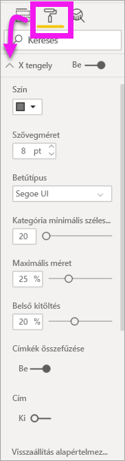

3. Állítsa az **X tengely** csúszkáját **Be** helyzetbe.

    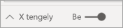

    Az X tengelyt akkor lehet érdemes **Ki** helyzetbe kapcsolni, ha a vizualizáció címkék nélkül is magától értetődő, vagy ha a jelentésoldal zsúfolt, és helyet szeretne rajta felszabadítani, hogy több adatot lehessen megjeleníteni.

4. Formázza a szöveg színét, méretét és betűtípusát:

    - **Szín**: Válassza a feketét

    - **Szövegméret**: Adja meg a *14* értéket

    - **Betűtípus**: Válassza az **Arial Black** típust

    - **Belső kitöltés**: Adjon meg *40%* -ot

        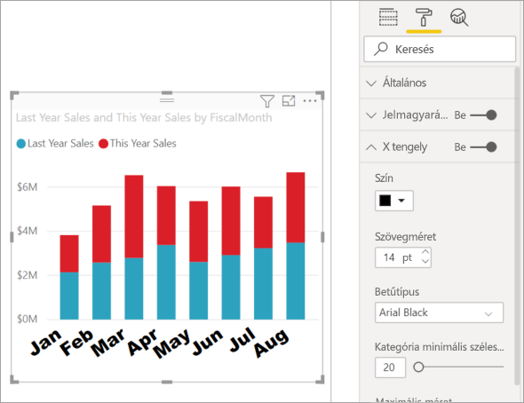
    
5. Tegyük fel, hogy változtatni szeretne az X tengely feliratainak döntött megjelenítésén. Erre több lehetősége is van. 
    - Csökkentse a szöveg méretét 14-esnél kisebbre.
    - Növelje a vizualizáció méretét. 
    - Jelenítsen meg kevesebb oszlopot, és adjon hozzá egy görgetősávot a **Minimális kategóriaszélesség** növelésével. 
    
    Itt a második lehetőséget választottuk, és az egyik méretezési csúszka elhúzásával növeltük a vizualizáció szélességét. Most már elfér rajta a 14 pontos szöveg, amit így nem kell döntve vagy görgetősávval megjeleníteni. 

   

### Az X tengely címének testreszabása
Ha az X tengely címe **be** van kapcsolva, akkor a cím az X tengely címkéi alatt jelenik meg. 

1. Először is kapcsolja **be** az X tengely címkéjét.  

    

    Rögtön észre fogja venni, hogy a vizualizáció X tengelyének mostantól van egy alapértelmezett címe.  Ez ebben az esetben **Pénzügyi hónap**.

   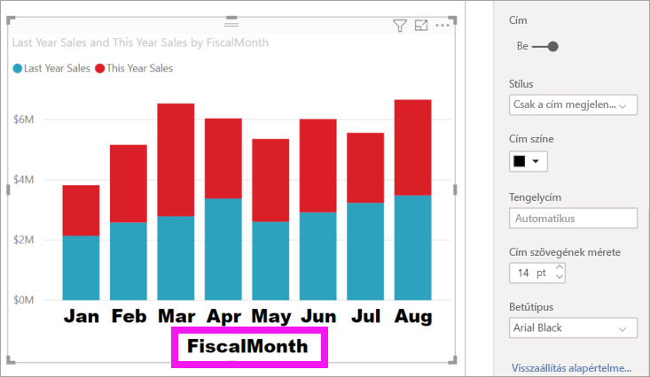

1. Formázza a cím szövegének színét, méretét és betűtípusát:

    - **Cím színe**: Válassza a narancssárgát

    - **Tengelycím**: Írja be a *Pénzügyi hónap* kifejezést (szóközzel)

    - **Cím szövegmérete**: Adja meg a *18*-at

    A testreszabás befejezése után a halmozott oszlopdiagram nagyjából így néz ki:

    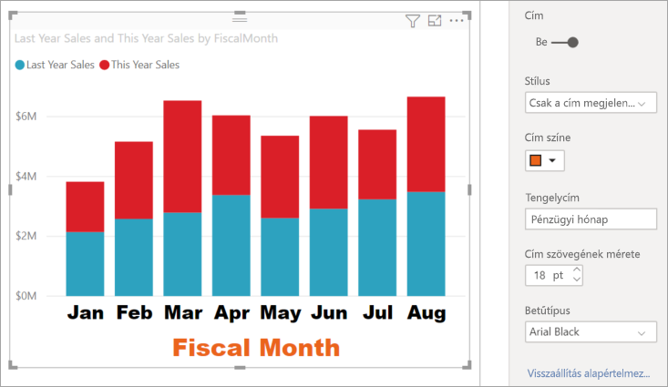

1. Mentse a végrehajtott módosításokat és haladjon tovább a következő részre. Az összes módosítás visszavonásához válassza a **Visszaállítás alapértelmezettre** lehetőséget az **X tengely** testreszabási panel alján. Most az Y tengelyt szabhatja testre.

## Az Y tengely testreszabása
Az Y tengely számos jellemzője testre szabható. Hozzáadhat és módosíthat adatcímkéket, az Y tengely címét és rácsvonalakat. Az értékeknél módosíthatók a megjelenítési egységek, a tizedesjegyek, a kezdő- és végpontok, a kategóriáknál pedig módosítható a sávok, oszlopok, vonalak és területek szélessége, mérete és kitöltése. 

Az alábbi példában folytatjuk az oszlopdiagram testreszabását. Végrehajtunk néhány módosítást, hogy megismerkedhessen pár lehetőséggel, a többit pedig önállóan fedezhesse fel.

### Az Y tengely címkéinek testreszabása
Alapértelmezés szerint az Y tengely címkéi a bal oldalon jelennek meg. Jelenleg halványszürkék, kicsik és nehezen olvashatók. Ezt fogjuk most módosítani.

1. Bontsa ki az Y tengely beállításait.

   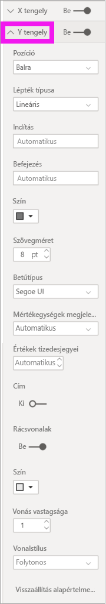

1. Állítsa az **Y tengely** csúszkát **Be** helyzetbe.  

    

    Az Y tengely kikapcsolásának az egyik lehetséges oka az lehet, hogy ezzel helyet hagyjunk még több adatnak.

1. Formázza a szöveg színét, méretét és betűtípusát:

    - **Szín**: Válassza a feketét

    - **Szövegméret**: Adja meg a *10*-et

    - **Megjelenítési egységek**: Válassza a **Millió** lehetőséget

    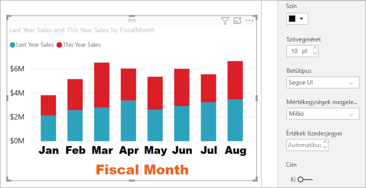

### Az Y tengely címének testreszabása
Ha az Y tengely címe **be** van kapcsolva, akkor a cím az Y tengely címkéi mellett jelenik meg. Ennél a vizualizációnál az Y tengely címe nem tesz hozzá a vizualizációhoz, így hagyja a **Cím** beállítást **kikapcsolva**. Az oktatóanyag későbbi részében majd Y-tengelycímeket is hozzá fogunk adni egy kéttengelyes vizualizációhoz. 

### A rácsvonalak testreszabása
Emelje ki a rácsvonalat a szín módosításával és a vonalvastagság növelésével:

- **Szín**: Válassza a narancssárgát

- **Vonalvastagság**: Adja meg a *2* értéket

A testreszabás elvégzése után az oszlopdiagramnak a következőhöz hasonlóan kell kinéznie:

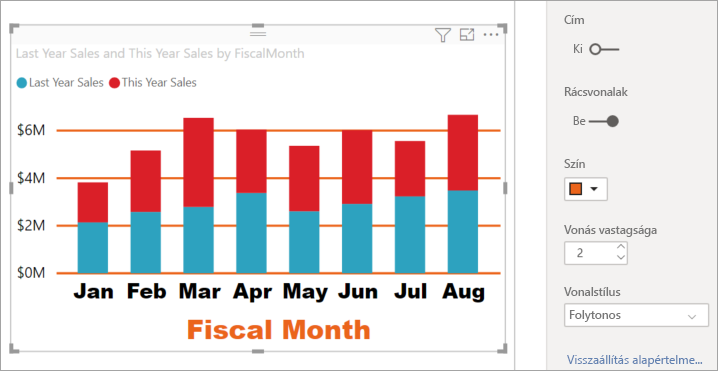

## Dupla Y tengellyel rendelkező vizualizációk testreszabása

Egyes vizualizációk esetében hasznos lehet, ha két Y tengely van. Ilyenek például a kombinált diagramok. Mielőtt formázhatnánk a dupla Y tengelyt, létrehozunk egy kombinált diagramot, amely az értékesítések és a bruttó árrések alakulását hasonlítja össze.  

### Két Y tengellyel rendelkező diagram létrehozása

1. Jelölje ki az oszlopdiagramot, majd módosítsa a típusát *Vonal- és halmozott oszlopdiagramra*. Ez a típusú vizualizáció egyetlen vonaldiagram-értéket és több halmozható oszlopértéket támogat. 

    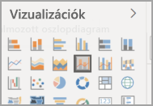
   

2. Húzza át az **Értékesítés** > **tavalyi bruttó nyereség (%)** értékét a Mezők panelről a **Sorértékek** közé.

    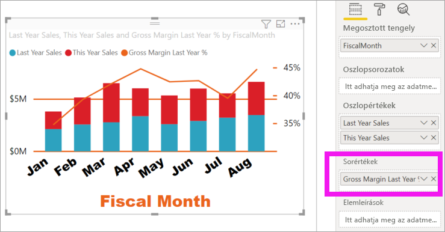

    
3. Formázza újra a vizualizációt úgy, hogy eltávolítja az X tengely döntött címkéit. 

   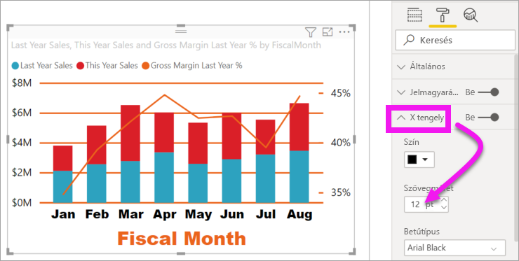

   A Power BI létrehoz két Y tengelyt, amelyek értékei külön-külön méretezhetők. A bal oldali tengely az értékesítést méri dollárban, a jobb oldali pedig a bruttó árrés százalékos arányát.

### A második Y tengely formázása
Mivel egy olyan vizualizáción kezdtünk dolgozni, amelynek az eredeti Y tengelye formázva volt, a Power BI a második Y tengely létrehozásakor is megőrizte a beállításokat. Ezeket azonban módosíthatjuk. 

1. A **Vizualizációk** ablaktáblán válassza a festőhenger ikont, a formázási lehetőségek megjelenítéséhez.

1. Bontsa ki az Y tengely beállításait.

1. Görgessen lefelé, amíg meg nem találja a **Másodlagos mutatása** beállítást. Ellenőrizze, hogy ez **Be** van-e kapcsolva. A másodlagos Y tengely a vonaldiagramot jelöli.

   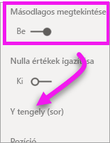

1. (Opcionális) Testre szabhatja a két tengely színét, méretét és megjelenítési egységeit. Ha átállítja akár az oszloptengely, akár a sortengely **Pozíció** beállítását, akkor a két tengely helyet cserél.

### Címek hozzáadása a tengelyekhez

Az összetett vizualizációk esetében sokat segíthet, ha címeket adunk a tengelyeknek.  A címek segítségével a munkatársai jobban megérthetik a vizualizáció által elmondott történetet.

1. Állítsa a **Cím** lehetőséget **Be** állásba az **Y tengely (Oszlop)** és az **Y tengely (Sor)** esetén is.

1. A **Stílus** beállításnál mindkettőhöz válassza a **Csak a cím megjelenítése** lehetőséget.

   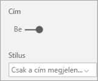

1. A kombinált diagram ekkor a dupla tengelyt címekkel együtt jeleníti meg.

   

1. Formázza meg a címeket. Ebben a példában az egyik címet rövidítettük, és mindkettőnek csökkentettük a betűméretét. 
    - Betűméret: **9**
    - Lerövidítettük az első Y tengely (az oszlopdiagram) **tengelycímét**: Tavalyi és idei év értékesítései

    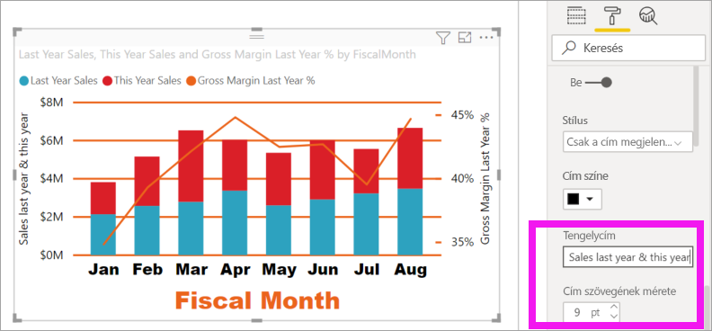

További információkért lásd a [Tippek és trükkök a színformázáshoz a Power BI-ban](service-tips-and-tricks-for-color-formatting.md), illetve [A vizualizáció címeinek, jelmagyarázatainak és háttereinek testreszabása](power-bi-visualization-customize-title-background-and-legend.md) cikket. Hamarosan újabb frissítések is elérhetővé válnak a címek formázásához kapcsolódóan. 

## Következő lépések

- [Vizualizációk a Power BI-jelentésekben](power-bi-report-visualizations.md)

További kérdései vannak? [Kérdezze meg a Power BI közösségét](https://community.powerbi.com/)
