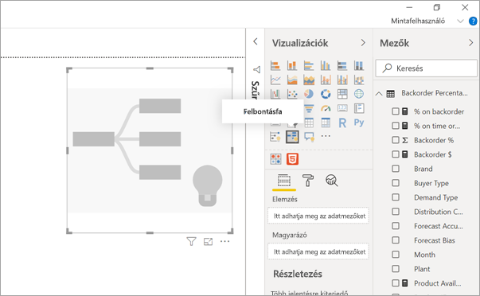
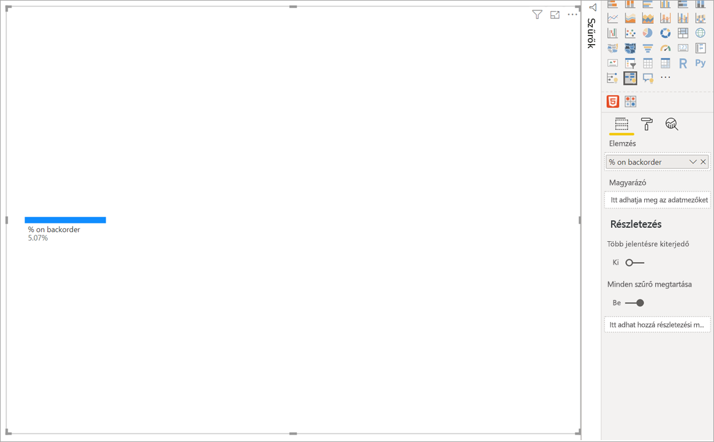
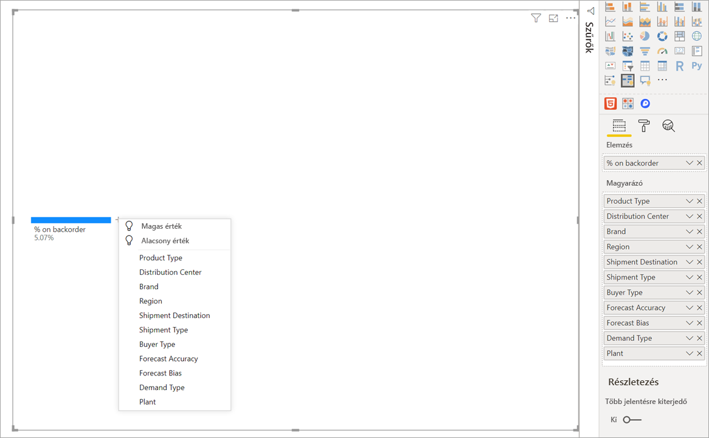
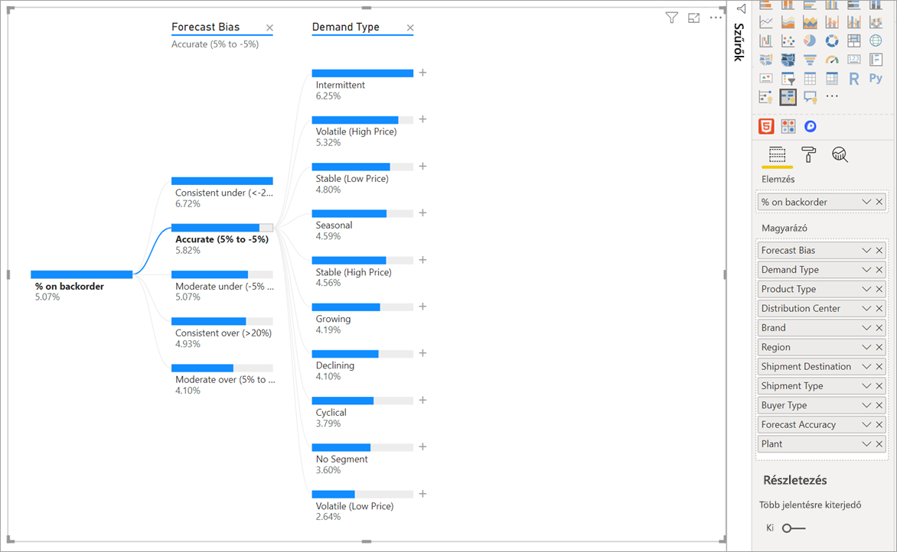
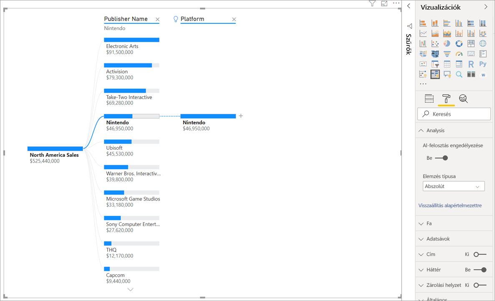
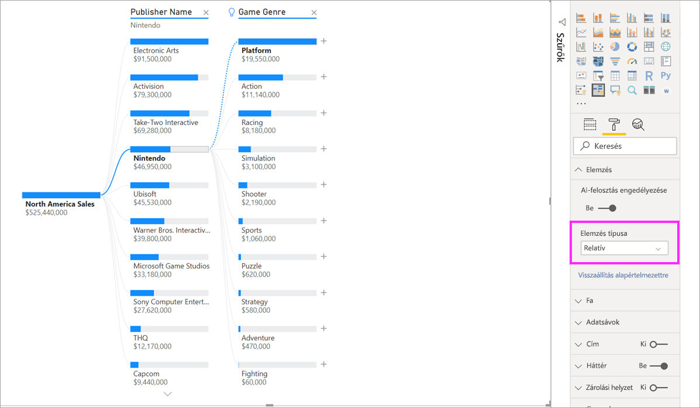
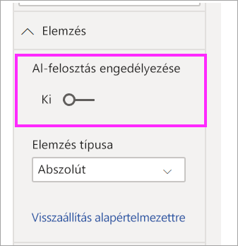

# A felbontásfa-vizualizáció használata a Power BI-ban (előzetes verzió)
[!INCLUDE [power-bi-visuals-desktop-banner](../includes/power-bi-visuals-desktop-banner.md)]

A felbontásfa-vizualizáció sokdimenziós adatok képi megjelenítését teszi lehetővé a Power BI-ban. Automatikusan összesíti az adatokat, és lehetővé teszi a lefúrást a dimenziók tetszőleges sorrendjében. Ugyanakkor mesterséges intelligenciával (AI-val) rendelkező vizualizáció, tehát meg lehet kérni a következő dimenzió megkeresésére, amelybe egy adott feltétel alapján le kell fúrni. Ez az alkalmi felderítés és az alapvető okok elemzése értékes eszközévé teszi.

Ez az oktatóanyag két példát használ:

- Egy ellátási lánc esetét, amely a vállalatnál a megrendelések alapján hiányzó termékek százalékos arányát elemzi.  
- Egy értékesítési esetet, amely videojátékok értékesítését bontja le számos tényező, például a játék műfaja és kiadója alapján.

## Első lépések
Válassza a felbontásfa ikonját a Vizualizációk panelen.

A vizualizáció kétféle bemenő információt igényel.

**Elemzés** – az elemezni kívánt metrika. Ennek metrikának vagy összesítésnek kell lennie.  
**Magyarázat ez alapján:** – egy vagy több dimenzió, amelyekbe le szeretne fúrni.

Amikor a mértéket a mezőgyűjtőbe húzza, a vizualizáció frissül, és megmutatja az összesített mértéket. Az alábbi példa a hiánylistán szereplő termékek átlagos százalékos arányát (5,07%) jeleníti meg. 

A következő lépés annak az egy vagy több dimenziónak a megadása, amelyekbe le szeretne fúrni. Ezeket a mezőket vegye a **Magyarázat ez alapján:** gyűjtőbe. Figyelje meg a gyökércsomópont mellett megjelenő pluszjelet. A + választásával megadhatja, hogy melyik mezőbe szeretne lefúrni (a mezőkbe tetszőleges sorrendben fúrhat le).

Az **Előrejelzés eltérése** elem kiválasztásakor a fa kibomlik, és az oszlopban lévő értékek alapján bontja le a mértéket. Ez az eljárás megismételhető egy másik csomópont választásával a lefúráshoz.

Az utolsó szint egy csomópontjának kijelölése keresztszűrést végez az adatokon. Egy korábbi szint csomópontjának kiválasztása megváltoztatja az útvonalat.

Más vizualizációk kezelésével a felbontásfán keresztszűrés végezhető. Ennek eredményeként megváltozhat a csomópontok szinteken belüli sorrendje.
Az alábbi példában a Ubisoft alapján végeztünk keresztszűrést a fán. Az útvonal módosul, az Xbox-értékesítések az elsőről a másodikra kerülnek, a PlayStation mögé. 

Ha ekkor a Nintendo alapján végzünk keresztszűrést a fán, az Xbox-értékesítések üresek, ugyanis nincsenek Xboxra fejlesztett Nintendo-játékok. Az Xbox és az az alatti ágak ki lesznek szűrve a nézetből.

Az útvonal elrejtése ellenére a meglévő szintek (ebben az esetben a Játék műfaja) rögzítve maradnak a fán. A Nintendo csomópont kijelölése ezért automatikusan kibontja a fát a Játék műfaja szintig.

## AI-vágás

Az „AI-vágás” segítségével megállapíthatja, hol érdemes folytatni az adatok vizsgálatát. Ezek a vágások a lista tetején jelennek meg, villanykörtével jelölve. A vágások az magas és alacsony értékek automatikus megkeresésével segítenek.

Az elemzés az Ön választása szerint két módon működhet. Az alapértelmezett viselkedése a következő:

**Magas érték**: Megvizsgálja az összes rendelkezésre álló mezőt, és megállapítja, hogy melyikbe lefúrva érhető el az elemzett mérték legmagasabb értéke.  
**Alacsony érték**: Megvizsgálja az összes rendelkezésre álló mezőt, és megállapítja, hogy melyikbe lefúrva érhető el az elemzett mérték legalacsonyabb értéke.  

Ha a hiánylista példáján a **Magas érték** lehetőséget választja, az eredmény az alábbi lesz: 

A **Terméktípus** mellett villanykörte jelenik meg, jelezve, hogy ez egy „AI-vágás” eredménye. A fa egy pontvonallal a **Betegfigyelés** csomópontot is megjelöli, mivel az eredményezi a legmagasabb hiányarányt (9,2%). 

A villanykörtére vitt egérmutató alatt elemleírás jelenik meg. Ebben a példában a leírás szövege a következő: „A hiány százalékos aránya akkor a legmagasabb, ha a terméktípus a Betegfigyelés”.

A vizualizáció úgy is konfigurálható, hogy **Abszolút** AI-vágás helyett **Relatívat** alkalmazzon. 

A relatív mód a kiugróan magas értékeket keresi meg (az oszlop adataihoz viszonyítva). Ezt a következő példa szemlélteti: 

A fenti képernyőképen az észak-amerikai videójáték-értékesítések láthatók. A fa először a **Kiadó neve** szerint lett vágva, majd lefúrást végeztek a Nintendo csomópontba. A **Magas érték** választásának eredménye a **Nintendo platform** kibontása. Mivel a Nintendo (kiadó) csak Nintendo konzolra fejleszt, itt csak egyetlen érték van, tehát nem meglepő, hogy ez a legmagasabb érték.

Ennél érdekesebb vágást végezhet, ha azt vizsgálja meg, hogy melyik érték emelkedik ki a vele egy oszlopban lévő többi érték közül. Az **Abszolút** helyett a **Relatív** elemzési típust választva a következő eredmény áll elő a Nintendóhoz: 

A javasolt érték ezúttal a **Platform a Játék műfaján belül**.  A Platform nem ad a Nintendóénál magasabb értéket (19 950 000 USD < 46 950 000 USD). Az értéke mégis kiemelkedő.

Még pontosabban fogalmazva, mivel a Játék műfajához 10 érték tartozik, a Platformhoz várható érték 4,6 millió USD lenne, ha ezek egyeneletesen oszlanának meg. Mivel a Platform értéke közel 20 millió USD, érdekes eredménynek számít, hiszen négyszerese a várt eredménynek.

A számítás menete a következő:

A Platformhoz tartozó észak-amerikai értékesítések / ABS(AVG(A Játék műfajához tartozó észak-amerikai értékesítések))  
a következőhöz képest:  
A Nintendóhoz tartozó észak-amerikai értékesítések / ABS(AVG(A Platformhoz tartozó észak-amerikai értékesítések))  

Behelyettesítve:

19 550 000 / ((19 550 000 + 11 140 000 + ... + 470 000 + 60 000) / 10) = 4,164  
a következőhöz képest:  
46 950 000 / (46 950 000 / 1) = 1  

Ha nem szeretne AI-vágásokat alkalmazni a fában, ezeket ki is kapcsolhatja az **Elemzési formázás** beállításaiban:  

## Fa kezelése AI-vágásokkal

Több AI-szint is épülhet egymásra. Különböző (Magas érték, Alacsony érték majd újra Magas érték) AI-szintek is használhatók: 

Ha a fa egy másik csomópontját választja ki, az AI-vágás elölről végzi az újraszámítást. Az alábbi példában másik csomópont lett kiválasztva az **Előrejelzés eltérése** szinten. Az ez alatti szintek úgy módosulnak, hogy a megfelelő Magas és Alacsony értékeket adják. 

Az AI-szintek akkor is újra lesznek számítva, ha egy másik vizualizációval keresztszűrést végez a felbontásfán. Az alábbi példán az látható, hogy a százalékos hiány a #0477-es üzemnél a legmagasabb.

Ha azonban kiválasztja a sávdiagram **Április** elemét, a legmagasabb érték a **Speciális sebészeti terméktípusra** módosul. Ebben az esetben nem csak a csomópontok sorrendje változott meg, hanem egy másik oszlop lett kiválasztva. 

Ha azt szeretné, hogy egy AI-szint AI nélküli szintként viselkedjen, a villanykörtét választva állíthatja vissza az alapértelmezett viselkedést. 

Bár több AI-szint egymás után fűzhető, AI-szintet nem követhet AI nélküli szint. Ha egy AI-vágást követően manuális vágást hajt végre, az AI-szintet jelző villanykörte eltűnik, és a szint normál szintté alakul át. 

## Zárolás

A tartalom készítője zárolhatja a szinteket a jelentés felhasználói számára. A zárolt szintek nem távolíthatók el és nem módosíthatók. A felhasználók bejárhatja a zárolt szinten belüli különböző útvonalakat, de magát a szintet nem változtathatja meg. A készítő a meglévő szint fölé vitt egérmutatóval jelenítheti meg a zárolás ikont. Tetszőleges számú szint zárolható, de zárolatlan szintek nem előzhetnek meg zároltakat.

Az alábbi példában az első két szint van zárolva. Ez azt jelenti, hogy a jelentés felhasználói módosíthatják a 3. és a 4. szintet, és akár új szinteket is beszúrhatnak ezek után. Az első két szintet azonban nem módosíthatják:

## Ismert korlátozások

A felbontásfa nem támogatott az alábbiaknál:  
-   Helyszíni Analysis Services

Az AI-vágás nem támogatott az alábbiaknál:  
-   Azure Analysis Services
-   Közvetlen lekérdezés
-   Power BI jelentéskészítő kiszolgáló
-   Webes közzététel
-   Összetett mértékek és az „Elemzésen” belüli bővítménysémákból származó mértékek

Az előzetes verzió egyéb korlátozásai:
- Power BI Mobile  
- Rögzítés irányítópulton
- Adatmegjelenítési funkcó
- Támogatás a Q&A-ban

## Következő lépések

[Power BI-perecdiagram](power-bi-visualization-doughnut-charts.md)

[Power BI-vizualizációk](power-bi-report-visualizations.md)

