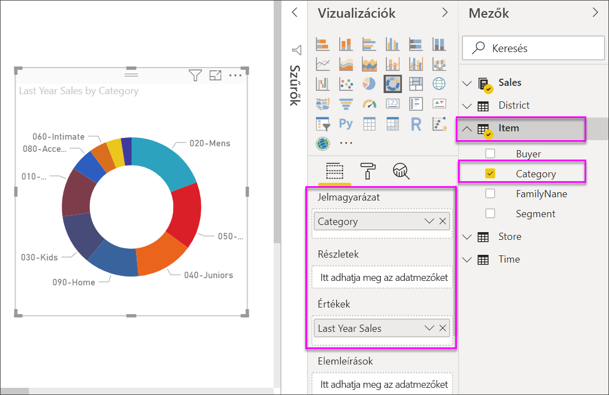

# Perecdiagramok a Power BI szolgáltatásban
A perecdiagram a tortadiagramhoz hasonlóan a részek egészhez való viszonyát mutatja. Az egyetlen különbség az, hogy a középső rész üres, így helyet biztosít egy címkének vagy ikonnak.

## Perecdiagram létrehozása
Ezen útmutatás a Kiskereskedelmi elemzési mintát használja egy olyan perecdiagram létrehozásához, mely az ez évi értékesítést jeleníti meg kategória szerint. Annak érdekében, hogy követni tudja a lépéseket, [töltse le a mintát](../sample-datasets.md), amely a Power BI szolgáltatásban vagy a Power BI Desktopban használható.

1. Kezdje a műveletet egy üres jelentésoldalon. Ha a Power BI szolgáltatást használja, mindenképpen a [Szerkesztési nézetében](../service-interact-with-a-report-in-editing-view.md) nyissa meg a jelentést.

2. A Mezők panelen válassza a **Sales** \> **Last Year Sales** (Értékesítés > Előző évi értékesítés) lehetőséget.  
   
3. A Megjelenítések ablaktáblán válassza a perecdiagram ikonját  az oszlopdiagram perecdiagrammá alakításához. Ha a **Last Year Sales** (Előző évi értékesítés) nem az **Értékek** területen található, húzza át oda.
     
   

4. Válassza az **Elem** \> **Kategória** lehetőséget, hogy hozzáadja az **Jelmagyarázat** területhez. 
     
    

5. Ha szeretné, [módosíthatja a diagram szövegének méretét és színét](power-bi-visualization-customize-title-background-and-legend.md). 

## Megfontolandó szempontok és hibaelhárítás
* A perecdiagram értékeinek összege 100%-nak kell lennie.
* A túl sok kategória megnehezíti az átlátást és az értelmezést.
* A perecdiagramok használhatók a legjobban, hogy egy részt az egészhez hasonlítsunk, kevésbé arra, hogy külön szakaszokat vessünk össze egymással. 

## Következő lépések
[Tölcsérdiagramok a Power BI-ban](power-bi-visualization-funnel-charts.md)

[Vizualizációtípusok a Power BI-ban](power-bi-visualization-types-for-reports-and-q-and-a.md)

