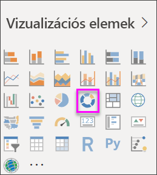

# Perecdiagramok a Power BI szolgáltatásban

[!INCLUDE [power-bi-visuals-desktop-banner](../includes/power-bi-visuals-desktop-banner.md)]

A perecdiagram a tortadiagramhoz hasonlóan a részek egészhez való viszonyát mutatja. Az egyetlen különbség az, hogy a középső rész üres, így helyet biztosít egy címkének vagy ikonnak.

## Előfeltétel

Ez az oktatóanyag a [Kiskereskedelmi elemzési minta PBIX-fájlt](http://download.microsoft.com/download/9/6/D/96DDC2FF-2568-491D-AAFA-AFDD6F763AE3/Retail%20Analysis%20Sample%20PBIX.pbix) használja.

1. A menüsor bal felső részén válassza a **Fájl** > **Megnyitás** lehetőséget
   
2. Keresse meg a **Kiskereskedelmi elemzési minta PBIX-fájlt**

1. Nyissa meg a **Kiskereskedelmi elemzési minta PBIX-fájlt** jelentésnézetben .

1. Kiválasztás  új oldal hozzáadásához.

## Perecdiagram létrehozása

1. Kezdjen egy üres jelentést tartalmazó lappal, majd a Mezők panelen válassza az **Értékesítés** \> **Előző évi értékesítés** lehetőséget.  
   
3. A Megjelenítések ablaktáblán válassza a perecdiagram ikonját  az oszlopdiagram perecdiagrammá alakításához. Ha a **Last Year Sales** (Előző évi értékesítés) nem az **Értékek** területen található, húzza át oda.
     
   

4. Válassza az **Elem** \> **Kategória** lehetőséget, hogy hozzáadja az **Jelmagyarázat** területhez. 
     
    

5. Ha szeretné, [módosíthatja a diagram szövegének méretét és színét](power-bi-visualization-customize-title-background-and-legend.md). 

## Megfontolandó szempontok és hibaelhárítás
* A perecdiagram értékeinek összege 100%-nak kell lennie.
* A túl sok kategória megnehezíti az átlátást és az értelmezést.
* A perecdiagramok használhatók a legjobban, hogy egy részt az egészhez hasonlítsunk, kevésbé arra, hogy külön szakaszokat vessünk össze egymással. 

## Következő lépések
[Tölcsérdiagramok a Power BI-ban](power-bi-visualization-funnel-charts.md)

[Vizualizációtípusok a Power BI-ban](power-bi-visualization-types-for-reports-and-q-and-a.md)

