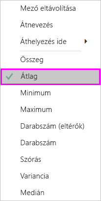
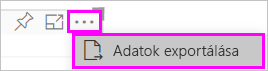
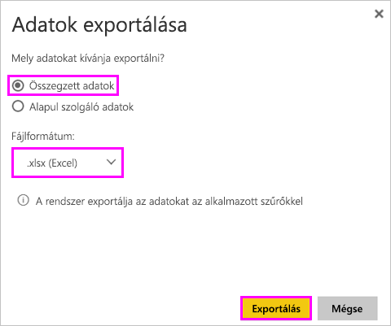
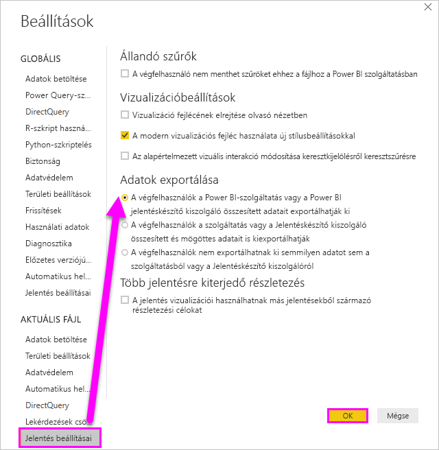

# A vizualizáció létrehozásához használt adatok exportálása

> [!IMPORTANT]
> Nem minden felhasználó tekintheti meg vagy exportálhatja az összes adatot. Ezt a jelentések tervezői és a rendszergazdák korlátozhatják az irányítópultok és jelentések készítésekor. Egyes adatok korlátozott hozzáférésűek, rejtettek vagy bizalmasak lehetnek, így különleges engedélyek nélkül nem tekinthetők meg és nem exportálhatók. 

## Az adatexportálásra jogosultak köre

Ha rendelkezik az adatokra vonatkozó engedélyekkel, láthatja és exportálhatja a Power BI által a vizualizációk létrehozásához használt adatokat. Az adatok gyakran bizalmasak, vagy csak bizonyos felhasználók számára hozzáférhetők. Ilyen esetben Ön nem láthatja vagy exportálhatja ezeket az adatokat. Részletesebb leírást a dokumentum végén, a **Korlátozások és szempontok** szakaszban talál. 

## Adatok megtekintése és exportálása

Ha szeretné megtekinteni a Power BI által a vizualizáció létrehozásához használt adatokat, [megjelenítheti az adatokat a Power BI-ban](service-reports-show-data.md). Ezeket az adatokat *.xlsx*- vagy *.csv*-fájlként az Excelbe is exportálhatja. Az adatexportálási lehetőség használatához Pro- vagy Premium-licenc szükséges, valamint engedélyek az adathalmazhoz és a jelentésekhez. <!--If you have access to the dashboard or report but the data is classified as *highly confidential*, Power BI will not allow you to export the data.-->

Tekintse meg, ahogyan Will exportálja az adatokat az egyik jelentésében található vizualizációkból, menti őket *.xlsx*-fájlként, és megnyitja a fájlt az Excelben. Ezután a videó alatt látható részletes utasításokat követve próbálkozzon meg a feladat elvégzésével. Vegye figyelembe, hogy a videó készítése során a Power BI egy régebbi verzióját használták.

<iframe width="560" height="315" src="https://www.youtube.com/embed/KjheMTGjDXw" frameborder="0" allowfullscreen></iframe>

## Adatok exportálása Power BI-irányítópultról

1. A vizualizáció jobb felső sarkában válassza a További műveletek (...) elemet.

    

1. Válassza az **Exportálás .csv-fájlba** lehetőséget.

    

1. A Power BI egy *.csv*-fájlba exportálja az adatokat. Ha szűrte a vizualizációt, az exportált .csv-fájl is szűrve lesz. 

1. A böngésző megkéri, hogy mentse a fájlt.  A mentés után nyissa meg a *.csv*-fájlt az Excelben.

    

## Adatok exportálása jelentésből

Annak érdekében, hogy követni tudja a lépéseket, nyissa meg a [Beszerzéselemzési mintajelentést](../sample-procurement.md) a Power BI szolgáltatás Szerkesztés nézetében. Adjon hozzá egy új üres jelentésoldalt. Ezután kövesse az alábbi lépéseket, és adjon hozzá egy összesítést, hierarchiát és egy vizualizáció-szintű szűrőt.

### Halmozott oszlopdiagram létrehozása

1. Hozzon létre új **halmozott oszlopdiagramot**.

    

1. A **Mezők** panelen válassza a **Hely > Város**, **Hely > Ország/Régió** és a **Számla > Kedvezmény százaléka** lehetőséget.  Előfordulhat, hogy a **Kedvezmény százalékát** át kell helyeznie az **Érték** területre.

    

1. Módosítsa a **Kedvezmény százaléka** összesítését **Darabszám** értékről **Átlag** értékre. Az **Érték** mezőben kattintson a **Kedvezmény százalékától** (előfordulhat, hogy **Kedvezmény mennyisége százalékban** néven találja) jobbra található nyílra, és válassza az **Átlag** lehetőséget.

    

1. Vegyen fel szűrőt a **Város** mezőhöz, jelölje ki az összes várost, majd szüntesse meg az **Atlanta** érték bejelölését.

    

   
1. Bontson ki részletesen egy szintet a hierarchiában. Kapcsolja be a részletezést, és hatoljon le a **Város** szintre. 

    

Most már készen állunk mindkét adatexportálási lehetőség kipróbálására.

### ***Összegzett*** adatok exportálása
Válassza az **Összegzett adatok** lehetőséget, ha a vizualizációban látható adatokat szeretné exportálni.  Az ilyen típusú export csak azokat az adatokat (oszlopokat és mértékeket) jeleníti meg, amelyekkel a vizualizáció létre lett hozva.  Ha a vizualizáció összesítést tartalmaz, exportálja az összesített adatokat. Például ha egy négy sávot megjelenítő sávdiagrammal rendelkezik, négy sornyi Excel-adatot fog kapni. Az összegzett adatok a Power BI szolgáltatásban *.xlsx* és *.csv* formátumban, a Power BI Desktopban .csv formátumban érhetők el.

1. A vizualizáció jobb felső sarkában válassza a három pontot. Válassza az **Adatok exportálása** lehetőséget.

    

    A Power BI szolgáltatásban, mivel a vizualizáció összesítést tartalmaz (a **Darabszám** helyett *Átlagot* használ), két lehetősége van:

    - **Összesített adatok**

    - **Mögöttes adatok**

    Az összesítésekkel kapcsolatos magyarázatokért tekintse meg [a Power BI összesítéseit](../service-aggregates.md) ismertető szakaszt.

    > [!NOTE]
    > A Power BI Desktopban összesített adatokat csak .csv-fájlként exportálhat. 
    
    
1. Az **Adatok exportálása** alatt válassza az **Összesített adatok** lehetőséget, válasszon az *.xlsx* és a *.csv* fájltípus közül, végül válassza az **Exportálás** lehetőséget. A Power BI exportálja az adatokat.

    

1. Ha az **Exportálás** lehetőséget választja, a böngésző megkéri, hogy mentse a fájlt. A mentés után nyissa meg a fájlt az Excelben.

    

    Ebben a példában az Excel-exportálás egy teljes értéket jelenít meg minden városhoz. Mivel Atlantát kiszűrtük, nem szerepel az eredmények között. A táblázat első sorában azok a szűrők láthatók, amelyeket a Power BI használt az adatok kinyerésére.
    
    - A rendszer a hierarchia által használt összes adatot exportálja, nem csak a vizualizáció aktuális részletezési szintjéhez használtakat. Itt például a városok szintjéig részleteztünk, de az export országadatokat is tartalmaz.  

    - Az exportált adatok összesítve vannak. Minden városhoz tartozik egy összegsor.

    - Mivel a vizualizációra szűrőket alkalmaztunk, az exportált adatok szűrve lesznek exportálva. Figyelje meg az első sort: **Alkalmazott szűrők: A Város nem Atlanta, GA**. 

### ***Mögöttes*** adatok exportálása

Válassza ezt a lehetőséget, ha a vizualizáció adatait ***és*** az adathalmaz további adatait szeretné megtekinteni (részletekért tekintse meg a lenti diagramot). ha a vizualizáció összesítést tartalmaz, a **Mögöttes adatok** kiválasztása eltávolítja az összesítést. Ebben a példában az Excel-exportálás az adathalmazban található minden Város sorhoz egy sort jelenít meg, és az egyetlen bejegyzéshez tartozó kedvezmény százalékát mutatja. A Power BI nem összesíti, hanem egybesimítja az adatokat.  

Ha az **Exportálás** lehetőséget választja, a Power BI egy *.xlsx*-fájlba exportálja az adatokat, és a böngésző megkéri, hogy mentse a fájlt. A mentés után nyissa meg a fájlt az Excelben.

1. A vizualizáció jobb felső sarkában válassza a három pontot. Válassza az **Adatok exportálása** lehetőséget.

    

    A Power BI szolgáltatásban, mivel a vizualizáció összesítést tartalmaz (a **Darabszám** helyett **Átlagot** használ), két lehetősége van:

    - **Összesített adatok**

    - **Mögöttes adatok**

    Az összesítésekkel kapcsolatos magyarázatokért tekintse meg [a Power BI összesítéseit](../service-aggregates.md) ismertető szakaszt.

    > [!NOTE]
    > A Power BI Desktopban csak összesített adatokat exportálhat. 
    
    
1. Az **Adatok exportálása** alatt válassza a **Mögöttes adatok**, majd az **Exportálás** lehetőséget. A Power BI exportálja az adatokat.

    

1. Ha az **Exportálás** lehetőséget választja, a böngésző megkéri, hogy mentse a fájlt. A mentés után nyissa meg a fájlt az Excelben.

    
    
    - Ezen a képernyőképen csupán a több, mint 100 000 soros Excel-fájl egy kis részlete látható.  
    
    - A rendszer a hierarchia által használt összes adatot exportálja, nem csak a vizualizáció aktuális részletezési szintjéhez használtakat. Itt például a városok szintjéig részleteztünk, de az export országadatokat is tartalmaz.  

    - Mivel a vizualizációra szűrőket alkalmaztunk, az exportált adatok szűrve lesznek exportálva. Figyelje meg az első sort: **Alkalmazott szűrők: A Város nem Atlanta, GA**. 

## Szellemi tulajdont képező adatok védelme

Az adathalmaz olyasmit is tartalmazhat, amit nem minden felhasználónak szabad látnia. Ha nem körültekintően exportálja a mögöttes adatokat, előfordulhat, hogy minden felhasználó látni fogja a vizualizációhoz tartozó részletes adatok minden sorát és oszlopát. 

Többféle stratégia is a Power BI-rendszergazdák és a tervezők rendelkezésére áll a szellemi tulajdont képező adatok védelmére. 

- A tervezők [eldönthetik, mely *exportálási lehetőségek*](#set-the-export-options) érhetők el a felhasználók számára.  

- A Power BI-rendszergazdák letilthatják az adatexportálást a vállalatnál. 

- Az adathalmaz tulajdonosai sorszintű biztonságot (RLS) állíthatnak be. Az RLS korlátozza a csak olvasási jogosultsággal rendelkező felhasználók hozzáférését. Ha azonban alkalmazás-munkaterületet konfigurált, amelyhez szerkesztési jogosultságot adott a tagoknak, rájuk nem vonatkoznak az RLS-szerepkörök. További információ: [Sorszintű biztonság](../service-admin-rls.md).

- A jelentéstervezők oszlopokat rejthetnek el, hogy azok ne jelenjenek meg a **Mezők** listájában. További információ: [Adathalmaz-tulajdonságok](../developer/automation/api-dataset-properties.md)

- A Power BI-rendszergazdák [bizalmassági címkéket](../admin/service-security-data-protection-overview.md) adhatnak az irányítópultokhoz, jelentésekhez, adathalmazokhoz és adatfolyamokhoz. Ezek olyan védelmi beállításokat juttathatnak érvényre, mint az exportálás során használt titkosítás vagy vízjel. 

- A Power BI-rendszergazdák a [Microsoft Cloud App Security](../admin/service-security-data-protection-overview.md) használatával figyelhetik a felhasználók hozzáférését és tevékenységeit, valós idejű kockázatelemzést hajthatnak végre, és címkékre vonatkozó vezérlőket állíthatnak be. A szervezetek például olyan szabályzatot konfigurálhatnak a Microsoft Cloud App Securityvel, amely megakadályozza, hogy a felhasználók nem felügyelt eszközökre töltsenek le bizalmas adatokat a Power BI-ból. 

## Mögöttes adatok részleteinek exportálása

A **Mögöttes adatok** lehetőség kiválasztásakor több dolog történhet. Az adatok megértéséhez előfordulhat, hogy rendszergazdai vagy informatikusi segítségre lesz szüksége. 

>

| A vizualizáció tartalma | Az exportáláskor megjelenő elemek  |
|---------------- | ---------------------------|
| Összesítések | az *első* összesítés és az összesítés teljes táblájának nem rejtett adatai |
| Összesítések | kapcsolódó adatok – ha a vizualizáció más, az összesítést tartalmazó adattáblához *kapcsolódó* adattáblák adatait használja (mindaddig, amíg a kapcsolat \*:1 vagy 1:1 mértékű) |
| Mértékek* | A vizualizáció összes mértéke *és* minden mérték azon adattáblákból, amelyek a vizualizációban használt mértékeket tartalmaznak |
| Mértékek* | Minden nem rejtett adat az adott értéket tartalmazó adattáblákból (feltéve, hogy a kapcsolat \*:1 vagy 1:1 típusú) |
| Mértékek* | Minden adat minden olyan táblából, amely a mértékeket tartalmazó táblákhoz \*:1/1:1 típusú kapcsolatlánccal kapcsolódik |
| Csak mértékek | Minden nem rejtett oszlop minden kapcsolódó táblából (a mérték kiterjesztése érdekében) |
| Csak mértékek | A modellmértékek duplikált sorainak összegzett adatai |

\* A Power BI Desktop vagy a szolgáltatás jelentéskészítési nézetében egy *mérték* jelenik meg a **Mezők** listában egy számológép ikonnal . Mértékek a Power BI Desktopban hozhatók létre.

### Exportálási beállítások megadása

A felhasználók számára elérhető adatexportálási beállítások típusait a Power BI jelentéstervezői adják meg. Az alábbiak közül választhat:

- A végfelhasználók a Power BI-szolgáltatás vagy a Power BI jelentéskészítő kiszolgáló összesített adatait exportálhatják ki

- A végfelhasználók a szolgáltatás vagy a Jelentéskészítő kiszolgáló összesített és mögöttes adatait is kiexportálhatják

- A végfelhasználók nem exportálhatnak ki semmilyen adatot sem a szolgáltatásból vagy a Jelentéskészítő kiszolgálóról

    > [!IMPORTANT]
    > Azt javasoljuk, hogy a jelentéstervezők térjenek vissza a régi jelentésekhez, és manuálisan állítsák vissza az exportálási beállítást igény szerint.

Ezeket a következő módon állíthatja be:

1. Induljon ki a Power BI Desktopból.

1. A bal felső sarokban kattintson a **Fájl** > **Lehetőségek és beállítások** > **Lehetőségek** menüpontra.

1. Az **AKTUÁLIS FÁJL** területen válassza a **Jelentésbeállítások** szakaszt.

    

1. Válassza ki a kívánt beállítást az **Adatexportálás** szakaszban.

Ezt a beállítást a Power BI szolgáltatásban is frissítheti.

Fontos megjegyezni, hogy amennyiben a Power BI felügyeleti portál beállításai és az exportált adatok jelentésbeállításai között ütközés lép fel, a felügyeleti beállítások felülírják az adatexportálási beállításokat.

## Korlátozások és szempontok
Ezek a korlátozások és szempontok a Power BI Desktopra és a Power BI szolgáltatásra is vonatkoznak, a Power BI Prót és Premiumot is beleértve.

- Adatok vizualizációból való exportálásához rendelkeznie kell [a mögöttes adathalmazra érvényes Összeállítási engedéllyel](https://docs.microsoft.com/power-bi/service-datasets-build-permissions).

-  A **Power BI Desktop** és a **Power BI szolgáltatás** által egy **importálási módú jelentésből** egy *.csv*-fájlba exportálható sorok maximális száma 30 000.

- Az alkalmazás által egy **importálási módú jelentésből** egy *.xlsx*-fájlba exportálható sorok maximális száma 150 000.

- A *mögöttes adatokat* használó exportálás nem működik a következő esetekben:

  - a verzió a 2016-osnál régebbi.

  - a modell táblái nem rendelkeznek egyedi kulccsal.
    
  -  egy rendszergazda vagy jelentéstervező letiltotta ezt a funkciót.

- A *mögöttes adatokat* használó exportálás nem működik, ha engedélyezi az *Adatot nem tartalmazó elemek megjelenítése* lehetőséget a Power BI által exportált vizualizációra.

- DirectQuery használata esetén a Power BI által maximálisan exportálható adatmennyiség 16 MB (tömörítés nélkül). Nem kívánt eredményként előfordulhat, hogy a sorok maximálás számánál kevesebbet exportál. Ez a következő esetekben valószínű:

    - Sok oszlop van.

    - Vannak nem jól tömöríthető adatok.

    - Egyéb tényezők járulnak hozzá a fájlméret növekedéséhez, ezzel csökkentve a Power BI által exportálható sorok számát.

- Ha a vizualizáció egynél több adattábla adatait használja, az adatmodellben pedig nincs kapcsolat ezen táblák között, a Power BI csak az első tábla adatait exportálja.

- Az egyéni vizualizációk és az R-vizualizációk jelenleg nem támogatottak.

- A Power BI-ban egy mező (oszlop) átnevezéséhez kattintson duplán a mezőre, majd írja be az új nevet. A Power BI *aliasnak* tekinti az új nevet. Előfordulhat, hogy egy Power BI-jelentésben így ismétlődő mezőnevek fordulnak elő, de az Excel nem engedélyezi az ismétlődő elemek használatát. Így amikor a Power BI az Excelbe exportálja az adatokat a mezők aliasai visszaállnak az eredeti mező- (oszlop-) nevekre.  

- Ha a *.csv*-fájlban Unicode-karakter található, a szöveg az Excelben hibásan jelenhet meg. Unicode-karakterek fordulhatnak elő például a pénznemek szimbólumaiban és a nem angol szavakban. Ha a fájlt a Jegyzettömbben nyitja meg, a Unicode helyesen jelenik meg. Ha a fájlt az Excelben szeretné megnyitni, a kerülő megoldás a *.csv* importálása. A fájlt a következő módon importálhatja az Excelbe:

  1. Nyissa meg az Excelt.

  1. Nyissa meg az **Adatok** fület.
  
  1. Válassza a **Külső adatok beolvasása** > **Szövegből** lehetőséget.
  
  1. Nyissa meg a helyi mappát, ahol a fájlt tárolja, és jelölje ki a *.csv*-fájlt.

- A Power BI-rendszergazdák letilthatják az adatok exportálását.

További kérdései vannak? [Kérdezze meg a Power BI közösségét](https://community.powerbi.com/)
