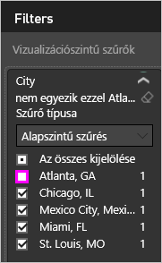
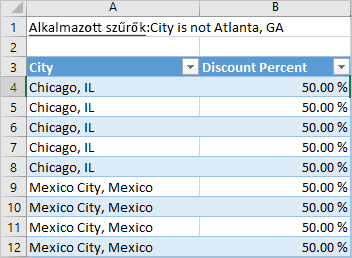

# Adatok exportálása vizualizációkból

Ha szeretné megtekinteni a Power BI által a vizualizáció létrehozásához használt adatokat, [megjelenítheti az adatokat a Power BI-ban](service-reports-show-data.md). Ezeket az adatokat *.xlsx*- vagy *.csv*-fájlként az Excelbe is exportálhatja. Az adatexportálási lehetőség használatához Pro- vagy Premium-licenc szükséges, valamint engedélyek az adathalmazhoz és a jelentésekhez.

Tekintse meg, ahogyan Will exportálja az adatokat az egyik jelentésében található vizualizációkból, menti őket *.xlsx*-fájlként, és megnyitja a fájlt az Excelben. Ezután a videó alatt látható részletes utasításokat követve próbálkozzon meg a feladat elvégzésével.

<iframe width="560" height="315" src="https://www.youtube.com/embed/KjheMTGjDXw" frameborder="0" allowfullscreen></iframe>

## Adatok exportálása Power BI-irányítópultról

1. A vizualizáció jobb felső sarkában válassza a három pontot.

    

1. Válassza az **Adatok exportálása** ikont.

    

1. A Power BI egy *.csv*-fájlba exportálja az adatokat. Ha szűrte a vizualizációt, az alkalmazás szűrni fogja a letöltött adatokat.

1. A böngésző megkéri, hogy mentse a fájlt.  A mentés után nyissa meg a *.csv*-fájlt az Excelben.

    

## Adatok exportálása jelentésből

Annak érdekében, hogy követni tudja a lépéseket, nyissa meg a [Beszerzéselemzési mintajelentést](../sample-procurement.md) Szerkesztési nézetben. Adjon hozzá egy új üres jelentésoldalt. Ezután kövesse az alábbi lépéseket, és adjon hozzá egy összesítést és egy vizualizáció-szintű szűrőt.

1. Hozzon létre új **halmozott oszlopdiagramot**.

1. A **Mezők** panelen válassza a **Hely > Város** és a **Számla > Kedvezmény százaléka** lehetőséget.  Előfordulhat, hogy a **Kedvezmény százalékát** át kell helyeznie az **Érték** területre.

    

1. Módosítsa a **Kedvezmény százaléka** összesítését **Darabszám** értékről **Átlag** értékre. Az **Érték** mezőben kattintson a **Kedvezmény százalékától** (előfordulhat, hogy **Kedvezmény mennyisége százalékban** néven találja) jobbra található nyílra, és válassza az **Átlag** lehetőséget.

    

1. Vegyen fel szűrőt a **Város** mezőhöz, jelölje ki az összes várost, majd szüntesse meg az **Atlanta** érték bejelölését.

    

   Most már készen állunk mindkét adatexportálási lehetőség kipróbálására.

1. A vizualizáció jobb felső sarkában válassza a három pontot. Válassza az **Adatok exportálása** lehetőséget.

    

    A Power BI online szolgáltatásban ha a vizualizáció összesítést tartalmaz (például ha módosította a **Szám** értéket *átlag*, *összeg* vagy *minimum* értékre), két lehetőség közül választhat:

    - **Összesített adatok**

    - **Mögöttes adatok**

    A Power BI Desktopban csak **Összegzett adatokat** választhat. Az összesítésekkel kapcsolatos magyarázatokért tekintse meg [a Power BI összesítéseit](../service-aggregates.md) ismertető szakaszt.

1. Az **Adatok exportálása** alatt válassza az **Összesített adatok** lehetőséget, válasszon az *.xlsx* és a *.csv* fájltípus közül, végül válassza az **Exportálás** lehetőséget. A Power BI exportálja az adatokat.

    

    Ha szűrőket alkalmazott a vizualizációhoz, az exportált adatok szűrve lesznek exportálva. Ha az **Exportálás** lehetőséget választja, a böngésző megkéri, hogy mentse a fájlt. A mentés után nyissa meg a fájlt az Excelben.
    
    A rendszer a hierarchia által használt összes adatot exportálja, nem csak a vizualizáció aktuális részletezési szintjéhez használtakat. Ha például a vizualizáció nincs fentről lefelé részletezve, az exportált adatok a hierarchia minden adatát tartalmazni fogják, nem csak a vizualizáció jelenlegi részletezési szintjéhez használt adatokat.

    **Összesített adatok**: Válassza ezt a lehetőséget, ha a vizualizációban látható adatokat szeretné exportálni.  Az ilyen típusú export csak azokat az adatokat (oszlopokat és méréseket) jeleníti meg, amelyekkel létrehozta a vizualizációt.  Ha a vizualizáció összesítést tartalmaz, exportálja az összesített adatokat. Például ha egy négy sávot megjelenítő sávdiagrammal rendelkezik, négy sornyi adatot fog kapni. Az összesített adatok *.xlsx*- és *.csv*-fájlként érhetők el.

    Ebben a példában az Excel-exportálás egy teljes értéket jelenít meg minden városhoz. Mivel Atlantát kiszűrtük, nem szerepel az eredmények között. A táblázat első sorában azok a szűrők láthatók, amelyeket a Power BI használt az adatok kinyerésére.

    

1. Most próbálja ki, hogy a **Mögöttes adatok**, az *.xlsx*, majd az **Exportálás** lehetőséget választja. A Power BI exportálja az adatokat. 

    > [!NOTE]
    > A mögöttes adatok exportálására a jelentésbeállításoktól függően van vagy nincs lehetősége.

    Ha szűrőket alkalmazott a vizualizációhoz, az exportált adatok szűrve lesznek exportálva. Ha az **Exportálás** lehetőséget választja, a böngésző megkéri, hogy mentse a fájlt. A mentés után nyissa meg a fájlt az Excelben.
    
    A rendszer a hierarchia által használt összes adatot exportálja, nem csak a vizualizáció aktuális részletezési szintjéhez használtakat. Ha például a vizualizáció nincs fentről lefelé részletezve, az exportált adatok a hierarchia minden adatát tartalmazni fogják, nem csak a vizualizáció jelenlegi részletezési szintjéhez használt adatokat.

    >[!WARNING]
    >A mögöttes adatok exportálása lehetővé teszi a felhasználók számára, hogy az összes részletes adatot (az adatokban szereplő minden sort) megtekintsék. A Power BI szolgáltatás rendszergazdái ezt kikapcsolhatják a vállalatnál. Ha Ön egy adathalmaz tulajdonosa, a jogvédett oszlopokat **rejtett** állapotúra állíthatja, így azok nem jelennek meg a **Mezők** listájában a Desktopban vagy a Power BI szolgáltatásban.

    **Mögöttes adatok**: Válassza ezt a lehetőséget, ha a vizualizáció adatait ***és*** a modell további adatait szeretné megtekinteni (részletekért tekintse meg a lenti diagramot). ha a vizualizáció összesítést tartalmaz, a *Mögöttes adatok* kiválasztása eltávolítja az összesítést. Ha az **Exportálás** lehetőséget választja, a Power BI egy *.xlsx*-fájlba exportálja az adatokat, és a böngésző megkéri, hogy mentse a fájlt. A mentés után nyissa meg a fájlt az Excelben.

    Ebben a példában az Excel-exportálás az adathalmazban található minden Város sorhoz egy sort jelenít meg, és az egyetlen bejegyzéshez tartozó kedvezmény százalékát mutatja. A Power BI egybesimítja az adatokat. Összesítést nem végez. A táblázat első sorában azok a szűrők láthatók, amelyeket a Power BI használt az adatok kinyerésére.  

    

## Mögöttes adatok részleteinek exportálása

A **Mögöttes adatok** lehetőség kiválasztásakor több dolog történhet. Az adatok megértéséhez előfordulhat, hogy rendszergazdai vagy informatikusi segítségre lesz szüksége. A Power BI Desktop vagy a szolgáltatás jelentéskészítési nézetében egy *mérték* jelenik meg a **Mezők** listában egy számológép ikonnal . A Power BI Desktop mértékeket hoz létre. A Power BI szolgáltatás ezt nem teszi.

| A vizualizáció tartalma | Az exportáláskor megjelenő elemek  |
|---------------- | ---------------------------|
| Összesítések | az *első* összesítés és az összesítés teljes táblájának nem rejtett adatai |
| Összesítések | kapcsolódó adatok – ha a vizualizáció más, az összesítést tartalmazó adattáblához *kapcsolódó* adattáblák adatait használja (mindaddig, amíg a kapcsolat \*:1 vagy 1:1 mértékű) |
| Mértékek | A vizualizáció összes mértéke *és* minden mérték azon adattáblákból, amelyek a vizualizációban használt mértékeket tartalmaznak |
| Mértékek | Minden nem rejtett adat az adott értéket tartalmazó adattáblákból (feltéve, hogy a kapcsolat \*:1 vagy 1:1 típusú) |
| Mértékek | Minden adat minden olyan táblából, amely a mértékeket tartalmazó táblákhoz \*:1/1:1 típusú kapcsolatlánccal kapcsolódik |
| Csak mértékek | Minden nem rejtett oszlop minden kapcsolódó táblából (a mérték kiterjesztése érdekében) |
| Csak mértékek | A modellmértékek duplikált sorainak összegzett adatai |

### Exportálási beállítások megadása

A felhasználók számára elérhető adatexportálási beállítások típusait a Power BI jelentéstervezői adják meg. Az alábbiak közül választhat:

- A végfelhasználók a Power BI-szolgáltatás vagy a Power BI jelentéskészítő kiszolgáló összesített adatait exportálhatják ki

- A végfelhasználók a szolgáltatás vagy a Jelentéskészítő kiszolgáló összesített és mögöttes adatait is kiexportálhatják

- A végfelhasználók nem exportálhatnak ki semmilyen adatot sem a szolgáltatásból vagy a Jelentéskészítő kiszolgálóról

    > [!IMPORTANT]
    > Azt javasoljuk, hogy a jelentéstervezők térjenek vissza a régi jelentésekhez, és manuálisan állítsák vissza az exportálási beállítást igény szerint.

Ezeket a következő módon állíthatja be:

1. Induljon ki a Power BI Desktopból.

1. A bal felső sarokban kattintson a **Fájl** > **Lehetőségek és beállítások** > **Lehetőségek** menüpontra.

1. Az **AKTUÁLIS FÁJL** területen válassza a **Jelentésbeállítások** szakaszt.

    

1. Válassza ki a kívánt beállítást az **Adatexportálás** szakaszban.

Ezt a beállítást a Power BI szolgáltatásban is frissítheti.

Fontos megjegyezni, hogy amennyiben a Power BI felügyeleti portál beállításai és az exportált adatok jelentésbeállításai között ütközés lép fel, a felügyeleti beállítások felülírják az adatexportálási beállításokat.

## Korlátozások és szempontok
Ezek a korlátozások és szempontok a Power BI Desktopra és a Power BI szolgáltatásra is vonatkoznak, a Power BI Prót és Premiumot is beleértve.

- Adatok vizualizációból való exportálásához rendelkeznie kell [a mögöttes adathalmazra érvényes Összeállítási engedéllyel](https://docs.microsoft.com/power-bi/service-datasets-build-permissions#build-permissions-for-shared-datasets).

-  A **Power BI Desktop** és a **Power BI szolgáltatás** által egy **importálási módú jelentésből** egy *.csv*-fájlba exportálható sorok maximális száma 30 000.

- Az alkalmazás által egy **importálási módú jelentésből** egy *.xlsx*-fájlba exportálható sorok maximális száma 150 000.

- A *mögöttes adatokat* használó exportálás nem működik a következő esetekben:

  - Az adatforrás élő Analysis Services-kapcsolat.

  - A verzió 2016-nál régebbi.

  - A modell táblái nem rendelkeznek egyedi kulccsal.
    
  -  Egy rendszergazda vagy jelentéstervező letiltotta ezt a funkciót.

- A *mögöttes adatokat* használó exportálás nem működik, ha engedélyezi az *Adatot nem tartalmazó elemek megjelenítése* lehetőséget a Power BI által exportált vizualizációra.

- DirectQuery használata esetén az adatok Power BI által maximálisan exportálható mennyisége 16 MB (tömörítés nélkül). Nem kívánt eredményként előfordulhat, hogy a sorok maximálás számánál kevesebbet exportál. Ez a következő esetekben valószínű:

    - Sok oszlop van.

    - Vannak nem jól tömöríthető adatok.

    - Egyéb tényezők járulnak hozzá a fájlméret növekedéséhez, ezzel csökkentve a Power BI által exportálható sorok számát.

- Ha a vizualizáció egynél több adattábla adatait használja, az adatmodellben pedig nincs kapcsolat ezen táblák között, a Power BI csak az első tábla adatait exportálja.

- Az egyéni vizualizációk és az R-vizualizációk jelenleg nem támogatottak.

- A Power BI-ban egy mező (oszlop) átnevezéséhez kattintson duplán a mezőre, majd írja be az új nevet. A Power BI *aliasnak* tekinti az új nevet. Előfordulhat, hogy egy Power BI-jelentésben így ismétlődő mezőnevek fordulnak elő, de az Excel nem engedélyezi az ismétlődő elemek használatát. Így amikor a Power BI az Excelbe exportálja az adatokat a mezők aliasai visszaállnak az eredeti mező- (oszlop-) nevekre.  

- Ha a *.csv*-fájlban Unicode-karakter található, a szöveg az Excelben hibásan jelenhet meg. Unicode-karakterek fordulhatnak elő például a pénznemek szimbólumaiban és a nem angol szavakban. Ha a fájlt a Jegyzettömbben nyitja meg, a Unicode helyesen jelenik meg. Ha a fájlt az Excelben szeretné megnyitni, a kerülő megoldás a *.csv* importálása. A fájlt a következő módon importálhatja az Excelbe:

  1. Nyissa meg az Excelt.

  1. Nyissa meg az **Adatok** fület.
  
  1. Válassza a **Külső adatok beolvasása** > **Szövegből** lehetőséget.
  
  1. Nyissa meg a helyi mappát, ahol a fájlt tárolja, és jelölje ki a *.csv*-fájlt.

- A Power BI-rendszergazdák letilthatják az adatok exportálását.

További kérdései vannak? [Kérdezze meg a Power BI közösségét](http://community.powerbi.com/)
