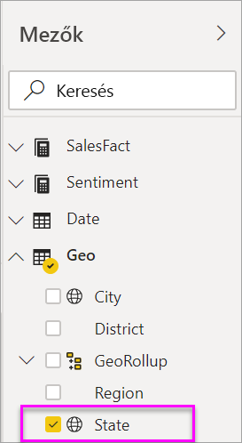
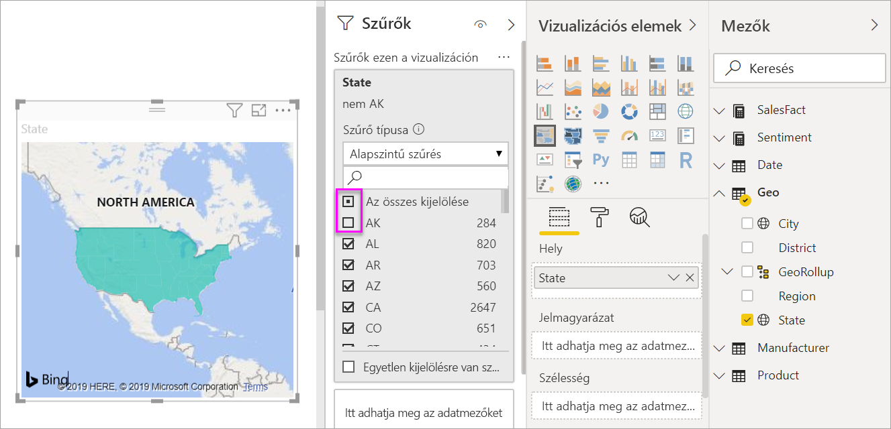
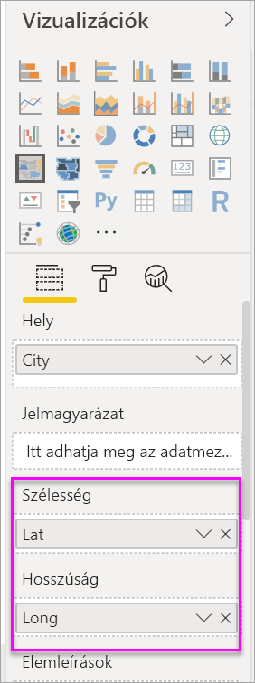

# Kitöltött (koropletikus) térképek létrehozása és használata a Power BI-ban

[!INCLUDE[consumer-appliesto-nyyn](../includes/consumer-appliesto-nyyn.md)]

[!INCLUDE [power-bi-visuals-desktop-banner](../includes/power-bi-visuals-desktop-banner.md)]

A tematikus térképek árnyalással, színezéssel vagy mintázattal jelenítik meg egy értéknek egy földrajzi területen vagy régión belüli viszonylagos eltéréseit.  A viszonylagos eltérések gyorsan megjeleníthetők a világostól (ritkább/kevesebb) a sötétig (gyakrabb/több) terjedő árnyalással.    

## Mit küld el a rendszer a Bingnek
A Power BI a Binggel integrálva adja meg az alapértelmezett térkép-koordinátákat (a geokódolás nevű eljárással). Amikor térképi vizualizációt hoz létre a Power BI szolgáltatásban vagy a Power BI Desktopban, akkor a **Hely**, **Szélesség** és **Hosszúság** gyűjtőben lévő (a vizualizáció létrehozásához használt) adatok továbbítódnak a Bingnek.

Lehetséges, hogy Önnek vagy a cégnek frissítenie kell a tűzfalat, hogy engedélyezze a hozzáférést azokhoz az URL-címekhez, amelyeket a Bing a geokódoláshoz használ.  Ezek az alábbiak:
- https://dev.virtualearth.net/REST/V1/Locations    
- https://platform.bing.com/geo/spatial/v1/public/Geodata    
- https://www.bing.com/api/maps/mapcontrol

A Bingnek küldött adatokról további információt, a geokódolás sikerességének növeléséhez pedig tippeket kaphat a [Tippek és trükkök térképi vizualizációkhoz](power-bi-map-tips-and-tricks.md) című cikkben.

## Mikor érdemes tematikus térképet használni
A tematikus térkép kitűnően alkalmas:

* mennyiségi információk térképi megjelenítésére.
* térbeli mintázatok és összefüggések kimutatására.
* szabványosított adatok esetén.
* társadalmi-gazdasági adatokkal végzett munkához.
* kiemelten fontos régiók esetén.
* a földrajzi helyek közötti eloszlás áttekintéséhez.

### Előfeltételek
Ez az oktatóanyag az [Értékesítési és marketing minta PBIX-fájlt](https://download.microsoft.com/download/9/7/6/9767913A-29DB-40CF-8944-9AC2BC940C53/Sales%20and%20Marketing%20Sample%20PBIX.pbix) használja.
1. A menüsor bal felső részén válassza a **Fájl** > **Megnyitás** lehetőséget
   
2. Keresse meg az **Értékesítési és marketing minta PBIX-fájl** példányát

1. Nyissa meg az **Értékesítési és marketing minta PBIX-fájlt** jelentésnézetben .

1. Kiválasztás  új oldal hozzáadásához.

> [!NOTE]
> A jelentés egy Power BI-munkatárssal való megosztásához mindkettőjüknek Power BI Pro-licenccel kell rendelkezniük, vagy a jelentésnek egy Premium kapacitásban kell lennie.    

### Kitöltött térkép létrehozása
1. A Mezők panelen válassza a **Geo** \> **Állam** mezőt.    

   
2. [Alakítsa át a diagramot](power-bi-report-change-visualization-type.md) tematikus térképpé. Figyelje meg, hogy az **Állam** a **Hely** alatt jelenik meg. A Bing Térképek a **Hely** alatti mezőt használja a térkép létrehozásához.  A hely többféle létező földrajzi hely lehet: országok, államok, megyék, városok, irányítószámok vagy más postai kódok, stb. A Bing Térképek világszerte sok helyhez biztosít kitöltött térképformákat. A Hely alatt bevitt érvényes érték nélkül a Power BI nem tudja létrehozni a tematikus térképet.  

   
3. Szűrje a térképet úgy, hogy csak az Egyesült Államok szárazföldi területeit mutassa.

   a.  Keresse meg a **Szűrők** területet a Megjelenítések paneltől balra. Bontsa ki, ha össze van csukva.

   b.  Vigye a kurzort az **Állam** fölé, és válassza a kibontó sávnyilat  
   

   c.  Tegyen pipát a **Mind** lehetőség mellé, és távolítsa el a pipát az **AK** elem mellől.

   
4. A Formátum ablaktábla megnyitásához válassza a festőhenger ikont, majd válassza az **Adatszínek** lehetőséget.

    

5. Válassza a három pontot, majd a **Feltételes formázás** elemet.

    

6. Az **Alapértelmezett színek – Adatszínek** képernyőn ellenőrizheti, milyen színárnyalatokkal jelenik majd meg a tematikus térkép. Beállíthatja többek között, hogy melyik mezőre alapuljon a színárnyalat, és hogy hogyan legyen alkalmazva. Ebben a példában a **SalesFact** > **Vélemény** mezőt használjuk, a legkisebb értékű vélemény narancssárga, a legmagasabbhoz pedig kék színt állítunk be. A maximális és a minimális közötti értékek a narancssárga és a kék árnyalataiban jelennek majd meg. A képernyő alján található illusztráció azt mutatja meg, hogy milyen színskálát lehet használni. 

    

7. A kitöltött térkép zöld és piros árnyalattal jelenik meg, ahol a piros az alacsonyabb véleménypontszámot, a zöld pedig a magasabb, pozitívabb véleménypontszámot jelöli.  További részletek megjelenítéséhez húzza a mezőt az Elemleírások területre.  Itt felvettük a **SalesFact** > **Véleményeltérés** értéket. Idaho (ID) állam kiemelése megmutatja, hogy a véleményeltérés értéke alacsony, 6-os.
   

10. [Mentse a jelentést](../service-report-save.md).

A Power BI-ban számos lehetőség van a kitöltött térkép megjelenésének szabályozására. Az adatszínvezérlők használatával elérheti a kívánt külalakot. 

## Kiemelés és keresztszűrés
További információ a Szűrök ablaktábla használatáról: [Szűrők hozzáadása jelentésekhez](../power-bi-report-add-filter.md).

A kitöltött térképek egyes helyeinek kiemelésével a rendszer keresztszűri a jelentésoldalon lévő többi vizualizációt, és fordítva.

1. Ahhoz, hogy követni tudja a lépéseket, először a **Fájl > Mentés** gombra kattintva mentenie kell a jelentést. 

2. Másolja ki a kitöltött térképet a CTRL-C billentyűkombinációval.

3. A jelentésvászon alsó részén válassza a **Vélemény** lapot, a Vélemény jelentéslap megnyitásához.

    

4. A vizualizációk áthelyezésével és méretezésével csináljon helyet az oldalon, majd a CTRL-V billentyűkombinációval illessze be az előző jelentésből származó kitöltött térképet. (Lásd a következő képeket)

   

5. Jelöljön ki egy államot a tematikus térképen.  Ez keresztkiemeléssel és keresztszűréssel jelöli a lapon lévő többi vizualizáció megfelelő adatait is. A **Texas** kiválasztásával például keresztszűrést hajt végre a kártyákon és keresztkiemelést a sávdiagramon. Ebből tudom, hogy a vélemény értéke 75, és hogy Texas a Central District (Középső körzet) #23. eleme.   
   
2. Jelöljön ki egy adatpontot a VanArsdel – Sentiment by Month (Vélemény hónap szerint) vonaldiagramon. Ekkor a rendszer szűrést alkalmaz a kitöltött térképen, így csak a VanArsdel véleményadatai jelennek meg, a konkurenciáé pedig nem.  
   

## Megfontolandó szempontok és hibaelhárítás
A térképadatok nem feltétlenül egyértelműek.  Van például egy Paris nevű város (Párizs) Franciaországban, de van egy Paris Texasban is. A földrajzi adatok feltehetően külön oszlopokban tárolódnak – Egy oszlopban a városok nevei, egy oszlopban az államoké vagy tartományoké, stb. – így a Bing nem mindig tudja eldönteni, hogy melyik Paris nevű városról van szó. Ha az adatkészlet földrajzi szélesség- és hosszúság-adatokat is tartalmaz, akkor a Power BI speciális mezőkkel támogatja a térképadatok egyértelművé tételét. Ehhez elég a szélesség értékét tartalmazó mezőt a Megjelenítések \> Szélesség területre húzni.  Tegye ugyanezt a hosszúsági adatokkal.    

Ha rendelkezik az adatkészlet Power BI Desktopban történő szerkesztéséhez szükséges jogosultsággal, akkor tekintse meg ezt a térképek kétértelműségének feloldásában segítő videót.

> [VIDEÓ https://www.youtube.com/embed/Co2z9b-s_yM ]

Ha nem fér hozzá a szélességi és hosszúsági adatokhoz, azonban szerkesztheti az adatkészletet, [kövesse ezt az útmutatást az adatkészlet frissítéséhez](https://support.office.com/article/Maps-in-Power-View-8A9B2AF3-A055-4131-A327-85CC835271F7).

A térképi vizualizációkhoz további segítséget nyújt a [Tippek és trükkök térképi vizualizációkhoz](../power-bi-map-tips-and-tricks.md) című cikk.

## Következő lépések

[Alakzat leképezése](desktop-shape-map.md)

[Vizualizációtípusok a Power BI-ban](power-bi-visualization-types-for-reports-and-q-and-a.md)
