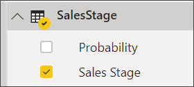
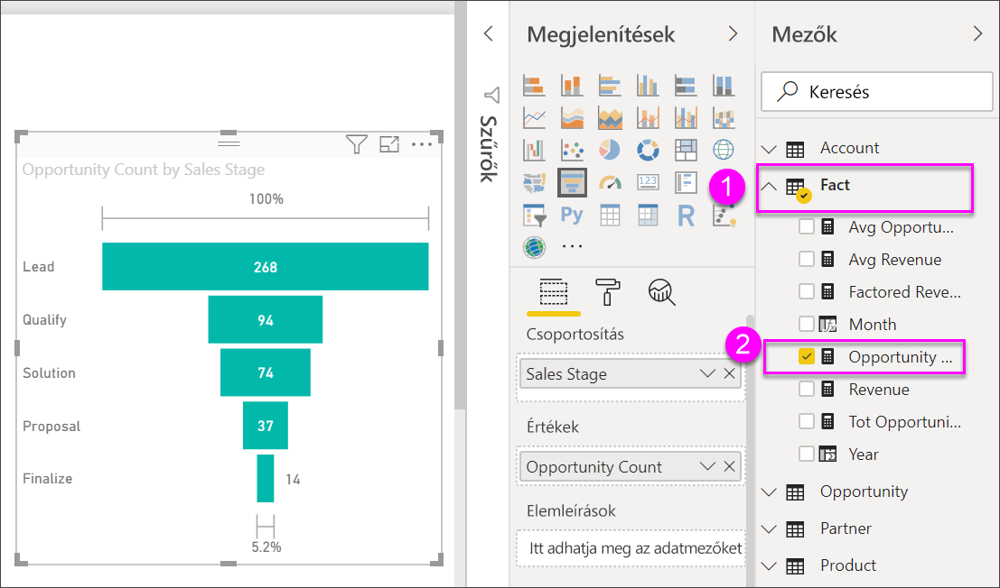

# Tölcsérdiagramok

[!INCLUDE [power-bi-visuals-desktop-banner](../includes/power-bi-visuals-desktop-banner.md)]

A tölcsérdiagramok segítségével vizualizálhatja az egymást követő összekapcsolt fázisokból álló lineáris folyamatokat. Ilyen például egy értékesítési tölcsér, amelyen keresztül az ügyfelek nyomon követhetőek az egyes fázisokban: Érdeklődő \> Minősített érdeklődő \> Lehetséges ügyfél \> Szerződés \> Zárás.  A tölcsér alakja egyetlen pillantásra megmutatja a lekövetett folyamat állapotát.

A tölcsér minden egyes szakasza a teljes mennyiséghez viszonyított százalékos arányt mutatja. Így az esetek többségében a tölcsérdiagram alakja valóban egy tölcsérhez hasonlít – az első szakasz a legszélesebb, majd a rákövetkező szakaszok egyre szűkülnek.  Persze a körte alakú tölcsérek is hasznosak – segítenek azonosítani a problémákat.  Általában véve azonban az első, a „bemeneti” szakasz a legszélesebb.

## Mikor érdemes tölcsérdiagramokat használni?
A tölcsérdiagram remek választás a következő esetekben:

* ha az adatok egymás követik, és legalább 4 fázisban következnek egymásból,
* ha az első fázis „elemeinek” száma várhatóan meghaladja az utolsó fáziséit,
* a fázisonkénti lehetőségek (bevétel/értékesítés/szerződések/stb.) számításához,
* a konverziós és megtartási arányok számításához,
* a lineáris folyamatok szűk keresztmetszeteinek felfedéséhez,
* a bevásárlókosár-munkafolyamatok nyomon követéséhez,
* az átkattintásos reklám-/marketingkampányok haladásának és sikerességének nyomon követéséhez.

## A tölcsérdiagramok használata
A tölcsérdiagramok:

* Rendezhetőek.
* Támogatják a többszörös használatot.
* Kiemelhető és keresztszűrhető az egyazon jelentésoldalon lévő más vizualizációkkal.
* Használható az egyazon jelentésoldalon lévő más vizualizációk kiemelésére és keresztszűrésére.
   > [!NOTE]
   > A videóban Will egy tölcsérdiagramot hoz létre az Értékesítési és marketing minta használatával. Ezután a videó alatt látható lépeseket követve próbálkozzon meg a feladattal saját maga is a Lehetőségelemzési minta PBIX-fájl használatával
   > 
   > 
## Előfeltétel

Ez az oktatóanyag a [Lehetőségelemzési minta PBIX-fájlt](http://download.microsoft.com/download/9/1/5/915ABCFA-7125-4D85-A7BD-05645BD95BD8/Opportunity%20Analysis%20Sample%20PBIX.pbix
) használja.

1. A menüsor bal felső részén válassza a **Fájl** > **Megnyitás** lehetőséget
   
2. Keresse meg a **Lehetőségelemzési minta PBIX-fájlt**

1. Nyissa meg a **Lehetőségelemzési minta PBIX-fájlt** jelentésnézetben .

1. Kiválasztás  új oldal hozzáadásához.

## Alapszintű tölcsérdiagram létrehozása
A videóban Will egy tölcsérdiagramot hoz létre az Értékesítési és marketing minta használatával.

<iframe width="560" height="315" src="https://www.youtube.com/embed/qKRZPBnaUXM" frameborder="0" allow="autoplay; encrypted-media" allowfullscreen></iframe>

Most hozzon létre egy saját tölcsérdiagramot az egyes értékesítési fázisokban lévő lehetőségek megjelenítéséhez.

1. Kezdjen egy üres jelentésoldalon, és válassza a **SalesStage** \> **Sales Stage** (Értékesítési fázis) mezőt.
   
    

1. Válassza a tölcsér ikont  az oszlopdiagram tölcsérdiagrammá alakításához.

2. A **Mezők** ablaktáblán válassza a **Fact** \> **Opportunity Count** lehetőséget.
   
    
4. A mutatót az egyes sávok fölé húzva a rendszer rengeteg információt jelenít meg.
   
   * A fázis neve
   * A jelenleg az adott fázisban lévő lehetőségek száma
   * Átfogó konverziós ráta (az érdeklődő számának százalékában kifejezve) 
   * Fázisról fázisra az előző fázishoz viszonyított (ebben az esetben ez a Proposal Stage/Solution Stage) százalékos arány (a Csökkenés mértéke)
     
     

6. [Mentse a jelentést](../service-report-save.md).

## Kiemelés és keresztszűrés
A Szűrök ablaktábla használatával kapcsolatos információkért lásd: [Szűrők hozzáadása jelentésekhez](../power-bi-report-add-filter.md).

A tölcsér egyes sávjainak kiemelésével a rendszer keresztszűri a jelentésoldalon lévő többi vizualizációt... és viszont. A feladat következő lépéseként adjon hozzá néhány vizualizációt a tölcsérdiagramot tartalmazó jelentésoldalhoz.

1. A tölcséren jelölje ki a **Proposal** sávot. Ez kiemeli a lapon lévő többi vizualizáció megfelelő adatait is. A többszörös kijelöléshez használja a CTRL billentyűt.
   
   
2. A vizualizációk keresztkiemelési és keresztszűrési beállításaival kapcsolatban lásd: [A Power BI vizualizációk interakciója](../service-reports-visual-interactions.md)

## Következő lépések

[Mérőműszerek a Power BI-ban](power-bi-visualization-radial-gauge-charts.md)

[Vizualizációtípusok a Power BI-ban](power-bi-visualization-types-for-reports-and-q-and-a.md)
