# Főbb befolyásolók vizualizáció
A főbb befolyásolók vizualizáció segít megérteni azokat a tényezőket, amelyek az érdeklődésére számot tartó metrikát alakítják. Elemzi az adatokat, rangsorolja a lényeges tényezőket, és megjeleníti őket főbb befolyásolóként. Érdekelheti például, hogy mi befolyásolja az alkalmazotti állomány változását (az elvándorlást). Az egyik tényező lehet a munkaszerződés hossza, a másik pedig az alkalmazottak kora. 
 
## Mikor érdemes használni a főbb befolyásolókat? 
A főbb befolyásolók vizualizáció remek választás a következőkhöz: 
- Megtekintheti, milyen tényezők befolyásolják az elemzett metrikát.

- Összevetheti ezeknek a tényezőknek a relatív fontosságát. Nagyobb hatása van az alkalmazotti állomány változására például a rövid távú szerződéseknek, mint a hosszú távúaknak? 

## A főbb befolyásolók használati követelményei 
Az elemzett metrikának kategóriamezőnek kell lennie.    

## A főbb befolyásoló vizualizáció funkciói

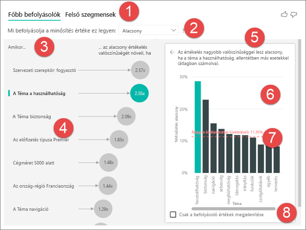    

1. ***Lapfülek*** – kiválaszthatja a lapfület a nézetek közötti váltáshoz. A főbb befolyásolók vizualizációval láthatók a kiválasztott metrika értékét leginkább befolyásoló tényezők. A felső szegmensekkel láthatók a metrika értékét leginkább befolyásoló felső szegmensek. Egy *szegmens* értékek kombinációjából tevődik össze.  Az egyik szegmens állhat olyan felhasználókból, akik legalább húsz éve ügyfelek, és a nyugati régióban élnek. 

2. ***Legördülő lista*** – az elemzett metrika értéke. Ebben a példában megnézzük a metrika **érékelését**, és az általunk kiválasztott érték **alacsony**.    

3. ***Átértékelés*** – segít értelmezni a bal oldali panelen látható vizualizációt. 

4. ***Bal oldali panel*** – a bal oldali panel egy vizualizációt tartalmaz.  Ebben az esetben a bal oldali panel a főbb befolyásolók listáját mutatja.

5. ***Átértékelés*** – segít értelmezni a jobb oldali panelen látható vizualizációt.

6. ***Jobb oldali panel*** – a jobb oldali panel egy vizualizációt tartalmaz. Ebben az esetben az oszlopdiagram megjeleníti a bal oldali panelen kiválasztott **főbb befolyásoló** **Téma** összes értékét. Az adott érték (**Használhatóság**) a bal oldali panelen zöld, és a **Téma** összes többi értéke fekete.

7. ***Átlagos vonal*** – az átlag számításánál a rendszer a **Téma** összes többi lehetséges értékét figyelembe vette, a **használhatóság** kivételével. Tehát a számítás az összes fekete értékre vonatkozik. Azt mutatja, hogy a többi **Téma** milyen százalékban eredményezett alacsony értékelést. Más szóval, amikor egy ügyfél értékelést ad, ez az ügyfél az értékelés okát vagy **témáját** is leírja. Témák például a használhatóság, a sebesség, a biztonság stb. Ha a **Téma** a **Használhatóság**, ez a második legfőbb befolyásoló tényező alacsony értékelés adásakor a bal oldali panelen lévő vizualizáció szerint. Ha átlagot számítunk az összes többi témából és az **alacsony** értékeléshez adott hozzájárulásukból, akkor az itt pirossal szereplő eredményt kapjuk. 

8. ***Jelölőnégyzet*** – csak a befolyásoló értékek megjelenítése.

## Főbb befolyásolók vizualizáció létrehozása 
 
Ebben a videóban megtekintheti, hogyan hozhat létre főbb befolyásolók vizualizációt, majd az alábbi lépéseket követve maga is létrehozhat egyet. 

<iframe width="560" height="315" src="https://www.youtube.com/embed/fDb5zZ3xmxU" frameborder="0" allow="accelerometer; autoplay; encrypted-media; gyroscope; picture-in-picture" allowfullscreen></iframe>

A termékmenedzser szeretné megtudni, milyen tényezők befolyásolják az ügyfeleket, amikor negatív értékelést adnak a felhőszolgáltatással kapcsolatban.  A lépések követéséhez nyissa meg az [Ügyfélvisszajelzések PBIX-fájlját](https://github.com/Microsoft/powerbi-desktop-samples/blob/master/2019/customerfeedback.pbix) a Power BI Desktopban. Az [Ügyfélvisszajelzések Excel-fájlját is letöltheti a Power BI szolgáltatáshoz vagy a Power BI Desktophoz](https://github.com/Microsoft/powerbi-desktop-samples/blob/master/2019/customerfeedback.xlsx). 

> [!NOTE]
> Az Ügyfélvisszajelzések adathalmazának alapja: [Moro et al., 2014] S. Moro, P. Cortez és P. Rita. A Data-Driven Approach to Predict the Success of Bank Telemarketing. (Adatvezérelt megközelítés a banki telemarketing sikerességének előrejelzéséhez.) Decision Support Systems, Elsevier, 62:22-31, 2014. június 

1. Nyissa meg a jelentést, és válassza a főbb befolyásolók ikonját.  

    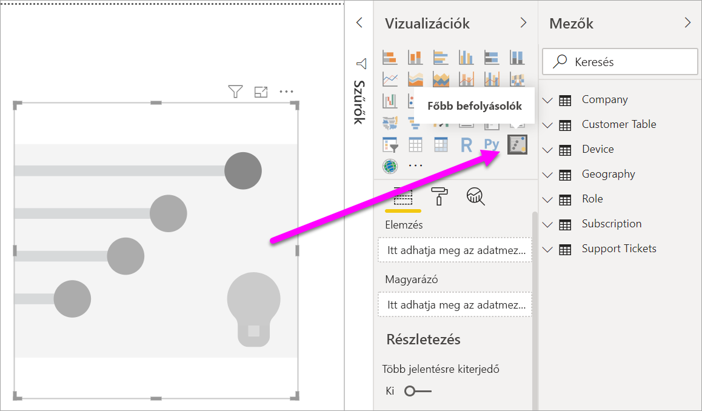

2. Húzza át az elemezni kívánt metrikát az **Elemzés** mezőbe. Az **Elemzés** mező csak kategorikus (nem folytonos) változókat támogat. Az érdekel bennünket, hogy min alapul a szolgáltatás **alacsony** ügyfélértékelése, ezért az **Ügyféltábla** > **Érékelés** lehetőséget választjuk.    
3. Ezután húzza azokat a mezőket, amelyekről úgy gondolja, hogy befolyásolhatták az **értékelést** a **Magyarázó** mezőbe. Tetszőleges számú mezőt áthúzhat. Ebben az esetben ezekkel kezdünk: 
    - Ország, régió 
    - Szervezeti szerepkör 
    - Előfizetés típusa 
    - Cégméret 
    - Téma     
4. Bennünket a negatív értékelések érdeklenek, ezért válassza az **Alacsony** értéket a **Mi befolyásolja az értékelést** legördülő listában.  

    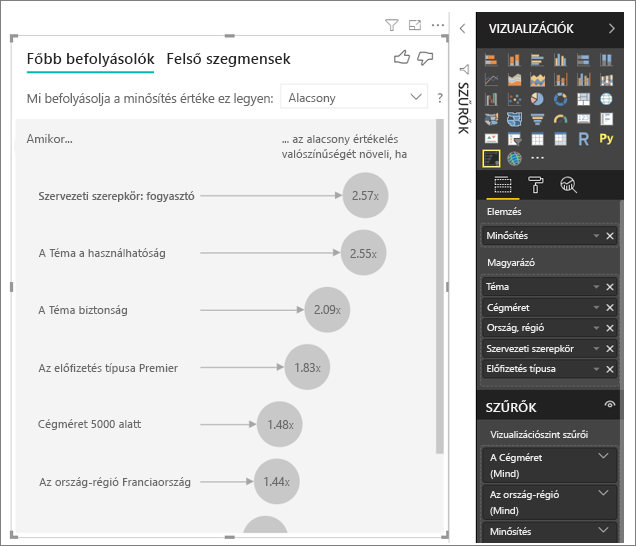

Az elemzés az elemzett mező táblaszintjén fut. Ebben az esetben az **Értékelés** metrika érdekel bennünket, amelynek meghatározása az ügyfél szintjén történik (az egyes ügyfelek magas vagy alacsony pontszámot adnak). A magyarázó tényezők mindegyikét az ügyfél szintjén kell meghatározni, hogy a vizualizáció használni tudja őket. 

A fenti példában minden egyes magyarázó tényező egy az egyhez vagy sok az egyhez kapcsolatban áll a metrikával. Az egyes pontszámokhoz például pontosan egy téma van társítva (az ügyfélértékelés fő témája). Hasonlóképp az ügyfelek egy országból érkeztek, és egy tagsági típussal és szerepkörrel rendelkeznek a szervezetben. A magyarázó tényezőink tehát már az ügyfél attribútumai, és nincs szükség átalakításokra, vagyis a vizualizáció azonnal használhatja őket. 

A későbbiekben az oktatóanyagban összetettebb példákat fogunk megnézni, melyekben egy a többhöz kapcsolatok szerepelnek. Ezekben az esetekben az oszlopokat először összesíteni kell az ügyfél szintjére az elemzés futtatása előtt.  

A magyarázó tényezőkként használt mértékek és összesítések értékelése szintén az **Elemzés** metrika táblaszintjén történik, és ebben a cikkben a későbbiekben néhány további példát is láthatunk. 

## A kategorikus főbb befolyásolók értelmezése 
Vessünk egy pillantást a főbb befolyásolókra az alacsony értékeléseknél. 

### Az alacsony értékelés valószínűségét befolyásoló leggyakoribb egyetlen tényező

A szervezetben három szerepkör van: felhasználók, rendszergazdák és kiadók. Láthatjuk, hogy az alacsony értékeléshez hozzájáruló legfontosabb tényező az, hogy felhasználó-e az értékelő. 

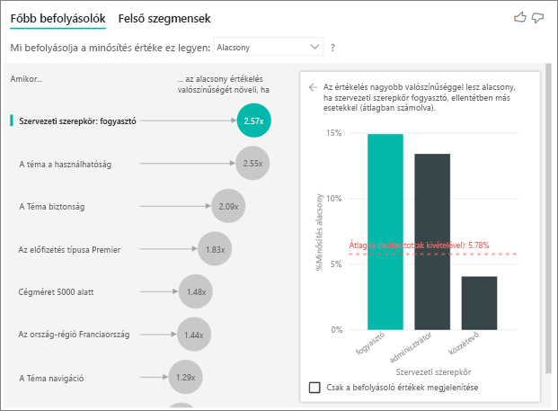

Pontosabban a felhasználók 2,57x nagyobb valószínűséggel adnak negatív pontszámot. A főbb befolyásoló diagramjában **A szervezetnél betöltött szerepkör a felhasználói** a bal oldali lista első helyén szerepel. **A szervezetnél betöltött szerepkör a felhasználói** kiválasztásával a Power BI további részleteket jelenít meg a jobb oldali panelen, mégpedig az egyes **szerepkörök** egymáshoz viszonyított hatását az alacsony értékelés adásakor.
  
- A felhasználók 14,93%-a ad alacsony pontszámot  
- Az összes többi szerepkör átlagosan ugyanakkor 5,78%-ban ad alacsony pontszámot 
- A felhasználók ezért 2,57x valószínűbben adnak alacsony pontszámot, mint az összes többi szerepkör tagjai (a zöld sáv és a piros pontozott vonal különbsége) 

### Az alacsony értékelés valószínűségét befolyásoló második leggyakoribb egyetlen tényező

A főbb befolyásolók vizualizáció sok különböző változó tényezőit képes összehasonlítani és rangsorolni.  A második befolyásolónak semmi köze sincs a **Szervezeti szerepkör** értékéhez.  Válassza ki a listában a második befolyásoló tényezőt, amely **A téma a használhatóság**. 

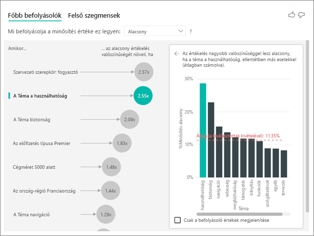

Itt látható, hogy a második legfontosabb tényező az ügyfélvélemény témájával kapcsolatos. Azok az ügyfelek, akik megjegyzést fűztek a termék *használhatóságához* 2,21x nagyobb valószínűséggel adtak alacsony pontszámot azokhoz az ügyfelekhez képest, akik más témákhoz, például a megbízhatósághoz, a tervezéshez vagy a sebességhez fűztek megjegyzést. 

Látható a vizualizációk között, hogy az átlag (piros pontozott vonal) 5,78%-ról 11,34%-ra változott. Az átlag dinamikusan jön létre, mert az összes többi érték átlagán alapul. Az első befolyással bíró személy esetén az átlag nem tartalmazta az ügyfél szerepkörét, a második esetében viszont a használhatóság témáját nem tartalmazta. 
 
A vizualizáció alján található négyzet bejelölésével a vizualizáció csak a befolyásoló értékek (ebben az esetben az alacsony pontszámot okozó szerepkörök) szerint lesz szűrve. Ezért ezentúl nem a 12 témát látjuk, hanem azt a négyet, amelyet a Power BI az alacsony értékelések okaként azonosított. 

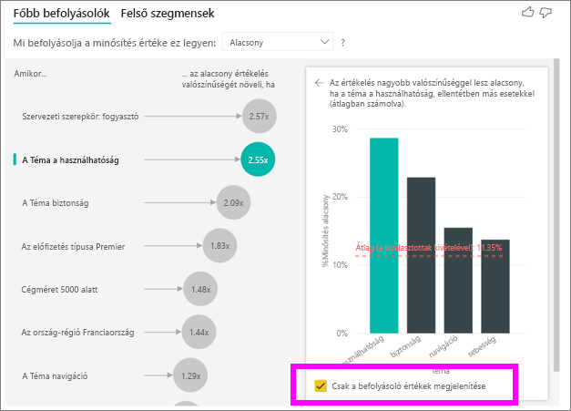

## Interakció más vizualizációkkal 
 
Minden alkalommal, amikor egy felhasználó rákattint egy szeletelőre, szűrőre vagy más vizualizációra a vásznon, a főbb befolyásolók vizualizáció újrafuttatja az új adatrészre vonatkozó elemzését. Húzza át például a cégméretet a jelentésbe, és használja szeletelőként. Azt szeretnénk látni, hogy a főbb befolyásolók nagyvállalati ügyfeleink körében (50 000 alkalmazottnál nagyobb vállalatméretnél) eltérőek-e az általános népességhez viszonyítva.  
 
A **>50 000** választásával újrafuttatja az elemezést, és láthatjuk, hogy a befolyásoló tényezők megváltoztak. A nagyvállalati ügyfeleknél az alacsony értékelések legfőbb befolyásoló tényezője a **biztonsággal** kapcsolatos **Téma**. Előfordulhat, hogy további elemzésekkel azt is meg kell vizsgálni, hogy vannak-e olyan meghatározott biztonsági funkciók, amelyekkel a nagyvállalati ügyfelek nem elégedettek. 

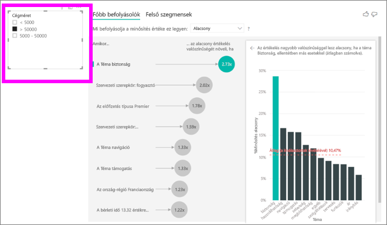

## Folyamatos főbb befolyásolók értelmezése 
 
Az eddigiekben a vizualizációt arra használtuk, hogy megtudjuk, hogyan befolyásolják a különböző kategóriákba tartozó mezők az alacsony értékeléseket. Folyamatosan érvényesülő tényezőket (például kor, magasság, ár) is át lehet húzni a Magyarázó mezőbe. Nézzük, mi történik, ha a Bérleti idő elemet húzzuk át az Ügyfél táblából a Magyarázó mezőbe. A Bérleti idő azt mutatja meg, hogy mennyi ideje használja az ügyfél a szolgáltatást. 
 
Úgy találtuk, hogy a **Bérleti idő** növekedésével az alacsony értékelés kapásának valószínűsége is növekszik. Ez a trend azt jelenti, hogy a hosszútávú ügyfeleink valójában valószínűbben adnak alacsony pontszámot, ami elég érdekes megállapítás, és a későbbiekben érdemes lehet további elemzésre.  
 
A vizualizáció azt tudja velünk, hogy a bérleti idő minden 13,44 hónapja után az alacsony értékelés valószínűsége 1,23x-ra nő. Ebben az esetben 13,44 hónap a bérleti idő szórását jelenti. Tehát a kapott megállapítás arra vonatkozik, hogy a bérleti idő standard mennyiséggel (a bérleti idő szórásával) való növelése hogyan befolyásolja az alacsony értékelés kapásának valószínűségét. 
 
A jobb oldali szórásdiagram az alacsony értékelések átlagos %-os arányát ábrázolja a bérleti idő egyes értékeihez viszonyítva, és tartalmaz egy trendvonalat is a diagram lejtésének kiemeléséhez.  

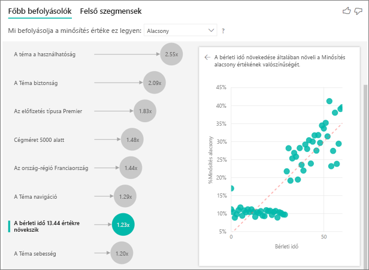

## Mértékek/összesítés értelmezése főbb befolyásolókként 
 
Végezetül pedig a felhasználók a mértékeket és összesítéseket magyarázó tényezőkként is használhatják az elemzésekben. Például előfordulhat, hogy meg szeretnénk tekinteni, milyen hatással van az ügyfelek támogatási jegyeinek száma vagy a nyitott jegyek átlagos időtartama a kapott pontszámra. 
 
Ebben az esetben látni szeretnénk, hogy az ügyfél támogatási jegyeinek száma befolyásolja-e a kapott pontszámot. Behívjuk a támogatási jegy azonosítóját a támogatási jegyek táblájából. Mivel az ügyfél több támogatási jeggyel is rendelkezhet, összesítenünk kell az azonosítót az ügyfél szintjén. Ez az összesítés fontos, mert az elemzést az ügyfél szintjén végezzük, ezért az összes befolyásoló tényezőt ezen a részletességi szinten kell definiálni. 
 
Meg fogjuk nézni az azonosítók számát (mivel mindegyik ügyfélsorhoz hozzátartozik a társított támogatási jegyek száma). Ebben az esetben azt láthatja, hogy a támogatási jegyek számának növekedésével az alacsony értékelések valószínűsége 5,51x növekszik. A jobb oldali vizualizáció megjeleníti a támogatási jegyek átlagos számát az eltérő értékelések szerint (az ügyfél szintjén kiértékelve). 

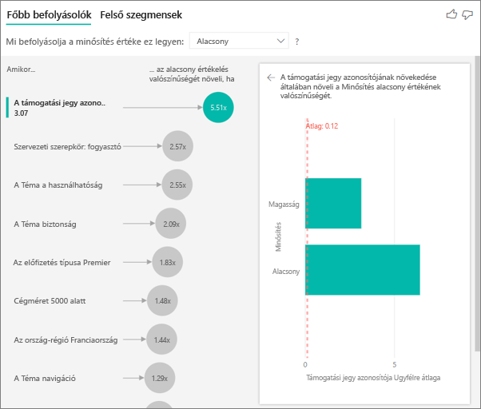

## Az eredmények értelmezése: felső szegmensek 
 
A Főbb befolyásolók lap lehetővé teszi a felhasználóknak az egyes tényezők értékelését külön-külön, a felhasználók ugyanakkor átválthatnak a Felső szegmensekre, hogy megtekinthessék, hogyan befolyásolja a különböző tényezők kombinációja az elemzett metrikát. 
 
A felső szegmens kezdetben megjelenítik a Power BI által felfedezett összes szegmens áttekintését. Az alábbi példában látható, hogy hat szegmens található. Ezekben a szegmensekben a rangsorolás a szegmenseken belüli alacsony értékelések %-os aránya alapján történik. Láthatjuk például, hogy az 1. szegmensben az alacsony ügyfélértékelések aránya 74,3%-os.  Minél magasabban van a buborék, annál nagyobb az alacsony értékelések aránya. A buborék mérete viszont attól függ, hogy hány ügyfél található a szegmensben. 

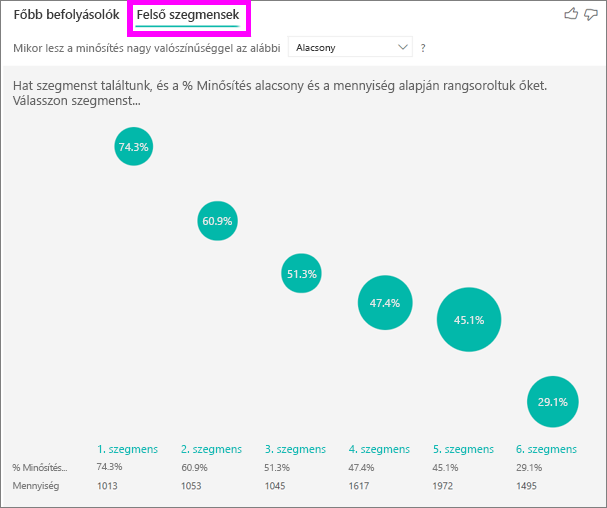

Egy buborék kiválasztásával megjelenítheti az adott szegmens részleteit. Ha például az 1. szegmenst választja, akkor láthatja, hogy az viszonylag hűséges ügyfelekből áll (több mint 29 hónapja vannak velünk), akik sok támogatási jeggyel rendelkeznek (4-nél többel). Végül pedig ők nem publikálók (tehát vagy ügyfelek vagy adminisztrátorok).  
 
Eben a csoportban 74,3% adott alacsony értékelést. Az átlagos ügyfél 11,7%-ban ad alacsony értékelést, tehát ebben a szegmensben az alacsony értékelések aránya szignifikánsan nagyobb (63 százalékponttal magasabb). Azt is látjuk, hogy az 1. szegmens az adatok kb. 2,2%-át tartalmazza, tehát a populáció egy körülhatárolható részét képviseli. 

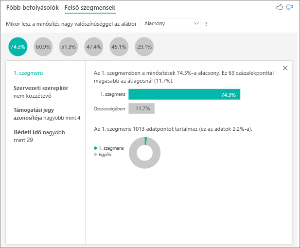

## Megfontolandó szempontok és hibaelhárítás 
 
**Mik az előzetes verzió korlátai?** 
 
A Főbb befolyásolók vizualizációnak jelenleg az előzetes verziója érhető el, és van néhány korlátozás, melyekről a felhasználóknak tudniuk kell. Jelenleg nem elérhető funkciók többek között: 
- Metrikák elemzése, amelyek összesítések/mértékek 
- A vizualizáció használata a Power BI Embeddedben
- A vizualizáció használata a Power BI-mobilalkalmazásokban
- RLS-támogatás 
- Közvetlen lekérdezés támogatása 
- Az élő kapcsolat támogatása 
 
**Egy hibaüzenetet látok, miszerint nem találhatók befolyásolók/szegmensek. Ez miért van?**  

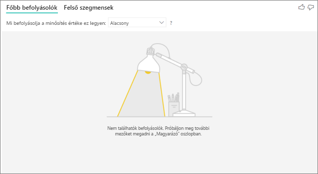

Ez a hiba akkor fordul elő, ha felvesz mezőket a **Magyarázó** elembe, de nem találhatók befolyásolók.   
- Az elemzett metrikát felvette az Elemzés és a Magyarázó elembe is (el kell távolítani a **Magyarázó** elemből) 
- A magyarázó mezők túl sok kevés megfigyeléssel rendelkező kategóriával rendelkeznek. Ez nehézzé teszi a vizualizációk számára annak a megállapítását, hogy melyek a befolyásoló tényezők, mivel nehéz néhány megfigyelés alapján általánosítani 
- A magyarázó tényezők megfelelő számú megfigyeléssel rendelkeznek az általánosításokhoz, de a vizualizáció nem találta semmilyen jelentős korrelációt, amelyről jelentést készíthetne 
 
**Egy hibaüzenet jelent meg, miszerint az éppen elemzett metrika nem rendelkezik elég adattal az elemzés futtatásához. Ez miért van?**  

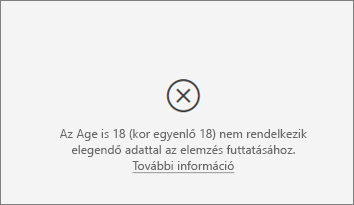

A vizualizáció úgy működik, hogy mintákat keres az adatokban az egyik csoportban (például az alacsony értékeléseket adott ügyfelek között) a többi csoporttal (például a magas értékelést adott ügyfelekkel) összehasonlítva. Ha a modellben lévő adatok nagyon kevés megfigyeléssel rendelkeznek, akkor nehéz mintákat találni. Ha a vizualizáció nem rendelkezik elegendő adattal jelentős befolyásolók találásához, akkor jelzi, hogy több adatra van szükség az elemzés futtatásához. Azt javasoljuk, hogy rendelkezzen legalább 100 megfigyeléssel a kiválasztott állapothoz (más szolgáltatóra váltó ügyfelek) és legalább 10 megfigyeléssel az összehasonlításhoz használt állapotokhoz (más szolgáltatóra nem váltó ügyfelek).  
 
**Egy hibaüzenet jelenik meg, miszerint a Magyarázó egyik mezője nem rendelkezik egyedi kapcsolattal az elemzett metrikát tartalmazó táblához. Ez miért van?**  
 
Az elemzés az elemzett mező táblaszintjén fut. Ha például Ön a szolgáltatásai ügyfélvisszajelzéseit elemzi, akkor rendelkezhet egy táblával, amelyben megtalálható, hogy az ügyfél magas vagy alacsony értékelést adott. Ebben az esetben az elemzés az ügyfél táblaszintjén fog futni. 

Ezzel a hibával akkor találkozik, ha van egy olyan kapcsolódó táblája, amelynek a meghatározása a metrikát tartalmazó táblánál nagyobb részletességi szinten történt. Szemléltessük ezt egy példával: 
 
- Elemzést végez azzal kapcsolatban, hogy mi befolyásolja az ügyfeleket, amikor alacsony értékeléseket adnak a szolgáltatására 
- Önt az érdekli, hogy befolyásolja-e az az eszköz, amelyen az ügyfél a szolgáltatást használja az általa adott értékeléseket 
- Az ügyfél többféleképpen is használhatja a szolgáltatást   
- Az alábbi példában a 10000000 ügyfél böngészővel táblagéppel is használja a szolgáltatást 

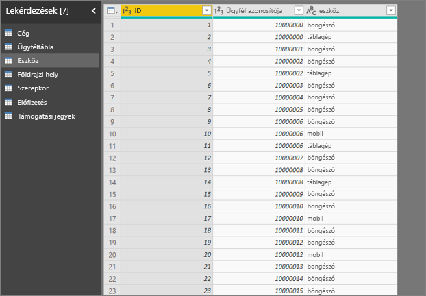

Ha az eszköz oszlopot próbálja magyarázó tényezőként használni, akkor a következő hibát fogja látni: 

Ennek az oka az, hogy az eszköz nincs definiálva az ügyfél szintjén – egy ügyfél több eszközön is használhatja a szolgáltatást. Ahhoz, hogy a vizualizáció mintákat találjon, az eszköznek az ügyfél attribútumává kell válnia. Ebben az esetben több megoldás is létezik, attól függően, mennyire értem a vállalat működését: 
 
- Az eszközök összegzését is módosíthatom, például megszámlálhatom, hogy az eszközök száma befolyásolhatja-e az ügyfél által adott pontszámot 
- Forgathatom az eszköz oszlopot annak megtekintéséhez, hogy a szolgáltatás egy meghatározott eszközön való használata befolyásolja-e az ügyfél értékelését  
 
Ebben a példában forgattam az adatokat, hogy új oszlopokat hozzak létre böngésző, mobil és tábla néven. Ezeket most felhasználhatom a Magyarázó felületen. Azt találtuk, hogy minden eszköz befolyásoló tényező, és a böngésző van a legnagyobb hatással az ügyfél által adott pontszámra. 

Pontosabban azok a felhasználók, akik nem a böngészővel használják a szolgáltatást, 3,79x nagyobb valószínűséggel adnak alacsony pontszámot azoknál, akik azzal használják. A listában lejjebb látható, hogy a mobilok esetében ennek az ellenkezője az igaz. A mobilalkalmazást használók nagyobb valószínűséggel adnak alacsony pontszámot, mint azok, akik nem azt használják.  

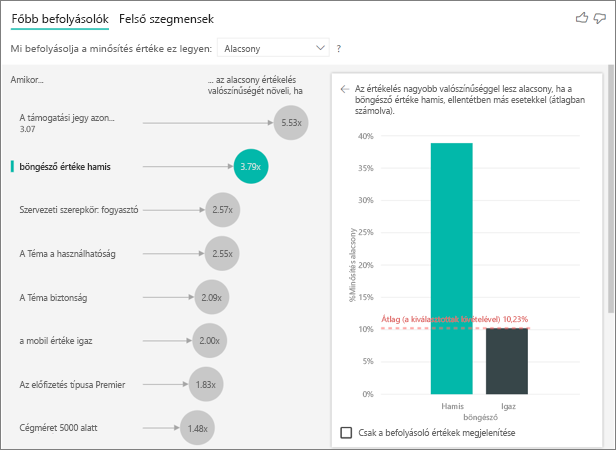

**Egy figyelmeztetést látok, miszerint az elemzésem nem tartalmaz mértékeket. Ez miért van?** [2052261] 

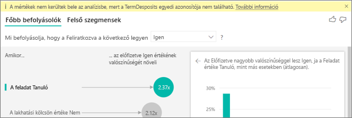

Az elemzés az elemzett mező táblaszintjén fut. Ha az ügyfelek lemorzsolódását elemzi, rendelkezhet egy táblával, amely tartalmazza, hogy az ügyfél lemorzsolódott-e vagy sem. Ebben az esetben az elemzés az ügyfél táblaszintjén fog futni.
 
A mértékek és összesítések elemzése alapértelmezés szerint ezen a táblaszinten történik. Ha van egy mértékünk az „Átlagos havi kiadások”-hoz, annak az elemzése az ügyfél táblaszintjén fog történni.  

Ha az ügyfél táblája nem rendelkezik egyedi azonosítóval, nem fogjuk tudni kiértékelni a mértéket, és az elemzés figyelmen kívül fogja azt hagyni. Ennek elkerülése érdekében a metrikával rendelkező táblának (ebben az esetben az ügyfél táblának) egyedi azonosítójának (például ügyfélazonosító) kell lennie. A Power Queryvel könnyen felvehet index oszlopot is.
 
**Megjelenik egy figyelmeztetés, miszerint az elemzett metrika több mint 10 egyedi értékkel rendelkezik, és hogy ez befolyásolhatja az elemzésem minőségét. Ez miért van?**  

A mesterséges intelligencián alapuló vizualizáció a kategóriák elemzésére van optimalizálva (például a lemorzsolódás lehet Igen vagy Nem, az ügyfél-elégedettség lehet Magas, Közepes vagy Alacsony stb.) Az elemzendő kategóriák számának emelése azt jelenti, hogy kategóriánként kevesebb megfigyeléssel fogunk rendelkezni, ami miatt a vizualizáció nehezebben fog mintát találni az adatokban. 

Erősebb befolyásoló tényezők találása érdekében javasoljuk, hogy a hasonló értékeket csoportosítsa egyetlen egységbe. Ha például az árhoz rendelkezik metrikával, valószínű, hogy jobb eredményeket kap, ha a hasonló árakat olyan gyűjtőkben csoportosítja, mint a Magas, a Közepes és az Alacsony ahelyett, hogy egyéni árpontokat használna. 

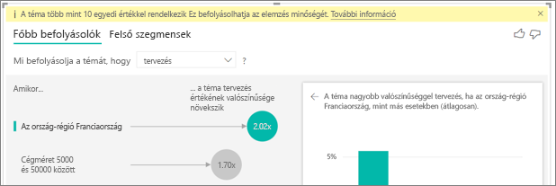

**Az adataimban vannak olyan tényezők, amelyek főbb befolyásolóknak látszanak, de valójában nem azok. Hogyan fordulhat ez elő?**

Az alábbi példában látható, hogy azok az ügyfelek, akik felhasználók alacsony értékeléseket adnak (az értékelések 14,93%-a alacsony). Érdekes módon az adminisztrátori szerepkörhöz szintén nagy arányú alacsony értékelések (13,42%) tartoznak, de ez nem számít befolyásoló tényezőnek. 

Ennek az oka az, hogy a vizualizáció az adatpontok számát is figyelembe veszi a befolyásoló tényezők keresésekor. Az alábbi példában több mint 29 000 felhasználó és 10-szer kevesebb adminisztrátor (nagyjából 2900) van. Ráadásul ezek közül csak 390 adott alacsony értékelést. A vizualizáció ezért nem rendelkezik elegendő adattal annak meghatározásához, hogy valóban mintát talált-e az adminisztrátori értékeléseknél, vagy csak véletlenszerűségről van szó.  

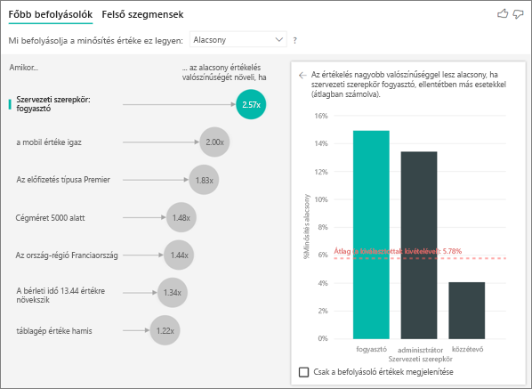

**Hogyan történik a főbb befolyásolók kiszámítása?**

A színfalak mögött a mesterséges intelligencia az [ML.NET-et](https://dotnet.microsoft.com/apps/machinelearning-ai/ml-dotnet) használja logisztikai regresszió futtatásához a főbb befolyásolók kiszámításához. A logisztikai regresszió egy statisztikai modell, amely összehasonlítja a különböző csoportokat egymással. Ha azt keressük, hogy mitől függnek az alacsony értékelések, a logisztikai regressziónak meg kell vizsgálnia, hogy az alacsony pontszámot adó ügyfelek miben különböznek azoktól, akik magas pontszámot adtak. Ha több kategóriával is rendelkezünk (magas pontszám, semleges pontszám, alacsony pontszám), akkor meg kell vizsgálnunk, hogy miben különböznek azok az ügyfelek, akik alacsony pontszámot adtak azoktól, akik nem adtak alacsony pontszámot (miben különböznek azoktól, akik magas VAGY semleges értékelést adtak). 
 
A logisztikai regresszió mintákat keres az adatokban, megvizsgálva, hogy miben különbözhetnek azok az ügyfelek, akik alacsony értékelést adtak azoktól, akik magas értékelést adtak. Előfordulhat például, hogy azok az ügyfelek, akik több támogatási jeggyel rendelkeznek magasabb %-ban adnak alacsony értékeléseket, mint azok, akiknek kevés támogatási jegyük, van vagy egyáltalán nincs.
 
A logisztikai regresszió azt is figyelembe veszi, hány adatpont található. Ha például az adminisztrátori szerepkörű ügyfelek arányosan több negatív pontszámot adnak, de csak néhány adminisztrátor van, ez nem fog befolyásoló tényezőnek minősülni. Ez azért van, mert nincs elég adatpont, amiből mintára lehetnek következtetni. Egy statisztikai tesztet (Wald tesztet) használunk annak meghatározására, hogy a tényező befolyásoló tényező-e. A vizualizáció 0,05-os p értéket használ a küszöbérték meghatározására. 

**Hogyan történik a szegmensek kiszámítása?**

A színfalak mögött az AI-vizualizáció az [ML.NET-et](https://dotnet.microsoft.com/apps/machinelearning-ai/ml-dotnet) használja, hogy egy döntési fa alkalmazásával megkeresse az érdekes alcsoportokat. A döntési fa célja az adatpontok egy olyan alcsoportjának a megtalálása, amelyben viszonylag nagy arányban fordul elő a keresett metrika (például az alacsony értékelést adó ügyfelek). 

A döntési fa megvizsgálja mindegyik magyarázó tényezőt, és megpróbálja megindokolni, melyik tényező adja a legjobb „elágazást”. Ha például úgy szűrjük az adatokat, hogy azok csak nagyvállalati ügyfeleket tartalmazzanak, elkülöníti ez azokat az ügyfeleket, akik magas értékelést adtak azoktól, akik alacsonyat? Vagy esetleg jobb lesz az adatokat úgy szűrni, hogy csak a biztonsággal kapcsolatos megjegyzést írt ügyfeleket foglalják magukba? 

A döntési fa az elágazás után már az adatoknak ezt az alcsoportját veszi figyelembe (például a biztonsággal kapcsolatos megjegyzést írt ügyfeleket), és megpróbálja eldönteni, mi lehet a következő legjobb elágazás csak ezeknél az adatoknál. Az egyes elágazások után megfontolja, hogy az adott alcsoport elegendő adatpontot tartalmaz-e ahhoz, hogy reprezentatív csoportnak számítson a mintára való következtetéshez, vagy pedig csak adatanomáliáról van szó és nem valódi szegmensről. (Másik statisztikai tesztet alkalmazunk az elágazási feltétel statisztikai jelentőségének ellenőrzésére 0,05-os p értékkel.) 

A döntési fa a futásának befejezése után az elágazások felhasználásával (biztonsági megjegyzések, nagyvállalatok) létrehozza a Power BI-szűrőket. A szűrőknek ez a kombinációja egy szegmensbe csomagolva szerepel a vizualizációban. 
 
**Miért válnak bizonyos tényezők befolyásolóvá vagy szűnnek meg befolyásolók lenni, miközben további mezőket húzok át a Magyarázó területre?**

A vizualizáció az összes magyarázó tényezőt együttesen értékeli. Ez azt jelenti, hogy miközben önmagában egy tényező lehet befolyásoló, ha azt más tényezőkkel együtt vizsgáljuk, már lehet, hogy nem az. Képzelje el, hogy azt vizsgáljuk, mitől függ a ház magas ára a hálószobák számát és a ház méretét véve magyarázó tényezőknek: 
- Önmagában a hálószobák száma okozhatja a magas házárakat 
- Ha belefoglaljuk a ház méretét az elemzésbe az azt jelenti, hogy azt vizsgáljuk, mi történik a hálószobákkal, miközben a ház mérete állandó marad 
- Ha a ház méretét 139 m2-ben (1500 sq ft) rögzítjük, nem valószínű, hogy a hálószobák számának folyamatos növelésével drámai módon növekedne a ház ára, tehát a hálószobák száma már lehet, hogy nem olyan fontos tényező, mint a ház méretének figyelembevétele előtt volt. 

## Következő lépések
[Kombinált diagramok a Power BI-ban](power-bi-visualization-combo-chart.md)

[Vizualizációtípusok a Power BI-ban](power-bi-visualization-types-for-reports-and-q-and-a.md)
