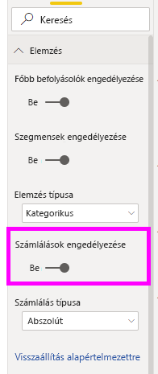
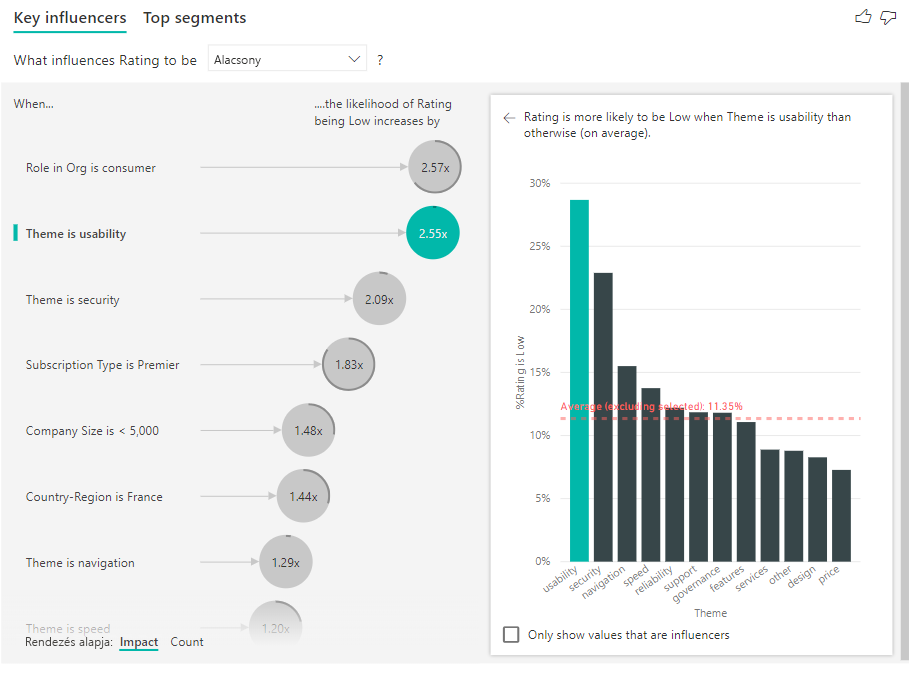
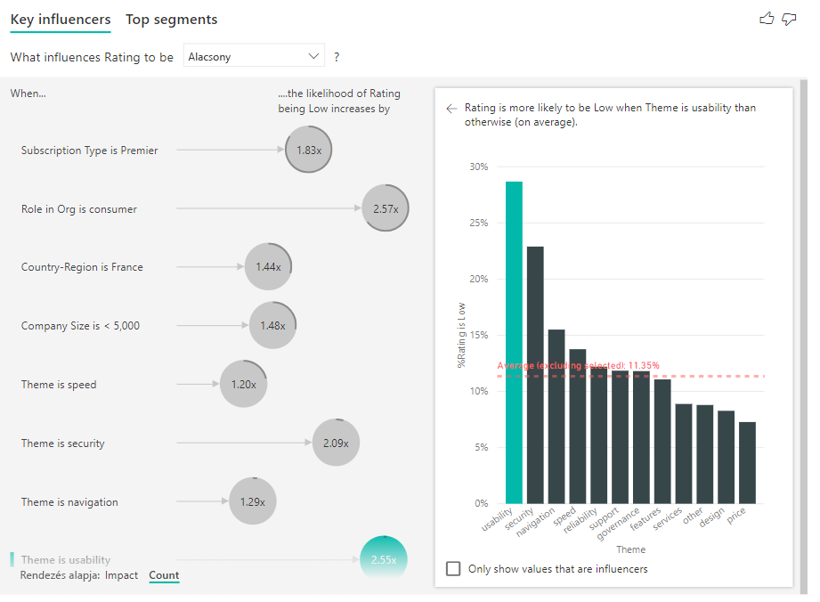
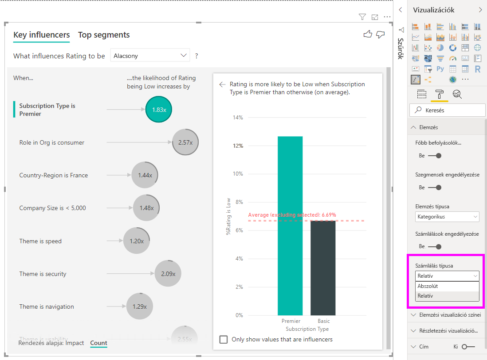
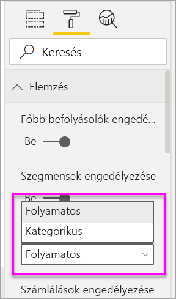
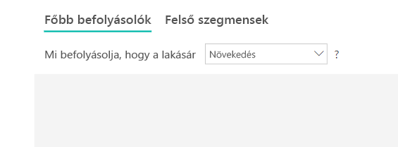
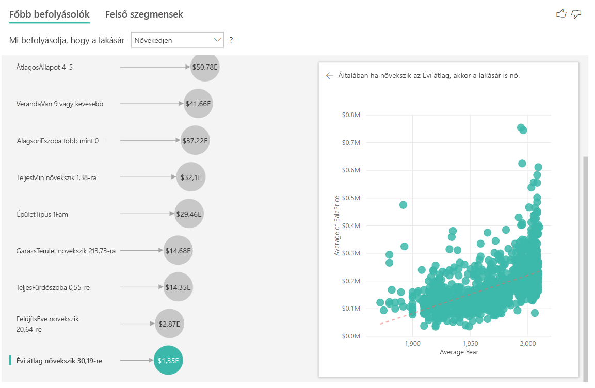
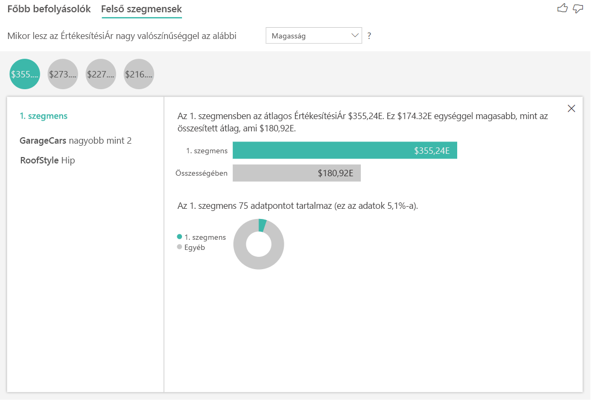
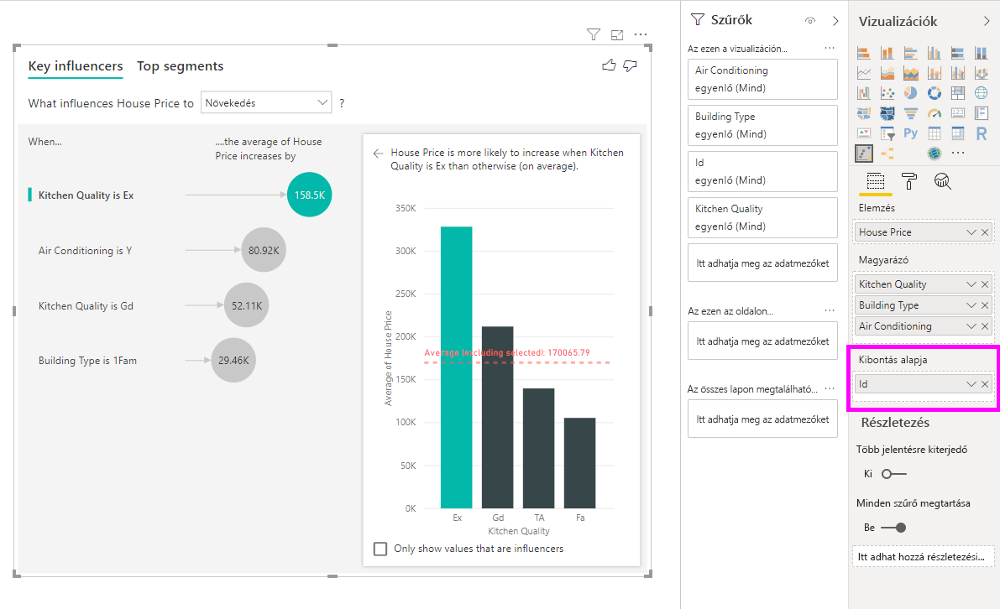

# Főbb befolyásolók vizualizációinak létrehozása

[!INCLUDE[consumer-appliesto-nyyn](../includes/consumer-appliesto-nyyn.md)]    

[!INCLUDE [power-bi-visuals-desktop-banner](../includes/power-bi-visuals-desktop-banner.md)]

A főbb befolyásolók vizualizáció segít megérteni azokat a tényezőket, amelyek az érdeklődésére számot tartó metrikát alakítják. Elemzi az adatokat, rangsorolja a lényeges tényezőket, és megjeleníti őket főbb befolyásolóként. Tegyük fel például, hogy meg szeretné tudni, mi befolyásolja az alkalmazotti állomány változását (más szóval az elvándorlást). Az egyik tényező lehet a munkaszerződés hossza, a másik pedig az alkalmazottak kora. 
 
## Mikor érdemes használni a főbb befolyásolókat? 
A főbb befolyásolók vizualizáció remek választás a következőkhöz: 
- Annak megtekintése, hogy milyen tényezők befolyásolják az elemzett metrikát.
- Ezen tényezők relatív fontosságának összevetése. Nagyobb hatása van az alkalmazotti állomány változására például a rövid távú szerződéseknek, mint a hosszú távúaknak? 

## A főbb befolyásoló vizualizáció funkciói

1. **Lapfülek**: Kiválaszthatja a lapfület a nézetek közötti váltáshoz. A **főbb befolyásolók** vizualizációval láthatók a kiválasztott metrika értékét leginkább befolyásoló tényezők. A **felső szegmensekkel** láthatók a metrika értékét leginkább befolyásoló felső szegmensek. Egy *szegmens* értékek kombinációjából tevődik össze. Az egyik szegmens állhat olyan felhasználókból, akik legalább húsz éve ügyfelek, és a nyugati régióban élnek. 

2. **Legördülő mező**: A vizsgált metrika értéke. Ebben a példában a **Minősítés** metrikával foglalkozunk. A kijelölt érték **alacsony**.

3. **Átértékelés**: Segít értelmezni a bal oldali panelen látható vizualizációt.

4. **Bal oldali panel**: A bal oldali panel egy vizualizációt tartalmaz. Ebben az esetben a bal oldali panel a főbb befolyásolók listáját mutatja.

5. **Átértékelés**: Segít értelmezni a jobb oldali panelen látható vizualizációt.

6. **Jobb oldali panel**: A jobb oldali panel egy vizualizációt tartalmaz. Ebben az esetben az oszlopdiagram megjeleníti a bal oldali panelen kiválasztott főbb befolyásoló **Témájának** összes értékét. A bal oldali panel **használhatóság** értéke zölddel jelenik meg. A **Téma** többi értéke feketén jelenik meg.

7. **Átlagos vonal**: Az átlag számításánál a rendszer a **Téma** összes lehetséges értékét figyelembe veszi a **használhatóság** kivételével (amely a kiválasztott befolyásoló). Tehát a számítás az összes fekete értékre vonatkozik. Azt mutatja, hogy a többi **Téma** milyen százalékban eredményezett alacsony értékelést. Ebben az esetben 11,35% adott alacsony értékelést (ezt mutatja a pontozott vonal).

8. **Jelölőnégyzet**: Szűri a jobb oldali panelen lévő vizualizációt, hogy csak az adott mezőt befolyásoló értékeket mutassa. Ebben a példában a használhatóságra, biztonságra és navigációra szűri a vizualizációt.

## Kategorikus metrika elemzése
 
Ebben a videóban megtekintheti, hogyan hozhat létre főbb befolyásolók vizualizációt kategorikus metrikával. Az alábbi lépéseket követve maga is létrehozhat egyet. 

   > [!NOTE]
   > Ez a videó a Power BI Desktop egy régebbi verzióját használja.
   > 
   > 
<iframe width="560" height="315" src="https://www.youtube.com/embed/fDb5zZ3xmxU" frameborder="0" allow="accelerometer; autoplay; encrypted-media; gyroscope; picture-in-picture" allowfullscreen></iframe>

A termékmenedzsere szeretné, ha Ön kiderítené, milyen tényezők befolyásolják az ügyfeleket, amikor negatív értékelést adnak a felhőszolgáltatással kapcsolatban. A lépések követéséhez nyissa meg az [Ügyfélvisszajelzések PBIX-fájlját](https://github.com/microsoft/powerbi-desktop-samples/tree/master/Monthly%20Desktop%20Blog%20Samples/2019/customerfeedback.pbix) a Power BI Desktopban. Az [Ügyfélvisszajelzések Excel-fájlját is letöltheti a Power BI szolgáltatáshoz vagy a Power BI Desktophoz](https://github.com/microsoft/powerbi-desktop-samples/tree/master/Monthly%20Desktop%20Blog%20Samples/2019/customerfeedback.xlsx). Válassza bármelyik hivatkozást, majd válassza a **Letöltés** lehetőséget a megnyíló GitHub-oldalon.

> [!NOTE]
> Az Ügyfélvisszajelzések adathalmazának alapja: [Moro et al., 2014] S. Moro, P. Cortez és P. Rita. A Data-Driven Approach to Predict the Success of Bank Telemarketing. (Adatvezérelt megközelítés a banki telemarketing sikerességének előrejelzéséhez.) *Decision Support Systems*, Elsevier, 62:22-31, 2014. június 

1. Nyissa meg a jelentést, és válassza a **főbb befolyásolók** ikonját. 

    

2. Húzza át az elemezni kívánt metrikát az **Elemzés** mezőbe. Annak megértéséhez, hogy min alapul a szolgáltatás alacsony ügyfélértékelése, válassza az **Ügyféltábla** > **Értékelés** lehetőséget.

3. Húzza azokat a mezőket, amelyekről úgy gondolja, hogy befolyásolhatták az **értékelést** a **Magyarázó** mezőbe. Tetszőleges számú mezőt mozgathat. Ebben az esetben kezdje a következőkkel:
    - Ország, régió 
    - Szervezeti szerepkör 
    - Előfizetés típusa 
    - Cégméret 
    - Téma
    
4. A **Kibontandó** mezőt hagyja üresen. Ez a mező csak mérték vagy összesített mező elemzésekor használatos. 

5. A negatív értékelések kiemeléséhez válassza az **Alacsony** értéket a **Mi befolyásolja az értékelést** legördülő listában.  

    

Az elemzés az elemzett mező táblaszintjén fut. Ebben az esetben ez az **Értékelés** metrika. Ez a metrika az ügyfélszinten van definiálva. Minden ügyfél megadott egy magas vagy egy alacsony pontszámot. A magyarázó tényezők mindegyikét az ügyfél szintjén kell meghatározni, hogy a vizualizáció használni tudja őket. 

Az előző példában minden egyes magyarázó tényező egy az egyhez vagy sok az egyhez kapcsolatban áll a metrikával. Ebben az esetben minden ügyfél egy témát adott meg az értékeléshez. Hasonlóképp az ügyfelek egy országból érkeztek, és egy tagsági típussal és szerepkörrel rendelkeznek a szervezetben. A magyarázó tényezők már az ügyfél attribútumai, és nincs szükség átalakításokra. A vizualizáció azonnal használhatja őket. 

A későbbiekben az oktatóanyagban összetettebb példákat tekinthet meg, melyekben egy a többhöz kapcsolatok szerepelnek. Ezekben az esetekben az oszlopokat először összesíteni kell az ügyfél szintjére az elemzés futtatása előtt. 

A magyarázó tényezőkként használt mértékek és összesítések értékelése szintén az **Elemzés** metrika táblaszintjén történik. A cikk későbbi szakaszaiban néhány további példát is láthatunk. 

## A kategorikus főbb befolyásolók értelmezése 
Vessünk egy pillantást a főbb befolyásolókra az alacsony értékeléseknél. 

### Az alacsony értékelés valószínűségét befolyásoló leggyakoribb egyéni tényező

A példában szereplő ügyfél háromféle szerepet tölthet be: fogyasztó, rendszergazda és közzétevő. Az alacsony értékeléshez hozzájáruló legfontosabb tényező az, hogy fogyasztó-e az értékelő. 

Pontosabban a fogyasztók 2,57-szer nagyobb valószínűséggel adnak negatív pontszámot a szolgáltatásnak. A főbb befolyásoló diagramjában a **Szervezeti szerepkör: fogyasztó** a bal oldali lista első helyén szerepel. A **Szervezeti szerepkör: fogyasztó** kiválasztásával a Power BI további részleteket jelenít meg a jobb oldali panelen. Látható az egyes szerepkörök alacsony értékelésre vonatkozó valószínűségének összehasonlító hatása.
  
- A fogyasztók 14,93%-a adott alacsony pontszámot. 
- Az összes többi szerepkör átlagosan ugyanakkor 5,78%-ban adott alacsony pontszámot.
- A fogyasztók 2,57-szer nagyobb valószínűséggel adnak alacsony pontszámot az összes többi szerepkörhöz képest. Ezt a zöld sáv a pontozott piros vonallal való elosztásával határozhatja meg. 

### Az alacsony értékelés valószínűségét befolyásoló második leggyakoribb egyéni tényező

A főbb befolyásolók vizualizáció sok különböző változó tényezőit hasonlítja össze és rangsorolja. A második befolyásolónak semmi köze sincs a **Szervezeti szerepkör** értékéhez. Válassza ki a listában a második befolyásoló tényezőt, amely **A téma a használhatóság**. 

A második legfontosabb tényező az ügyfélvélemény témájával kapcsolatos. Azok az ügyfelek, akik megjegyzést fűztek a termék használhatóságához 2,55-ször nagyobb valószínűséggel adtak alacsony pontszámot azokhoz az ügyfelekhez képest, akik más témákhoz, például a megbízhatósághoz, a tervezéshez vagy a sebességhez fűztek megjegyzést. 

A vizualizációk között az átlag (piros pontozott vonal) 5,78%-ról 11,34%-ra változott. Az átlag dinamikusan jön létre, mert az összes többi érték átlagán alapul. Az első befolyásoló esetén az átlag nem tartalmazza az ügyfélszerepkört. A második befolyásoló esetén nem tartalmazza a használhatóság témát. 
 
Válassza a **Csak a befolyásoló értékek megjelenítése** jelölőnégyzetet, amellyel csak a befolyásoló értékekre szűrhet. Ebben az esetben ezek a szerepkörök eredményezik az alacsony pontszámot. A tizenkét témából kiszűrte azt a négyet, amelyet a Power BI alacsony értékelést okozóként azonosított. 

## Interakció más vizualizációkkal 
 
Minden alkalommal, amikor rákattint egy szeletelőre, szűrőre vagy más vizualizációra a vásznon, a főbb befolyásolók vizualizáció újrafuttatja az új adatrészre vonatkozó elemzését. Áthúzhatja például a **cégméretet** a jelentésbe, és szeletelőként használhatja. Segítségével megtekintheti, hogy a főbb befolyásolók nagyvállalati ügyfelei körében eltérőek-e az általános népességhez viszonyítva. A nagyvállalatok több mint 50 000 alkalmazottat foglalkoztatnak.
 
A **>50 000** választásával újrafuttatja az elemezést, és láthatja, hogy a befolyásoló tényezők megváltoztak. A nagyvállalati ügyfeleknél az alacsony értékelések legfőbb befolyásoló tényezője a biztonsággal kapcsolatos téma. Előfordulhat, hogy további elemzésekkel azt is meg kell vizsgálni, hogy vannak-e olyan meghatározott biztonsági funkciók, amelyekkel a nagyvállalati ügyfelek nem elégedettek. 

## Folyamatos főbb befolyásolók értelmezése 
 
Az eddigiekben a vizualizációt arra használta, hogy megtudja, hogyan befolyásolják a különböző kategóriákba tartozó mezők az alacsony értékeléseket. Folyamatosan érvényesülő tényezők (például kor, magasság, ár) is szerepelhetnek a **Magyarázó** mezőben. Nézzük meg, mi történik, ha a **Bérleti idő** elemet áthelyezi az Ügyfél táblából a **Magyarázó** mezőbe. A Bérleti idő azt mutatja meg, hogy mennyi ideje használja az ügyfél a szolgáltatást. 
 
A Bérleti idő növekedésével az alacsony értékelések valószínűsége is növekszik. Ez a trend azt sugallja, hogy a régebbi ügyfelek nagyobb valószínűséggel adnak negatív pontszámot. Ez érdekes eredmény, és célszerű lehet részletesebben foglalkozni vele később. 
 
A vizualizáció azt tudatja Önnel, hogy a bérleti idő minden 13,44 hónapja után az alacsony értékelés valószínűsége 1,23-szorosára nő. Ebben az esetben 13,44 hónap a bérleti idő szórását jelenti. Tehát a kapott megállapítás arra vonatkozik, hogy a bérleti idő standard mennyiséggel (a bérleti idő szórásával) való növelése hogyan befolyásolja az alacsony értékelések valószínűségét. 
 
A jobb oldali ablaktábla pontdiagramja a bérleti idő egyes értékeihez tartozó alacsony értékelések átlagos százalékos arányát számítja ki. A lejtést trendvonallal emeli ki.

## Dobozolt folyamatos főbb befolyásolók

Bizonyos esetekben előfordulhat, hogy a folyamatos tényezők automatikusan kategorikussá váltak. Ennek az az oka, hogy a változók közötti kapcsolat nem lineáris, ezért nem lehet egyszerűen növekvőként vagy csökkenőként leírni a kapcsolatot (mint például a fenti példában).

Korrelációs tesztekkel meghatározzuk, hogy mennyire lineáris a befolyásoló a célpontra nézve. Ha a cél folytonos, Pearson-korrelációt futtatunk, ha pedig kategorikus, pontbiszeriális korrelációs teszteket végzünk. Ha azt észleljük, hogy a kapcsolat nem megfelelően lineáris, felügyelt dobozolást hajtunk végre, amellyel legfeljebb öt dobozt hozunk létre. Annak megállapításához, hogy mely dobozokat érdemes használni, felügyelt dobozolási módszert alkalmazunk, amely a magyarázó tényező és az elemzett célpont közti kapcsolatot vizsgálja.

## Mértékek és összesítések értelmezése főbb befolyásolókként 
 
A mértékeket és összesítéseket magyarázó tényezőkként is használhatja az elemzésben. Például előfordulhat, hogy meg szeretné tekinteni, milyen hatással van az ügyfelek támogatási jegyeinek száma vagy a nyitott jegyek átlagos időtartama a kapott pontszámra. 
 
Ebben az esetben látni szeretné, hogy az ügyfél támogatási jegyeinek száma befolyásolja-e a kapott pontszámot. Hívja be a **támogatási jegy azonosítóját** a támogatási jegyek táblájából. Mivel az ügyfél több támogatási jeggyel is rendelkezhet, Önnek összesítenie kell az azonosítót az ügyfél szintjén. Az összesítés fontos, mert az elemzés az ügyfél szintjén fut, ezért az összes befolyásoló tényezőt ezen a részletességi szinten kell definiálni. 
 
Tekintsük meg az azonosítók számát. Minden ügyfélsorhoz tartoznak támogatási jegyek. Ebben az esetben a támogatási jegyek számának növekedésével az alacsony értékelések valószínűsége 5,51-szeresére növekszik. A jobb oldali vizualizáció megjeleníti a támogatási jegyek átlagos számát az eltérő **értékelések** szerint (az ügyfél szintjén kiértékelve). 

## Az eredmények értelmezése: Felső szegmensek 
 
A **Főbb befolyásolók** lapfülön egyesével értékelheti a tényezőket. A **Felső szegmensek** lapfüllel emellett megtekintheti, hogy a tényezők egyvelege milyen hatással van az elemzett metrikára. 
 
A felső szegmensek kezdetben megjelenítik a Power BI által felfedezett összes szegmens áttekintését. Az alábbi példán látható, hogy a program hat szegmenst talált. Ezekben a szegmensekben a rangsorolás a szegmenseken belüli alacsony értékelések százalékos aránya alapján történik. Az 1. szegmensben például az alacsony ügyfélértékelések aránya 74,3%-os. Minél magasabban van a buborék, annál nagyobb az alacsony értékelések aránya. A buborék mérete attól függ, hogy hány ügyfél található a szegmensben. 

Egy buborék kiválasztásával megjelenítheti az adott szegmens részleteit. Ha például kiválasztja az 1. szegmenst, láthatja, hogy az viszonylag régi ügyfelekből áll. Már több mint 29 hónapja ügyfelek, és több mint négy támogatási jeggyel rendelkeznek. Végül pedig ők nem publikálók (tehát vagy ügyfelek vagy adminisztrátorok). 
 
Ennek a csoportnak a 74,3 %-a adott alacsony értékelést. Az átlagos ügyfél 11,7%-ban ad alacsony értékelést, tehát ebben a szegmensben nagyobb az alacsony értékelések aránya. Egészen pontosan 63 százalékponttal magasabb. Az 1. szegmens az adatok kb. 2,2%-át tartalmazza, tehát a populáció egy körülhatárolható részét képviseli. 

## Darabszámok hozzáadása

Előfordul, hogy egy befolyásolónak nagy hatása van, de csak nagyon kevés adatot tartalmaz. A **Témánál** például a **használhatóság** az alacsony értékelések második legnagyobb befolyásolója. Mégis lehetséges, hogy a használhatóság miatt csak néhány ügyfél panaszkodott. A darabszámok segítenek fontossági sorrendbe állítani azokat a befolyásolókat, amelyekkel foglalkozni szeretne.

A számlálást a formázási panel **Elemzés kártyáján** kapcsolhatja be.

A számlálók bekapcsolása esetén minden befolyásoló buborékja körül egy körív jelenik meg, amely a befolyásoló által tartalmazott adatok hozzávetőleges arányát mutatja. Minél hosszabb a buborék körüli ív, annál több benne az adat. Látható, hogy a **használhatóság** **Téma** csak az adatok nagyon kis hányadát tartalmazza.

Az alsó Rendezés kapcsolóval a buborékok a befolyás helyett a darabszám szerint is rendezhetők. Darabszám alapján a legnagyobb befolyásoló az, ha az **Előfizetés típusa** **Premier**.

Ha a körív teljes kör, az azt jelenti, hogy ez a befolyásoló tartalmazza az adatok 100%-át. A formázási panel **Elemzés kártyájának** a **Számláló típusa** legördülő listájában számláló típusa úgy is módosítható, hogy a befolyásolók maximumához legyen viszonyítva. Ilyenkor a legtöbb adatot tartalmazó befolyásolót teljes kör jelöli, a többi pedig ennek arányában lesz ábrázolva.

## Numerikus metrika elemzése

Ha az **Elemzés** mezőbe egy nem összesített numerikus mezőt helyez, több lehetőség áll Ön előtt. A **Formázás panelen** a **kategorikus elemzéstípus** és a **folyamatos elemzéstípus** közül választhat, így módosítva a vizualizáció viselkedését.

A **kategorikus elemzéstípus** a fent leírt módon működik. Ha például egy 1 és 10 közötti értékekkel rendelkező felmérés pontszámait vizsgálja, felmerülhet a kérdés, hogy mi eredményez 1-es pontszámot.

A **folyamatos elemzéstípus** folyamatosra módosítja a kérdést. A fenti példából kiindulva tehát az új kérdés arra vonatkozna, hogy mi befolyásolja a felmérés pontszámainak növekedését vagy csökkenését.

Hasznos különbséget tenni a kettő között, különösen akkor, amikor számos egyedi érték található az elemzett mezőben. Az alábbi példában ingatlanok áraival foglalkozunk. Az a kérdés, hogy mi miatt 156 214 a ház ára, nem túl hasznos, mivel túl specifikus, és valószínűleg nem rendelkezünk elegendő adattal ahhoz, hogy megállapítsunk egy mintát.

Ehelyett azt a kérdést célszerű feltenni, hogy mi befolyásolja az ingatlanár növekedését, mivel az ingatlanárakat így különálló értékek helyett tartományként kezelhetjük.

## Az eredmények értelmezése: Főbb befolyásolók 

Eben a forgatókönyvben a „Mi befolyásolja az ingatlanár növekedését?” kérdéssel foglalkozunk. Olyan magyarázó tényezőket vizsgálunk, amelyek az ingatlanárakat befolyásolhatják, például a **Year Built** (a ház építésének éve), **KitchenQual** (a konyha minősége), valamint a **YearRemodAdd** (a ház felújításának éve). 

Az alábbi példában a legfőbb befolyásoló tényezőt láthatjuk, amely a kitűnő konyhaminőség. Az eredmények nagyon hasonlóak azokhoz, amelyeket a kategorikus metrikák elemzésekor láthattunk, néhány fontos különbséggel:

- A jobb oldali oszlopdiagram az átlagokat mutatja a százalékok helyett. Ez illusztrálja a kitűnő konyhával (zöld sáv) rendelkező házak átlagos árát a kitűnő konyha nélküli (pontozott vonal) házak átlagos árával szemben
- A buborékban látható szám a piros pontozott vonal és a zöld sáv közti különbség, ezúttal azonban számként (158,49K USD) kifejezve valószínűség (1,93x) helyett. A kitűnő konyhával rendelkező házak így átlagosan majdnem 160 000 USD-vel drágábbak az azzal nem rendelkezőknél.

Az alábbi példában azt vizsgáljuk, hogy a folyamatos tényező (a ház felújításának éve) milyen hatással van a ház árára. A folyamatos befolyásolók elemzések a következőkben tér el kategorikus metrikákétól:

-   A jobb oldali panel pontdiagramja a felújítás évének különböző értékeihez számítja ki az átlagos ingatlanárat. 
-   A buborékban található érték azt mutatja, hogy mennyivel emelkedik az átlagos ingatlanár (jelen esetben 2,87 ezer USD-vel), amikor a ház felújításának éve a szabványos szórással nő (amely ebben az esetben 20 év)

A mértékek esetében utolsóként a ház építésének átlagos évét vizsgáljuk. Az elemzés a következőképpen történik:

-   A jobb oldali panel pontdiagramja a táblázat különböző értékeihez számítja ki az átlagos ingatlanárat
-   A buborékban található érték azt mutatja, hogy mennyivel emelkedik az átlagos ingatlanár (jelen esetben 1,35 ezer USD-vel), amikor az átlagos év a szabványos szórással nő (amely ebben az esetben 30 év)

## Az eredmények értelmezése: Felső szegmensek

A numerikus célok felső szegmensei azokat a csoportokat jelenítik meg, amelyekben az átlagos ingatlanárak magasabbak a teljes adatkészletnél. Az alábbiakban például azt láthatjuk, hogy az **1. szegmens** olyan házakból áll, amelyeknél a **GarageCars** (a garázsban tárolható autók száma) értéke nagyobb 2-nél, a **RoofStyle** (tető típusa) pedig Dőlt. Az ilyen házak átlagos ára 355 ezer USD, szemben a teljes átlaggal, amely 180 ezer USD.

## Mérték vagy összesített oszlop metrika elemzése

Mérték vagy összesített oszlop esetében az elemzés alapértelmezése a [fent](https://docs.microsoft.com/power-bi/visuals/power-bi-visualization-influencers#analyze-a-metric-that-is-numeric) ismertetett **folytonos elemzéstípus**. Ez nem módosítható. Mérték vagy összesített oszlop elemzése esetén a nem összesített numerikus oszlopéhoz képest a fő eltérés az elemzés futtatásának szintje.

Nem összesített oszlopoknál az elemzés mindig a tábla szintjén fut. A fenti ingatlanos példában az **Ingatlanár** metrika elemzésével állapítottuk meg, hogy mi befolyásolja az ingatlanárak emelkedését és csökkenését. Az elemzés automatikusan a tábla szintjén fut. A tábla minden házhoz egyedi azonosítót tartalmaz, tehát az elemzés a házak szintjén fut.

Mértékek és összesített oszlopok esetén nem azonnal nyilvánvaló, hogy azokat milyen szinten elemezzük. Ha az **Ingatlanár** **átlagként** lett összesítve, akkor figyelembe kell vennünk, hogy milyen szinten szeretnénk kiszámítani az ingatlanárak átlagát. Ez az adott környéken átlagos ingatlanár? Esetleg regionális szintű?

A mértékek és az összesített oszlopok automatikusan a használt **Magyarázó** mezők alapján vannak elemezve. Tegyük fel, hogy a **Magyarázó** mezők között három olyan van, amely minket érdekel: **Konyha minősége**, **Épület jellege** és **Légkondicionálás**. Az **átlagos ingatlanár** a három mező minden egyedi kombinációjára ki lesz számítva. Sokszor érdemesebb táblázatos nézetre váltani, és átnézni az éppen kiértékelt adatokat.

Ez erősen összesített elemzés, így a regressziós modell nehezen talál olyan mintázatot az adatok között, amelyből tanulhat. A jobb eredmény érdekében az elemzést részletesebb szinten kellene lefuttatnunk. Ha az ingatlanok árát az egyes ingatlanok szintjén szeretnénk elemezni, akkor az elemzésbe fel kellene vennünk az **ID** (azonosító) mezőt. Azt azonban nem szeretnénk, hogy az ingatlanazonosító befolyásolónak minősüljön. Nem volna hasznos ismeret, hogy a nagyobb azonosítójú ingatlanok ára magasabb. Itt jut szerephez a **Kibontandó** mezőgyűjtő. A **Kibontandó** gyűjtőbe azokat a mezőket vehetjük fel, amelyeket az elemzés szintjének beállításához szeretnénk használni anélkül, hogy új befolyásolókat keresnénk.

Vizsgáljuk meg a vizualizációt, amelyet akkor kapunk, ha az **ID** mezőt felvesszük a **Kibontandó** gyűjtőbe. Ha a mérték kiértékelésének szintje már meg van határozva, a befolyásolók pontosan ugyanúgy értelmezhetők, mint a [nem összesített numerikus oszlopok](https://docs.microsoft.com/power-bi/visuals/power-bi-visualization-influencers#analyze-a-metric-that-is-numeric) esetén.

Ha szeretne még alaposabban megismerkedni a mértékeknek a főbb befolyásolók vizualizációval végzett elemzésével, tekintse meg az alábbi oktatóanyagot.

<iframe width="1167" height="631" src="https://www.youtube.com/embed/2X1cW8oPtc8" frameborder="0" allow="accelerometer; autoplay; encrypted-media; gyroscope; picture-in-picture" allowfullscreen></iframe>

## Megfontolandó szempontok és hibaelhárítás 
 
**Mik a vizualizáció korlátai?** 
 
A főbb befolyásoló vizualizáció rendelkezik bizonyos korlátokkal:

- A Direct Query nem támogatott
- Az Azure Analysis Services és az SQL Server Analysis Services szolgáltatásokhoz való élő kapcsolat nem támogatott
- A webes közzététel nem támogatott
- A .NET-keretrendszer 4.6-os vagy újabb verzió szükséges hozzá

**Egy hibaüzenetet látok, miszerint nem találhatók befolyásolók vagy szegmensek. Ez miért van?** 

Ez a hiba akkor fordul elő, ha felvesz mezőket a **Magyarázó** elembe, de nem találhatók befolyásolók. 
- Az elemzett metrikát felvette az **Elemzés** és a **Magyarázó** elembe is. Távolítsa el a **Magyarázó** elemből. 
- A magyarázó mezők túl sok kevés megfigyeléssel rendelkező kategóriával rendelkeznek. Ez nehézzé teszi a vizualizációk számára annak a megállapítását, hogy melyek a befolyásoló tényezők. Nehéz csupán néhány megfigyelés alapján általánosítani. Ha numerikus mezőt elemez célszerű a **kategorikus elemzésről** való **folyamatos elemzésre** váltani a **Formázás panel** **Elemzés** területén.
- A magyarázó tényezők elegendő megfigyeléssel rendelkeznek az általánosításokhoz, de a vizualizáció nem talált semmilyen jelentős korrelációt, amelyről jelentést készíthetne.
 
**Egy hibaüzenet jelenik meg, miszerint az éppen elemzett metrika nem rendelkezik elég adattal az elemzés futtatásához. Ez miért van?** 

A vizualizáció úgy működik, hogy mintákat keres az adatokban az egyik csoportban a többi csoporttal összehasonlítva. Például olyan ügyfeleket keres, akik alacsony értékelést adtak, szemben a magas értékelést adókkal. Ha a modellben lévő adatok csak kevés megfigyeléssel rendelkeznek, akkor nehéz mintákat találni. Ha a vizualizáció nem rendelkezik elegendő adattal jelentős befolyásolók találásához, akkor jelzi, hogy több adatra van szükség az elemzés futtatásához. 

Azt javasoljuk, hogy a kijelölt állapothoz legalább 100 megfigyelést használjon. Ebben az esetben az állapot az elvándorló ügyfeleket jelenti. Az összehasonlításként használt állapotokhoz is legalább 10 megfigyelésre van szüksége. Ebben az esetben az összehasonlítás állapota a nem elvándorló ügyfeleket jelenti.

Ha numerikus mezőt elemez célszerű a **kategorikus elemzésről** való **folyamatos elemzésre** váltani a **Formázás panel** **Elemzés** területén.

**Hibaüzenet jelenik meg, amely szerint nem összesített elemzés esetén az elemzés mindig a szülőtábla sorainak szintjén fut. A szintnek a „Kibontandó” mezőkkel való módosítása nem megengedett. Ez miért van?**

Numerikus vagy kategorikus oszlop elemzésekor az elemzés mindig a tábla szintjén fut. Ha például ingatlanárakat elemez, és a tábla azonosító oszlopot tartalmaz, az elemzés automatikusan az ingatlanazonosítók szintjén fog futni. 

Mérték vagy összesített oszlop elemzésekor pontosan meg kell adnia, hogy milyen szinten szeretné futtatni az elemzést. Mértékekhez és összesített oszlopokhoz a **Kibontandó** gyűjtőben módosítható az elemzés szintje új befolyásolók felvétele nélkül. Ha az **Ingatlanár** mértékként lett definiálva, akkor az elemzés szintjét úgy módosíthatja, hogy felveszi az ingatlanazonosító oszlopot a **Kibontandó** gyűjtőbe.

**Egy hibaüzenet jelenik meg, miszerint a *Magyarázó* egyik mezője nem rendelkezik egyedi kapcsolattal az elemzett metrikát tartalmazó táblához. Ez miért van?**
 
Az elemzés az elemzett mező táblaszintjén fut. Ha például Ön a szolgáltatásai ügyfélvisszajelzéseit elemzi, akkor rendelkezhet egy táblával, amelyben megtalálható, hogy az ügyfél magas vagy alacsony értékelést adott. Ebben az esetben az elemzés az ügyfél táblaszintjén fut. 

Ezzel a hibával akkor találkozik, ha van egy olyan kapcsolódó táblája, amelynek a meghatározása a metrikát tartalmazó táblánál nagyobb részletességi szinten történt. Íme egy példa: 
 
- Elemzést végez azzal kapcsolatban, hogy mi befolyásolja az ügyfeleket, amikor alacsony értékeléseket adnak a szolgáltatására.
- Önt az érdekli, hogy az az eszköz, amelyen az ügyfél a szolgáltatást használja, befolyásolja-e az általa adott értékeléseket.
- Az ügyfél többféleképpen is használhatja a szolgáltatást.
- Az alábbi példában a 10000000 számú ügyfél böngészővel és táblagéppel is használja a szolgáltatást.

Ha az eszközoszlopot próbálja magyarázó tényezőként használni, akkor a következő hibát fogja látni: 

Ez a hiba azért jelenik meg, mert az eszköz nincs definiálva az ügyfél szintjén. Az ügyfél több eszközön is használhatja a szolgáltatást. Ahhoz, hogy a vizualizáció mintákat találjon, az eszköznek az ügyfél attribútumának kell lennie. Több megoldás is létezik, attól függően, mennyire látja át a vállalat működését: 
 
- Módosíthatja az eszközök összesítést az eszközök számára. Ez akkor lehet hasznos például, ha az eszközök száma hatással lehet az ügyfél által adott pontszámra. 
- Elforgathatja az eszköz oszlopot annak megtekintéséhez, hogy a szolgáltatás egy meghatározott eszközön való használata befolyásolja-e az ügyfél értékelését.
 
Ebben a példában az adatokat elforgatva hoztunk létre új oszlopokat böngészőhöz, a mobilokhoz és a táblagépekhez (győződjön meg róla, hogy a modellezési nézetben újra létrehozza a kapcsolatokat az adatok forgatása után). Ezeket az eszközöket most felhasználhatja a **Magyarázó** felületen. Láthatjuk, hogy minden eszköz befolyásoló tényező, és a böngésző van a legnagyobb hatással az ügyfél által adott pontszámra.

Pontosabban azok a felhasználók, akik nem a böngészővel használják a szolgáltatást, 3,79-szer nagyobb valószínűséggel adnak alacsony pontszámot azoknál, akik azzal használják. A listában lejjebb látható, hogy a mobilok esetében ennek az ellenkezője az igaz. A mobilalkalmazást használók nagyobb valószínűséggel adnak alacsony pontszámot, mint azok, akik nem azt használják. 

**Egy figyelmeztetést látok, miszerint az elemzésem nem tartalmaz mértékeket. Ez miért van?** 

Az elemzés az elemzett mező táblaszintjén fut. Ha az ügyfelek elvándorlását elemzi, rendelkezhet egy táblával, amely tartalmazza, hogy az ügyfél elvándorolt-e vagy sem. Ebben az esetben az elemzés az ügyfél táblaszintjén fut.
 
A mértékek és összesítések elemzése alapértelmezés szerint ezen a táblaszinten történik. Ha lenne egy mérték az átlagos havi kiadásokhoz, annak az elemzése az ügyfél táblaszintjén történne. 

Ha az ügyfél táblája nem rendelkezik egyedi azonosítóval, nem tudja kiértékelni a mértéket, és az elemzés figyelmen kívül fogja azt hagyni. Ezen helyzet elkerülése érdekében ügyeljen rá, hogy a metrikát tartalmazó tábla rendelkezik egyedi azonosítóval. Ez ebben az esetben az ügyfél táblája, az egyedi azonosító pedig az ügyfélazonosító. A Power Queryvel könnyen felvehet indexoszlopot is.
 
**Megjelenik egy figyelmeztetés, miszerint az elemzett metrika több mint 10 egyedi értékkel rendelkezik, ami befolyásolhatja az elemzésem minőségét. Ez miért van?** 

Az AI-vizualizáció kategorikus és numerikus mezőket elemezhet. Kategorikus mezőkre jó példa az Elvándorlás: Igen/Nem, Ügyfél-elégedettség: Magas/Közepes/Alacsony típus. Az elemzendő kategóriák számának növelésével kevesebb megfigyelés jut az egyes kategóriákra. Ez nehézzé teszi a vizualizáció számára, hogy mintákat találjon az adatok között. 

Numerikus mezők elemzésekor kezelheti szövegként a numerikus mezőket. Ebben az esetben a kategorikus adatokkal megegyező elemzést kell futtatnia (**kategorikus elemzés**). Ha számos különböző értékkel rendelkezik, ajánlott **folyamatos elemzésre** váltani, mivel így a számokat nem külön értékekként kezeli, hanem mintákat állapíthat meg azok változása alapján. A **kategorikus elemzésről** a **folyamatos elemzésre** a **Formázás panel** **Elemzés** területén válthat.

Erősebb befolyásoló tényezők keresése érdekében javasoljuk, hogy a hasonló értékeket csoportosítsa egyetlen egységbe. Ha például az árhoz rendelkezik metrikával, valószínű, hogy jobb eredményeket kap, ha a hasonló árakat olyan gyűjtőkben csoportosítja, mint a Magas, a Közepes és az Alacsony ahelyett, hogy egyéni árpontokat használna. 

**Az adataimban vannak olyan tényezők, amelyek főbb befolyásolóknak látszanak, de valójában nem azok. Hogyan fordulhat ez elő?**

Az alábbi példában azok az ügyfelek, akik fogyasztók, alacsony értékeléseket adnak (az értékelések 14,93%-a alacsony). Az adminisztrátori szerepkörhöz szintén nagy arányú alacsony értékelések (13,42%) tartoznak, de ez nem számít befolyásoló tényezőnek. 

Ennek az oka az, hogy a vizualizáció az adatpontok számát is figyelembe veszi a befolyásoló tényezők keresésekor. Az alábbi példában több mint 29 000 felhasználó és 10-szer kevesebb adminisztrátor (nagyjából 2900) van. Ezek közül csak 390 adott alacsony értékelést. A vizualizáció nem rendelkezik elegendő adattal annak meghatározásához, hogy valóban mintát talált-e az adminisztrátori értékeléseknél, vagy csak véletlenszerűségről van szó. 

**Mik az adatpontkorlátok a főbb befolyásolók esetében?**
Az elemzést egy 10 000 adatpontos mintán futtatja a rendszer. Az egyik oldalon található buborékokban az összes észlelt befolyásoló jelenik meg. A másik oldalon található oszlopdiagramok és pontdiagramok ezen alapvető vizualizációk mintavételi stratégiáit követik.

**Hogyan történik a főbb befolyásolók kiszámítása kategorikus elemzésnél?**

A színfalak mögött a mesterséges intelligencia az [ML.NET-et](https://dotnet.microsoft.com/apps/machinelearning-ai/ml-dotnet) használja logisztikai regresszió futtatásához a főbb befolyásolók kiszámításához. A logisztikai regresszió egy statisztikai modell, amely összehasonlítja a különböző csoportokat egymással. 

Ha azt szeretné látni, hogy mitől függnek az alacsony értékelések, a logisztikai regressziónak meg kell vizsgálnia, hogy az alacsony pontszámot adó ügyfelek miben különböznek azoktól, akik magas pontszámot adtak. Ha több pontszám-kategóriával rendelkezik, például Magas, Semleges és Alacsony, meg kell vizsgálnia, hogy miben térnek el az alacsony értékelést adó ügyfelek azoktól, akik magasabbat adtak. Ebben az esetben tehát: hogyan térnek el az alacsony pontszámot adó ügyfelek a semleges vagy magas értékelést adóktól? 
 
A logisztikai regresszió mintákat keres az adatokban, megvizsgálva, hogy miben különbözhetnek azok az ügyfelek, akik alacsony értékelést adtak azoktól, akik magas értékelést adtak. Előfordulhat például, hogy azok az ügyfelek, akik több támogatási jeggyel rendelkeznek, magasabb százalékban adnak alacsony értékeléseket, mint azok, akiknek kevés támogatási jegyük, van vagy egyáltalán nincs.
 
A logisztikai regresszió azt is figyelembe veszi, hány adatpont található. Ha például az adminisztrátori szerepkörű ügyfelek arányosan több negatív pontszámot adnak, de csak néhány adminisztrátor van, ez nem fog befolyásoló tényezőnek minősülni. Ez azért van, mert nincs elég adatpont, amiből mintára lehetne következtetni. Egy statisztikai tesztet (Wald tesztet) használunk annak meghatározására, hogy a tényező befolyásoló tényező-e. A vizualizáció 0,05-os p értéket használ a küszöbérték meghatározására. 

**Hogyan történik a főbb befolyásolók kiszámítása numerikus elemzésnél?**

A színfalak mögött az AI-vizualizáció az [ML.NET-et](https://dotnet.microsoft.com/apps/machinelearning-ai/ml-dotnet) használja lineáris regresszió futtatásához a főbb befolyásolók kiszámításához. A lineáris regresszió egy statisztikai modell, amely azt vizsgálja, hogy az elemzett mező eredménye hogyan változik a magyarázó tényezők alapján.

Ha például ingatlanárakat elemez, a lineáris regresszió megvizsgálja, hogy egy kitűnő konyha milyen hatással lehet az ingatlanárra. A kitűnő konyhákkal rendelkező házak vajon általában alacsonyabb vagy magasabb árakkal bírnak, mint az ilyenekkel nem rendelkezők?

A lineáris regresszió az adatpontok számát is figyelembe veszi. Ha például a teniszpályákkal rendelkező házakhoz magasabb árak tartoznak, azonban kevés teniszpályával rendelkező ház van, ez a tényező nem számít befolyásolónak. Ez azért van, mert nincs elég adatpont, amiből mintára lehetne következtetni. Egy statisztikai tesztet (Wald tesztet) használunk annak meghatározására, hogy a tényező befolyásoló tényező-e. A vizualizáció 0,05-os p értéket használ a küszöbérték meghatározására. 

**Hogyan történik a szegmensek kiszámítása?**

A színfalak mögött az AI-vizualizáció az [ML.NET-et](https://dotnet.microsoft.com/apps/machinelearning-ai/ml-dotnet) használja, hogy egy döntési fa alkalmazásával megkeresse az érdekes alcsoportokat. A döntési fa célja az adatpontok egy olyan alcsoportjának a megtalálása, amelyben viszonylag nagy arányban fordul elő a keresett metrika. Ez lehet például az alacsony értékelést adó ügyfelek, vagy a magas árú házak.

A döntési fa megvizsgálja mindegyik magyarázó tényezőt, és megpróbálja megindokolni, melyik tényező adja a legjobb *elágazást*. Ha például úgy szűri az adatokat, hogy azok csak nagyvállalati ügyfeleket tartalmazzanak, elkülöníti ez azokat az ügyfeleket, akik magas értékelést adtak azoktól, akik alacsonyat? Vagy esetleg jobb az adatokat úgy szűrni, hogy csak a biztonsággal kapcsolatos megjegyzést írt ügyfeleket foglalják magukba? 

Miután a döntési fa elkészíti az elágazást, az alcsoport adataiból megállapítja az újabb ideális elágazást. Ebben az esetben az alcsoport a biztonsággal kapcsolatos megjegyzést írt ügyfelek. Az egyes elágazások után megfontolja, hogy az adott alcsoport elegendő adatpontot tartalmaz-e ahhoz, hogy reprezentatívnak számítson a mintára való következtetéshez, vagy pedig csak adatanomáliáról van szó és nem valódi szegmensről. Másik statisztikai tesztet alkalmazunk az elágazási feltétel statisztikai jelentőségének ellenőrzésére 0,05-os p értékkel. 

A döntési fa a futásának befejezése után az elágazások felhasználásával (például biztonsági megjegyzések és nagyvállalatok) létrehozza a Power BI-szűrőket. A szűrőknek ez a kombinációja egy szegmensbe csomagolva szerepel a vizualizációban. 
 
**Miért válnak bizonyos tényezők befolyásolóvá vagy szűnnek meg befolyásolók lenni, miközben további mezőket helyezek át a *Magyarázó* mezőbe?**

A vizualizáció az összes magyarázó tényezőt együttesen értékeli. Miközben önmagában egy tényező lehet befolyásoló, ha azt más tényezőkkel együtt vizsgáljuk, már lehet, hogy nem az. Tegyük fel, hogy azt vizsgáljuk, mitől függ a ház magas ára a hálószobák számát és a ház méretét véve magyarázó tényezőknek:

- Önmagában a hálószobák száma okozhatja a magas házárakat.
- Ha belefoglaljuk a ház méretét az elemzésbe, az azt jelenti, hogy azt vizsgáljuk, mi történik a hálószobákkal, miközben a ház mérete állandó marad.
- Ha a ház mérete fixen 1500 négyzetláb, nem valószínű, hogy a hálószobák számának folyamatos növekedésével drámaian megnőne az ingatlanár is. 
- Lehetséges, hogy a hálószoba ebben az esetben nem annyira fontos tényező, mint mielőtt figyelembe vettük a ház méretét. 

A jelentés egy Power BI-munkatárssal való megosztásához mindkettőjüknek Power BI Pro-licenccel kell rendelkezniük, vagy a jelentésnek egy Premium kapacitásban kell lennie. Lásd a [jelentések megosztását](../collaborate-share/service-share-reports.md) ismertető szakaszt.

## Következő lépések
- [Kombinált diagramok a Power BI-ban](power-bi-visualization-combo-chart.md)
- [Vizualizációtípusok a Power BI-ban](power-bi-visualization-types-for-reports-and-q-and-a.md)
