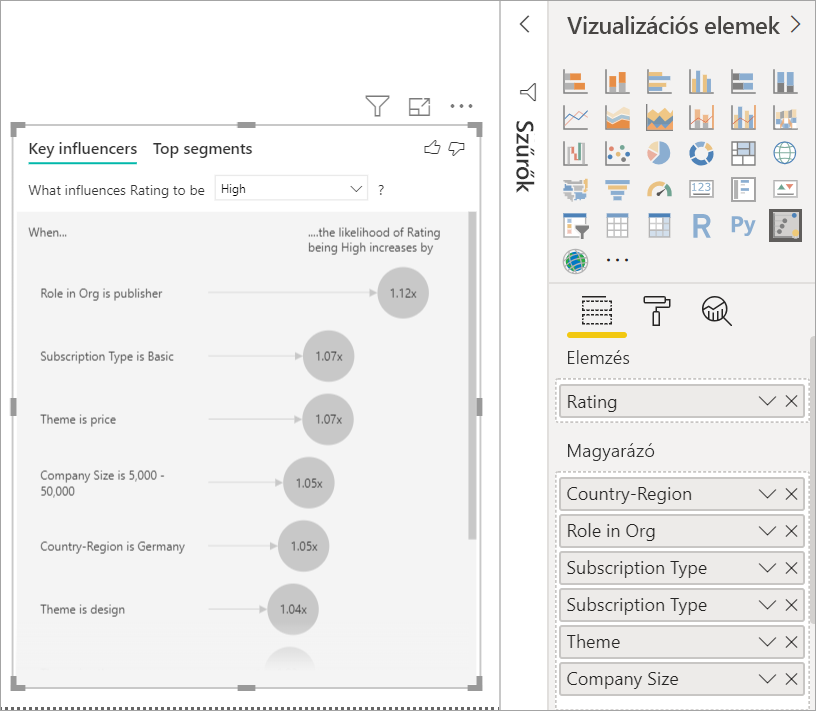

# Főbb befolyásolók vizualizáció
A vizuális fontos Véleményformálók segítségével megismerheti a tényezők a meghajtó egy Önt érdeklő metrikát. Elemzi az adatokat, rangsorolja a lényeges tényezőket, és megjeleníti őket főbb befolyásolóként. Tegyük fel például, döntse el, hogy milyen hatású alkalmazott a forgalom, amely más néven churn szeretné. Egy tényező lehet, hogy foglalkoztatási szerződés hossza, és a egy másik tényező lehet, hogy alkalmazott kora. 
 
## Mikor érdemes használni a fontos Véleményformálók 
A fontos Véleményformálók Vizualizáció használata nagyszerű választás, ha azt szeretné, a: 
- Tekintse meg, milyen tényezők befolyásolják a metrika az elemezni.
- Ellentétben ezek a tényezők a relatív fontosságát. Nagyobb hatása van az alkalmazotti állomány változására például a rövid távú szerződéseknek, mint a hosszú távúaknak? 

## A főbb befolyásolók használati követelményei 
A metrika elemez kell lennie a numerikus vagy kategorikus mező (összesítések és a mértékek még nem támogatottak).

## A vizuális fontos Véleményformálók funkciói

1. **Lapok**: Váltás a nézetek a fület választva. **Kulcs véleményvezérek** azt mutatja be, a Kiemelt közreműködők, a kiválasztott metrika értékének. **Az első szegmensek** jeleníti meg, hogy a felső szegmens, amely hozzájárul a kiválasztott metrika értékének. Egy *szegmens* értékek kombinációjából tevődik össze. Például egy szegmens lehet a fogyasztók számára, akik legalább 20 éve már az ügyfelek és a nyugati régióban élő. 

2. **Legördülő lista**: A vizsgált mérőszám értéke. Ebben a példában tekintse meg a metrika **minősítés**. A kijelölt érték **alacsony**.

3. **Szűrőutasítás**: Ez segít értelmezni a Vizualizáció a bal oldali panelen.

4. **Bal oldali panelen**: A bal oldali ablaktáblában egy Vizualizáció tartalmazza. Ebben az esetben a bal oldali ablaktáblán a felső fontos Véleményformálók listája látható.

5. **Szűrőutasítás**: Ez segít értelmezni a vizualizációt, a jobb oldali ablaktáblán.

6. **Jobb oldali ablaktáblában**: A jobb oldali ablaktáblában egy Vizualizáció tartalmazza. Ebben az esetben az oszlopdiagram értékét jeleníti meg az összes számára a legfontosabb befolyással bíró személy **téma** , amely a bal oldali panelen kiválasztott. A megadott érték **használhatósági** zöld megjelenik a bal oldali ablaktáblán. Az összes többi értékeit **téma** fekete színnel jelennek meg.

7. **Átlagos vonal**: Minden egyéb lehetséges értékei kiszámítja az átlagos **téma** kivételével **használhatósági**. Tehát a számítás az összes fekete értékre vonatkozik. Megadja, hogy hány százaléka, a másik **témák** kaptunk egy alacsony-besorolása. Más szóval minősítést kap egy ügyfél által, amikor adott ügyfél azt is leírja az okból, vagy a minősítés témáját. Egyes témák használhatóságát, a sebesség és a biztonság. 

   **Téma használhatóságra** van, a második kulcs befolyással bíró személy, egy alacsony besorolása alapján a Vizualizáció a bal oldali panelen. Ha a más témák és a egy minősítése hozzájárulásuk átlagos **alacsony**, vörös színnel jelenik meg az eredményt kapja meg. Az összes a más témák megadott, csak 11.35 % magasabbak **használhatósági**.

8. **Jelölőnégyzet**: **Csak a véleményvezérek értékek megjelenítése**.

## Főbb befolyásolók vizualizáció létrehozása 
 
Ebben a videóban megtudhatja, hogyan hozhat létre egy fontos Véleményformálók visual. Ezután kövesse az alábbi lépéseket, hozzon létre egyet. 

<iframe width="560" height="315" src="https://www.youtube.com/embed/fDb5zZ3xmxU" frameborder="0" allow="accelerometer; autoplay; encrypted-media; gyroscope; picture-in-picture" allowfullscreen></iframe>

A termék főnöke döntse el, amely számításba érdeklődő ügyfelek számára, hogy a felhőalapú szolgáltatással kapcsolatos negatív felülvizsgálatok hagyja. A lépések követéséhez nyissa meg az [Ügyfélvisszajelzések PBIX-fájlját](https://github.com/Microsoft/powerbi-desktop-samples/blob/master/2019/customerfeedback.pbix) a Power BI Desktopban. Emellett letöltheti a [Vásárlói visszajelzési Excel-fájlt a Power BI szolgáltatásban vagy a Power BI Desktop](https://github.com/Microsoft/powerbi-desktop-samples/blob/master/2019/customerfeedback.xlsx). 

> [!NOTE]
> Az Ügyfélvisszajelzések adatkészlet alapján a [Moro et al., 2014] S. Moro o. Cortez és o. Rita. "Egy adatvezérelt megközelítéssel Bank Telemarketing sikeres előrejelzésére." *Döntési támogató rendszerekhez*, Elsevier, 62:22-31, 2014. június. 

1. Nyissa meg a jelentést, és válassza ki a **véleményvezérek kulcs** ikonra. 

    

2. A metrika az vizsgálni kívánt áthelyezése a **elemzés** mező. A **elemzés** a mező csak a kategorikus, vagy nem folyamatos, változókat támogatja. Vezérli az ügyfelek tekintheti minősítés alacsony, a szolgáltatás kiválasztása **ügyfél tábla** > **minősítés**. 
3. Úgy gondolja, hogy befolyásolhatja áthelyezési mezők **minősítés** be a **által ismertetik** mező. Továbbléphet a legtöbb mezővel. Ebben az esetben indítsa el:
    - Ország, régió 
    - Szervezeti szerepkör 
    - Előfizetés típusa 
    - Cégméret 
    - Téma 
1. A negatív minősítések összpontosíthat, válassza ki a **alacsony** a a **mi befolyásolja a minősítés kell** legördülő listából.  

    

Az elemzés futtatja a mező az elemezni kívánt tábla szintjét. Ebben az esetben azt a **minősítés** metrikát. Ez a metrika egy ügyfél szintjén van meghatározva. Minden ügyfél megkapta a magas pontszám vagy alacsony pontszámmal. A magyarázó tényezők definiálni kell az ügyfél győződjön meg arról, hogy a Vizualizáció szintjén is. 

Az előző példában minden, a magyarázó tényezők rendelkezik egy-az-egyhez vagy a mérőszám a több-az-egyhez kapcsolat. Ebben az esetben minden pontszám van társítva pontosan egy témát. Ez a téma volt a fő téma ügyfél felülvizsgálat. Hasonlóképpen ügyfelek egyik országból egy tagsági típussal rendelkeznek, és hajtsa végre egy szerepkört a szervezetben való származnak. A magyarázó tényezők már egy ügyfél attribútumai, és nincs átalakítások van szükség. A Vizualizáció teheti őket az azonnal használható. 

Az oktatóanyag későbbi részében tekinti meg, amelyek egy-a-többhöz kapcsolatok összetettebb példákat. Ezekben az esetekben az oszlopokat kell először összesíteni az ügyfél szintre az elemzés futtatása előtt. 

Mértékek és összesítések magyarázó tényezők is értékeli ki a tábla szintjén használt a **elemzés** metrikát. Néhány példa a cikk későbbi részében látható. 

## Kategorikus fontos Véleményformálók értelmezése 
Vessünk egy pillantást a fontos Véleményformálók az alacsony értékelésekhez. 

### Felső egyetlen szolgáltatás, amely befolyásolja az alacsony értékelésnek valószínűségét

Ebben a példában a szervezet három szerepkört tartalmaz: fogyasztói, a rendszergazda és a közzétevő. A legfontosabb tényező, amely hozzájárul az alacsony értékelésnek egy fogyasztó folyamatban. 

Pontosabban a felhasználók valószínűbb 2.57 alkalommal adni a szolgáltatás egy negatív pontszám. A fontos Véleményformálók diagram listák **fogyasztói szerepe a szervezeti** a bal oldali listában szereplő első. Kiválasztásával **fogyasztói szerepe a szervezeti**, Power bi-ban a jobb oldali ablaktáblában további részleteket jeleníti meg. Az összehasonlító hatással az egyes szerepkörök egy alacsony értékelésnek valószínűségét jelenik meg.
  
- a fogyasztók 14.93 % biztosítanak alacsony pontszámmal. 
- Átlagosan a többi szerepkör biztosítanak alacsony pontszámmal 5.78 idő %-a.
- A fogyasztók 2.57 alkalommal nagyobb valószínűséggel biztosítanak alacsony pontszámmal a többi szerepkör képest. Megadhatja, hogy ez a piros pontozott vonal a zöld sáv halmozódik. 

### Második egyetlen szolgáltatás, amely befolyásolja az alacsony értékelésnek valószínűségét

A vizuális fontos Véleményformálók hasonlítja össze, és rangsorolja a számos különböző változók tényezők. A második befolyással bíró személy nem rendelkező **szerepkör a szervezeti**. Válassza ki a listából, amely a második befolyással bíró személy **bennük, használhatóság**. 

A második legfontosabb tényező a téma az ügyfél felülvizsgálat kapcsolódik. Ügyfelek, akik a termék használhatósága kapcsolatos ellátva voltak 2.55 alkalommal nagy valószínűséggel biztosítanak alacsony pontszámmal ügyfelek, akik más témákban, például a megbízhatóság, tervezési és sebesség ellátva képest. 

A Vizualizációk között az átlagos, amely a piros pontozott vonal jelenik meg, beállítás változása: 5.78 % 11.34 %. Az átlagos-alapú, az összes érték átlagát azért dinamikus. Az első befolyással bíró személy, az átlagos kizárt a felhasználói szerepkör. A második befolyással bíró személy, az ki lesz zárva a használhatósági téma. 
 
Válassza ki a **csak a véleményvezérek értékek megjelenítése** melletti jelölőnégyzetet, hogy csak a befolyásos értékek alapján szűrni. Ebben az esetben a szerepköröket, amelyek alacsony pontszámmal meghajtó zajlik. A Power BI azonosított, amelyek alacsony minősítések meghajtó témák négy tizenkét témák csökkentik. 

## Más Vizualizációk 
 
Minden alkalommal, amikor kiválaszt egy szeletelőt, szűrő vagy más vizualizációhoz a vásznon, a vizuális fontos Véleményformálók Újrafuttatja az elemzést az adatok új része. Például átválthat **Cégméret** a jelentést és a egy szeletelő szeretné használni. Ezzel a nagyvállalati vásárlók számára a fontos Véleményformálók eltérnek-e a lakosság megtekintéséhez. Egy vállalati vállalati mérete nagyobb, mint 50 000 alkalmazottak.
 
Kiválasztásával **> 50 000** elemzését, és láthatja, hogy megváltozott-e a véleményvezérek ismétlések. A nagyvállalati ügyfelek a felső befolyással bíró személy alacsony minősítéseket a biztonsággal kapcsolatos téma van. Előfordulhat, hogy szeretné tovább lásd: vizsgálja meg, ha vannak az adott biztonsági funkciók nagy ügyfelei véleménypontszáma kapcsolatos. 

## Folyamatos fontos Véleményformálók értelmezése 
 
Az eddigi megtudhatta, hogyan használhatja a Vizualizáció különböző kategorikus mezőket alacsony minősítések befolyásolhatja. Az is előfordulhat, hogy folyamatos tényező befolyásolja, például az életkor, a magasságra és a díj a **által ismertetik** mező. Nézzük, mi történik, amikor **bérleti idő** áthelyezik az ügyfél tábláról **által ismertetik**. Bérleti idő ábrázolja mennyi ügyfél használta a szolgáltatást. 
 
Növeli a bérleti idő, alacsonyabb minősítést fogadása valószínűségét is növekszik. Erre az irányra javasolja, hogy a hosszabb távú azokat az ügyfeleket több negatív pontszám biztosíthat. Az ilyen elemzések az érdekes, és a egy követéséhez később érdemes. 
 
A Vizualizáció látható, hogy minden alkalommal, amikor a bérleti idő 13.44 hónappal megnő, átlagosan alacsony értékelésnek valószínűségét növeli 1,23 alkalommal. Ebben az esetben 13,44 hónap a bérleti idő szórását jelenti. Így a kap elemzés néz ki, hogyan lehet a valószínűségét, hogy egy alacsony értékelésnek fogadása bérleti idő növelésével standard értékkel, amely a bérleti idő szórása, hatással van. 
 
A jobb oldali ablaktáblán a pontdiagram átlagos százalékos aránya alacsony minősítések az egyes bérleti idő értékét jeleníti meg. Kiemeli a trendvonal-görbét.

## Fontos Véleményformálók mértékek és összesítések értelmezés 
 
Használhatja mértékek és összesítések magyarázó tényezők belül az elemzést. Például érdemes tekintse meg a pontszám rendelkezik ügyfél-támogatási jegyek száma és a egy nyitott jegyet az átlagos időtartama hatásának kapja. 
 
Ebben az esetben érdemes tekintse meg, ha a támogatási jegyeket, amely egy ügyfél rendelkezik száma befolyásolja a pontszám biztosítanak. Most már Ön is betöltheti **támogatja a Jegyazonosító** a támogatási jegy táblából. Mivel egy ügyfél több támogatási jegyeket, a vevő szint azonosító összevonásakor. Összesítés fontos, mert az elemzés a felhasználói szinten fut, így minden illesztőprogramját a részletesség szintjét kell definiálni. 
 
Tekintsük át a azonosítók száma. Minden ügyfél sor nullértékkel rendelkezik egy hozzá társított támogatási jegyek száma. Ebben az esetben a támogatási jegyek növekszik, száma, az értékelés folyamatban valószínűségét alacsony megnő 5.51 alkalommal. A Vizualizáció jobb a támogatási jegyeket átlagos számát mutatja különböző **minősítés** értékek értékeli ki a vásárlói szintjén. 

## Az eredmények értelmezését: Felső szegmensek 
 
Használhatja a **véleményvezérek kulcs** fülre, és külön-külön értékeli az egyes tényezőket. Használhatja még a **szegmensek leggyakoribb** lapján megtekintheti, milyen hatással van a tényező kombinációját az elemzett metrika. 
 
Felső szegmens kezdetben megjelenítése a Power BI által felderített szegmensek áttekintése. Az alábbi példa bemutatja, hogy hat szegmens található. Ezekben a szegmensekben százalékos aránya alacsony minősítéseket a szegmensben szerint vannak rangsorolva. 1, szegmens például 74.3 % vevő minősítése, amelyek alacsony rendelkezik. Minél magasabban van a buborék, annál nagyobb az alacsony értékelések aránya. A buborék méretét jelzi, hogy hány ügyfél vannak a szegmensben. 

Egy buborék kiválasztásával megjelenítheti az adott szegmens részleteit. Ha szegmens 1, például találja, hogy áll, akkor viszonylag meglévő ügyfelek. Ezeket a ügyfelek már több mint 29 másik hónapon keresztül, és legfeljebb négy támogatási jegyek rendelkezik. Végül azok még nem kiadóknak, hogy azok a fogyasztók vagy a rendszergazdák. 
 
Ebben a csoportban 74.3 %-a az ügyfelek adott egy alacsony-besorolása. Az átlagos ügyfél adott 11,7 %-ában minősítés, így ez a szakasz egy kis minősítések nagyobb hányadát alacsony. 63 százalékos pontok nagyobb legyen. Szegmens 1 az adatok körülbelül 2.2 % is tartalmaz, így ez azt jelenti, hogy a lakosság-címmel rendelkező része. 

## Numerikus adatok használata

Ha egy numerikus mezőt a **elemzés** mező, választhat, hogy hogyan legyen kezelve a forgatókönyvhöz. Módosíthatja a Vizualizáció viselkedését megnyitom a **formázás ablaktábla** közötti váltáskor és **Kategorikus elemzéstípus** és **folyamatos elemzés típusa**.

A **Kategorikus elemzéstípus** a fent leírt módon. Például ha meg lettek beállításnak 1 és 10 közötti felmérés pontszámok megnézzük, megkérheti "Mi befolyásolja a felmérés pontszámok határa 1?"

A **folyamatos elemzéstípus** folyamatos egy módosítja a kérdést. A fenti példában az új kérdést lenne, "Mi befolyásolja a felmérés pontszámok növelheti/csökkentheti a?"

Ezt a különbséget nagyon hasznos, amikor a rendszer elemzése mezőben egyedi értékeket számos lehetősége van. Az alábbi példában áttekintjük ház árak. Már nem nagyon könnyen értelmezhető kérje meg a "Mi befolyásolja a ház ár kell 156,214?" mivel nagyon specifikus, és valószínűleg nem elegendő az adatokat egy minta célszámítógéppel.

Ehelyett előfordulhat, hogy szeretnénk kérje meg, "Mi befolyásolja ház ár növelése"? amely lehetővé teszi számunkra, hogy a ház árak kezelje a különböző értékeket, hanem egy tartományt.

## Az eredmények értelmezését: Főbb befolyásolók 

Ebben a forgatókönyvben áttekintjük, "Mi befolyásolja ház ár növelése érdekében". Mi helyzet magyarázó tényező, amelyek hatással lehetnek például a ház ár **év beépített** (a ház készítették év), **KitchenQual** (megjelenítő kijelzőket a konyhai minőség) és **YearRemodAdd** (a ház újra lett modellezett év). 

Az alábbi példában áttekintjük a felső befolyással bíró személy, amely megjelenítő kijelzőket a konyhai minőségi … kitűnő folyamatban van. Az eredmények nagyon hasonlóak az azt láttuk, hogy is elemzésekor, hogy néhány fontos különbség a kategorikus metrikák azokat:

- Az oszlopdiagram a jobb oldali fér hozzá az átlagokat helyett. Ezért megmutatja a ház és a egy kiváló konyhai átlagos ház ára mi (zöld sávok) nélkül egy kiváló konyhai (szaggatott vonal) egy adott átlagos ház ára képest
- A szám a buborékra a továbbra is a különbség a piros pontozott vonal és sáv zöld, de számos alkalmazásának ($158.49-K) helyett egy elágazás (1.93 x). Átlagos stb, a kiváló konyha házak szinte $160K drágábbak, mint házak kiváló konyha nélkül.

Az alábbi példában azt a hatást helyzet a folyamatos tényezőt (ház újra lett modellezett év) ház ár rendelkezik. Hogyan tudjuk elemezni folyamatos véleményvezérek kategorikus mérőszámhoz képest különbségek a következők:

-   A jobb oldali ablaktáblán a pontdiagram jeleníti meg mindegyik eltérő értékhez újra modellezett év átlagos ház díja. 
-   A buborék értékét jeleníti meg, mennyi az átlagos ház által ár növeli (ebben az esetben 2 USD. 87-k) Ha az év, a ház volt újra modellezett növeli a szórás (ebben az esetben 20 évben) által

Mi helyzet az átlagos év mértékek esetén végül egy ház lett létrehozva. Itt az elemzést a következőképpen történik:

-   A jobb oldali ablaktáblán a teszteredményekből jeleníti meg a tábla mindegyik eltérő értékhez átlagos ház díjszabása
-   A buborék értékét jeleníti meg, mennyi az átlagos ház által ár növeli (ebben az esetben 1 USD. 35-K) Ha az átlagos év növeli a szórás (ebben az esetben 30 év)

## Az eredmények értelmezését: Felső szegmens

Felső szegmens a numerikus célok megjelenítése csoportok, a ház átlagosan díjai magasabbak, mint a teljes adatkészletben. Például az alábbiakban látható, amely **szegmens 1** áll házak ahol **GarageCars** (a garázsnak illeszkednek autók száma) értéke nagyobb, mint 2 és a **RoofStyle** közreműködés van. Házak adott jellemzőkkel rendelkezik egy átlagos ára, 355 Ft az összesített átlagos az adatokban, amely 180 Ft.

## Megfontolandó szempontok és hibaelhárítás 
 
**Mik a korlátozások az előzetes verzióra?** 
 
A vizuális fontos Véleményformálók jelenleg nyilvános előzetes verzióban érhető el, és bizonyos korlátozásokkal rendelkezik. Tartalmazza a Funkciók, amelyek jelenleg nem érhető el: 
- Összesítések vagy mértékeket ítélt elemzése.
- A Vizualizáció a Power BI Embedded felhasználása.
- A Vizualizáció a Power BI mobile-alkalmazások felhasználása.
- Támogatja a rls-t.
- Közvetlen lekérdezés támogatása.
- Élő kapcsolat támogatása.

**Látható, amely nem véleményvezérek szegmensek találhatók vagy hiba. Ez miért van?** 

Ez a hiba akkor fordul elő, amikor mezőket tartalmazza **által ismertetik** , de nincs véleményvezérek találhatók. 
- Voltak elemzése a metrika szerepelni mindkét **elemzés** és **által ismertetik**. Távolítsa el a **által ismertetik**. 
- A magyarázó mezők túl sok kevés megfigyeléssel rendelkező kategóriával rendelkeznek. Ebben a helyzetben lehetővé teszi annak meghatározására, hogy mely tényezők véleményvezérek a vizualizációhoz tartozó rögzített. Meglehetősen nehéz általánosításához csak néhány megfigyelések alapján. Ha egy numerikus mező, van elemzése átállás érdemes **Kategorikus elemzési** való **végzett folyamatos elemzés** a a **formázás ablaktábla** alatt a  **Elemzés** kártya.
- A magyarázó tényezők van elég megfigyelések általánosítani, de a Vizualizáció nem találta meg a jelentés minden jelentéssel bíró összefüggéseket.
 
**Látható, hogy a metrika I vagyok elemzése nem rendelkezik elegendő adat az elemzés futtatása hibát. Ez miért van?** 

A Vizualizáció megnézzük az adatok egy csoport más csoportokhoz képest működik. Ha például ügyfelek, akik a megadott alacsony minősítések képest, akiknek adott nagy minősítési keresi. Ha az adatokat a modell csak néhány megfigyelések, minták megtalálása nehezebb. Ha a Vizualizáció nem rendelkezik elegendő jelentéssel bíró véleményvezérek az adatokat, az azt jelzi, hogy a több adatra van szükség az elemzést futtatni. 

Azt javasoljuk, hogy rendelkezik-e a kiválasztott állam legalább 100 megfigyeléseket. Ebben az esetben az állapot az ügyfelek, akik a vásárlói lemorzsolódás. Is szüksége lesz legalább 10 megfigyeléseket az államok összehasonlító használja. Ebben az esetben az összehasonlítás állapota vásárlók lemorzsolódásának nem.

Ha egy numerikus mező, van elemzése átállás érdemes **Kategorikus elemzési** való **végzett folyamatos elemzés** a a **formázás ablaktábla** alatt a  **Elemzés** kártya.

**Egy hibát, amely egy mezőre *által ismertetik* egyedileg nem kapcsolódik a metrika I vagyok elemzése tartalmazó tábla. Ez miért van?**
 
Az elemzés futtatja a mező az elemezni kívánt tábla szintjét. Például a szolgáltatás vásárlói visszajelzéseket elemez, akkor előfordulhat, hogy van-e egy táblát, amely tájékoztatja, hogy egy ügyfél rendelte egy nagy minősítési vagy egy alacsony értékelésnek. Ebben az esetben az elemzési fut az ügyfél tábla szintjén. 

Ha a tábla, amely tartalmazza a mérőszám, mint a részletes szintű egy kapcsolódó tábla meghatározott, ez a hibaüzenet jelenik meg. Íme egy példa: 
 
- Az ügyfelek számára biztosítanak alacsony minősítéseket a szolgáltatás vezérli elemez.
- Meg szeretné tekinteni a Ha az eszköz, amelyen az ügyfél is használja a szolgáltatás befolyásolja a felülvizsgálatok biztosítanak.
- Egy ügyfél több különböző módon lehet igénybe venni a szolgáltatást.
- A következő példában 10000000 ügyfél használja a böngésző és a egy táblagépen használják a szolgáltatást.

Az eszköz oszlop használata egy magyarázó tényezőként meg, a következő hiba jelenik meg: 

Ez a hiba akkor jelenik meg, mert az eszköz nincs definiálva az ügyfél szintjén. Egy ügyfél több eszközre a szolgáltatást használhatják. Minták keresése a vizualizációhoz tartozó az eszköz attribútummal kell rendelkeznie az ügyfél. Nincsenek számos olyan megoldást, amely az üzleti ismeretekkel függ: 
 
- Módosíthatja az összesítést az eszközök számát. Például használja a száma, ha az eszközök száma befolyásolhatja a pontszám, amely egy ügyfél ad. 
- Az eszköz oszlopban megtekintheti, ha a szolgáltatást, meghatározott eszközre felhasználása befolyásolja egy vevő minősítése is forgáspont.
 
Ebben a példában az adatokat böngésző-, mobil-, az új oszlopok létrehozásához, és táblagépes volt problémakörrel. Most már használhatja az adott megismerkedéshez **által ismertetik**. Minden eszköz kapcsolja véleményvezérek lennie, és a böngésző ügyfél pontszám a legnagyobb hatással van.

Ügyfeleink, akik nem a böngészőben a szolgáltatás felhasználásához, pontosabban 3.79 alkalommal több várhatóan alacsony pontszámmal, mint az ügyfelek, akik tegye lehetővé. Alacsonyabb lefelé a listában, a mobile inverz is igaz. Ügyfeleink, akik a mobilalkalmazás valószínűbb, hogy alacsony pontszámmal, mint az ügyfelek, akik nem. 

**Látható, hogy a mértékek nem szerepel a saját elemzési figyelmeztetést. Ez miért van?** 

Az elemzés futtatja a mező az elemezni kívánt tábla szintjét. Vásárlók lemorzsolódásának elemzése, ha lehetséges, hogy egy táblát, amely tájékoztatja, hogy egy ügyfél előforduló vagy sem. Ebben az esetben az elemzést az ügyfél tábla szintjén futtatja.
 
Mértékek és összesítések tábla szintű elemzett alapértelmezés szerint is. Ha egy mértéket az átlagos havi kiadások, azt kellene elemezheti az ügyfél tábla szintjén. 

Ha az ügyfél táblázat nem rendelkezik egy egyedi azonosítót, az mértékcsoport nem értékelhető, és az elemzés által figyelmen kívül. Ezen helyzet elkerülése érdekében győződjön meg a metrika az a tábla egyedi azonosítója. Ebben az esetben az ügyfél táblázat és az egyedi azonosító felhasználó azonosítója. A rendszer is könnyedén adhat hozzá egy indexoszlopot Power Query használatával.
 
**Látható, hogy rendelkezik-e 10-nél több egyedi értékeket a metrika I vagyok elemzése és, hogy ez a mennyiség hatással lehet a saját elemzési minőségét figyelmeztetést. Ez miért van?** 

A mesterséges Intelligencia Vizualizáció elemezheti a kategorikus és numerikus mezőket. Kategorikus mezőket, például lehet Lemorzsolódási van Igen vagy nem, és ügyfél-elégedettséget magas, közepes vagy alacsony. Kategóriák elemzéséhez számának növelésével azt jelenti, hogy kevesebb megfigyelések kategória szerinti. Ez a helyzet megnehezíti a mintákat találni az adatok a vizualizációt. 

Amikor elemzi a numerikus mezők választhat, hogy való kezelése a numerikus mezők, például szöveg, ebben az esetben fog futni az azonos elemzése, ahogy olyan kategorikus adatok között (**Kategorikus elemzési**). Ha számos különböző értékeket, javasoljuk, hogy váltson az elemzés **végzett folyamatos elemzés** , ez azt jelenti, hogy is kikövetkeztetni a mintákat, amikor számok növeléséhez vagy csökkentéséhez ahelyett kezeli őket a különböző értékeket. Válthat a **Kategorikus elemzési** való **végzett folyamatos elemzés** a a **formázás ablaktábla** alatt a **elemzési** kártya.

Erősebb véleményvezérek található, javasoljuk, hogy hasonló értékek egyetlen egységbe. Például ha ár metrikája, Ön valószínűleg jobb eredmények eléréséhez létre hasonló árak magas, közepes és alacsony kategóriák és az egyes Árpontok szerint. 

**Tényezők a saját adatok, amelyek úgy tűnik, fontos Véleményformálók lehetnek, de ezek nem. Hogyan fordulhat ez elő?**

A következő példában a felhasználók, akiket a fogyasztók alacsony minősítés az értékelések, amelyek túl alacsonyak 14.93: % meghajtó. A rendszergazda szerepkör is rendelkezik alacsony minősítések 13.42 %-os, nagy arányban, de ez nem tekinthető az befolyással bíró személy. 

Ez a döntés oka, hogy a Vizualizáció is figyelembe veszi az adatpontok száma ha véleményvezérek talál. Az alábbi példa a több mint 29,000 fogyasztók és 10-szer kevesebb rendszergazdák, körülbelül 2,900 rendelkezik. Ezek közül csak 390 alacsony értékelésnek adott. A Vizualizáció nem rendelkezik elegendő adat határozza meg, hogy talált egy minta-rendszergazda értékeléssel, vagy csak egy alkalommal keresése. 

**Hogyan kiszámítása kategorikus elemzéshez fontos Véleményformálók?**

A színfalak mögött a mesterséges Intelligencia vizualizációt használ [ML.NET](https://dotnet.microsoft.com/apps/machinelearning-ai/ml-dotnet) , futtasson logisztikai regressziót a fontos Véleményformálók kiszámításához. A logisztikai regresszió egy statisztikai modell, amely összehasonlítja a különböző csoportokat egymással. 

Ha meg szeretné tekinteni a alacsony minősítések vezérli, megvizsgálja a logisztikai regressziós hogyan az ügyfelek, akik alacsony pontszámmal rendelte az ügyfeleknek, akik rendelte a magas pontszám eltérnek. Ha több kategóriát, például magas, semleges és alacsony pontszámok, hogyan az ügyfeleknek, akik alacsony minősítést kapott eltérnek-e az ügyfelek, akik egy alacsony-besorolása nem tekinti meg. Ebben az esetben hogyan hajtsa végre az ügyfeleknek, akik alacsony pontszámmal rendelte különbözik az ügyfeleknek, akik nagy minősítési vagy semleges minősítést kapott? 
 
A logisztikai regressziós adatok keresi, és hogyan eltérhetnek az ügyfelek, akik egy alacsony értékelésnek rendelte a nagy minősítési rendelte a felhasználókat keres. Ez előfordulhat, hogy a található, például, hogy további támogatási jegyek rendelkező ügyfelek biztosítanak alacsony minősítések néhány vagy nincs támogatási jegyek rendelkező ügyfelek, mint nagyobb százalékban.
 
A logisztikai regressziós is figyelembe veszi, hány adatpontok jelen. Például ha az ügyfelek, akik a rendszergazdai szerepet adjon arányosan negatív értékeket, de van néhány csak rendszergazdák, ez nem tekinthető meggyőző. Ezt a döntést, mert nincs elegendő adatpont következtetnek ki egy minta érhető el. Egy statisztikai teszt, más néven egy Wald teszt e tényező számít egy befolyással bíró személy meghatározására szolgál. A vizualizáció 0,05-os p értéket használ a küszöbérték meghatározására. 

**Hogyan kiszámítása numerikus elemzéshez fontos Véleményformálók?**

A színfalak mögött a mesterséges Intelligencia vizualizációt használ [ML.NET](https://dotnet.microsoft.com/apps/machinelearning-ai/ml-dotnet) futtatásához egy lineáris regressziós a fontos Véleményformálók kiszámításához. Lineáris regresszió statisztikai modell, amely megállapítja, hogy hogyan változik a rendszer elemzése a mező eredményét a magyarázó tényezők alapján.

Például elemzünk ház árak, ha egy lineáris regressziós fogja végignézni a hatás having egy kiváló konyhai lesz, a ház díja. A kiváló konyha házak általában rendelkeznek kisebb vagy nagyobb ház díjak nélkül kiváló konyha házak képest?

A lineáris regressziós is figyelembe veszi az adatpontok száma. Például ha a teniszpályák házak rendelkezik magasabb árakat, de csekély házak, amelyek egy Teniszpálya van, ez nem számít meggyőző. Ezt a döntést, mert nincs elegendő adatpont következtetnek ki egy minta érhető el. Egy statisztikai teszt, más néven egy Wald teszt e tényező számít egy befolyással bíró személy meghatározására szolgál. A vizualizáció 0,05-os p értéket használ a küszöbérték meghatározására. 

**Hogyan történik a szegmensek kiszámítása?**

A színfalak mögött a mesterséges Intelligencia vizualizációt használ [ML.NET](https://dotnet.microsoft.com/apps/machinelearning-ai/ml-dotnet) érdekes alcsoportok található döntési fa futtatásához. A döntési fa célja kialakított, amelyek viszonylag magas a az Önt érdeklő metrika adatpontok csoport alcsoportja. Ennek az lehet az ügyfeleknek alacsony válasszák vagy magas árakkal házak.

A döntési fa minden magyarázó tényezőt vesz igénybe, és mely tényezőt biztosít, a legjobb OK megpróbálja *felosztása*. Például ha csak a nagyvállalati ügyfelek tartalmazza az adatok szűrése, fog, amely külön ügyfelek, akik egy nagy minősítési és a egy alacsony értékelésnek adott ki? Vagy esetleg jobban, szűrje az adatokat csak a biztonsággal kapcsolatos ellátva felhasználókat felvenni? 

A döntési fa egy felosztási bekövetkezik, miután vesz igénybe a alcsoport az adatok, és határozza meg, hogy az adatok a következő ajánlott felosztás. Ebben az esetben a alcsoport az ügyfelek, akik biztonsági ellátva. Minden egyes felosztás után azt is figyelembe veszi-e elegendő adatpont a csoport is reprezentatívnak tekinthető elég a mintát, vagy hogy az adatok és a egy valódi szegmens anomáliát célszámítógéppel rendelkezik. A felosztás feltétel statisztikai vételének 0,05 p-értékkel ellenőrzése egy másik statisztikai teszt alkalmazható. 

A döntési fa végeztével biztonsági megjegyzések és a nagyvállalati, például az összes elágazást vesz igénybe, és hozza létre a Power BI szűrők. A szűrőknek ez a kombinációja egy szegmensbe csomagolva szerepel a vizualizációban. 
 
**Miért ne bizonyos tényezőket véleményvezérek válnak vagy leállítása folyamatban van a véleményvezérek módon be további mezők áthelyezem a *által ismertetik* mező?**

A vizualizáció az összes magyarázó tényezőt együttesen értékeli. Egy tényező lehet, hogy az befolyással bíró személy önmagában, de ha akkor számít, a többi tényező nem lehet-e. Tegyük fel, hogy egy adott díja hirdetései és magyarázó tényezők ház méret magas vezérli elemezni szeretné:

- Önmagában további hirdetései lehet magas ház árak illesztőprogramját.
- Többek között ház mérete az elemzés azt jelenti, hogy kell kinéznie, hogy mi történik a Hálószobák közben ház méretű állandó marad.
- Ház mérete 1500 négyzetláb van rögzítve, ha nem valószínű, hogy a Hálószobák száma jelenti folyamatos növekedése jelentősen növeli a ház ár. 
- Előfordulhat, hogy hirdetései nem, a legfontosabb tényező előtti ház mérete tekintették. 

## Következő lépések
- [Kombinált diagramok a Power BI-ban](power-bi-visualization-combo-chart.md)
- [Vizualizációtípusok a Power BI-ban](power-bi-visualization-types-for-reports-and-q-and-a.md)
