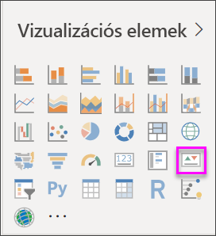

# KPI (teljesítménymutatós) vizuális elemek
A fő teljesítménymutató (KPI) olyan vizuális jel, amely egy mérhető cél terén elért előrehaladás mértékét jelzi. A KPI-kal kapcsolatos további információkért lásd: [Microsoft Developer Network](https://msdn.microsoft.com/library/hh272050).

Ha még nem regisztrált a Power BI-ra, a kezdés előtt [hozzon létre egy ingyenes próbaverziós fiókot](https://app.powerbi.com/signupredirect?pbi_source=web).

## Előfeltételek
* [Power BI Desktop – ingyenes!](https://powerbi.microsoft.com/get-started/)
* [A Kiskereskedelmi elemzési minta PBIX-fájlja](http://download.microsoft.com/download/9/6/D/96DDC2FF-2568-491D-AAFA-AFDD6F763AE3/Retail%20Analysis%20Sample%20PBIX.pbix)

## Mikor érdemes KPI-t használni?
A KPI remek választás:

* az előrehaladás mérésére (miben járok előrébb vagy miben maradtam le?)
* egy céltól való távolság mérésére (mennyivel járok előrébb vagy milyen messze vagyok tőle?)   

## KPI-követelmények
A fő teljesítménymutató (KPI) specifikus mérésen alapul, és úgy van kialakítva, hogy segítsen egy mutatószám jelenlegi értékének és állapotának egy meghatározott célhoz viszonyított értékelésében. Ezért a KPI-vizualizációhoz szükség van egy *alapmértékre*, amely egy értéket és egy *célmértéket* vagy célértéket, valamint egy *küszöbértéket* vagy *célt* ad eredményként.

Jelenleg a KPI-adatkészletnek tartalmaznia kell egy KPI célértékeit. Ha az adatkészlet nem tartalmaz ilyet, létrehozhat célokat, ha hozzáad egy célokat tartalmazó Excel-munkalapot az adatmodellhez vagy egy PBIX-fájlt.

## KPI létrehozása
A bemutatott lépések elvégzéséhez a Power BI Desktopban nyissa meg a [Kiskereskedelmi elemzési minta .PBIX-fájlját](http://download.microsoft.com/download/9/6/D/96DDC2FF-2568-491D-AAFA-AFDD6F763AE3/Retail%20Analysis%20Sample%20PBIX.pbix). Létrehozunk egy KPI-t, amely egy értékesítési cél irányába tett előrehaladást méri.

Másik lehetőségként tekintse meg a videót, amelyben bemutatjuk, hogyan hozhat létre egyetlen mutatószámos vizualizációkat: mérőműszereket, kártyákat és KPI-ket.

<iframe width="560" height="315" src="https://www.youtube.com/embed/xmja6EpqaO0?list=PL1N57mwBHtN0JFoKSR0n-tBkUJHeMP2cP" frameborder="0" allowfullscreen></iframe>

1. Nyissa meg a jelentést a Jelentés nézetben, majd új lap hozzáadásához kattintson a sárga lapfülre.    
2. A Mezők panelen válassza a **Sales > Total Units This Year** (Értékesítés > Idei összes egység) mezőt.  Ez lesz a mutató.
3. Adjon hozzá **Time > FiscalMonth** (Időpont > Pénzügyi hónap) értékeket.  Ez jelzi a trendet.
4. FONTOS: A **PénzügyiHónap** mező szerint rendezze a diagramot. Miután átalakítja a vizualizációt KPI-vé, nincs lehetőség rendezésre.

    
5. Alakítsa át a vizualizációt KPI-vé a KPI ikon kiválasztásával a Vizualizációk panelen.
   
    
6. Adjon meg egy célt. Adja meg a múlt évi értékesítést célként. Húzza a **Total Units Last Year** (Tavalyi összes egység) mezőt a **Célkitűzések** mezőbe.
   
    
7. Ha szeretné, formázza a KPI-t a festőhenger ikon kiválasztásával, amely megnyitja Formátum panelt.
   
   * **Mutató** – szabályozza a mutatószám megjelenítési egységeit és tizedesjegyeit.
   * **Trendtengely** – amikor **Be** értékre van állítva, a trendtengely a KPI-vizualizáció háttereként jelenik meg.  
   * **Célok** – amikor **Be** értékre van állítva, a vizualizáció megjeleníti a célt és a távolságot a céltól százalékban.
   * **Színkódok > Irány** – néhány KPI magasabb érték esetén *jobb*, néhány pedig alacsonyabb érték esetén *jobb*. Vessük össze például a bevételeket a várakozási idővel. Általában a bevételek magasabb értéke jobbnak tekinthető, míg a várakozási idő magasabb értéke nem. Válassza a **high is better** (a nagyobb érték jobb) lehetőséget, és igény szerint módosítsa a színbeállításokat.

A KPI-k a Power BI szolgáltatásban, illetve a mobileszközein is elérhetők, így mindig szinkronban lehet vállalkozása működésével.

## Megfontolandó szempontok és hibaelhárítás
* Amennyiben a KPI-je nem hasonlít a fentire, lehetséges, hogy pénzügyi hónapok szerint kell sorba rendeznie. Mivel a KPI-knél nem érhető el a rendezés lehetősége, a pénzügyi hónapok szerinti rendezést még *azelőtt* kell elvégeznie, hogy átalakítja a vizualizációt KPI-vé.

## Következő lépések

[Alapszintű térképek a Power BI-ban](power-bi-map-tips-and-tricks.md)

[Vizualizációtípusok a Power BI-ban](power-bi-visualization-types-for-reports-and-q-and-a.md)