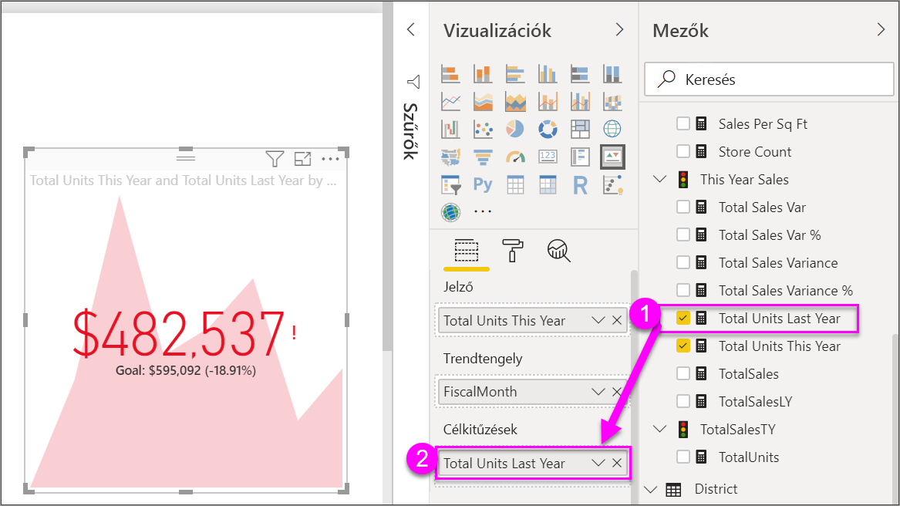

# Fő teljesítménymutató (KPI) vizualizációk létrehozása

[!INCLUDE [power-bi-visuals-desktop-banner](../includes/power-bi-visuals-desktop-banner.md)]

A fő teljesítménymutató (KPI) olyan vizuális jel, amely egy mérhető cél terén elért előrehaladás mértékét jelzi. A fő teljesítménymutatókról a [Fő teljesítménymutatók (KPI-k) a PowerPivotban](/previous-versions/sql/sql-server-2012/hh272050(v=sql.110)) című cikk ír bővebben.

Megtekintheti a videót, amelyben bemutatjuk, hogyan hozhat létre egyetlen mutatószámos vizualizációkat: kijelzőket, kártyákat és KPI-ket.
   > [!NOTE]
   > Ez a videó a Power BI Desktop egy régebbi verzióját használja.
   > 
   > 
<iframe width="560" height="315" src="https://www.youtube.com/embed/xmja6EpqaO0?list=PL1N57mwBHtN0JFoKSR0n-tBkUJHeMP2cP" frameborder="0" allowfullscreen></iframe>

## Mikor érdemes KPI-t használni?

A KPI remek választás:

* A haladás mérésére. A „mivel haladok jól, és mivel vagyok lemaradva?” kérdés megválaszolására.

* A cél távolságának mérésére. A „mennyivel járok előrébb, vagy vagyok lemaradva?” kérdés megválaszolására.

## KPI-követelmények

A tervezők egy adott mértékre alapozzák a KPI-vizualizációkat. A KPI rendeltetése egy metrika aktuális mérőszámának és állapotának kiértékelése egy meghatározott célhoz viszonyítva. Egy a KPI-vizualizációhoz egy meghatározható értékű *alapmértékre*, egy *célmértékre* vagy célértékre, valamint egy *küszöbértékre* vagy *célra* szükség.

A KPI-adathalmazoknak tartalmazniuk kell egy KPI célértékeit. Ha az adathalmaz nem tartalmaz célértékeket, létrehozhatja azokat, ha hozzáad egy célokat tartalmazó Excel-munkalapot az adatmodellhez vagy PBIX-fájlhoz.

## Előfeltételek

Ez az oktatóanyag a [Kiskereskedelmi elemzési minta PBIX-fájlt](https://download.microsoft.com/download/9/6/D/96DDC2FF-2568-491D-AAFA-AFDD6F763AE3/Retail%20Analysis%20Sample%20PBIX.pbix) használja.

1. A menüsor bal felső részén válassza a **Fájl** > **Megnyitás** lehetőséget

1. Keresse meg a **Kiskereskedelmi elemzési minta PBIX-fájlt**

1. Nyissa meg a **Kiskereskedelmi elemzési minta PBIX-fájlt** jelentés nézetben. 

1. Új oldal hozzáadásához válassza a **+** jelet. 

## KPI létrehozása

Ebben a példában létre fog hozni egy KPI-t, amely egy értékesítési cél irányába tett előrehaladást méri.

1. A **Mezők** panelen válassza az **Értékesítés > Idei összes egység** mezőt.  Ez az érték lesz a mutató.

1. Adjon hozzá **Time > FiscalMonth** (Időpont > Pénzügyi hónap) értékeket.  Ez az érték adja meg a trendet.

1. A vizualizáció jobb felső sarkában válassza a három pontot, és ellenőrizze, hogy a Power BI **FiscalMonth** szerint növekvő sorrendbe rendezte-e az oszlopokat.

    > [!IMPORTANT]
    > Miután átalakítja a vizualizációt KPI-vé, rendezésre már **nincs** lehetőség. Most kell megfelelően rendeznie.

    

    A helyesen rendezett vizualizáció az alábbihoz hasonló:

    

1. Alakítsa át a vizualizációt **KPI**-vé a KPI ikon kiválasztásával a **Vizualizációk** panelen.

    

1. Cél hozzáadásához húzza a **Total Units Last Year** (Tavalyi összes egység) mezőt a **Célkitűzések** mezőbe.

    

1. Ha szeretné, formázza a KPI-t a festőhenger ikon kiválasztásával, amely megnyitja Formátum panelt.

    * **Mutató** – szabályozza a mutatószám megjelenítési egységeit és tizedesjegyeit.

    * **Trendtengely** – amikor **Be** értékre van állítva, a vizualizáció a trendtengelyt a KPI-vizualizáció háttereként jeleníti meg.  

    * **Célok** – amikor **Be** értékre van állítva, a vizualizáció megjeleníti a célt és a távolságot a céltól százalékban.

    * **Színkódok > Irány** – néhány KPI *magasabb* értékek, néhány pedig *alacsonyabb* értékek esetén minősül jobbnak. Vessük össze például a bevételeket a várakozási idővel. Általában a bevételek magasabb értéke jobbnak tekinthető, míg a várakozási idő magasabb értéke nem. Válassza a **magas jó** lehetőséget, és igény szerint módosítsa a színbeállításokat.

KPI-k a Power BI szolgáltatásban és a mobileszközökön is elérhetők. Ez lehetőséget kínál arra, hogy mindig az üzlet pulzusán tartsa az ujját.

## Szempontok és hibaelhárítás

Amennyiben a KPI-je nem hasonlít a fentire, lehetséges, hogy nem a **FiscalMonth** mező szerint rendezte sorba. A KPI-k nem rendezhetők. Elölről kell kezdenie, és a pénzügyi hónapok (**FiscalMonth**) szerinti rendezést még *az előtt* kell elvégeznie, hogy átalakítja a vizualizációt KPI-vé.

## További lépések

* [Tippek és trükkök térképvizualizációkhoz a Power BI-ban](power-bi-map-tips-and-tricks.md)

* [Vizualizációk típusai a Power BI-ban](power-bi-visualization-types-for-reports-and-q-and-a.md)

Több kérdése van? [Kérdezze meg a Power BI közösségét](https://community.powerbi.com/)
