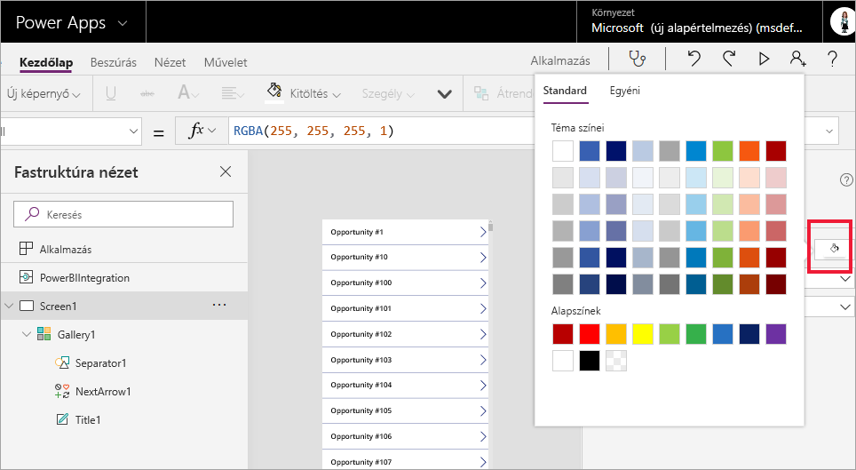

# Oktatóanyag: Power Apps-vizualizáció beágyazása egy Power BI-jelentésbe

Ebben az útmutatóban a PowerApps-vizualizáció használatával fog létrehozni egy új alkalmazást, amelyet egy Power BI-mintajelentésbe ágyaz. Az alkalmazás a jelentés többi vizualizációjához is kapcsolódni fog.

Ha még nincs PowerApps-előfizetése, kezdés előtt [hozzon létre egy ingyenes fiókot](https://web.powerapps.com/signup?redirect=marketing&email=).

Az oktatóanyag a következőket ismerteti:
> [!div class="checklist"]
> * Power Apps-vizualizáció hozzáadása Power BI-jelentéshez
> * Új alkalmazás létrehozása a Power Apps szolgáltatásban, amely a Power BI-jelentés adatait használja
> * A Power Apps-vizualizáció megtekintése és használata a jelentésben

## Előfeltételek

* [Google Chrome](https://www.google.com/chrome/browser/) vagy [Microsoft Edge](https://www.microsoft.com/windows/microsoft-edge) böngésző
* [Power BI-előfizetés](https://docs.microsoft.com/power-bi/service-self-service-signup-for-power-bi) telepített [Lehetőségelemzési mintával](https://docs.microsoft.com/power-bi/sample-opportunity-analysis#get-the-content-pack-for-this-sample)
* Ismeretek a következőkkel kapcsolatban: [Alkalmazások létrehozása a PowerAppsben](https://docs.microsoft.com/powerapps/maker/canvas-apps/data-platform-create-app-scratch) és [Power BI-jelentések szerkesztése](https://docs.microsoft.com/power-bi/service-the-report-editor-take-a-tour)

## Új alkalmazás létrehozása
Amikor a Power Apps-vizualizációt hozzáadja a jelentéshez, elindul a Power Apps Studio, és élő adatkapcsolatot hoz létre a Power Apps és a Power BI között.

1. Nyissa meg a Lehetőségelemzési mintajelentést, majd válassza az *Upcoming Opportunities* (Jövőbeli lehetőségek) lapot. 

2. Helyezze és méretezze át a jelentés néhány csempéjét, hogy az új vizualizáció elférhessen.

    

2. A Vizualizációk panelen válassza ki a Power Apps-ikont, majd méretezze át a vizualizációt úgy, hogy az illeszkedjen a létrehozott területhez.

    

3. A **Mezők** ablaktáblában válassza ki a **Name** (Név), **Product Code** (Termékkód) és **Sales Stage** (Értékesítési szakasz) mezőket. 

    

4. A Power Apps-vizualizáció csempéjén válassza ki azt a Power Apps-környezetet, amelyben az alkalmazást szeretné létrehozni, majd válassza az **Új létrehozása** lehetőséget.

    

    A Power Apps Studióban létrejött egy alapszintű alkalmazás egy *katalógussal*, amely a Power BI-ban kiválasztott mezők egyikét jeleníti meg.

    

5.  Méretezze át a katalógust úgy, hogy az csak a képernyő felét foglalja el. 

6. A bal oldali ablaktáblában válassza a **Screen1** lehetőséget, majd állítsa a képernyő **Kitöltés** tulajdonságát „LightBlue” (Világoskék) értékre, hogy az jobban kitűnjön a jelentésben.

    

6. Csináljon helyet egy felirat típusú vezérlőnek. 

    

8. A **katalógus** alatt szúrjon be egy szöveges felirat típusú vezérlőelemet.

   

7. Húzza a feliratot a vizualizáció aljára. Állítsa a **Text** tulajdonságot `"Opportunity Count: " & CountRows(Gallery1.AllItems)` értékre. A címke mostantól a jövőbeli lehetőségek számát jeleníti meg.

    

    

7. Mentse el az alkalmazást „Opportunities app” néven. 

    

## Az alkalmazás megtekintése a jelentésben
Az alkalmazás most már elérhető a Power BI-jelentésben, és a többi vizualizációval is kapcsolatban áll, mert ugyanazt az adatforrást használja.

A Power BI-jelentésben a **Jan** lehetőséget kiválasztva a dátumszeletelőben szűrést alkalmazhat a teljes jelentésre, beleértve az alkalmazásban szereplő adatokat is.

Megfigyelheti, hogy a lehetőségek száma az alkalmazásban megegyezik a jelentés bal felső sarkában szereplő számmal. A jelentés más elemeit kiválasztva az alkalmazásban szereplő adatok is frissülnek.

## Erőforrások felszabadítása
Ha már nem szeretné tovább használni a Lehetőségelemzési mintát, akkor nyugodtan törölheti az irányítópultot, a jelentést és az adatkészletet.

## Következő lépések
[Q&A – vizualizáció](power-bi-visualization-types-for-reports-and-q-and-a.md)    
[Oktatóanyag: Power Apps-vizualizáció beágyazása egy Power BI-jelentésbe](https://docs.microsoft.com/powerapps/maker/canvas-apps/powerapps-custom-visual)