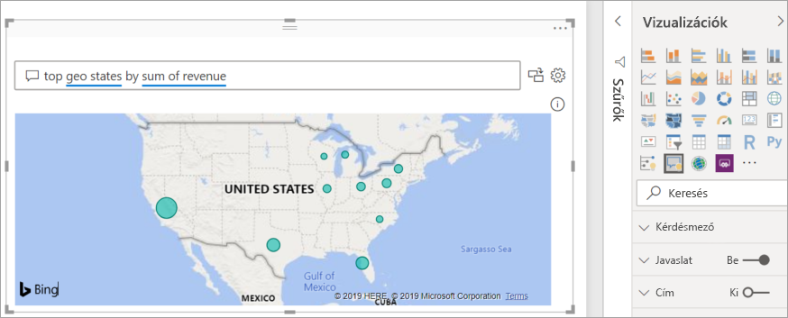

# Bevezetés a Power BI Q&A-vizualizáció használatába

[!INCLUDE [power-bi-service-new-look-include](../includes/power-bi-service-new-look-include.md)]

## Mi a Q&A-vizualizáció?

A Q&A-vizualizáció lehetővé teszi a felhasználók számára, hogy természetes nyelven feltett kérdéseikre vizualizáció formájában kapják meg a választ. 

[!INCLUDE [power-bi-visuals-desktop-banner](../includes/power-bi-visuals-desktop-banner.md)]

A Q&A-vizualizációt egyaránt igénybe vehetik a *felhasználók*, ha gyors választ kívánnak kapni a megadott adataikra, és a *tervezők*, akik két kattintással hozhatnak létre vizualizációkat bárhol a jelentésben, és természetes nyelven kezdhetik a használatot. A Q&A-vizualizáció, más vizualizációkhoz hasonlóan biztosítja a keresztszűrés és a keresztkijelölés lehetőségét, és támogatja a könyvjelzőket. A Q&A-vizualizáció támogatja a témákat és a Power BI-ban elérhető egyéb alapértelmezett formázási lehetőségeket.

A Q&A vizualizáció négy alapvető elemből áll;

- Kérdésmező. A felhasználó ide írja be a kérdést, és itt kap javaslatokat a kérdés kiegészítéséhez.
- A javasolt kérdések előre feltöltött listája.
- A Q&A vizualizációt hagyományos vizualizációra váltó ikon. 
- Ez az ikon megnyitja a Q&A-eszközök ablaktáblát, ahol a tervezők konfigurálhatják a mögöttes természetes nyelvi motort.

## Előfeltételek

1. Ez az oktatóanyag az [Értékesítési és Marketing minta PBIX-fájlt](https://download.microsoft.com/download/9/7/6/9767913A-29DB-40CF-8944-9AC2BC940C53/Sales%20and%20Marketing%20Sample%20PBIX.pbix) használja. 

1. A Power BI Desktop menüsorának bal felső részén válassza a **Fájl** > **Megnyitás** lehetőséget
   
2. Keresse meg az **Értékesítési és Marketing minta PBIX-fájlt**.

1. Fájl megnyitása jelentés nézetben .

1. Kiválasztás  új oldal hozzáadásához.

Ha hibát tapasztal a Q&A-vizualizáció létrehozása során, ellenőrizze a [korlátozások](../natural-language/q-and-a-limitations.md) szakaszban, hogy az adatforrás-konfiguráció támogatva van-e.

## Q&A-vizualizáció létrehozása javasolt kérdés használatával
Ebben a gyakorlatban egy javasolt kérdést választunk ki a Q&A vizualizáció létrehozásához. 

1. Egy üres jelentésoldalról kiindulva válassza ki a Vizualizáció ablaktáblán a Q&A-vizualizáció ikont.

    

2. Húzza át a szegélyt a vizualizáció újraméretezéséhez.

    

3. A vizualizáció létrehozásához válasszon a javasolt kérdések közül, vagy kezdjen beírni egy kérdést a kérdésmezőbe. Ebben a példában kiválasztottuk a **top geo states by sum of revenue** (vezető földrajzi államok jövedelemösszeg alapján) kérdést. A Power BI megpróbálja kiválasztani a felhasználható vizualizációtípust. Ebben az esetben ez egy térkép.

    

    De a természetes nyelven megadott lekérdezésekhez hozzáadhatja annak meghatározását is, hogy a Power BI milyen típusú vizualizációt használjon. Vegye figyelembe, hogy nem minden vizualizációtípus fog működni vagy értelmezhető eredményt mutatni az adatokkal. Ezek az adatok például nem ábrázolhatók értelmezhetően egy pontdiagramon. A kartogram azonban jól használható.

    

## Q&A-vizualizáció létrehozása természetes nyelvi lekérdezéssel
Az előző példában kiválasztottunk egy javasolt kérdést a Q&A-vizualizáció létrehozásához.  Ebben a gyakorlatban a saját kérdésünket írjuk be. A kérdés beírását a Power BI automatikus kiegészítéssel, javaslatokkal és visszajelzéssel segíti.

Ha nem biztos a kérdéstípusban vagy a szóhasználatban, bontsa ki az **Összes javaslat megjelenítése** elemet, vagy tekintse át a Mezők ablaktáblát a vászon jobb oldalán. Itt megismerheti az Értékesítési és Marketing adatkészlet szóhasználatát és tartalmát.

1. Írjon be egy kérdést a Q&A-mezőbe. A Power BI pirossal húzza alá a fel nem ismert szavakat. A Power BI lehetőség szerint segít a fel nem ismert szavak meghatározásában.  Az alábbi első példában bármelyik javaslatot kiválaszthatja.  

    

2. Ahogy előrehalad a kérdés beírásával, a Power BI értesíti, ha nem érti a kérdést, és megpróbál segíteni. Az alábbi példában a Power BI felteszi a „Did you mean...” (Arra gondolt hogy...) kérdést, és javaslatot tesz egy másik szó használatára az adatkészletből. 

    

5. A Power BI segítségével feltehettünk egy csak felismerhető kifejezésekből álló kérdést. A Power BI vonaldiagram formájában jeleníti meg az eredményeket. 

    

6. Módosítsuk a vizualizációt oszlopdiagramra. 

    

7.  Adjon hozzá további vizualizációkat a jelentésoldalhoz, és tekintse meg, hogyan kommunikál a Q&A-vizualizáció a többi vizualizációval az oldalon. Ebben a példában a Q&A-vizualizáció keresztszűrést végzett a vonatdiagramon és a térképen, és keresztkiemelést a sávdiagramon.

    

## Q&A-vizualizáció formázása és testreszabása
A Q&A-vizualizációt a formázási ablaktábla segítségével és téma alkalmazásával formázhatja. 

### Téma alkalmazása
Téma kiválasztása esetén a téma a teljes jelentésoldalra érvényes lesz. Számos téma közül választhat, ezért érdemes többet is kipróbálni, amíg megtalálja az igényeinek megfelelőt. 

1. A menüsáv **Kezdőlap** lapján kattintson a **Témaváltás** lehetőségre. 

    

    
    
2. Ebben a példában az **Egyéb témák**  > **Színvakok számára biztonságos** lehetőséget választottuk.

    

### A Q&A-vizualizáció formázása
Formázhatja a Q&A-vizualizációt, a kérdésmezőt és a javaslatok megjelenítésének módját. Mindent módosíthat, a cím hátterétől kezdve a fel nem ismert szavak rámutatáskor megjelenő színéig. Ebben a példában szürke hátteret választottunk a kérdésmezőhöz, az aláhúzás színét pedig sárgára és zöldre módosítottuk. A cím középre igazított, a háttere sárga. 

## Q&A-vizualizáció átváltása hagyományos vizualizációra
Cím és szegély hozzáadásával módosítottuk a színvakok számára biztonságos oszlopdiagramot. Most már készen állunk arra, hogy a jelentésben hagyományos vizualizációra váltsunk, majd rögzítsük azt egy irányítópulthoz.

Kattintson a , és **váltson a Q&A-eredményről hagyományos vizualizációra**.

Ez már nem Q&A-vizualizáció, hanem hagyományos oszlopdiagram. Irányítópulthoz rögzíthető. A jelentésen belül ez a vizualizáció a többi hagyományos vizualizációhoz hasonlóan működik. Figyelje meg, hogy a Vizualizáció ablaktáblán a Q&A-vizualizáció ikon helyett egy Oszlopdiagram ikon van kiemelve.

A ***Power BI szolgáltatás*** használata esetén a rögzítés ikonra kattintva rögzítheti a vizualizációt egy irányítópulthoz. 

## A Q&A-vizualizáció speciális funkciói
A fogaskerék ikonra kattintva megnyithatja a Q&A vizualizáció Eszközök ablaktábláját. 

Az Eszközök ablaktábla használatával megtaníthatja a Q&A-vizualizációnak az ismeretlen kifejezéseket, a kifejezések használatát, valamint a használatban lévő adatkészlethez és jelentéshez javasolt kérdések kezelését. Az Eszközök ablaktáblán áttekintheti a Q&A-vizualizáció használata során feltett kérdéseket, és láthatja a felhasználók által megjelölt kérdéseket. További információkhoz lásd a [Bevezetés a Q&A-eszközök használatába](../natural-language/q-and-a-tooling-intro.md) című cikket.

## Megfontolandó szempontok és hibaelhárítás
A Q&A-vizualizáció integrálva van az Office és a Bing szolgáltatásokkal az adatkészlet mezőiben lévő fel nem ismert, általános használatú szavak azonosításának megkísérléséhez.  

## Következő lépések

A természetes nyelvet többféleképpen is integrálhatja. További információért tekintse át a következő cikkeket:

* [Q&A Eszközök](../natural-language/q-and-a-tooling-intro.md)
* [Q&A – ajánlott eljárások](../natural-language/q-and-a-best-practices.md)
