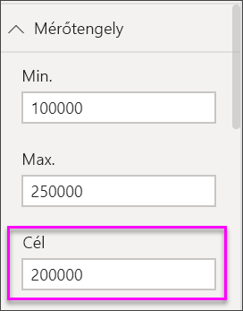

# A Power BI kör alakú mérőműszer-diagramjai

[!INCLUDE [power-bi-visuals-desktop-banner](../includes/power-bi-visuals-desktop-banner.md)]

A tárcsadiagramok egyetlen értéket jeleznek ki egy köríven. Ez mérhet egy cél felé megtett előrehaladást vagy egy fő teljesítménymutatót (KPI). A vonal (vagy *mutató*) a kitűzött célértéket jelzi. Az árnyékolás a cél elérésében tett előrehaladást mutatja. Az íven belüli érték az előrehaladás értéke. A Power BI minden lehetséges értéket egyenlően oszt el az íven, minimálistól (bal szélső érték) a maximálisig (jobb szélső érték).

Ebben a példában Ön autókereskedő, aki az értékesítési csapat havi értékesítési átlagát követi nyomon. A mutató a 140 autó eladásában meghatározott célt jelenti. Az értékesítések lehetséges minimális átlaga 0, maximuma pedig 200.  A kék árnyékolás azt mutatja, hogy a csapat átlagosan körülbelül 120 értékesítést hajtott végre ebben a hónapban. Szerencsére van még egy hetük a cél elérésére.

Megtekintheti a videót, amelyben bemutatjuk, hogyan hozhat létre egyetlen mutatószámos vizualizációkat: kijelzőket, kártyákat és KPI-ket.
   > [!NOTE]
   > Ez a videó a Power BI Desktop egy régebbi verzióját használja.
   > 
   > 
<iframe width="560" height="315" src="https://www.youtube.com/embed/xmja6EpqaO0?list=PL1N57mwBHtN0JFoKSR0n-tBkUJHeMP2cP" frameborder="0" allowfullscreen></iframe>

## Mikor érdemes mérőműszer-diagramot használni?

A mérőműszer-diagram remek választás:

* Egy cél elérésében megtett előrehaladás mutatására.

* Százalékos mérőszám, például fő teljesítménymutató jelölésére.

* Egyetlen mérték állapotának mutatására.

* Információk gyorsan átlátható és érthető megjelenítésére.

## Előfeltételek

Ez az oktatóanyag a [Pénzügyi minta Excel-fájlt](http://download.microsoft.com/download/9/6/D/96DDC2FF-2568-491D-AAFA-AFDD6F763AE3/Retail%20Analysis%20Sample%20PBIX.pbix) használja.

1. A menüsor bal felső részén válassza az **Adatok beolvasása** > **Excel** lehetőséget
   
2. Keresse meg a **Pénzügyi minta Excel-fájl** példányát

1. Nyissa meg a **Pénzügyi minta Excel-fájlt** jelentésnézetben .

1. Válassza a **financials**, majd a **Sheet1** elemet

1. Kattintson a **Betöltés** gombra

1. Kiválasztás  új oldal hozzáadásához.

## Alapszintű mérőműszer-diagram létrehozása

### 1\. lépés: Mérőműszer-diagram létrehozása a bruttó értékesítés nyomon követéséhez

1. Kezdje a műveletet egy üres jelentésoldalon

1. A **Mezők** panelen válassza a **Bruttó értékesítés** mezőt.

   

1. Módosítsa az összesítést **Átlag** értékre.

   

1. Válassza a tárcsa ikont  Az oszlopdiagram tárcsadiagrammá alakításához.

    

    Attól függően, hogy mikor tölti le a **Pénzügyi minta** fájlt, az ábráétól eltérő számokat láthat.

    > [!TIP]
    > Alapértelmezés szerint a Power BI olyan tárcsadiagramot hoz létre, amelyben a jelenlegi érték (jelen esetben a **bruttó értékesítés átlaga**) az ív felezőpontján van. Mivel az **átlagos bruttó értékesítés** 182,76 ezer dollár, a kezdőérték (Minimum) 0-ra van beállítva, a záróérték (Maximum) pedig a jelenlegi érték duplája.

### 3\. lépés: A célérték megadása

1. Húzza az **ELÁBÉ** értéket a **Mezők** panelről a **Célérték** területre.

1. Módosítsa az összesítést **Átlag** értékre.

   A Power BI hozzáad egy tűt, amely a **145,48 ezer dolláros** célértéket mutatja.

   

    Feltűnhet, hogy meghaladtuk a célt.

   > [!NOTE]
   > Manuálisan is megadhat célértéket. Lásd az alábbi [A Minimális, a Maximális és a Célértékek manuális beállítása a formázási beállítások segítségével](#use-manual-format-options-to-set-minimum-maximum-and-target-values) szakaszt.

### 4\. lépés: A maximális érték megadása

A 2. lépésben a Power BI az **Érték** mezővel automatikusan beállította a minimális és a maximális értéket. Mi a teendő, ha saját maximális értéket szeretne megadni? Tegyük fel például, hogy a jelenlegi érték duplája helyett lehetséges maximális értéknek az adathalmaz legmagasabb bruttó értékesítési értékét szeretné megadni.

1. Húzza a **Bruttó értékesítés** értéket a **Mezők** listából a **Maximális érték** területre.

1. Módosítsa az összesítést **Maximális** értékre.

   

   A rendszer újrarajzolja a mérőműszert új záróértékkel, amely 1,21 millió bruttó értékesítés.

   

### 5\. lépés: Jelentés mentése

1. [Mentse a jelentést](../service-report-save.md).

## A Minimális, a Maximális és a Célértékek manuális beállítása a formázási beállítások segítségével

1. Távolítsa el a **Gross Sales maximuma** értéket a **Maximális érték** területről.

1. Válassza a festőhenger ikont a **Formázás** panel megnyitásához.

   

1. Bontsa ki a **Mérőtengely** elemet, és adjon meg a **Min** és a **Max** értéket.

    

1. Törölje az **ELÁBÉ** beállítást a **Mezők** panelről a célérték eltávolításához.

    

1. Amikor megjelenik a **Cél** mező a **Mérőtengely** alatt, adjon meg egy értéket.

     

1. Ha szeretné, folytathatja a mérőműszer-diagram formázását.

Ha végrehajtja ezeket a lépéseket, az alábbihoz hasonló tárcsadiagramot fog kapni:

## Következő lépés

* [Fő teljesítménymutató (KPI) vizualizációk](power-bi-visualization-kpi.md)

* [Vizualizációtípusok a Power BI-ban](power-bi-visualization-types-for-reports-and-q-and-a.md)

További kérdései vannak? [Kérdezze meg a Power BI közösségét](http://community.powerbi.com/)
