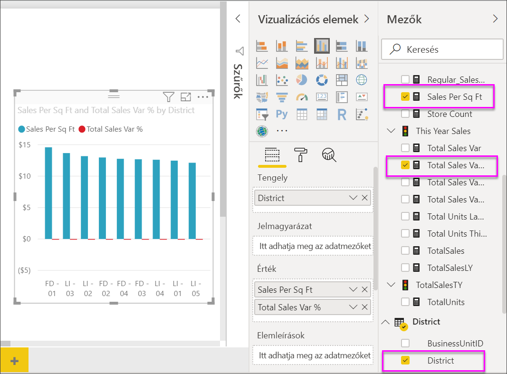
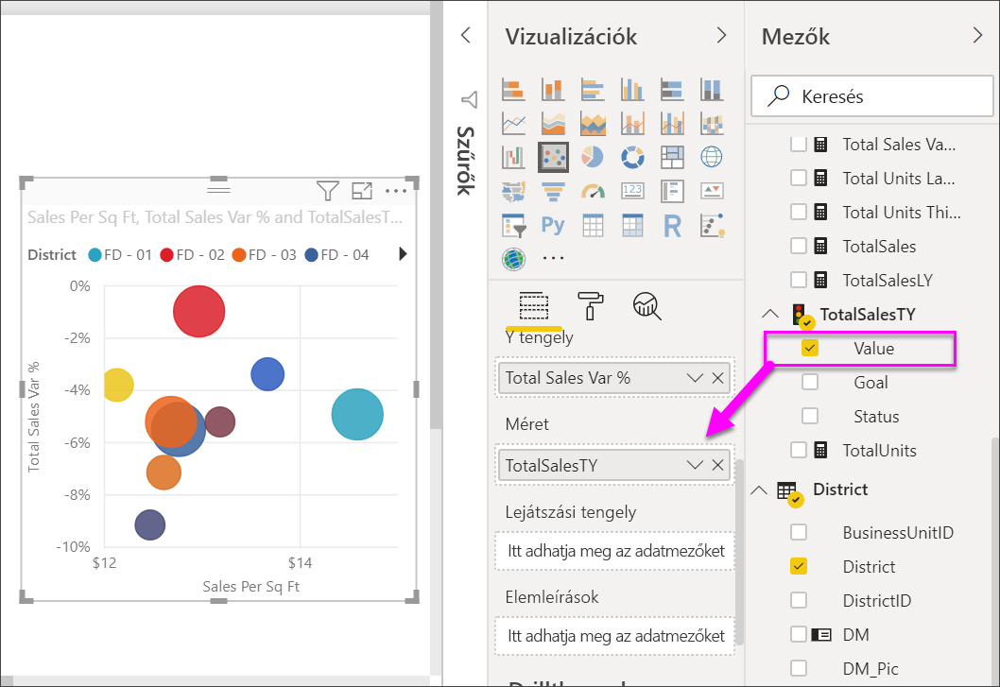

# Pontdiagramok, buborékdiagramok és pöttydiagramok a Power BI-ban

[!INCLUDE[consumer-appliesto-nyyn](../includes/consumer-appliesto-nyyn.md)]

[!INCLUDE [power-bi-visuals-desktop-banner](../includes/power-bi-visuals-desktop-banner.md)]

A pontdiagramok mindig két értéktengellyel rendelkeznek. A vízszintes tengely mentén numerikus adatok egy készletét ábrázolják, a függőleges tengely mentén pedig numerikus adatok egy másik készletét. A diagram pontokat jelenít meg az x és y numerikus értékek metszéspontjában, így egyetlen adatponttá kombinálja ezeket az értékeket. A Power BI ezeket az adatpontokat egyenletesen vagy egyenetlenül oszthatja el a vízszintes tengely mentén. Ez a diagramon megjelenített adatoktól függ.

Beállíthatja az adatpontok számát, amely legfeljebb 10 000 lehet.  

## Mikor érdemes pontdiagramot, buborékdiagramot vagy pöttydiagramot használni?

### Pont- és buborékdiagramok

A pontdiagramok két numerikus érték kapcsolatát ábrázolják. A buborékdiagramokban az adatpontok helyett buborékok szerepelnek, és a buborékok *mérete* egy harmadik adatdimenziót jelöl.

A pontdiagram remek választás a következő esetekben:

* Két numerikus érték kapcsolatának ábrázolására.

* Két számcsoport xy koordináták sorozataként való ábrázolásához.

* Vonaldiagram helyett, ha módosítani szeretné a függőleges tengely léptékét.

* A vízszintes tengely logaritmikus skálává alakításakor.

* Olyan munkalapadatok megjelenítéséhez, amelyekben értékpárok vagy az értékek csoportosított készletei szerepelnek.

    > [!TIP]
    > A pontdiagramokban módosíthatja a tengelyek független skáláit több információ megjelenítéséhez a csoportosított értékekről.

* Nagyméretű adathalmazok mintáinak megjelenítéséhez, például lineáris vagy nem lineáris trendek, fürtök és kiugró adatok megjelenítésével.

* Nagy számú adatpont összehasonlítására az időre való tekintet nélkül.  Minél több adatot tartalmaz a pontdiagram, annál jobb összehasonlítás végezhető.

Azon felül, ami pontdiagramokkal elérhető, a buborékdiagram kitűnő választás a következőkhöz:

* Ha az adatok három adatsorozattal rendelkeznek, amelyek mindegyike egy értékkészletet tartalmaz.

* Pénzügyi adatok ábrázolásához.  A különböző buborékméretek hasznosak adott értékek vizuális kiemeléséhez.

* Kvadránsokkal való használathoz.

### Pöttydiagramok

A pöttydiagram hasonlít a buborék- és pontdiagramokra, de inkább az X tengely mentén elhelyezkedő kategorizált adatok ábrázolására használható.

Érdemes ezt választani, ha kategorikus adatokat szeretne ábrázolni az X tengely mentén.

## Előfeltételek

Ez az oktatóanyag a [Kiskereskedelmi elemzési minta PBIX-fájlt](https://download.microsoft.com/download/9/6/D/96DDC2FF-2568-491D-AAFA-AFDD6F763AE3/Retail%20Analysis%20Sample%20PBIX.pbix) használja.

1. A menüsor bal felső részén válassza a **Fájl** > **Megnyitás** lehetőséget
   
2. Keresse meg a **Kiskereskedelmi elemzési minta PBIX-fájlt**

1. Nyissa meg a **Kiskereskedelmi elemzési minta PBIX-fájlt** jelentésnézetben .

1. Kiválasztás  új oldal hozzáadásához.

> [!NOTE]
> A jelentés egy Power BI-munkatárssal való megosztásához mindkettőjüknek Power BI Pro-licenccel kell rendelkezniük, vagy a jelentésnek egy Premium kapacitásban kell lennie.    

## Pontdiagram létrehozása

1. Kezdjen egy üres jelentést tartalmazó lappal, majd a **Mezők** panelen válassza a következő mezőket:

    * **Értékesítés** > **Értékesítés Négyzetláb szerint**

    * **Értékesítés** > **Teljes értékesítés %-os szórása**

    * **Kerület** > **Kerület**

    

1. A **Vizualizációk** panelen válassza a  ikont a fürtözött oszlopdiagram pontdiagrammá alakításához.

   

1. Húzza a **Kerület** elemet a **Részletek** területről a **Jelmagyarázat** területre.

    A Power BI megjelenít egy pontdiagramot, amely a **Teljes értékesítési eltérés (%)** értéket jeleníti meg az Y tengely mentén, és az **Értékesítések négyzetlábanként** értéket az X tengely mentén. Az adatpontok színe a kerületeket jelzi:

    

Most adjunk hozzá egy harmadik dimenziót.

## Buborékdiagram létrehozása

1. A **Mezők** panelen húzza az **Értékesítések** > **Idei értékesítések** > **Érték** elemet a **Méret** területre. Az adatpontok az értékesítési értékkel arányos mértékben jelennek meg.

   

1. Vigye az egérmutatót egy buborék fölé. A buborék mérete az **Idei értékesítések** értékét tükrözi.

    

1. Ha a buborékdiagramon belüli adatpontok számát szeretné megváltoztatni, a **Vizualizációk** panel **Formázás** szakaszában bontsa ki az **Általános** elemet, és állítsa az **Adatmennyiséget** a kívánt értékre.

    

    A maximális adatmennyiség értékeként bármilyen számot megadhat 10.000-ig. Ahogy egyre nagyobb számokat használ, javasolt először tesztelést végezni a megfelelő teljesítmény biztosítása érdekében.

    > [!NOTE]
    > A több adatpont miatt a betöltés tovább tarthat. Ha a felső korlátokat megközelítő jelentéseket tesz közzé, mindenképpen tesztelje azokat a weben és mobileszközön is. Ajánlatos meggyőződni arról, hogy a diagram teljesítménye megfelel a felhasználói elvárásoknak.

1. Folytathatja a vizualizáció színeinek, a címkéknek, a címeknek, a háttereknek és egyebeknek a formázását. A [kisegítő lehetőségek javítása](../desktop-accessibility.md) érdekében érdemes lehet minden vonalhoz jelölőalakzatokat hozzáadni. Ha a jelölőalakzatot szeretné kiválasztani, bontsa ki az **Alakzatok** elemet, válassza a **Jelölőalakzat** lehetőséget, majd válasszon ki egy alakzatot.

    

    A jelölőalakzat alakja megváltoztatható rombuszra, háromszögre vagy négyszögre. A különböző jelölőalakzatok használata az egyes vonalakhoz megkönnyíti a jelentés használóinak a vonalak (vagy területek) elkülönítését egymástól.

1. Nyissa meg az Elemzés panelt  további információk hozzáadásához a vizualizációhoz.  
    - Adjon hozzá egy középérték-vonalat. Válassza a **Középérték-vonal** > **Hozzáadás** lehetőséget. Alapértelmezés szerint a Power BI az *Értékesítés Négyzetláb szerint* értékhez ad hozzá középérték-vonalat. Ez nem túl hasznos, mert láthatjuk, hogy 10 adatpont áll rendelkezésre, és tudjuk, hogy a középérték úgy jön létre, hogy mindegyik oldalon öt-öt adatpont található. Ehelyett váltsa a **Mérték** beállítást a *Teljes értékesítés %-os szórása* értékre.  

        

    - Szimmetrikus árnyékolást adhat hozzá annak megjelenítéséhez, hogy mely pontokon nagyobb az x tengelyen mért érték az y tengelyhez képest, és fordítva. Ha az Elemzés panelen bekapcsolja a szimmetrikus árnyékolást, Power BI szimmetrikusan jeleníti meg a pontdiagram hátterét az aktuális tengely alsó és felső határai alapján. Ez egy gyors módszer annak azonosítására, hogy egy adatpont melyik tengelymértéket részesíti előnyben, különösen akkor, ha az x és az y tengely tengelytartománya eltér.

        a. Módosítsa a **Teljes értékesítés %-os szórása** beállítást a **Tavalyi bruttó nyereség (%)** értékre

        

        b. Az Elemzés panelen adja hozzá a **Szimmetrikus árnyékolás** elemet. Az árnyékolásból láthatjuk, hogy a Hosiery (Harisnya) (a rózsaszín árnyalatú területen lévő zöld buborék) az egyetlen kategória, amely a bruttó árrést részesíti előnyben, és nem az üzlet négyzetlábban megadott területe szerinti értékesítést. 

        

    - Folytassa az Elemzés panel felfedezését, ha további érdekes megállapításokat szeretne tenni az adatokról. 

        

## Pöttydiagram létrehozása

Pöttydiagram létrehozásához helyezzen a numerikus **X tengely** helyére egy kategorizált mezőt.

Az **X tengely** panelről távolítsa el az **Értékesítések négyzetlábanként** mezőt, és tegye a helyére a **Körzet** > **Körzeti vezető** mezőt.

## Megfontolandó szempontok és hibaelhárítás

### A pontdiagramon csak egy adatpont szerepel

A pontdiagramon csak egyetlen adatpont szerepel, amely összesíti az X és az Y tengely összes értékét?  Vagy esetleg az összes értéket egyetlen vízszintes vagy függőleges vonal mentén összesíti?

Adjon egy mezőt a **Részletek** területhez annak megadásához, hogy a Power BI hogyan csoportosítsa az értékeket. A mezőnek egyedinek kell lennie minden egyes megjeleníteni kívánt ponthoz. Megfelel például egy egyszerű sorszám vagy azonosító mező.

Vagy ha nem szerepel ilyen az adatokban, hozzon létre egy mezőt, amely pontonként valami egyedivé fűzi össze az X és Y értékeket:

Új mező létrehozásához [a Power BI Desktop Lekérdezésszerkesztőjével adjon hozzá egy indexoszlopot](../desktop-add-custom-column.md) az adatkészlethez. Ez után adja hozzá ezt az oszlopot a vizualizáció **Részletek** területéhez.

## Következő lépések

Az alábbi cikkeket is érdekesnek találhatja:

* [Nagy sűrűségű mintavételezés a Power BI-pontdiagramokban](desktop-high-density-scatter-charts.md)
* [Vizualizációtípusok a Power BI-ban](power-bi-visualization-types-for-reports-and-q-and-a.md)
* [Tippek az adatábrázolások Power BI-jelentésekben történő rendezéséhez és terjesztéséhez](../guidance/report-tips-sort-distribute-data-plots.md)

További kérdései vannak? [Kérdezze meg a Power BI közösségét](https://community.powerbi.com/)
