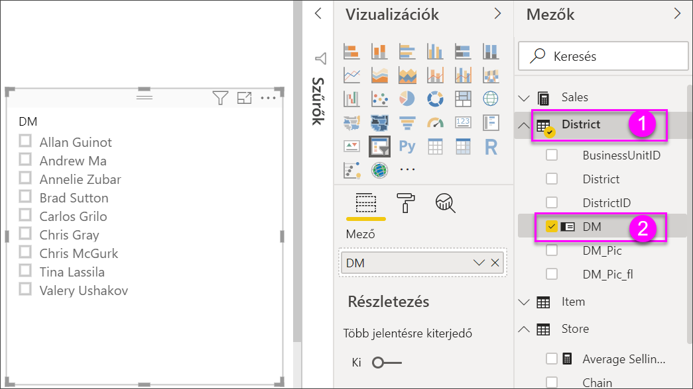
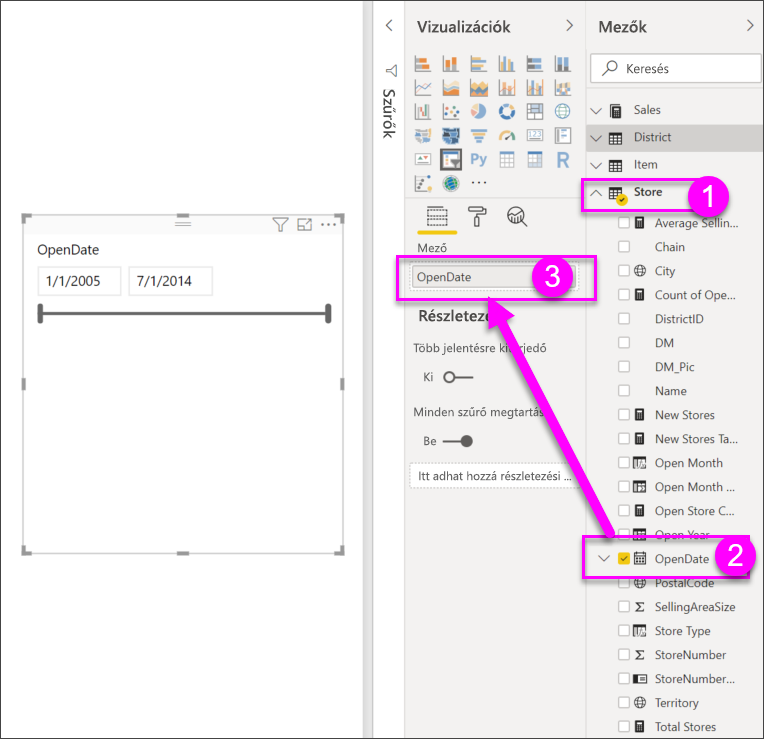
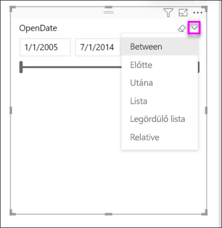
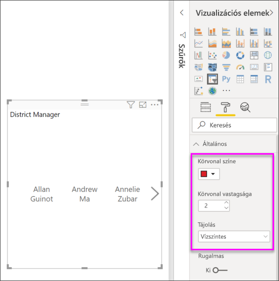
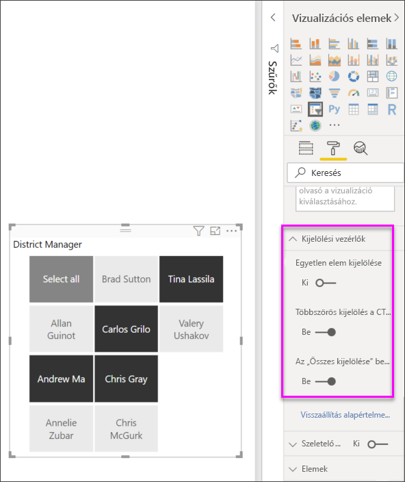

# Szeletelők a Power BI-ban

[!INCLUDE [power-bi-visuals-desktop-banner](../includes/power-bi-visuals-desktop-banner.md)]

A jelentést olvasók számára az összesítő értékesítési mérőszámok megjelenítése mellett az egyes körzeti vezetők teljesítményét és a különböző időkereteket is ki kell tudni mutatni. Létrehozhat különálló jelentéseket vagy összehasonlító diagramokat, illetve használhat szeletelőket. A szűrés másféle lehetőségét kínáló szeletelőkkel az adathalmaz a jelentés más vizualizációiban szereplő részére szűkíthető. 

Ez az útmutató az ingyenes [Kiskereskedelmi elemzési minta](../sample-retail-analysis.md) használatával mutatja be a lista és dátumtartomány típusú szeletelők létrehozásának, formázásának és használatának lépéseit. Jó szórakozást a szeletelők formázásának és használatának felfedezéséhez! 

## Mikor érdemes szeletelőt használni?
A szeletelő kitűnően alkalmas a következő célokra:

* Gyakran használt vagy fontos szűrők megjelenítése a jelentésvásznon a könnyebb elérhetőség érdekében.
* Az aktuális szűrt állapot egyszerűbb megjelenítése legördülő lista használata nélkül. 
* Az adattáblák szükségtelen és rejtett oszlopai alapján történő szűrés.
* Jobban szűrt jelentések létrehozása azáltal, hogy a szeletelőket a lényeges vizualizációk mellett helyezi el.

A Power BI-szeletelőkre a következő korlátozások érvényesek:

- A szeletelő nem támogatja a beviteli mezőket.
- A szeletelők nem támogatják a részletezést.
- A szeletelő nem támogatja a vizualizációszintű szűrőket.

## Szeletelők létrehozása

**Új szeletelő létrehozása körzeti vezető szerint szűrt adatok létrehozásához**

Ez az oktatóanyag a [Kiskereskedelmi elemzési minta PBIX-fájlt](http://download.microsoft.com/download/9/6/D/96DDC2FF-2568-491D-AAFA-AFDD6F763AE3/Retail%20Analysis%20Sample%20PBIX.pbix) használja.

1. A menüsor bal felső részén válassza a **Fájl** > **Megnyitás** lehetőséget
   
2. Keresse meg a **Kiskereskedelmi elemzési minta PBIX-fájlt**

1. Nyissa meg a **Kiskereskedelmi elemzési minta PBIX-fájlt** jelentésnézetben .

1. Kiválasztás  új oldal hozzáadásához.

2. Új szeletelő létrehozásához az Áttekintés lapon (miközben a vásznon semmi sincs kijelölve), a **Vizualizációk** panelen válassza a **Szeletelő** ikont . 
3. Az új szeletelőt kijelölve válassza a Mezők panel **Körzet** > **KV** elemét a szeletelő kitöltéséhez. Az új szeletelő névlista formájában jelenik meg, a nevek előtt jelölőnégyzetekkel. 
    
    
    
4. A szeletelő számára a szeletelő és a vásznon levő egyéb elemek átméretezésével, illetve elmozdításával biztosíthat helyet. Vegye figyelembe, hogy a szeletelő elemeit a rendszer levágja, ha a szeletelőt túl kicsire méretezi át. 
5. Jelöljön be neveket a szeletelőn, és figyelje meg a hatást az oldalon levő más vizualizációkon. A nevek bejelölésének megszüntetéséhez kattintson ismét a jelölőnégyzetükre; egynél több név bejelöléséhez tartsa lenyomva a **Ctrl** billentyűt. Az összes név kiválasztása ugyanazzal az eredménnyel jár, mintha egyet sem választana ki. 

6. A szeletelő formázásához választhatja a festőhenger ikont is. A lehetőségek száma túl nagy ahhoz, hogy mindegyiket ismertessük – kísérletezzen, és alkossa meg az Önnek megfelelő szeletelőt. Az alábbi példákban az első szeletelő vízszintes tájolást, az elemekhez pedig színezett hátteret használ. A második szeletelő függőleges marad, a színek helyett pedig megmaradt a szöveg a hagyományosabb megjelenés érdekében.

   
>[!TIP]
>Alapértelmezés szerint a szeletelő listaelemei növekvő sorrendbe vannak rendezve. A rendezés csökkenő irányba való módosításához válassza a szeletelő jobb felső sarkában levő három pontot ( **...** ), majd a **Rendezés csökkenő sorrendben** lehetőséget.

**Új szeletelő létrehozása dátumtartomány szerint szűrt adatok létrehozásához**

1. Új vizualizáció létrehozásához, miközben a vásznon semmi sincs kiválasztva, a Mezők ablaktáblán nyissa le az **Store** legördülő listát, majd húzza az **OpenDate** elemet a Vizualizációk panelen levő **Értékek** gyűjtőbe.
2. A vizualizáció szeletelővé való átalakításához, miután kijelölte az új vizualizációt, a Vizualizációk ablaktáblán válassza a **Szeletelő** ikont. Ez a szeletelő egy csúszkavezérlő, amely fel van töltve a dátumtartománnyal.
    
    

    
4. A szeletelő számára a szeletelő és a vásznon levő egyéb elemek átméretezésével, illetve elmozdításával biztosíthat helyet. Vegye figyelembe, hogy a szeletelő méretének módosításával a csúszka is átméreteződik, de ha a szeletelőt túl kicsire méretezi, akkor a csúszka eltűnik, és a dátumokat a rendszer levágja. 
4. A csúszkával különféle dátumtartományokat jelölhet ki, illetve egy dátummezőt kiválasztva értéket is megadhat vagy felugró naptárt is használhat a pontosabb kijelöléshez. Figyelje meg a hatást a lapon lévő többi vizualizáción.
    
    >[!NOTE]
    >A numerikus és a dátum/idő adattípusok alapértelmezés szerint tartomány típusú csúszka szeletelőt eredményeznek. A Power BI 2018. februári frissítésétől kezdődően az egész szám adattípusú tartománycsúszkák már egész számértékekhez igazodnak, a tizedesjegyek megjelenítése helyett. 

5. A szeletelő típusának módosításához a szeletelő kijelölt állapota mellett mutasson az egérmutatóval a szeletelő jobb felső részére, nyissa le a megjelenő legördülő listát, majd válasszon egy másik lehetőséget, például a **Lista** vagy az **Előtt** elemet. Figyelje meg a szeletelő megjelenésének és a választási lehetőségeknek a módosulását. 
 
    

A dátum és numerikus típusú szeletelők létrehozásáról és használatáról a következő videóból vagy [A numerikustartomány-szeletelő használata a Power BI Desktopban](../desktop-slicer-numeric-range.md) című cikkből tájékozódhat bővebben.
   > [!NOTE]
   > Ez a videó a Power BI Desktop egy régebbi verzióját használja.
   > 
   > 
<iframe width="560" height="315" src="https://www.youtube.com/embed/zIZPA0UrJyA" frameborder="0" allowfullscreen></iframe> 

## A lap szeletelők által érintett vizualizációinak kijelölése
Alapértelmezés szerint a jelentésoldalakon levő szeletelők az adott oldalon levő összes többi vizualizációra, valamint egymásra is hatással vannak. Az imént létrehozott lista és dátum típusú szeletelők értékeinek kiválasztása közben figyelje meg a többi vizualizációra gyakorolt hatásokat. A szűrt adatok a mindkét szeletelőben kijelölt értékek metszetét képezik. 

A **Vizualizációk interakciói** beállítással egyes vizualizációkat kivonhat a többi vizualizáció hatása alól. Az **Áttekintés** oldalon a „Teljes értékesítési szórásnégyzet pénzügyi hónap és körzeti vezető szerint” diagram átfogó összehasonlító adatokat jelenít meg a körzeti vezetőkről havi bontásban, amit érdemes mindig megjelenített állapotban tartani. A **Vizualizációk interakció** használatával megakadályozhatja, hogy a szeletelők kijelölései szűrést végezzenek ezen a diagramon. 

1. Ha a Körzeti vezető szeletelő van kijelölve a **Körzeti havi értékesítés** oldalon:
    - A Power BI Desktopban, a **Vizuális eszközök** részben válassza a **Formátum** menüt, majd válassza az **Interakciók szerkesztése** lehetőséget.
   
   A szűrővezérlők az egyéb vizualizációk felett jelennek meg az oldalon. Kezdetben az összes **Szűrő** ikon ki van jelölve.
   
2. A **Teljes értékesítési szórásnégyzet pénzügyi hónap és körzeti vezető szerint** diagram szeletelő általi szűrésének meggátlásához a diagram felett válassza a **Nincs** ikont. 
3. Válassza a **Hónap** szeletelőt, majd a **Teljes értékesítési szórásnégyzet pénzügyi hónap és körzeti vezető szerint** diagram e szeletelő általi szűrésének meggátlásához a diagram felett ismét válassza a **Nincs** ikont. Így a „Teljes értékesítési szórásnégyzet pénzügyi hónap és körzeti vezető szerint” diagram, a szeletelőkben levő nevek és dátumtartományok kiválasztása esetén is változatlan marad. 

Az interakciók szerkesztéséről a [Vizuális interakciók a Power BI-jelentésekben](../service-reports-visual-interactions.md) című cikkben talál további információkat.

## Más oldalakon levő szeletelők szinkronizálása és használata
A Power BI 2018. februári frissítésétől kezdve a szeletelők szinkronizálhatók és egy jelentés bármely – vagy akár az összes – oldalán felhasználhatók. 

Az aktuális jelentésben a **Körzeti havi értékesítés** oldalon is van **Körzeti vezető** szeletelő. Mi a teendő, ha ezt a szeletelőt az **Áttekintés** oldalon is használni szeretnénk? Szeletelő az **Új üzletek** oldalon is van, de ez csak az **Üzlet neve** információt adja meg. A **Körzeti vezető** szeletelőt a **Szeletelő szinkronizálása** panellel szinkronizálhatja ezekhez az oldalakhoz, hogy bármely oldal szeletelőinek kijelölései mindhárom oldalon hatással legyenek a vizualizációkra.

1. Válassza a Power BI Desktop **Nézet** menüjének **Szeletelők szinkronizálása** elemét.

    

1.  A **Szeletelők szinkronizálása** panel a **Szűrők** és a **Vizualizációk** panel között jelenik meg.  

    

1. Jelölje ki a **Körzeti vezető** szeletelőt a **Körzeti havi értékesítés** oldalon. 
    
    
    
3. A **Szinkronizálás** oszlopban válassza ki az **Új üzletek** oldalt és az **Áttekintés** oldalt, hogy a **Körzeti havi értékesítés** szeletelő szinkronizálva legyen ezekkel az oldalakkal. 
    
3. A **Látható** oszlopban válassza ki az **Új üzletek** oldalt és az **Áttekintés** oldalt. A **Szeletelők szinkronizálása** panelnek most az alábbi ábrához kell hasonlítania:

    

1. Figyelje meg a szeletelő szinkronizálásának és más oldalakon való megjelenítésének hatásait. A **Körzeti havi értékesítés** oldalon a **Körzeti vezető** szeletelő most már az **Áttekintés** oldalon levő szeletelővel azonos kijelöléseket jeleníti meg. Az **Új üzletek** oldalon a **Körzeti vezető** szeletelő hatással van az **Üzlet neve** szeletelőben elérhető kijelölésekre. 
    
    >[!TIP]
    >Bár a szinkronizált oldalakon a szeletelő kezdetben ugyanolyan méretben és pozícióban jelenik meg, mint az eredeti oldalon, a különböző oldalakon levő szinkronizált szeletelők egymástól függetlenül is áthelyezhetők, átméretezhetők és formázhatók. 

>[!NOTE]
>Ha egy szeletelőt egy adott oldalra szinkronizálás, de nem teszi azt láthatóvá az adott oldalon, akkor a más oldalakon elvégzett szeletelő kijelölések továbbra is szűrik az adatokat az oldalon.
 
## Szeletelők formázása
A szeletelő típusától függően különböző formázási beállítások érhetők el. A **Vízszintes** tájolás, a **Rugalmas** elrendezés és az **Elem** színezés használatával a szokásos listaelemek helyett gombokat vagy csempéket hozhat létre, és a szeletelő elemeket a különböző képernyőméretekhez és elrendezésekhez igazodóvá teheti.  

1. Jelölje ki bármelyik oldalon a **Körzeti vezető** szeletelőt, majd a **Vizualizációk** ablaktáblán válassza a **Formázás** ikont  a formázási beállítások megjelenítéséhez. 
    
    
    
2. A beállítások megjelenítéséhez és szerkesztéséhez kattintson a kategóriák melletti legördülőmenü-nyilakra. 

### Általános beállítások
1. A **Körvonal színe** beállításnál adja meg a piros színt, majd módosítsa a **Körvonal vastagsága** értéket 2-re. Ez adja meg a fejléc és az elemek körüli körvonalak és az aláhúzások színét és vastagságát, ha azok engedélyezve vannak. 
2. A **Tájolás** beállításban az alapértelmezett beállítás a **Függőleges**. Vízszintesen elrendezett csempékkel vagy gombokkal, és a szeletelőbe be nem férő elemek eléréséhez görgetőnyilakkal rendelkező szeletelő előállításához válassza a **Vízszintes** lehetőséget.
    
    
    
3. A szeletelő elemek elrendezésének a megjelenítő képernyő és a szeletelő mérete alapján történő módosításához kapcsolja be a **Rugalmas** elrendezést. Lista típusú szeletelők esetén a rugalmas elrendezés csak vízszintes tájolásban érhető el, és megakadályozza az elemek kisebb képernyőkön történő levágását. Tartománycsúszka típusú szeletelők esetén a rugalmas formázás módosítja a csúszka stílusát, és rugalmasabb átméretezést biztosít. Nagyon kis méretben mindkét típusú szeletelő szűrőikonná változik. 
    
    
    
    >[!NOTE]
    >A rugalmas elrendezéssel járó módosítások felülírhatják a megadott fejléc- és elemformázási beállításokat. 
    
4. A szeletelő helyzete és mérete numerikus pontossággal is megadható az **X pozíció**, **Y pozíció**, **Szélesség** és **Magasság** mezőben, de a szeletelő közvetlenül a vásznon is áthelyezhető és méretezhető. Kísérletezzen különböző elemméretekkel és -elrendezésekkel, majd figyelje meg, hogyan módosul ezeknek megfelelően a rugalmas formázás.  

    

A vízszintes tájolásról és a rugalmas elrendezésről az [Átméretezhető rugalmas szeletelő létrehozása a Power BI-ban](../power-bi-slicer-filter-responsive.md) című cikk tartalmaz bővebb információt.

### Kijelölési vezérlők beállításai (csak lista típusú szeletelők esetén)
1. Az **Összes kijelölés megjelenítése** lehetőség beállítása alapértelmezés szerint **Ki**. Kapcsolja **Be**, hogy a szeletelőn megjelenjen az összes elem kijelölésére és az összes kijelölés megszüntetésére alkalmas **Összes kijelölése** vezérlőelem. Amikor minden elem ki van jelölve, a kijelölések kattintással vagy koppintással egyenként megszüntethetők, így ez nemleges feltételű szűrőként használható. 
    
    
    
2. Az **Egyetlen elem kijelölése** lehetőség alapértelmezés szerint **Be** van kapcsolva. Az elemek kattintással vagy koppintással egyenként kijelölhetők, a **Ctrl** billentyű lenyomva tartása mellett történő kattintással vagy koppintással pedig több elem is kijelölhető. Ha az **Egyetlen elem kijelölése** lehetőséget **Ki** értékre állítja, akkor több elem is kijelölhető a **Ctrl** billentyű lenyomva tartása nélkül. Ismételt kattintással vagy koppintással az elem kijelölése megszüntethető. 

### Cím beállításai
A szeletelő felső részén az adatmező nevét tartalmazó **Cím** alapértelmezés szerint **Be** van kapcsolva. 
1. Formázza a cím szövegét. A **Betűszín** legyen piros, a **Betűméret** 14 pt, az **Igazítás** közép, a **Betűcsalád** pedig Arial Black. 

### Elem beállításai (csak lista típusú szeletelők esetén)
1. Formázza az elem szövegét és hátterét úgy, hogy a **Betűszín** fekete, a **Háttér** világospiros, a **Betűméret** 10 pt és a **Betűcsalád** Arial legyen. 
2. A **Körvonal** beállításnál válassza a **Keret** lehetőséget, hogy minden elem köré keretet rajzoljon az **Általános** beállítások között megadott vonalvastagsággal és színnel. 
    
    
    
    >[!TIP]
    >- Az **Elrendezés > Vízszintes** beállítás esetén a nem kijelölt elemek a választott szöveg- és háttérszínnel, a kijelöltek pedig a rendszer alapértelmezése szerint általában fekete háttérrel és fehér szöveggel jelennek meg.
    >- Az **Elrendezés > Függőleges** beállítás esetén az elemek mindig a beállított színekben látszanak, a kijelölt jelölőnégyzetek pedig mindig feketék. 

### Dátum vagy numerikus adatbevitel és csúszkabeállítások (csak tartománycsúszka típusú szeletelők esetén)
- A dátum vagy numerikus adatbeviteli beállítások ugyanazok, mint az **Elem** beállítások lista típusú szeletelők esetén, azzal a különbséggel, hogy nincs **Körvonal** vagy aláhúzás lehetőség.
- A csúszkabeállítások lehetővé teszik a tartománycsúszka színének beállítását, illetve a csúszka **Ki** helyzetbe kapcsolását, ami csak a numerikus adatbevitelt hagyja meg.

### Egyéb formázási lehetőségek
A további formázási lehetőségek alapértelmezés szerint ki vannak kapcsolva. Ha **Be** vannak kapcsolva: 
- **Háttér:** Háttérszínt ad meg a teljes szeletelőhöz, és beállítja annak átlátszóságát.
- **Képarány rögzítése:** Átméretezéskor megtartja a szeletelő képarányát.
- **Szegély:** 1 képpont vastagságú szegélyt rajzol a szeletelő köré, és beállítja annak színét. (Ez a szeletelőszegély az általános körvonal-beállításoktól független, azok nincsenek hatással rá.) 

## Következő lépések
[Vizualizációtípusok a Power BI-ban](power-bi-visualization-types-for-reports-and-q-and-a.md)

[Táblák a Power BI-ban](power-bi-visualization-tables.md)

