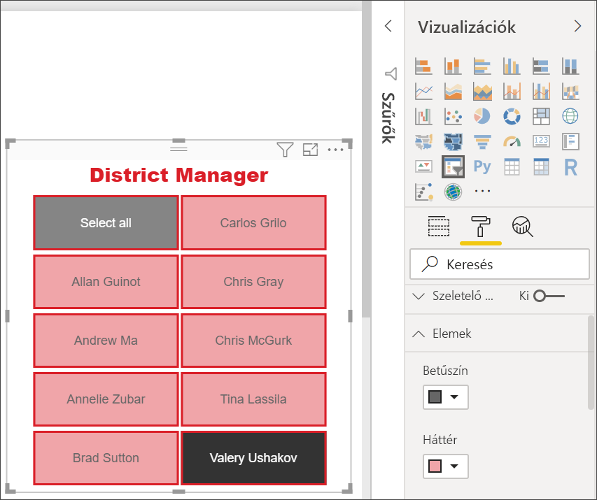

# Szeletelők a Power BI-ban

[!INCLUDE [applies-to](../includes/applies-to.md)] [!INCLUDE [yes-desktop](../includes/yes-desktop.md)] [!INCLUDE [yes-service](../includes/yes-service.md)]

Tegyük fel, hogy a jelentést olvasók számára az összesítő értékesítési metrikák megjelenítése mellett az egyes körzeti vezetők teljesítményét és a különböző időkereteket is ki szeretné mutatni. Létrehozhat különálló jelentéseket vagy összehasonlító diagramokat. Vagy használhat *szeletelőket* is. A szűrés másféle lehetőségét kínáló szeletelőkkel az adathalmaz a jelentés más vizualizációiban szereplő részére szűkíthető. 

Ez a cikk egy egyszerű szeletelő létrehozását és formázását mutatja be lépésenként az ingyenes [Kiskereskedelmi elemzési minta](../create-reports/sample-retail-analysis.md) használatával. Azt is bemutatja, hogyan szabályozható a szeletelő által befolyásolt vizualizációk köre, és hogyan lehet más oldalakon lévő szeletelőkkel szinkronizálni. A következő cikkek bizonyos szeletelőtípusok elkészítését ismertetik:

- [Numerikustartomány-szeletelők](../create-reports/desktop-slicer-numeric-range.md).
- [Relatívdátum-szeletelők](desktop-slicer-filter-date-range.md).
- Rugalmas, [átméretezhető szeletelők](../create-reports/power-bi-slicer-filter-responsive.md).
- Több mezőt tartalmazó [hierarchia-szeletelők](../create-reports/power-bi-slicer-hierarchy-multiple-fields.md).

## Mikor érdemes szeletelőt használni?
A szeletelő kitűnően alkalmas a következő célokra:

* Gyakran használt vagy fontos szűrők megjelenítése a jelentésvásznon a könnyebb elérhetőség érdekében.
* Az aktuális szűrt állapot egyszerűbb megjelenítése legördülő lista használata nélkül. 
* Az adattáblák szükségtelen és rejtett oszlopai alapján történő szűrés.
* Jobban szűrt jelentések létrehozása azáltal, hogy a szeletelőket a lényeges vizualizációk mellett helyezi el.

A Power BI-szeletelők nem támogatják a következőket:

- Beviteli mezők
- Lehatolás

## Szeletelő létrehozása

Ez a szeletelő a körzeti vezető alapján szűri az adatokat. Ha követni szeretné a folyamatot, töltse le a [Kiskereskedelmi elemzési minta PBIX-fájlt](https://download.microsoft.com/download/9/6/D/96DDC2FF-2568-491D-AAFA-AFDD6F763AE3/Retail%20Analysis%20Sample%20PBIX.pbix).

1. Nyissa meg a Power BI Desktopot, majd válassza a menüsáv **Fájl** > **Megnyitás** elemét.
   
1. Keresse meg a **Retail Analysis sample PBIX.pbix** fájlt, majd válassza a **Megnyitás** lehetőséget.

1. A bal oldali ablaktáblán válassza a **Jelentés** ikont  a fájl jelentés nézetben való megnyitásához.

1. Új szeletelő létrehozásához az **Áttekintés** lapon (miközben a vásznon semmi ne legyen kiválasztva), a **Vizualizációk** ablaktáblán jelölje be a **Szeletelő** ikont . 

1. Az új szeletelőt kijelölve válassza a **Mezők** panel **Körzet** > **DM** elemét a szeletelő kitöltéséhez. 

    Az új szeletelő most ki van töltve a körzeti vezetők nevének és a jelölőnégyzeteiknek listájával.
    
    
    
1. A szeletelő számára a vásznon levő egyéb elemek átméretezésével, illetve elmozdításával biztosíthat helyet. Vegye figyelembe, hogy ha túl kicsire méretezi át a szeletelőt, akkor levágja az elemeit. 

1. Jelöljön be neveket a szeletelőn, és figyelje meg a hatást az oldalon levő más vizualizációkon. A nevek bejelölésének megszüntetéséhez kattintson ismét a jelölőnégyzetükre; egynél több név bejelöléséhez tartsa lenyomva a **Ctrl** billentyűt. Az összes név kiválasztása ugyanazzal az eredménnyel jár, mintha egyet sem választana ki. 

1. Vagy válassza a **Vizualizációk** ablaktáblán a **Formátum** elemet (festőhenger ikont) a szeletelő formázásához. 

   A lehetőségek száma túl nagy ahhoz, hogy mindegyiket itt ismertessük – kísérletezzen a kívánt szeletelő létrehozásához. Az alábbi képen az első szeletelő vízszintes tájolással és színes háttérrel rendelkezik az elemekhez. A második szeletelő a szabványosabb külső érdekében függőleges tájolással és színes szöveggel rendelkezik.

   

   >[!TIP]
   >Alapértelmezés szerint a szeletelő listaelemei növekvő sorrendbe vannak rendezve. A rendezés csökkenő irányba való módosításához válassza a szeletelő jobb felső sarkában levő három pontot ( **...** ), majd a **Rendezés csökkenő sorrendben** lehetőséget.

## A lap szeletelők által érintett vizualizációinak kijelölése
Alapértelmezés szerint a jelentésoldalakon levő szeletelők az adott oldalon levő összes többi vizualizációra, valamint egymásra is hatással vannak. Az imént létrehozott lista és dátum típusú szeletelők értékeinek kiválasztása közben figyelje meg a többi vizualizációra gyakorolt hatásokat. A szűrt adatok a mindkét szeletelőben kijelölt értékek metszetét képezik. 

A vizualizációk interakcióival egyes oldalvizualizációkat kivonhat a többi vizualizáció hatása alól. Az **Áttekintés** oldalon a **Teljes értékesítési szórásnégyzet pénzügyi hónap és körzeti vezető szerint** diagram átfogó összehasonlító adatokat jelenít meg a körzeti vezetőkről havi bontásban, amit érdemes mindig megjelenített állapotban tartani. A vizualizációk interakcióival megakadályozhatja, hogy a szeletelők kijelölései szűrést végezzenek ezen a diagramon. 

1. Lépjen a jelentés **Áttekintés** oldalára, majd válassza ki a korábban létrehozott **DM** szeletelőt.

1. A Power BI Desktop menüben, a **Vizuális eszközök** részben válassza a **Formátum** menüt, majd válassza az **Interakciók szerkesztése** lehetőséget.
   
   A szűrővezérlők  az egyéb vizualizációk felett jelennek meg az oldalon, egy-egy **Szűrő** és **Nincs** lehetőséggel. Kezdetben a **Szűrő** lehetőség van előre kiválasztva az összes vezérlőn.
   
1. Válassza a **Teljes értékesítési szórásnégyzet pénzügyi hónap és körzeti vezető szerint** diagram feletti **Nincs** lehetőséget a szűrővezérlőben, hogy a **DM** szeletelő ne szűrje. 

1. Válassza az **OpenDate** szeletelőt, majd válassza a **Teljes értékesítési szórásnégyzet pénzügyi hónap és körzeti vezető szerint** diagram feletti **Nincs** lehetőséget, hogy a szeletelő ne szűrje. 

   Így a **Teljes értékesítési szórásnégyzet pénzügyi hónap és körzeti vezető szerint** diagram a szeletelőkben levő nevek és dátumtartományok kiválasztása esetén is változatlan marad.

További információ az interakciók szerkesztéséről: [A vizualizációk interakciójának módosítása a Power BI-jelentésekben](../create-reports/service-reports-visual-interactions.md).

## Más oldalakon levő szeletelők szinkronizálása és használata
A Power BI 2018. februári frissítésétől kezdve a szeletelők szinkronizálhatók és egy jelentés bármely – vagy akár az összes – oldalán felhasználhatók. 

Az aktuális jelentésben a **Körzeti havi értékesítés** oldal egy **Körzeti vezető** szeletelővel rendelkezik, de mi történik, ha az **Új üzletek** oldalon is használni szeretnénk ezt a szeletelőt? Az **Új üzletek** oldalon szerepel egy szeletelő, de csak az **Üzlet nevének** információit tartalmazza. A **Szeletelők szinkronizálása** panelen ezekhez az oldalakhoz szinkronizálhatja a **Körzeti vezető** szeletelőjét, hogy bármely oldal szeletelőinek kijelölései mindhárom oldalon hatással legyenek a vizualizációkra.

1. Válassza a Power BI Desktop **Nézet** menüjének **Szeletelők szinkronizálása** elemét.

    

    A **Szeletelők szinkronizálása** panel a **Szűrők** és a **Vizualizációk** panel között jelenik meg.

    

1. A jelentés **Körzeti havi értékesítés** oldalán válassza a **Körzeti vezető** szeletelőt. 

    Mivel már létrehozott egy **Körzeti vezető** (**DM**) szeletelőt az **Áttekintés** oldalon, a **Szeletelők szinkronizálása** panel a következőképpen jelenik meg:
    
    
    
1. A **Szeletelők szinkronizálása** panel **Szinkronizálás** oszlopában válassza ki az **Áttekintés**, **Körzeti havi értékesítés** és **Új Üzletek** lapokat. 

    Ezen kijelölés miatt a rendszer mindhárom oldallal szinkronizálja a **Körzeti havi értékesítés** szeletelőt. 
    
1. A **Szeletelők szinkronizálása** panel **Látható** oszlopában válassza az **Új üzletek** oldalt. 

    Ezen kijelölés miatt a **Körzeti havi értékesítés** szeletelő mindhárom oldalon látható. A **Szeletelők szinkronizálása** panel most a következőképpen jelenik meg:

    

1. Figyelje meg a szeletelő szinkronizálásának és más oldalakon való megjelenítésének hatásait. Figyelje meg, hogy a **Körzeti havi értékesítés** oldalon a **Körzeti vezető** szeletelő most már az **Áttekintés** oldalon levő szeletelővel azonos kijelöléseket jeleníti meg. Az **Új üzletek** oldalon most látható a **Körzeti vezető** szeletelő, és a kijelölései hatással vannak az **Üzlet neve** szeletelőben látható kijelölésekre. 
    
    >[!TIP]
    >Bár a szinkronizált oldalakon a szeletelő kezdetben ugyanolyan méretben és pozícióban jelenik meg, mint az eredeti oldalon, a különböző oldalakon levő szinkronizált szeletelők egymástól függetlenül is áthelyezhetők, átméretezhetők és formázhatók. 

    >[!NOTE]
    >Ha egy szeletelőt egy adott oldalra szinkronizál, de nem teszi azt láthatóvá az adott oldalon, akkor a más oldalakon elvégzett szeletelőkijelölések továbbra is szűrik az adatokat az oldalon.
 
## Szeletelők szűrése
A szeletelőkre alkalmazott vizualizációszintű szűrőkkel rövidebbé teheti a szeletelőben megjelenő értékek listáját. Kiszűrheti például az üres értékeket egy listaszeletelőből, vagy kiszűrhet bizonyos dátumokat egy tartomány-szeletelőből. Ez csupán *a szeletelőben megjelenő értékekre* van hatással, nem pedig *azokra a szűrőkre, amelyeket a szeletelő alkalmaz más vizualizációkon* a kijelöléskor. Tegyük fel például, hogy egy tartomány-szeletelőre alkalmaz szűrőt, hogy az csak bizonyos dátumokat mutasson. A szeletelőben a kijelölés csak ennek a tartománynak az első és az utolsó dátumát mutatja meg, de a többi vizualizációban továbbra is látható a többi dátum. A szeletelőben kiválasztott tartomány módosításakor a többi vizualizáció is frissülni fog. A szeletelő törlésekor ismét megjelenik az összes dátum.

A vizualizációszintű szűrőkről a [Szűrőtípusok](../create-reports/power-bi-report-filter-types.md) című cikkből tájékozódhat bővebben.

## Szeletelők formázása
A szeletelő típusától függően különböző formázási beállítások érhetők el. A **Vízszintes** tájolás, a **Rugalmas** elrendezés és az **Elem** színezés használatával a szokásos listaelemek helyett gombokat vagy csempéket hozhat létre, és a szeletelő elemeket a különböző képernyőméretekhez és elrendezésekhez igazodóvá teheti.  

1. Jelölje ki bármelyik oldalon a **Körzeti vezető** szeletelőt, majd a **Vizualizációk** panelen válassza a **Formázás** ikont  a formázási vezérlők megjelenítéséhez. 
    
    
    
1. A beállítások megjelenítéséhez és szerkesztéséhez kattintson a kategóriák melletti legördülőmenü-nyilakra. 

### Általános beállítások
1. A **Formátum** területen válassza az **Általános** lehetőséget, válasszon egy piros színt a **Körvonal színe** területen, majd módosítsa a **Körvonal vastagságát***2* értékre. 

    Ez a beállítás módosítja a fejléc és az elemek körüli körvonalak és az aláhúzások színét és vastagságát.

1. **Tájolásként** alapértelmezés szerint a **Függőleges** érték van kiválasztva. Vízszintesen elrendezett csempékkel vagy gombokkal, és a szeletelőbe be nem férő elemek eléréséhez görgetőnyilakkal rendelkező szeletelő előállításához válassza a **Vízszintes** lehetőséget.
    
    
    
1. A szeletelő elemek méretének és elrendezésének a megjelenítő képernyő és a szeletelő mérete alapján történő módosításához kapcsolja **be** a **Rugalmas** elrendezést. 

    Lista típusú szeletelők esetén a rugalmas elrendezés megakadályozza az elemek kisebb képernyőkön történő levágását. Ez csak vízszintes tájolásban érhető el. Tartománycsúszka típusú szeletelők esetén a rugalmas formázás módosítja a csúszka stílusát, és rugalmasabb átméretezést biztosít. Kis méretben mindkét típusú szeletelő szűrőikonná változik.
    
    
    
    >[!NOTE]
    >A rugalmas elrendezéssel járó módosítások felülírhatják a megadott fejléc- és elemformázási beállításokat. 
    
1. A szeletelő helyzete és mérete numerikus pontossággal is megadható az **X pozíció**, **Y pozíció**, **Szélesség** és **Magasság** mezőben, vagy a szeletelő közvetlenül a vásznon is áthelyezhető és átméretezhető. 

    Kísérletezzen különböző elemméretekkel és -elrendezésekkel, majd figyelje meg, hogyan módosul ezeknek megfelelően a rugalmas formázás. Ezek a beállítások csak akkor érhetők el, ha a vízszintes tájolást választja. 

    

A vízszintes tájolásokról és a rugalmas elrendezésekről az [Átméretezhető rugalmas szeletelő létrehozása a Power BI-ban](../create-reports/power-bi-slicer-filter-responsive.md) című cikk tartalmaz bővebb információt.

### Kijelölési vezérlők beállításai (csak lista típusú szeletelők esetén)
1. A **Kijelölési vezérlők** területen kapcsolja **Be** **„Az összes kijelölése” beállítás megjelenítése** lehetőséget **Az összes kijelölése** elem hozzáadásához a szeletelőhöz. 

    **„Az összes kijelölése” beállítás megjelenítése** lehetőség alapértelmezés szerint **Ki** van kapcsolva. Ha engedélyezve van, a beállítás váltásával kijelölheti az összes elemet, illetve megszüntetheti az összes elem kijelölését. Ha az összes elemet kijelöli, akkor egy elem kijelölésével megszüntetheti a kijelölését, vagyis *nemleges feltételű* szűrőtípust használhat.
    
    
    
1. Kapcsolja **Ki** az **Egyetlen elem kijelölése** beállítást, hogy több elemet is kiválaszthasson a **Ctrl** billentyű lenyomva tartása nélkül. 

    Az **Egyetlen elem kijelölése** lehetőség alapértelmezés szerint **Be** van kapcsolva. Az elemek a kiválasztással egyenként kijelölhetők, a **Ctrl** billentyű lenyomva tartása mellett pedig több elem is kijelölhető. Az elemek ismételt kijelölésével megszüntethető azok kijelölése.

### Cím beállításai
A **Cím** alapértelmezés szerint **Be** van kapcsolva. Ez a kijelölés a szeletelő tetején található adatmező nevét jeleníti meg. 
- Ebben a cikkben a következőképpen formázza a cím szövegét: 
   - **Betűszín**: piros
   - **Szövegméret**: **14 pt**
   - **Igazítás**: **Középre**
   - **Betűtípus**: **Arial Black**

### Elemek beállításai (csak lista típusú szeletelők esetén)
1. Ebben a cikkben a következőképpen formázza az **Elemek** lehetőséget:
    - **Betűszín**: fekete
    - **Háttér**: világospiros
    - **Szövegméret**: **10 pt**
    - **Betűtípus**: **Arial**
 
1. A **Körvonal** beállításnál válassza a **Keret** lehetőséget, hogy minden elem köré keretet rajzoljon az **Általános** beállítások között megadott vonalvastagsággal és színnel. 
    
    
    
    >[!TIP]
    >- Az **Általános** > **Tájolás** > **Vízszintes** kijelölése esetén a nem kijelölt elemek a választott szöveg- és háttérszínnel, a kijelöltek pedig a rendszer alapértelmezése szerint általában fekete háttérrel és fehér szöveggel jelennek meg.
    >- Az **Általános** > **Tájolás > Függőleges** kijelölése esetén az elemek mindig a kiválasztott színekben látszanak, a bejelölt jelölőnégyzetek pedig mindig feketék. 

### Dátum vagy numerikus adatbevitel és csúszkabeállítások (csak tartománycsúszka típusú szeletelők esetén)
- Lista típusú szeletelők esetén a dátum/numerikus adatbeviteli beállítások ugyanazok, mint az **Elemek** beállítások esetén, kivéve, ha nincs körvonal vagy aláhúzás lehetőség.
- A **csúszkabeállítások** lehetővé teszik a tartománycsúszka színének beállítását, illetve a csúszka **Ki** helyzetbe kapcsolását, ami csak a numerikus adatbevitelt hagyja meg.

### Egyéb formázási lehetőségek
A további formázási lehetőségek alapértelmezés szerint **Ki** vannak kapcsolva. Kapcsolja **Be** ezeket a beállításokat a következők vezérléséhez: 
- **Háttér**: Háttérszínt ad meg a teljes szeletelőhöz, és beállítja annak átlátszóságát.
- **Zárolási helyzet**: Átméretezéskor megtartja a szeletelő képarányát.
- **Szegély**: Szegélyt rajzol a szeletelő köré, és beállítja annak színét. Ez a szeletelőszegély az **Általános** beállításoktól független, azok nincsenek hatással rá. 

## Következő lépések
További információért tekintse át a következő cikkeket:

- [Vizualizációtípusok a Power BI-ban](power-bi-visualization-types-for-reports-and-q-and-a.md)

- [Táblák a Power BI-ban](power-bi-visualization-tables.md)
