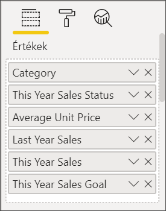
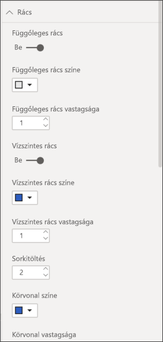
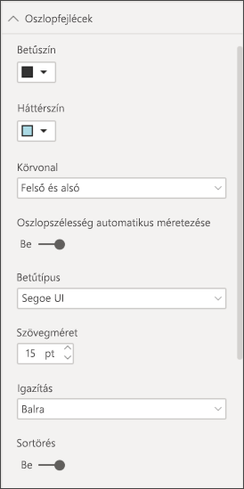
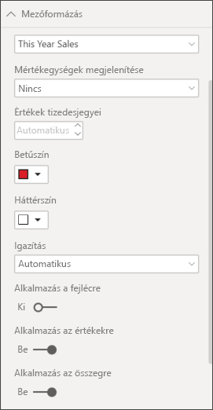
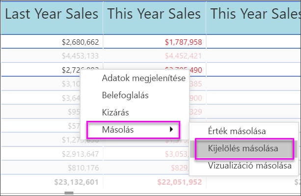

# Táblák a Power BI-jelentésekben és -irányítópultokon

[!INCLUDE[consumer-appliesto-nyyn](../includes/consumer-appliesto-nyyn.md)]

[!INCLUDE [power-bi-visuals-desktop-banner](../includes/power-bi-visuals-desktop-banner.md)]

A táblák olyan táblázatok, amelyek sorok és oszlopok logikai sorozataként jelenítik meg a kapcsolódó adatokat. Tartalmazhatnak fejléceket és összesítősorokat is. A táblák jól használhatók mennyiségi összehasonlításokhoz, ahol több, egy kategóriába tartozó érték vizsgálható egyszerre. Ez a tábla például a **Kategória** öt különböző mértékét jeleníti meg.

Táblázatokat hozhat létre a jelentésekben, és egyéb vizualizációk mellett keresztkiemelést alkalmazhat a táblázaton belül, ugyanazon a jelentésoldalon. Kiválaszthat sorokat, oszlopokat vagy egyetlen cellát is, és keresztkiemeléssel láthatja el őket. Egy vagy több kijelölt cellát kimásolhat és beilleszthet más alkalmazásokba is.

## Mikor érdemes táblát használni?

A tábla remek választás a következő esetekben:

* Részletes adatok és pontos értékek megtekintéséhez és összehasonlításához (vizualizációk helyett).

* Az adatok táblázatos formában való megjelenítéséhez.

* Numerikus adatok kategóriák szerinti megjelenítéséhez.

## Előfeltétel

Ez az oktatóanyag a [Kiskereskedelmi elemzési minta PBIX-fájlt](https://download.microsoft.com/download/9/6/D/96DDC2FF-2568-491D-AAFA-AFDD6F763AE3/Retail%20Analysis%20Sample%20PBIX.pbix) használja.

1. A menüsor bal felső részén válassza a **Fájl** > **Megnyitás** lehetőséget
   
2. Keresse meg a **Kiskereskedelmi elemzési minta PBIX-fájlt**

1. Nyissa meg a **Kiskereskedelmi elemzési minta PBIX-fájlt** jelentésnézetben .

1. Kiválasztás  új oldal hozzáadásához.

> [!NOTE]
> A jelentés egy Power BI-munkatárssal való megosztásához mindkettőjüknek Power BI Pro-licenccel kell rendelkezniük, vagy a jelentésnek egy Premium kapacitásban kell lennie.

## Tábla létrehozása

Létrehozza a cikk elején bemutatott táblát az értékesítési adatok elemkategória szerinti megjelenítéséhez.

1. A **Mezők** panelen válassza az **Elem** > **Kategória** lehetőséget.

    A Power BI automatikusan létrehoz egy táblát, amely az összes kategóriát felsorolja.

    

1. Válassza az **Értékesítés > Átlagos egységár** és **Értékesítés > Múlt évi értékesítések** lehetőséget.

1. Ez után válassza az **Értékesítések > Folyó évi értékesítések** elemet, és válassza ki mindhárom lehetőséget: **Érték**, **Cél** és **Állapot**.

1. A **Vizualizációk** ablaktáblán keresse meg az **Értékek** területet, és jelölje ki az értékeket, amíg a diagram oszlopainak sorrendje meg nem egyezik az oldalon fentebb látható első ábrával. Ha szükséges, húzza az értékeket a területre. Az **Értékek** területnek így kell kinéznie:

    

## A táblázat formázása

A táblázatot többféle módon is formázhatja. Itt ezek közül csak néhányat említünk. A többi formázási lehetőség megismeréséhez nyissa meg és fedezze fel a **Formázás** panelt (festőhenger ikon ).

* Próbálja ki a tábla formázását. Itt hozzáad majd egy függőleges kék rácsot, növeli a sorok közötti távolságot, és növeli a külső szegélyek és a szöveg méretét is.

    

    

* Az oszlopok fejléceiben módosítsa a háttérszínt, adjon hozzá egy körvonalat, és növelje a betűméretet.

    

    

* Még az egyes oszlopokra és oszlopfejlécekre is alkalmazhat formázást. Kezdje a **Mezőformázás** kibontásával, majd jelölje ki az oszlopot a formázáshoz a legördülő menüben. Az oszlopértékektől függően a **Mezőformázás** lehetővé teszi a következők beállítását: megjelenítési egységek, betűszín, tizedesjegyek száma, háttér, igazítás stb. Miután módosította a beállításokat, döntse el, hogy alkalmazza-e ezeket a fejlécre és az összesítési sorra is.

    

    

* Egyéb formázások után íme a végleges táblázat.

    

### Feltételes formázás

A *feltételes formázás* a formázás egyik típusa. A Power BI feltételes formázást tud alkalmazni bármely olyan mezőre, amelyet a **Vizualizációk** panel **Értékek** területéhez hozzáadott.

A táblák feltételes formázásával a cellák értéke alapján határozhat meg ikonokat, URL-címeket, a cellák háttér- vagy betűszínét, beleértve a színátmeneteket is.

1. A **Formátum** panelen nyissa meg a **Feltételes formázás** kártyát.

    

1. Jelölje ki a formázni kívánt mezőt, és húzza a **Háttérszín** csúszkáját a Be értékre. A Power BI egy színátmenetet alkalmaz az oszlopban lévő értékek alapján. Az alapértelmezett színek módosításához válassza a **Speciális vezérlők** lehetőséget.

    A **Széttartó** lehetőség bejelölése esetén megadhat egy választható **Középértéket** is.

    

    Most alkalmazzunk feltételes formázást az Average Unit Price (Átlagos egységár) értékekre. Válassza a **Széttartó** lehetőséget, adjon hozzá színeket, és válassza az **OK** elemet.

    
1. Vegyen fel egy pozitív és negatív értékeket is tartalmazó új mezőt a táblába. Válassza az **Sales > Total Sales Variance** (Értékesítés > Teljes értékesítés szórása) lehetőséget.

    

1. Az adatsávok feltételes formázásának hozzáadásához állítsa az **Adatsávok** csúszkát a Be értékre.  

    

1. Az adatsávok testreszabásához válassza a **Speciális vezérlők** lehetőséget. A megjelenő párbeszédpanelen állítsa be a **Pozitív sáv** és a **Negatív sáv** színeit, jelölje be a **Csak sávok megjelenítése** lehetőséget, és végezze el a többi kívánt módosítást.

    

1. Válassza az **OK** lehetőséget.

    A numerikus értékek helyét adatsávok veszik át a táblában, így könnyebben áttekinthető lesz.

    

1. Vizuális jelzéseket adhat hozzá a táblához *feltételes ikonokkal*.  A **Feltételes formázás** kártyán válassza ki az **Idei értékesítés** elemet a legördülő listából. Az **Ikonok** csúszkát állítsa **Be** értékre.  Az ikonok testreszabásához válassza **Speciális vezérlők** lehetőséget.

    

## Power BI-táblázatok értékeinek másolása és felhasználása más alkalmazásokban

A táblázat vagy mátrix rendelkezhet olyan tartalommal, amelyet fel szeretne használni más alkalmazásokban (például: Dynamics CRM, Excel) vagy más Power BI-jelentésekben. Ha a Power BI-ban a jobb gombbal kattint egy vagy több kijelölt cellán belül, kimásolhatja azokat a vágólapra, majd beillesztheti egy másik alkalmazásba.

Egyetlen cella másolása:

1. Válassza ki a másolni kívánt cellát.

1. Kattintson jobb gombbal a cellában.

1. Válassza a **Másolás** > **Érték másolása** lehetőséget.

    

    A cella formázatlan értéke felkerül a vágólapra, ahonnan beillesztheti egy másik alkalmazásba.

Több mint egy cella másolása:

1. Jelölje ki a cellatartományt, vagy a **CTRL** billentyűt nyomva tartva jelöljön ki egy vagy több cellát.

1. Kattintson a jobb gombbal a kijelölt cellák valamelyikén belül.

1. Válassza a **Másolás** > **Kijelölés másolása** lehetőséget.

    

## Tábla oszlopszélességeinek állítása

Előfordul, hogy a Power BI csonkolja az oszlopfejléceket a jelentésekben vagy az irányítópultokon. Az oszlop teljes nevének megjelenítéséhez vigye a kurzort a fejléc jobb oldalára, amíg meg nem jelenik a dupla nyíl, majd válassza ki és húzza el oldalra a nyilakat.

## Megfontolandó szempontok és hibaelhárítás

* Oszlopformázás alkalmazásakor oszloponként választhat igazítási beállítást a következők közül: **Automatikus**, **Bal**, **Közép**, **Jobb**. Az oszlopok általában csak szöveget vagy csak számokat tartalmaznak, nem pedig azok keverékét. Azokban az esetekben, amelyekben egy oszlop számokat és szöveget is tartalmaz, az **Automatikus** beállítás szöveg esetén balra, számok esetén pedig jobbra fog igazítani. Ez a működésmód a balról jobbra olvasott nyelvek kezelésére szolgál.

* Ha a tábla celláiban vagy fejléceiben lévő szöveges adatok sortörést jelző karaktereket tartalmaznak, a program kizárólag akkor veszi őket figyelembe, ha bekapcsolja a Sortörés beállítást az elemhez tartozó formázási panel kártyáján. 

## Következő lépések

* [Fatérképek a Power BI-ban](power-bi-visualization-treemaps.md)

* [Vizualizációtípusok a Power BI-ban](power-bi-visualization-types-for-reports-and-q-and-a.md)
