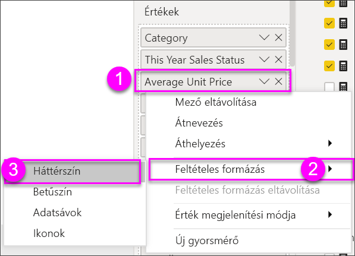
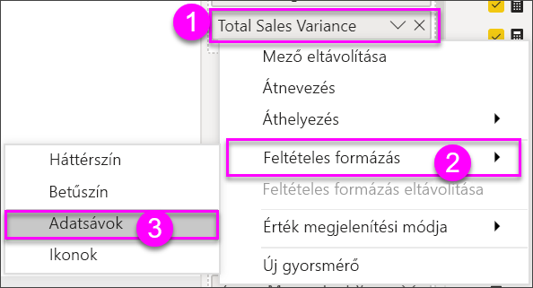
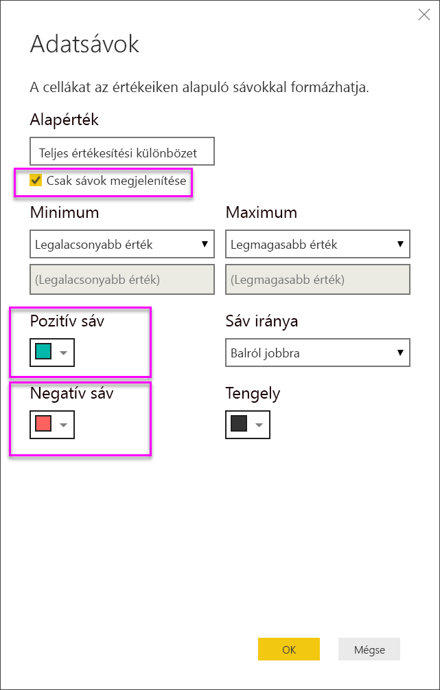

# Táblák a Power BI-jelentésekben és -irányítópultokon

A táblák olyan táblázatok, amelyek sorok és oszlopok logikai sorozataként jelenítik meg a kapcsolódó adatokat. Tartalmazhatnak fejléceket és összesítősorokat is. A táblák jól használhatók mennyiségi összehasonlításokhoz, ahol több, egy kategóriába tartozó érték vizsgálható egyszerre. Ez a tábla például a **Kategória** öt különböző mértékét jeleníti meg.

Táblázatokat hozhat létre a jelentésekben, és egyéb vizualizációk mellett keresztkiemelést alkalmazhat a táblázaton belül, ugyanazon a jelentésoldalon. Kiválaszthat sorokat, oszlopokat vagy egyetlen cellát is, és keresztkiemeléssel láthatja el őket. Egy vagy több kijelölt cellát kimásolhat és beilleszthet más alkalmazásokba is.

## Mikor érdemes táblát használni?

A tábla remek választás a következő esetekben:

* Részletes adatok és pontos értékek megtekintéséhez és összehasonlításához (vizualizációk helyett).

* Az adatok táblázatos formában való megjelenítéséhez.

* Numerikus adatok kategóriák szerinti megjelenítéséhez.

> [!NOTE]
> Ha a tábla túl sok értéket tartalmaz, érdemes lehet mátrixszá alakítani és/vagy lefúrást alkalmazni. A táblák legfeljebb 3500 adatpontot képesek megjeleníteni.

## Előfeltételek

* A Power BI szolgáltatás vagy a Power BI Desktop

* Kiskereskedelmi elemzési mintajelentés

## A Kiskereskedelmi elemzési mintajelentés beszerzése

Ez az útmutatás a Kiskereskedelmi elemzési mintát használja. A vizualizációk létrehozásához az adatkészletre és a jelentésre vonatkozó szerkesztési jogosultságok szükségesek. A Power BI mintái mind szerkeszthetőek. Ha mások osztanak meg Önnel jelentést, abban az esetben nem fog tudni vizualizációkat létrehozni jelentésekben. A leírás követéséhez nyissa meg a [Kiskereskedelmi elemzési minta jelentést](../sample-datasets.md).

Ha beszerezte a **Kiskereskedelmi elemzési mintát**, elkezdheti a munkát.

## Tábla létrehozása

Létrehozza a cikk elején bemutatott táblát az értékesítési adatok elemkategória szerinti megjelenítéséhez.

1. A **Saját munkaterületen** válassza az **Adatkészletek** > **Jelentés létrehozása** lehetőséget.

    

1. A **Mezők** panelen válassza az **Elem** > **Kategória** lehetőséget.

    A Power BI automatikusan létrehoz egy táblát, amely az összes kategóriát felsorolja.

    

1. Válassza az **Értékesítés > Átlagos egységár** és **Értékesítés > Múlt évi értékesítések** lehetőséget.

1. Ez után válassza az **Értékesítések > Folyó évi értékesítések** elemet, és válassza ki mindhárom lehetőséget: **Érték**, **Cél** és **Állapot**.

1. A **Vizualizációk** ablaktáblán húzza az értékeket az **Értékek** területre, amíg a tábla oszlopainak rendje meg nem egyezik az oldalon fentebb látható első ábrával. Az **Értékek** területnek így kell kinéznie:

    

1. Rögzítse a táblát az irányítópultra a rajzszög ikonnal  a vizualizáció jobb felső sarkában.

## A táblázat formázása

A táblázatot többféle módon is formázhatja. Itt ezek közül csak néhányat említünk. A többi formázási lehetőség megismeréséhez nyissa meg és fedezze fel a **Formázás** panelt (festőhenger ikon ).

* Próbálja ki a tábla formázását. Itt hozzáad majd egy függőleges kék rácsot, növeli a sorok közötti távolságot, és növeli a külső szegélyek és a szöveg méretét is.

    

    

* Az oszlopok fejléceiben módosítsa a háttérszínt, adjon hozzá egy körvonalat, és növelje a betűméretet.

    

    

* Még az egyes oszlopokra és oszlopfejlécekre is alkalmazhat formázást. Kezdje a **Mezőformázás** kibontásával, majd jelölje ki az oszlopot a formázáshoz a legördülő menüben. Az oszlopértékektől függően a **Mezőformázás** lehetővé teszi a következők beállítását: megjelenítési egységek, betűszín, tizedesjegyek száma, háttér, igazítás stb. Miután módosította a beállításokat, döntse el, hogy alkalmazza-e ezeket a fejlécre és az összesítési sorra is.

    

    

* Egyéb formázások után íme a végleges táblázat.

    

### Feltételes formázás

A *feltételes formázás* a formázás egyik típusa. A Power BI a mezők feltételes formázását a **Vizualizációk** panel **Értékek** területén alkalmazza.

A táblák feltételes formázásával a cellák értéke alapján határozhat meg egyéni háttér- vagy betűszínt (akár színátmeneteket is) a cellákhoz.

1. A **Vizualizációk** panelen válassza a **Mezők** ikont .

1. Válassza az **Értékek** területen a formázni kívánt érték mellett a lefele mutató nyilat (vagy kattintson a jobb gombbal a mezőre).

    > [!NOTE]
    > A mezők feltételes formázása kizárólag az **Értékek** terület **Mezők** szakaszában kezelhető.

    

1. Válassza a **Háttérszín** elemet.

1. A megjelenő párbeszédpanelen beállíthatja a színt, valamint a **Minimum** és **Maximum** értékét. A **Széttartó** lehetőség bejelölése esetén megadhat egy választható **Középértéket** is.

    

    Most alkalmazzunk feltételes formázást az Average Unit Price (Átlagos egységár) értékekre. Válassza a **Széttartó** lehetőséget, adjon hozzá színeket, és válassza az **OK** elemet.

    
1. Vegyen fel egy pozitív és negatív értékeket is tartalmazó új mezőt a táblába. Válassza az **Sales > Total Sales Variance** (Értékesítés > Teljes értékesítés szórása) lehetőséget.

    

1. Adjon hozzá feltételes adatsávformázást – ehhez válassza a lefelé mutató nyilat a **Total Sales Variance** (Teljes értékesítés szórása) mellett, majd a **Feltételes formázás > Adatsávok** lehetőséget.

    

1. A megjelenő párbeszédpanelen állítsa be a **Pozitív sáv** és a **Negatív sáv** színeit, jelölje be a **Csak sávok megjelenítése** lehetőséget, és végezze el a többi kívánt módosítást.

    

1. Kattintson az **OK** gombra.

    A numerikus értékek helyét adatsávok veszik át a táblában, így könnyebben áttekinthető lesz.

    

A vizualizációk feltételes formázásának törléséhez egyszerűen kattintson újra a mezőre a jobb gombbal, és válassza a **Feltételes formázás eltávolítása** lehetőséget.

> [!TIP]
> A feltételes formázás a **Formázás** ablaktábláról is elérhető. Válassza ki a formázni kívánt értéket, és az alapértelmezett beállítások alkalmazásához állítsa a **Színskálák** vagy az **Adatsávok** beállítást **Be** értékre, vagy a beállítások testreszabásához válassza a **Speciális vezérlők** lehetőséget.

## Power BI-táblázatok értékeinek másolása és felhasználása más alkalmazásokban

A táblázat vagy mátrix rendelkezhet olyan tartalommal, amelyet fel szeretne használni más alkalmazásokban (például: Dynamics CRM, Excel) vagy más Power BI-jelentésekben. Ha a Power BI-ban a jobb gombbal kattint egy vagy több kijelölt cellán belül, kimásolhatja azokat a vágólapra, majd beillesztheti egy másik alkalmazásba.

Egyetlen cella másolása:

1. Válassza ki a másolni kívánt cellát.

1. Kattintson jobb gombbal a cellában.

1. Válassza a **Másolás** > **Érték másolása** lehetőséget.

    

    A cella formázatlan értéke felkerül a vágólapra, ahonnan beillesztheti egy másik alkalmazásba.

Több mint egy cella másolása:

1. Jelölje ki a cellatartományt, vagy a **CTRL** billentyűt nyomva tartva jelöljön ki egy vagy több cellát.

1. Kattintson a jobb gombbal a kijelölt cellák valamelyikén belül.

1. Válassza a **Másolás** > **Kijelölés másolása** lehetőséget.

    

    A másolat tartalmazza az oszlopok és a sorok fejléceit.

    

## Tábla oszlopszélességeinek állítása

Előfordul, hogy a Power BI csonkolja az oszlopfejléceket a jelentésekben vagy az irányítópultokon. Az oszlop teljes nevének megjelenítéséhez vigye a kurzort a fejléc jobb oldalára, amíg meg nem jelenik a dupla nyíl, majd válassza ki és húzza el oldalra a nyilakat.

## Megfontolandó szempontok és hibaelhárítás

Oszlopformázás alkalmazásakor oszloponként választhat igazítási beállítást a következők közül: **Automatikus**, **Bal**, **Közép**, **Jobb**. Az oszlopok általában csak szöveget vagy csak számokat tartalmaznak, nem pedig azok keverékét. Azokban az esetekben, amelyekben egy oszlop számokat és szöveget is tartalmaz, az **Automatikus** beállítás szöveg esetén balra, számok esetén pedig jobbra fog igazítani. Ez a működésmód a balról jobbra olvasott nyelvek kezelésére szolgál.

## Következő lépések

* [Fatérképek a Power BI-ban](power-bi-visualization-treemaps.md)

* [Vizualizációtípusok a Power BI-ban](power-bi-visualization-types-for-reports-and-q-and-a.md)
