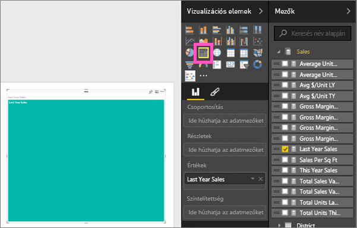

# Fatérképek a Power BI-ban
A fatérképek a hierarchikus adatokat beágyazott téglalapokként jelenítik meg.  A hierarchia minden egyes szintjét egy színes téglalap (más néven „ág”) jelöli, amely további téglalapokat („leveleket”) tartalmaz.  Az egyes téglalapokon belüli területet a mért érték alapján osztja ki a rendszer. A téglalapok pedig méret szerint vannak rendezve, a bal felső saroktól (legnagyobb), a jobb alsó sarokig (legkisebb).

Ha például az értékesítést elemzem, akkor valószínűleg a következő ruházati kategóriák szerepelnek majd a legfelső szintű téglalapokban, az úgynevezett *ágakban*: **Urban** (Város), **Rural** (Vidék), **Youth** (Fiatalok), és **Mix** (Vegyes).  A kategóriákat jelölő téglalapjaim kisebb téglalapokra, más néven *levelekre* tagolódnának, az adott kategória ruházati gyártóit jelképezve. Ezek a kisebb téglalapok pedig az eladott darabszámok alapján kapnák a méretüket és az árnyalatukat.  

A fenti **Urban** ágban sok `Maximus` márkájú ruhát adtak el, `Natura` és `Fama` ruhákból valamivel kevesebb fogyott, a `Leo` márkából pedig keveset értékesítettek.  Így a fatérkép **Urban** ágában:
* a `Maximus` rendelkezik a legnagyobb téglalappal a bal felső sarokban;
* valamivel kisebb téglalapban jelenik meg a `Natura` és a `Fama`;
* számos egyéb téglalap jelöli az összes többi ruházati márkát; és 
* egy egészen kis méretű jut a `Leo` márkára.  

Az egyéb ruházati kategóriákban értékesített tételek számát pedig az egyes levélcsomópontok mérete és árnyalata alapján hasonlíthatom össze: minél nagyobb és sötétebb egy adott téglalap, annál nagyobb értéket jelöl.

## Mikor érdemes fatérképet használni
A fatérképek használata nagyszerű választás, ha:

* nagy mennyiségű hierarchikus adatot szeretne megjeleníteni;
* egy oszlopdiagram nem tudja hatékonyan kezelni a nagy mennyiségű értéket;
* az egyes részek és az egész közötti arányokat szeretné megjeleníteni;
* a hierarchia egyes kategóriaszintjein belül megfigyelhető eloszlási mintákat szeretné megjeleníteni;
* méret és színek alapján szeretne attribútumokat megjeleníteni;
* mintákat, kiugró adatokat, legfontosabb részvevőket és kivételeket szeretne azonosítani.

### Előfeltételek
 - Power BI szolgáltatás vagy Power BI Desktop
 - Kiskereskedelmi elemzési minta

## Egyszerű fatérkép létrehozása
Szeretne előbb megnézni valaki mást, ahogyan létrehoz egy fatérképet?  Ugorjon a videóban 2:10-hez, hogy megnézhesse, hogyan hoz létre Amanda egy fatérképet.

<iframe width="560" height="315" src="https://www.youtube.com/embed/IkJda4O7oGs" frameborder="0" allowfullscreen></iframe>

Vagy hozzon létre saját fatérképet. Ez az útmutatás a Kiskereskedelmi elemzési mintát használja. Hogy követni tudja a lépéseket, jelentkezzen be a Power BI szolgáltatásba, és válassza az **Adatok lekérése \> Minták \> Kiskereskedelmi elemzési minta \> Kapcsolódás \> Ugrás az irányítópultra** lehetőséget. Vizualizációkat csak akkor hozhat létre jelentésekben, ha jogosultsággal rendelkezik az adatkészlet és a jelentés szerkesztéséhez. A Power BI mintái szerkeszthetőek. Azonban nem adhat vizualizációkat olyan jelentésekhez, amelyeket valaki más osztott meg Önnel.  

1. Nyissa meg a „Kiskereskedelmi elemzési minta” jelentést az „Összes áruház” csempe kiválasztásával.    
2. Nyissa meg a [Szerkesztő nézetet](../service-interact-with-a-report-in-editing-view.md), és válassza ki a **Sales** > **Last Years Sales** mértéket.   
      
3. Konvertálja a diagramot fatérképpé.  
      
4. Húzza az **Item** > **Category** elemet a **Csoport** gyűjtőbe. A Power BI létrehoz egy fatérképet, amelyen a téglalapok mérete az összes eladáson alapszik, a szín pedig a kategóriát jelöli.  Lényegében egy olyan hierarchiát hozott létre, amely az összes értékesítés kategóriák szerinti relatív arányát jeleníti meg.  A legtöbb eladás a **Men's** (Férfi) kategóriában van, a legkevesebb pedig a **Hosiery** (Harisnya) kategóriában.   
      
5. Húzza a **Store** > **Chain** elemet a **Részletek** gyűjtőbe a fatérképe kiegészítéséhez. Így már kategóriák és üzletláncok szerint is össze tudja hasonlítani a tavalyi év értékesítéseit.   
   
   
   > [!NOTE]
   > A Színtelítettség és a Részletek gyűjtők nem használható egyszerre.
   > 
   > 
5. Helyezze a kurzort egy **Chain** elem fölé, hogy megjelenjen az adott **Kategória** elemleírása.  Például, ha a kurzorral a **090-Home** téglalap **Fashions Direct** levelére mutat, akkor megjelenik a Home (Otthoni) kategória Fashion Direct részéhez tartozó elemleírás.  
   
6. [Vegye fel a fatérképet egy irányítópult-csempeként (rögzítse a vizualizációt)](../service-dashboard-tiles.md). 
7. [Mentse a jelentést](../service-report-save.md).

## Kiemelés és keresztszűrés
További információ a Szűrök ablaktábla használatáról: [Szűrők hozzáadása jelentésekhez](../power-bi-report-add-filter.md).

Egy Kategória vagy Részlet kiemelése egy fatérképen keresztkiemelést és keresztszűrést végez a jelentésoldalon lévő többi vizualizáción, és fordítva. A lépések elvégzéséhez adjon vizualizációkat a jelentésoldalhoz, vagy másolja a fatérképet a jelentésben szereplő egyéb nem üres oldalak egyikéhez.

1. A fatérképen válasszon egy kategóriát, vagy válasszon egy láncot egy kategórián belül.  Ez keresztkiemelést végez az oldalon található többi vizualizációval. A **050-Shoes** kiválasztása például megmutatja, hogy a tavalyi év cipőeladásai 3 640 471 $ értéket képviseltek, amelyből 2 174 185 $ a Fashion Directtől származott.  
   

2. A **Last Year Sales by Chain** (Előző évi értékesítések üzletlánc szerint) tortadiagramban válassza a **Fashions Direct** szeletet, ezzel keresztszűrést végezhet a fatérképen.  
       

3. A keresztkiemelések és keresztszűrések használatának módját a [Vizualizációk közötti interakciók Power BI-jelentésekben](../service-reports-visual-interactions.md) című cikk ismerteti.

## Következő lépések

[Vízesésdiagramok a Power BI-ban](power-bi-visualization-waterfall-charts.md)

[Vizualizációtípusok a Power BI-ban](power-bi-visualization-types-for-reports-and-q-and-a.md)